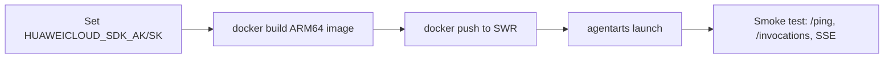

# AgentArts CLI

AgentArts is Huawei Cloud's enterprise-grade Agent lifecycle platform. The CLI
(`agentarts`) manages the full pipeline: init → dev → deploy → invoke.

## 1. Installation & Auth

```bash
pip install agentarts-sdk

# Auth (required for launch and invoke)
export HUAWEICLOUD_SDK_AK="<your-ak>"
export HUAWEICLOUD_SDK_SK="<your-sk>"
```

## 2. CLI Commands Quick Reference

| Command | Purpose |
|---------|---------|
| `agentarts --version` | Verify CLI installed |
| `agentarts init -n <name> -t langgraph` | Scaffold a new LangGraph project |
| `agentarts dev` | Start local dev server on port 8080 |
| `agentarts launch` | Build image → push SWR → deploy to Runtime |
| `agentarts invoke '{"message":"..."}'` | Call deployed Agent (sync) |
| `agentarts invoke --custom-path stream '{"message":"..."}'` | Call with custom sub-path (e.g., SSE streaming) |
| `agentarts config` | Interactive config wizard |
| `agentarts runtime describe` | Inspect deployed Runtime status |

### Local dev verification

```bash
agentarts dev
curl -X POST http://localhost:8080/invocations \
  -H 'Content-Type: application/json' \
  -d '{"message":"你好"}'
```

### Invoke deployed Agent

```bash
# Sync
agentarts invoke '{"message":"帮我查一下明天的日程"}'

# SSE stream (requires PREFIX_MATCH in invoke_config.url_match_type)
agentarts invoke --custom-path invocations/stream '{"message":"你好"}'
```

### Runtime status check

```bash
agentarts runtime describe
```

## 3. Project Structure

```
my_agent/
├── .agentarts_config.yaml  # Deployment config (see §4)
├── agent.py                # Agent entrypoint (if using AgentArtsRuntimeApp)
├── Dockerfile              # Container image definition
└── requirements.txt        # Python deps
```

For this project, the actual config lives at:
`personal-assistant-service/.agentarts_config.yaml`

## 4. `.agentarts_config.yaml` Schema

```yaml
default_agent: personal-assistant
agents:
  personal-assistant:
    base:
      name: personal-assistant
      entrypoint: agent:app          # Or app.main:app (FastAPI)
      dependency_file: pyproject.toml
      region: cn-southwest-2         # Only supported region
      platform: linux/arm64          # MUST be ARM64
      language: python3
      base_image: ghcr.io/astral-sh/uv:python3.12-bookworm
      container_runtime: docker

    swr_config:
      organization: personal-assistant-org
      repository: agent_personal_assistant
      organization_auto_create: true
      repository_auto_create: true

    runtime:
      arch: arm64                    # Must match base.platform
      invoke_config:
        protocol: HTTP
        port: 8080
        url_match_type: PREFIX_MATCH  # ACCURATE_MATCH (default, only /invocations)
                                      # PREFIX_MATCH (needed for /invocations/stream etc.)
      network_config:
        network_mode: PUBLIC
      identity_configuration:
        authorizer_type: IAM
        authorizer_configuration: null
      observability:
        tracing:
          enabled: true
        metrics:
          enabled: true
        logs:
          enabled: true
      artifact_source:
        url: swr.cn-southwest-2.myhuaweicloud.com/personal-assistant-org/agent_personal_assistant:latest
        commands: []
      environment_variables:
        - key: DEEPSEEK_API_KEY
          value: "xxxxxxxxxxxxxxxxxxxxxxx"
        - key: CORS_ALLOWED_ORIGINS
          value: "https://example.com,https://another.com"

      tags:
        - key: app
          value: personal-assistant
        - key: env
          value: dev
```

### Key Config Fields

| Field | Must-Know |
|-------|-----------|
| `base.platform` | MUST be `linux/arm64` |
| `base.region` | Only `cn-southwest-2` supported |
| `runtime.arch` | Must match `base.platform` — ARM64 images on x86 nodes fail silently |
| `invoke_config.url_match_type` | `PREFIX_MATCH` needed for sub-paths like `/invocations/stream` or `/invocations/playground/` |
| `invoke_config.port` | Always 8080 |
| `environment_variables` | Secrets (API keys) go here, NEVER commit to git |
| `artifact_source.url` | Full SWR path; deploy with manual `docker build` + `docker push` before `agentarts launch` |

## 5. Deployment Workflow (High-Level)



### Step-by-step

1. **Set auth env vars**:
   ```bash
   export HUAWEICLOUD_SDK_AK="<ak>"
   export HUAWEICLOUD_SDK_SK="<sk>"
   ```

2. **Build ARM64 image** (on x86 Mac, use buildx + QEMU):
   ```bash
   export BUILDKIT_USE_OCI_MEDIA_TYPES=0  # Required for Docker 27+
   docker buildx build --platform linux/arm64 --load \
     -f personal-assistant-service/Dockerfile \
     -t swr.cn-southwest-2.myhuaweicloud.com/personal-assistant-org/agent_personal_assistant:latest \
     .
   ```

   If local machine is not ARM64 native, first:
   ```bash
   docker run --rm --privileged multiarch/qemu-user-static --reset -p yes
   ```

3. **Push to SWR**:
   ```bash
   # Login (zsh-compatible password generation)
   SWR_PASSWORD=$(printf "$HUAWEICLOUD_SDK_AK" | openssl dgst -binary -sha256 -hmac "$HUAWEICLOUD_SDK_SK" | od -An -vtx1 | tr -d ' \n')
   echo "$SWR_PASSWORD" | docker login swr.cn-southwest-2.myhuaweicloud.com -u cn-southwest-2@$(echo -n "$HUAWEICLOUD_SDK_AK" | tail -c 16) --password-stdin

   docker push swr.cn-southwest-2.myhuaweicloud.com/personal-assistant-org/agent_personal_assistant:latest
   ```

4. **Deploy**:
   ```bash
   cd personal-assistant-service
   agentarts launch
   ```

5. **Verify** (after launch, note the Runtime domain from output):
   ```bash
   curl -s "<runtime-domain>/ping"
   # Expected: {"status": "ok"}

   agentarts invoke '{"message":"你好，请简单介绍一下你自己"}'
   # Expected: valid AI response

   agentarts invoke --custom-path invocations/stream '{"message":"你好"}'
   # Expected: SSE streaming events
   ```

## 6. Common Pitfalls

### ARM64 architecture
- AgentArts Runtime **only** supports `linux/arm64`. X86 images cause `exec format error`.
- Build on x86 machines requires `docker buildx` + QEMU emulation.
- `runtime.arch` must match `base.platform` — both `arm64`.

### Docker 27+ OCI media types
- SWR does not support OCI format images (Docker 27+ default).
- Always set `export BUILDKIT_USE_OCI_MEDIA_TYPES=0` before building.

### Gateway routing (url_match_type)
- Default `ACCURATE_MATCH` only forwards `/invocations` exactly.
- SSE streaming at `/invocations/stream` or Chainlit at `/invocations/playground/` require `PREFIX_MATCH`.
- If routes return 404 at runtime but work locally, check this field.

### IAM sub-account permissions
- The AK/SK must have `SWR FullAccess` (for push/launch) and `OBS FullAccess` (for frontend uploads).
- If using a sub-account, grant these in IAM → User Groups → Authorization.

### Entrypoint mismatch
- `.agentarts_config.yaml` `entrypoint` and `Dockerfile CMD` should agree on the actual app module.
- If using FastAPI with `app.main:app`, set `entrypoint: "app.main:app"`.
- When using manual `docker build` + `docker push` + `agentarts launch`, the Dockerfile CMD wins.

### CORS
- If frontend and backend are on different origins, CORS middleware must be configured in the backend (not in `.agentarts_config.yaml`).
- Set `CORS_ALLOWED_ORIGINS` env var in `environment_variables`, then read it in the app's CORS middleware.

### Silent container failures
- `agentarts invoke` returning `NA.30200: failed to start container` with empty logs usually means `runtime.arch` mismatch.
- Run `grep -A10 'runtime:' personal-assistant-service/.agentarts_config.yaml | grep 'arch:'` to confirm.

## 7. Observability (Control Console)

After `agentarts launch`, verify in the web console at `https://console.huaweicloud.com/agentarts/`:

1. **Runtime status**: 智能体运行时 → confirm instance is "运行中"
2. **Full-chain Trace**: 观测 → 全链路 Trace → check recent traces
3. **Metrics**: 观测 → 指标监控 → QPS, latency, error rate
4. **Logs**: 观测 → 日志 → container stdout/stderr

## 8. Quick Health Checks

```bash
# CLI installed?
agentarts --version

# SWR reachable?
curl -s -o /dev/null -w '%{http_code}' https://swr.cn-southwest-2.myhuaweicloud.com/v2/
# Expected: 401 (auth required — means it's reachable)

# Auth set?
echo $HUAWEICLOUD_SDK_AK

# Config exists?
ls personal-assistant-service/.agentarts_config.yaml
```
