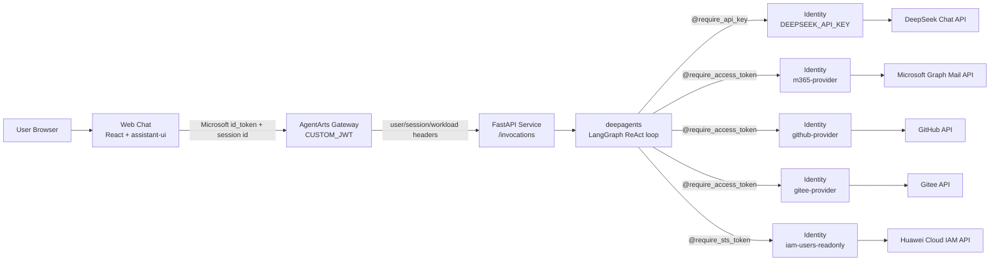

# Personal Assistant

Personal Assistant 是一个以 **Agent Identity 最佳实现 Demo** 为目标的对话式 AI 助手项目。它展示一个真实 Agent 如何在受控身份边界内，以用户委托或工作负载身份访问 LLM、Microsoft 365、GitHub、Gitee 和华为云 IAM 等外部服务。

项目仍运行在 AgentArts Runtime 上，但 README 的主线不再是“AgentArts 平台能做什么”，而是回答一个更具体的问题：

> 当 Agent 需要代表真实用户调用真实系统时，身份、授权、凭据、会话隔离和敏感操作确认应该如何落到代码里？

## 项目定位

本项目聚焦 Agent Identity 的端到端落地：

- **Inbound Identity**：用户通过 Microsoft Entra ID 等入口登录，由 AgentArts Gateway 验证 JWT，并向后端注入可信的用户 ID、Session ID 和 Workload Access Token。
- **Outbound Identity**：Agent 不在代码或环境变量中保存长期密钥，而是通过 AgentArts Identity 的 Credential Provider 获取 API Key、OAuth2 Access Token 或 STS 临时凭证。
- **User Delegation**：Agent 可以在用户授权后，以用户身份访问 Microsoft 365 邮件、GitHub、Gitee 等服务。
- **Workload Identity**：Agent 容器使用 Gateway 注入的短期 Workload Access Token 与 Identity Service 通信，生产环境无需依赖本地 `.agent_identity.json`。
- **Guarded Actions**：发送邮件、回复邮件、给 GitHub 仓库加星等敏感写操作必须先返回预览，只有用户明确确认后才执行。
- **Session Isolation**：后端使用 `{user_id}:{session_id}` 作为 LangGraph checkpoint thread_id，避免跨用户或跨会话状态串扰。

## 当前能力

| 能力 | 当前状态 | 说明 |
|------|----------|------|
| Web Chat | 已实现 | React + assistant-ui + SSE 流式对话，支持 Microsoft Entra ID 登录 |
| Inbound Identity | 已实现 | AgentArts Gateway `CUSTOM_JWT` 验证后注入用户与会话 header |
| LLM Credential | 已实现 | DeepSeek API Key 通过 `DEEPSEEK_API_KEY` Credential Provider 注入 |
| Microsoft 365 邮件 | 已实现 | `m365-provider` OAuth2 User Federation，支持邮件列表、详情、搜索、发送、回复 |
| GitHub 工具 | 已实现 | `github-provider` OAuth2 User Federation，支持仓库列表、目录/文件读取、代码搜索、加星 |
| Gitee 工具 | 已实现 | `gitee-provider` OAuth2 User Federation，支持仓库列表 |
| 华为云 IAM 工具 | 已实现 | `iam-users-readonly` STS Provider，只读列出 IAM 用户 |
| 敏感操作 Guard | 已实现 | 邮件发送、邮件回复、GitHub 加星均需要二次确认 |
| Chainlit Playground | 已实现 | 后端调试 UI：`/invocations/playground` |
| Memory 长期记忆 | 规划中 | 当前已具备 LangGraph checkpoint，会话内状态隔离；AgentArts Memory 尚未接入 |
| 飞书 / OfficeClaw | 规划中 | 当前生产主入口为 Web Chat + `/invocations` |

## 技术架构



后端是标准 FastAPI 应用，部署到 AgentArts Runtime 的 ARM64 容器中。AgentArts 负责 Runtime、Gateway、Identity 和可观测性；业务代码负责 Agent 编排、工具注册、用户会话隔离和敏感操作确认。

## 关键身份链路

### 1. 用户进入 Agent

Web Chat 通过 MSAL 获取 Microsoft Entra ID `id_token`，请求 `/invocations` 时携带：

- `Authorization: Bearer <id_token>`
- `x-hw-agentarts-session-id: <uuid>`

生产环境中，AgentArts Gateway 校验 JWT 后注入：

- `X-HW-AgentGateway-User-Id`
- `x-hw-agentarts-session-id`
- `X-HW-AgentGateway-Workload-Access-Token`

后端只信任 Gateway 注入或本地开发显式模拟的身份 header，并将它们写入 `AgentArtsRuntimeContext`。

### 2. Agent 获取外部凭据

外部凭据均由 AgentArts Identity 管理：

| Provider | 类型 | 用途 |
|----------|------|------|
| `DEEPSEEK_API_KEY` | API Key | 构造 LangChain OpenAI-compatible LLM |
| `m365-provider` | OAuth2 User Federation | 调用 Microsoft Graph 邮件 API |
| `github-provider` | OAuth2 User Federation | 调用 GitHub API |
| `gitee-provider` | OAuth2 User Federation | 调用 Gitee API |
| `iam-users-readonly` | STS | 使用临时云凭据只读访问华为云 IAM |

代码通过 `@require_api_key`、`@require_access_token` 和 `@require_sts_token` 装饰器获取凭据，不直接持久化用户 token、client secret、AK/SK 或长期 API key。

### 3. Agent 执行敏感操作

以下工具是敏感写操作：

- `send_email`
- `reply_to_email`
- `github_star_repository`

它们默认 `confirm=False`，只返回操作预览。只有用户明确回复“确认”“发送”等肯定指令后，Agent 才能再次调用同一工具并传入 `confirm=True` 执行真实写操作。

## 项目结构

```
personal-assistant/
├── personal-assistant-client/   # Web Chat 前端：React、assistant-ui、MSAL、SSE
├── personal-assistant-service/  # Agent 后端：FastAPI、deepagents、Identity SDK、工具实现
├── personal-assistant-meta/     # Design hub：规格、ADR、issue plan、架构文档
├── personal-assistant-infra/    # OpenTofu + HCL：OBS、DNS 等华为云基础资源
├── personal-assistant-e2e/      # pytest E2E：Service + Client 联调
├── .opencode/                   # OpenCode agent 定义与 workflow 配置
├── AGENTS.md                    # 项目协作规范
└── README.md
```

## 快速开始

### 后端

```bash
cd personal-assistant-service
uv sync
cp .env.example .env
uv run uvicorn app.main:app --host 0.0.0.0 --port 8080 --reload
```

LLM 密钥不放在 `.env` 中。请在 AgentArts Identity 中创建 API Key Credential Provider：

| 字段 | 值 |
|------|----|
| Provider name | `DEEPSEEK_API_KEY` |
| Secret value | DeepSeek API key |

本地直连后端时，需要显式模拟 Gateway 注入的身份 header：

```bash
curl http://localhost:8080/ping

curl -X POST http://localhost:8080/invocations \
  -H "Content-Type: application/json" \
  -H "X-HW-AgentGateway-User-Id: dev-user" \
  -H "x-hw-agentarts-session-id: dev-session" \
  -d '{"message":"你好"}'

curl -N -X POST http://localhost:8080/invocations \
  -H "Content-Type: application/json" \
  -H "Accept: text/event-stream" \
  -H "X-HW-AgentGateway-User-Id: dev-user" \
  -H "x-hw-agentarts-session-id: dev-session" \
  -d '{"message":"你好","stream":true}'
```

调试 UI：

```text
http://localhost:8080/invocations/playground
```

### 前端

```bash
cd personal-assistant-client
npm install
npm run dev
```

Vite dev server 默认监听 `http://localhost:5173`，并将 `/invocations` 代理到 `http://localhost:8080`。开发模式下前端会生成 `x-hw-agentarts-session-id`，Vite proxy 会注入本地模拟用户 ID。

## 部署概览

| 组件 | 部署方式 | 说明 |
|------|----------|------|
| Backend | AgentArts Runtime | FastAPI ARM64 容器，入口 `/ping` 和 `/invocations` |
| Identity | AgentArts Identity | 配置 Inbound `CUSTOM_JWT` 与 Outbound Credential Providers |
| Frontend | Cloudflare Pages | Vite 静态文件 + Pages Function same-origin `/api/invocations` Proxy |
| Infrastructure | OpenTofu + HCL | 管理现有 OBS、DNS 等华为云基础资源；Cloudflare deployment 由 Wrangler 管理 |

后端部署配置在 `personal-assistant-service/.agentarts_config.yaml`；Cloudflare
Pages 配置位于 `personal-assistant-client/wrangler.toml`。Production Web
Chat：`https://agentarts-personal-assistant.pages.dev`。

Frontend merge 到 `main` 后由
`.github/workflows/deploy-frontend-to-cloudflare.yml` 自动测试并部署。手动
运维命令见
`personal-assistant-meta/architecture/cloud-service/cloudflare/pages.md`。

## 开发工作流

系统开发遵循仓库约定的 5 步流水线：

1. 在 `personal-assistant-meta/issues/` 下创建 issue，描述变更动机和预期结果。
2. Meta 阶段生成 Implementation Plan。
3. service/client/infra 分工实现。
4. e2e-manager 执行端到端验证。
5. 检查通过后合并到 `main`。

各目录的详细规范见对应 `AGENTS.md`。

## 愿景

Personal Assistant 不是一个泛泛的聊天 Demo，而是一个面向生产 Agent 的身份样板：它把“用户是谁”“Agent 代表谁调用工具”“凭据由谁保管”“敏感动作如何确认”“会话如何隔离”这些问题放在第一层设计里。

如果你正在设计需要访问企业系统、个人数据或云资源的 Agent，可以把这个项目作为 Agent Identity 的参考实现起点。
