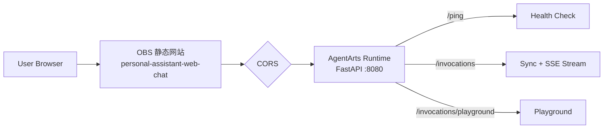

# Personal Assistant

基于华为云智果（AgentArts）Agent 平台构建的个人助理应用，作为 AgentArts 高代码开发模式的端到端示例项目。

## 项目背景

AgentArts 是华为云推出的 Agent 开发平台，为专业开发者提供了一条从代码到生产的完整链路。然而，对于刚刚接触 AgentArts 的开发者来说，"平台能做什么"、"我能做到什么程度"往往是最先遇到的问题。

Personal Assistant 正是为此而生——它是一个真实可运行的个人助理 Agent，从本地编码、SDK 接入、Memory 与 Tools 集成，到 container 化部署和线上 observability，完整覆盖 AgentArts 高代码开发的全流程。通过这个项目，我们希望回答两个问题：

- **AgentArts 怎么用？** —— 以 LangChain/LangGraph 为主流框架，演示如何通过 AgentArts SDK 接入平台的 Memory（记忆库）、MCP Gateway（网关）、Tools（工具集成）和 Identity（身份认证）等核心能力。
- **AgentArts 能做成什么？** —— 交付一个真正有价值的个人助理，而不是玩具 Demo。它连接日历、邮件、笔记、任务管理等日常工具，具备长短期记忆，能在你的授权下主动完成跨应用的信息检索、日程协调和事项跟进。

## 功能规划

| 模块 | 说明 | 用到的 AgentArts 能力 |
|------|------|----------------------|
| 日历管理 | 查询/创建日程，冲突检测，多时区协调 | Memory（用户偏好记忆）、MCP Gateway（日历 API） |
| 邮件处理 | 摘要收件箱、草拟/发送邮件、自动分类 | Tools（邮件服务集成）、Guard（敏感操作拦截） |
| 笔记检索 | 自然语言搜索历史笔记、相关知识关联 | Memory（长期记忆抽取）、MCP Gateway（笔记 API） |
| 任务跟踪 | 多源事项聚合，智能优先级排序 | Memory（短期上下文记忆）、Runtime（弹性伸缩） |
| 上下文记忆 | 记住用户偏好、习惯和历史决策 | Memory（长短期分级存储、自定义抽取策略） |

## 技术架构



## 项目结构

```
personal-assistant/
├── personal-assistant-client/   # 前端应用，Web Chat 界面及飞书/OfficeClaw 客户端适配
├── personal-assistant-service/  # 后端服务，AgentArts Runtime 上的 AI Agent 服务
├── personal-assistant-meta/     # Design hub，所有设计讨论、架构决策和变更规划
├── personal-assistant-infra/    # 基础设施即代码（IaC），OpenTofu + HCL，管理华为云资源
├── personal-assistant-e2e/      # E2E 测试脚本，pytest，覆盖 Service+Client 联调
├── .opencode/                   # OpenCode agent 定义与 workflow 配置
├── AGENTS.md                    # 项目根 AGENTS.md，整体规范与目录导航
└── README.md
```

## 访问已部署系统

- **Web Chat 前端**：`https://personal-assistant-web-chat.obs-website.cn-southwest-2.myhuaweicloud.com`
- **Backend API**：`https://<agent>.agentarts.cn-southwest-2.myhuaweicloud.com`
- 具体域名以 `agentarts launch` 输出和 OBS 控制台静态网站托管域名为准。

## 快速开始

### 本地开发

**后端**（Python 3.12+、uv）：

```bash
cd personal-assistant-service
uv sync
cp .env.example .env   # 编辑 .env 填入 MAAS_API_KEY 等密钥
uv run uvicorn app.main:app --host 0.0.0.0 --port 8080 --reload
```

**前端**（Node.js 18+、npm）：

```bash
cd personal-assistant-client
npm install
npm run dev
```

### 生产部署

部署流程详见 [`personal-assistant-meta/issues/chores/chore-1-agentarts-deploy/plan.md`](personal-assistant-meta/issues/chores/chore-1-agentarts-deploy/plan.md)。

1. **后端**：`docker build`（ARM64 镜像）→ 推送 SWR → `agentarts launch` 启动 AgentArts Runtime
2. **前端**：`npm run build` → `obsutil cp` 上传至 OBS 静态网站
3. **基础设施**：OBS Bucket 由 `personal-assistant-infra/` 中 OpenTofu IaC 管理

> CORS 中间件已在 `app/main.py` 中预配置（支持 `CORS_ALLOWED_ORIGINS` 环境变量），无需手动修改。

## 愿景

Personal Assistant 的目标不是替代现有的 AI 助手产品，而是为 AgentArts 开发者提供一个"可复制的起点"——你可以基于这个项目快速搭建自己的 Agent 应用，也可以把它当作学习 AgentArts 平台能力的实战教程。每一个模块的设计都优先考虑**可替换性**和**可扩展性**，方便你替换成自己的 Tools 和数据源。

如果你正在评估 AgentArts 是否能满足你的业务需求，希望这个项目能给你一个真实的参考。
