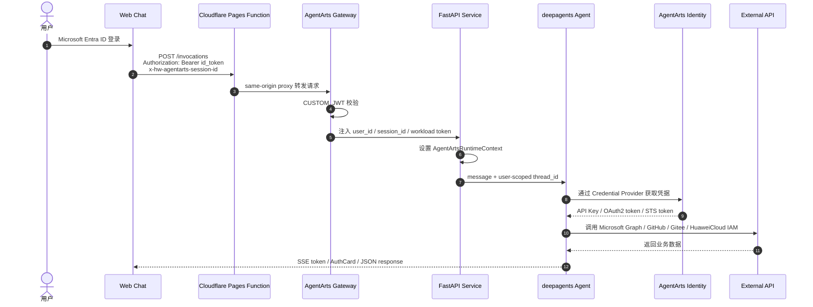
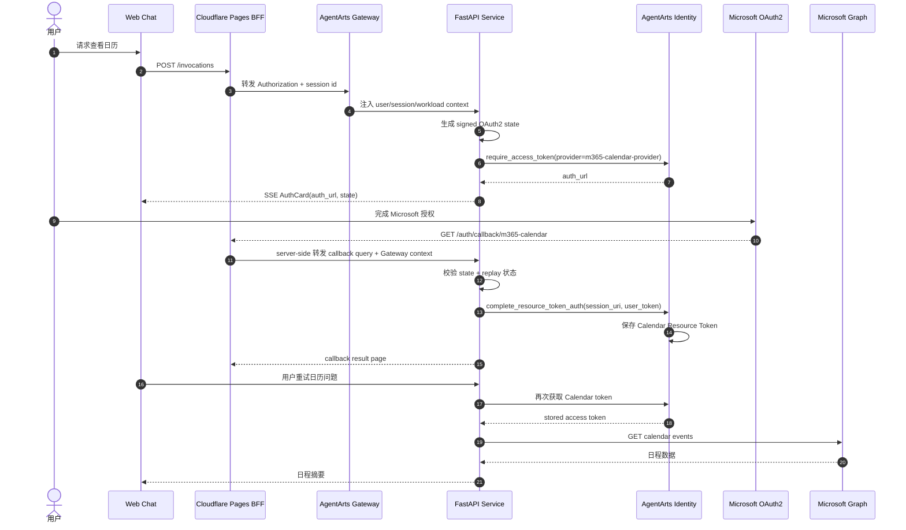

# Personal Assistant Demo 场景与 Agent Identity 最佳实践

> 本文是 Personal Assistant demo 的展示文档，侧重说明各业务场景的 use case，以及每个 use case 具体使用了 Agent Identity 的哪些能力。

## 1. Demo 定位

Personal Assistant 不是一个普通聊天 Demo，而是一个 **Agent Identity 最佳实践 Demo**。它要展示的问题是：

> 当 Agent 需要代表真实用户访问真实系统时，如何处理用户身份、会话隔离、凭据托管、用户委托、云资源临时凭证和敏感操作确认？

当前 production 主入口是 Web Chat。用户通过 Microsoft Entra ID 登录后，在浏览器中以自然语言让 Agent 查询邮件、读取日历、访问代码仓库、查看华为云 IAM 用户，或执行需要确认的写操作。所有外部凭据都由 AgentArts Identity 管理，Agent 代码不保存长期 API Key、OAuth2 access token、AK/SK 或用户密码。

## 2. Agent Identity 能力总览

| Agent Identity 能力 | Demo 中的落点 | 价值 |
|---|---|---|
| Inbound Identity | Web Chat 通过 Microsoft Entra ID 登录，AgentArts Gateway 校验 JWT 并注入 `X-HW-AgentGateway-User-Id` | 后端只信任 Gateway 注入的用户身份，避免浏览器伪造用户 ID |
| Session Identity | Gateway / Client 传递 `x-hw-agentarts-session-id`，后端用 `{user_id}:{session_id}` 作为 checkpoint thread_id | 同一用户多轮对话连续，不同用户和不同 Session 隔离 |
| Workload Identity | Gateway 注入 `X-HW-AgentGateway-Workload-Access-Token`，后端写入 `AgentArtsRuntimeContext` | Agent 容器用短期 Workload token 访问 Identity Service，不依赖本地长期凭据 |
| API Key Credential Provider | `DEEPSEEK_API_KEY` Provider 为 LLM 调用提供 DeepSeek API Key | LLM API Key 不进代码、不进 `.env`、不进镜像 |
| OAuth2 User Federation | `m365-email-provider`、`m365-calendar-provider`、`github-provider`、`gitee-provider` | Agent 以用户委托身份访问 Microsoft Graph、GitHub、Gitee |
| OAuth2 Token Vault | 用户完成授权后，第三方 access token 保存在 AgentArts Identity | 浏览器、LLM prompt、日志和业务数据库都不接触第三方 token |
| OAuth2 Auth URL Callback | 未授权时 `on_auth_url` 通过 SSE AuthCard 展示授权链接 | 授权链接带外呈现，不由 LLM 转述，减少误传和泄露 |
| OAuth2 Full Flow | Calendar callback 由 Cloudflare Pages BFF 转发到 Service，Service 调用 `complete_resource_token_auth` | 展示完整的服务端 session binding、state 校验和 replay 防护 |
| STS Credential Provider | `iam-users-readonly` 为华为云 IAM 只读查询提供临时凭证 | 云资源访问使用短期 STS，按最小权限授予 |
| Guarded Actions | 发送邮件、回复邮件、GitHub star 需要用户明确确认 | 凭据层允许访问，应用层对高风险写操作加运行态 Guard |

## 3. 端到端身份链路



这条链路体现了 Demo 的核心边界：

- Browser 只负责登录、携带 ID Token 和展示授权状态。
- Gateway 是生产环境 Inbound JWT 校验者。
- Service 只信任 Gateway 注入的身份 header。
- Agent 通过 Identity SDK 获取外部凭据。
- 第三方 access token 不暴露给浏览器、LLM、日志或业务数据库。

## 4. Use Case 1：登录后进入 Web Chat

### 用户场景

用户打开 Web Chat，点击登录，使用 Microsoft Entra ID 完成认证，然后开始与 Personal Assistant 对话。

示例：

```text
用户：你好，今天帮我处理一下工作事项。
Agent：可以。我可以帮你查看邮件、日历、代码仓库和部分华为云 IAM 信息。你想先处理哪一项？
```

### 使用的 Agent Identity 能力

| 能力 | 说明 |
|---|---|
| Inbound Custom JWT | Web Chat 使用 MSAL 获取 Microsoft `id_token`，请求 `/invocations` 时携带 `Authorization: Bearer <id_token>` |
| Gateway JWT Verification | AgentArts Gateway 根据 `.agentarts_config.yaml` 中的 OIDC discovery 配置校验 token |
| Gateway Header Injection | Gateway 向后端注入 `X-HW-AgentGateway-User-Id` 和 `x-hw-agentarts-session-id` |
| Workload Access Token | Gateway 注入 `X-HW-AgentGateway-Workload-Access-Token`，供后端访问 Identity Service |

### 实现落点

- Frontend：`personal-assistant-client/src/lib/auth.ts`
- Frontend request：`personal-assistant-client/src/lib/chat/chat-api-client.ts`
- Service auth：`personal-assistant-service/app/auth.py`
- Runtime route：`personal-assistant-service/app/main.py`
- AgentArts config：`personal-assistant-service/.agentarts_config.yaml`

## 5. Use Case 2：普通对话与 LLM 调用

### 用户场景

用户进行普通对话、摘要、规划或让 Agent 判断下一步该调用哪个工具。即使没有访问外部用户资源，Agent 也需要调用 LLM。

示例：

```text
用户：帮我把今天的工作按优先级整理一下。
Agent：可以。我会先查看你的日历和邮件，再按紧急程度整理。
```

### 使用的 Agent Identity 能力

| 能力 | 说明 |
|---|---|
| API Key Credential Provider | LLM API Key 通过 `DEEPSEEK_API_KEY` Provider 获取 |
| Secretless Runtime | 代码和环境变量只保存 Provider name，不保存真实 API Key |
| Workload Identity | 生产环境通过 Gateway 注入的 Workload Access Token 向 Identity Service 换取凭据 |

### 实现落点

- Provider catalog：`personal-assistant-service/app/provider_catalog.py`
- LLM credential：`personal-assistant-service/app/llm_config.py`
- Agent bundle：`personal-assistant-service/app/agent_handler.py`

这一场景体现了 Agent Identity 的第一个基本原则：**Agent 需要调用 LLM，但不应该把 LLM API Key 放进代码、镜像或普通环境变量。**

## 6. Use Case 3：查看和搜索 Microsoft 365 邮件

### 用户场景

用户希望 Agent 读取自己的 Outlook 邮件，例如查看收件箱、打开某封邮件详情或按关键词搜索。

示例：

```text
用户：帮我看看最近 10 封收件箱邮件。
Agent：我需要访问你的 Microsoft 365 邮件。请点击授权卡片完成授权。
用户完成授权后重试。
Agent：最近 10 封邮件如下：...
```

### 使用的 Agent Identity 能力

| 能力 | 说明 |
|---|---|
| OAuth2 User Federation | `m365-email-provider` 以用户身份调用 Microsoft Graph Mail API |
| Token Vault | Microsoft Graph access token 由 AgentArts Identity 保存 |
| AuthCard | 未授权时，`on_auth_url` 通过 SSE custom stream 把授权链接推给 Web Chat |
| Upfront Consent | 邮件领域统一使用 `Mail.Read`、`Mail.ReadWrite`、`Mail.Send` scope，避免同一领域内频繁重复授权 |

### 支持的邮件 use case

| Use Case | Tool | Identity Provider |
|---|---|---|
| 列出收件箱或指定 folder 邮件 | `list_emails` | `m365-email-provider` |
| 获取单封邮件正文、发件人、收件人和附件信息 | `get_email` | `m365-email-provider` |
| 按关键词搜索邮件 | `search_emails` | `m365-email-provider` |

### 实现落点

- Email tools：`personal-assistant-service/app/tools/email_tools.py`
- Tool registry：`personal-assistant-service/app/tools/__init__.py`
- SSE AuthCard stream：`personal-assistant-service/app/agent_handler.py`

## 7. Use Case 4：草拟、发送和回复邮件

### 用户场景

用户让 Agent 写邮件或回复邮件。Agent 必须先展示预览，只有用户明确确认后才执行发送。

示例：

```text
用户：帮我回复张三，说 demo 改到周五下午。
Agent：我会回复这封邮件：
收件人：张三
正文：张三你好，demo 改到周五下午，具体时间我稍后同步。
是否确认发送？
用户：确认发送。
Agent：已发送。
```

### 使用的 Agent Identity 能力

| 能力 | 说明 |
|---|---|
| OAuth2 User Federation | Agent 使用用户授权的 Microsoft Graph token 发送或回复邮件 |
| Token Vault | 发送操作使用 Identity 注入的 access token，Service 不持久化 token |
| Guarded Action | 写操作必须经过用户确认，不能只凭初始自然语言请求直接执行 |
| Scope Strategy | Identity 层使用统一邮件 scope，安全控制上移到 Agent Runtime 的 Guard |

### 支持的写操作 use case

| Use Case | Tool | Guard 方式 |
|---|---|---|
| 发送新邮件 | `send_email` | Agent 行为规则要求先展示完整预览，用户确认后才调用 |
| 回复已有邮件 | `reply_to_email` | Agent 行为规则要求先读取上下文、展示回复内容，再等待确认 |

邮件写操作体现了 Agent Identity 的第二个关键原则：**凭据授权不等于业务动作自动允许。** 用户可以授权 `Mail.Send`，但 Agent Runtime 仍要对高风险动作进行确认。

## 8. Use Case 5：读取 Microsoft 365 日历

### 用户场景

用户希望 Agent 查看今天、本周或指定时间范围的会议安排，也可以查看某个会议详情或按关键词搜索。

示例：

```text
用户：今天下午有哪些会议？
Agent：我需要访问你的 Microsoft 365 日历。请点击授权卡片完成授权。
用户完成授权后重试。
Agent：今天下午有 2 个会议：...
```

### 使用的 Agent Identity 能力

| 能力 | 说明 |
|---|---|
| OAuth2 User Federation | `m365-calendar-provider` 以用户身份读取 Microsoft Graph Calendar |
| Least Privilege Scope | Calendar 首版只使用 `Calendars.Read` |
| OAuth2 Full Flow | Calendar 使用 backend-owned callback 完成 `complete_resource_token_auth` |
| Signed State | Service 生成并校验绑定 user_id、session_id、provider 的 OAuth2 state |
| Replay Guard | callback completion 状态由 `OAuth2CallbackStore` 管理，防止重复 callback 造成混乱 |
| Callback Context Bridge | Cloudflare Pages BFF 用短时 HttpOnly cookie 恢复 callback 所需 Gateway context |

### 支持的日历 use case

| Use Case | Tool | Identity Provider |
|---|---|---|
| 查询指定时间范围内的日程 | `list_calendar_events` | `m365-calendar-provider` |
| 查看单个会议详情 | `get_calendar_event` | `m365-calendar-provider` |
| 按关键词搜索会议 | `search_calendar_events` | `m365-calendar-provider` |

### Calendar OAuth2 Full Flow



Calendar 是当前 Demo 中最完整的 Agent Identity OAuth2 样板：浏览器只展示状态，Service 负责 callback ownership、state 校验、replay 处理和 Identity session binding。

### 实现落点

- Calendar tools：`personal-assistant-service/app/tools/calendar_tools.py`
- OAuth2 state：`personal-assistant-service/app/oauth2_state.py`
- Callback store：`personal-assistant-service/app/oauth2_callback_store.py`
- Backend callback：`personal-assistant-service/app/main.py`
- Cloudflare callback BFF：`personal-assistant-client/functions/auth/callback/m365-calendar.js`
- Return URL allowlist：`personal-assistant-infra/agent_identity.tf`

## 9. Use Case 6：访问 GitHub 仓库与代码

### 用户场景

用户希望 Agent 代表自己访问 GitHub 仓库，例如列出仓库、查看目录、读取文件或搜索代码。

示例：

```text
用户：列出我能访问的 GitHub 仓库。
Agent：我需要你的 GitHub 授权。请点击授权卡片完成授权。
用户完成授权后重试。
Agent：你可访问的仓库包括：...
```

### 使用的 Agent Identity 能力

| 能力 | 说明 |
|---|---|
| OAuth2 User Federation | `github-provider` 以用户身份调用 GitHub API |
| Configurable Scope | 默认 scope 来自 `GITHUB_SCOPES`，当前为 `repo,read:user` |
| AuthCard | 未授权时通过 SSE AuthCard 展示 GitHub 授权 URL |
| Token Vault | GitHub token 保存在 AgentArts Identity |

### 支持的 GitHub use case

| Use Case | Tool | Identity Provider |
|---|---|---|
| 列出当前用户可访问仓库 | `github_list_repositories` | `github-provider` |
| 查看仓库目录或文件列表 | `github_list_repo_contents` | `github-provider` |
| 读取仓库文件内容 | `github_get_file_content` | `github-provider` |
| 搜索代码 | `github_search_code` | `github-provider` |
| 给仓库 star | `github_star_repository` | `github-provider` |

### 敏感操作 Guard

`github_star_repository` 是 tool-level Guard 示例：默认 `confirm=False` 时只返回预览和 `requires_confirmation=True`，只有用户明确确认后，Agent 才能再次以 `confirm=True` 调用真实 star API。

### 实现落点

- GitHub tools：`personal-assistant-service/app/tools/github_tools.py`
- Provider settings：`personal-assistant-service/app/settings.py`
- Identity helpers：`personal-assistant-service/app/identity.py`

## 10. Use Case 7：访问 Gitee 仓库

### 用户场景

用户希望 Agent 代表自己查看 Gitee / 码云仓库。

示例：

```text
用户：帮我列一下我的 Gitee 仓库。
Agent：请先完成 Gitee 授权。
用户完成授权后重试。
Agent：你当前可访问的 Gitee 仓库如下：...
```

### 使用的 Agent Identity 能力

| 能力 | 说明 |
|---|---|
| OAuth2 User Federation | `gitee-provider` 以用户身份调用 Gitee API |
| Provider Abstraction | GitHub 和 Gitee 使用相同的 User Federation 模式，但 Provider 与 API endpoint 独立 |
| AuthCard | 未授权时通过 SSE AuthCard 展示授权入口 |

### 支持的 Gitee use case

| Use Case | Tool | Identity Provider |
|---|---|---|
| 列出当前用户可访问仓库 | `gitee_list_repositories` | `gitee-provider` |

### 实现落点

- Gitee tools：`personal-assistant-service/app/tools/gitee_tools.py`
- Provider settings：`personal-assistant-service/app/settings.py`

## 11. Use Case 8：查看华为云 IAM 用户

### 用户场景

运维或管理员希望通过对话查看华为云 IAM 子用户列表、启停状态等只读信息。

示例：

```text
用户：帮我看一下华为云 IAM 子用户列表。
Agent：当前可见 IAM 用户如下：...
```

### 使用的 Agent Identity 能力

| 能力 | 说明 |
|---|---|
| STS Credential Provider | `iam-users-readonly` 通过 AgentArts Identity 下发短期 STS 凭证 |
| Least Privilege | Provider 对应只读 IAM 用户查询权限 |
| Temporary Credential | 工具只拿到短期 `access_key_id`、`secret_access_key`、`security_token` |
| No Long-lived AK/SK | 代码、环境变量和日志都不保存长期 AK/SK |

### 支持的 IAM use case

| Use Case | Tool | Identity Provider |
|---|---|---|
| 分页列出 IAM 用户 / 子用户 | `huaweicloud_list_iam_users` | `iam-users-readonly` |
| 按 group_id 过滤 IAM 用户 | `huaweicloud_list_iam_users` | `iam-users-readonly` |

### 实现落点

- IAM tools：`personal-assistant-service/app/tools/iam_tools.py`
- STS settings：`personal-assistant-service/app/settings.py`
- Identity helper：`personal-assistant-service/app/identity.py`

## 12. Use Case 9：多轮会话与用户隔离

### 用户场景

用户在同一 Session 中连续对话，Agent 能记住前面刚说过的信息；不同用户或不同 Session 之间不能串扰。

示例：

```text
用户 A / Session 1：我今天重点关注项目 A。
用户 A / Session 1：我刚才说重点关注什么？
Agent：项目 A。

用户 B / Session 1：我刚才说重点关注什么？
Agent：我没有看到你在当前会话里提供过这个信息。
```

### 使用的 Agent Identity 能力

| 能力 | 说明 |
|---|---|
| Gateway User ID | 后端使用可信 `X-HW-AgentGateway-User-Id` |
| Session ID | 后端使用 `x-hw-agentarts-session-id` |
| User-scoped Checkpoint | `thread_id = "{user_id}:{session_id}"` |
| Defense in Depth | 即使不同用户伪造相同 session id，最终 thread_id 仍不同 |

### 实现落点

- Config 构造：`personal-assistant-service/app/agent_handler.py`
- Header 提取：`personal-assistant-service/app/auth.py`
- Checkpointer backend：`POSTGRES_DSN` / `SQLITE_DB_PATH` / in-memory fallback

## 13. Demo 展示路径建议

建议按以下顺序演示，能最清晰突出 Agent Identity：

1. **登录与 Inbound Identity**：展示 Web Chat 登录后请求进入 Agent，说明 Gateway 是用户身份信任边界。
2. **普通对话与 LLM Credential**：说明 LLM API Key 来自 `DEEPSEEK_API_KEY` Provider，而不是环境变量明文。
3. **邮件读取**：首次触发 `m365-email-provider` 授权，展示 AuthCard 和 User Federation。
4. **邮件发送 Guard**：展示先预览、再确认发送，强调“有 token 不代表可直接写”。
5. **Calendar Full OAuth2 Flow**：展示 callback 经 BFF 到 Service，由 Service 完成 `complete_resource_token_auth`。
6. **GitHub / Gitee 代码仓库**：展示同一 Agent 可以接入多个 OAuth2 Provider。
7. **GitHub star Guard**：展示 tool-level `confirm=False -> confirm=True`。
8. **Huawei Cloud IAM STS**：展示 Agent 使用短期 STS 凭证访问云资源，避免长期 AK/SK。
9. **Session Isolation**：展示同 session 连续、多用户隔离。

## 14. Demo 关键话术

可以用下面几句话概括 Demo 的 Agent Identity 价值：

- **用户身份由 Gateway 验证，不由 Agent 自己猜。**
- **外部凭据由 Identity Service 托管，不进代码、不进镜像、不进浏览器。**
- **Agent 代表用户调用外部服务，但每个 Provider 都有独立授权边界。**
- **Workload token 是短期凭证，Agent Runtime 不需要长期平台凭据。**
- **OAuth2 callback 的完成动作在服务端收口，浏览器只做展示和状态同步。**
- **敏感写操作由 Runtime Guard 控制，不能因为用户授权了 scope 就自动执行。**
- **会话状态使用 user-scoped thread_id 隔离，避免跨用户或跨 Session 串扰。**

## 15. 结论

这个 Demo 的核心不是“Agent 会调用几个 API”，而是展示一套可复用的生产级身份模式：

1. Inbound：用户先被可信 Gateway 验证。
2. Runtime：Agent 以 Workload Identity 访问 Identity Service。
3. Outbound：外部资源通过 Provider 分域授权。
4. Token：第三方凭据存放在 Token Vault。
5. Guard：高风险写操作在 Agent Runtime 再确认。
6. Session：状态按用户和会话隔离。

因此，Personal Assistant 可以作为 Agent Identity 最佳实践的端到端参考实现：从登录、对话、授权、callback、工具调用，到敏感操作确认和会话隔离，每一层都有明确的身份边界。
