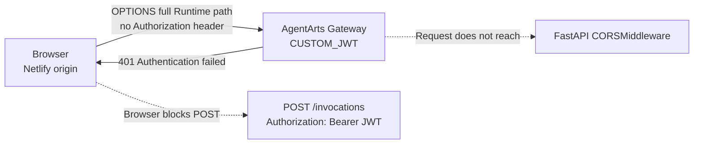
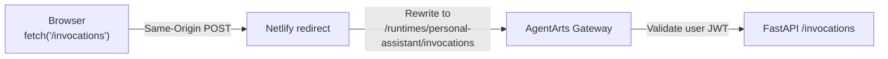
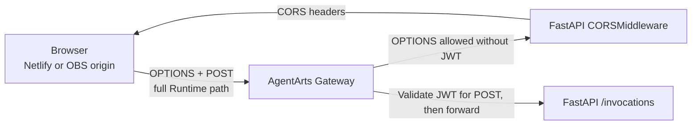

# ADR-014: Netlify Proxy 与生产 CORS 直连评估

> 状态：Accepted（2026-06-18 修订） | 原始日期：2025-06-11 | 关联文档：[`ADR-015`](./ADR-015-obs-cdn-path-routing-no-cors.md)

---

## 背景

Web Chat 前端当前部署在 Netlify
（`agentarts-personal-assistant.netlify.app`），后端运行在 AgentArts
Gateway（`defaultgw-xxx.cn-southwest-2.huaweicloud-agentarts.com`）。

项目当前按环境使用两种 Proxy：

| 环境 | 当前请求方式 | Proxy 职责 |
|------|--------------|------------|
| Local development | 浏览器请求 Vite `/invocations` | 转发到本地 FastAPI；当 `PROXY_TARGET=prod` 时补充 Gateway Runtime path |
| Production | 浏览器请求 Netlify `/invocations` | Netlify redirect 转发到 AgentArts Gateway 的完整 Runtime path |

Gateway 对外暴露的真实路径不是前端使用的逻辑路径：

```text
Frontend path: /invocations
Gateway path:  /runtimes/personal-assistant/invocations
```

Vite Proxy 当前通过以下 rewrite 解决该差异：

```ts
path.replace(
  /^\/invocations/,
  "/runtimes/personal-assistant/invocations",
)
```

原 ADR 假设生产 Gateway 使用 `API_KEY`，因此选择 Netlify Edge Function
在服务端注入 API Key。当前实现和认证模型已变化：

- Gateway 使用 `authorizer_type: CUSTOM_JWT`
- 浏览器通过 Microsoft 登录取得用户 JWT，并发送
  `Authorization: Bearer <id-token>`
- Netlify 当前使用 `netlify.toml` redirect，只负责 URL rewrite，不再注入
  API Key

因此需要重新评估：生产环境能否删除 Netlify Proxy，让浏览器通过 CORS
直接调用 AgentArts Gateway。

---

## 决策

**Local development 继续使用 Vite Proxy。生产环境暂时保留 Netlify Proxy，
不切换到浏览器 CORS 直连。**

删除生产 Proxy 是目标方向，但只有在 AgentArts Gateway 能正确处理
unauthenticated CORS preflight 后才能实施。当前 Gateway 会在请求到达
FastAPI `CORSMiddleware` 之前拒绝 `OPTIONS`，因此生产 CORS 直连不可用。



### Path 问题结论

URL path 差异**不会从协议上阻止 CORS**。Proxy 删除后，不再执行
`path.replace(...)`，但前端可以把完整 Runtime prefix 放入生产环境变量：

```bash
VITE_API_BASE_URL=https://<gateway-domain>/runtimes/personal-assistant
```

现有 Client 使用：

```ts
fetch(`${baseUrl}/invocations`, ...)
```

最终请求 URL 将正确变为：

```text
https://<gateway-domain>/runtimes/personal-assistant/invocations
```

因此 path rewrite 可以由配置替代，不需要为此保留 Proxy。必须避免仅配置
Gateway origin，否则浏览器会请求错误的
`https://<gateway-domain>/invocations` 并得到 `404 No matching policy found`。

### OPTIONS preflight 结论

当前聊天请求包含以下非 simple request 条件：

- `Content-Type: application/json`
- `Authorization`
- `x-hw-agentarts-session-id`
- `X-HW-AgentGateway-User-Id`

浏览器会先发送：

```http
OPTIONS /runtimes/personal-assistant/invocations
Origin: https://agentarts-personal-assistant.netlify.app
Access-Control-Request-Method: POST
Access-Control-Request-Headers: authorization,content-type,x-hw-agentarts-session-id,x-hw-agentgateway-user-id
```

Preflight 只声明后续请求希望使用的 headers，不会携带业务请求的
`Authorization: Bearer <JWT>`。2026-06-18 对已部署 Gateway 的实际验证结果为：

```http
HTTP/1.1 401 Unauthorized

{"code":401,"data":null,"message":"Authentication failed!"}
```

这说明请求被 Gateway 的 `CUSTOM_JWT` authorizer 拦截，未到达 FastAPI。
所以即使 FastAPI 已正确配置 `CORSMiddleware`，也无法为该 preflight 返回
`Access-Control-Allow-Origin` 等 headers。浏览器随后不会发送真实的
`POST /invocations`。

---

## 目标拓扑与迁移条件

### 当前可用拓扑



Netlify redirect 使浏览器看到的是 Same-Origin 请求，因此不会产生 CORS
preflight。用户 JWT 仍由浏览器发送并由 Gateway 验证，Netlify 不保存或注入
API Key。

### 未来 CORS 直连拓扑



只有以下条件全部满足后，才能删除生产 Netlify Proxy：

1. AgentArts Gateway 明确支持对目标 Runtime path 的 `OPTIONS` bypass，
   或 Gateway 自身能够返回完整、正确的 CORS preflight response。
2. Gateway 对 `POST` 等受保护的业务 methods 仍强制执行 `CUSTOM_JWT`
   验证；FastAPI 不重复验证 JWT，而是信任 Gateway 注入的 verified user
   identity。放行 `OPTIONS` 不能降低业务接口认证强度。
3. 生产 `VITE_API_BASE_URL` 包含完整
   `/runtimes/personal-assistant` prefix。
4. FastAPI `CORS_ALLOWED_ORIGINS` 只列出明确允许的生产 origin。
5. 对真实 Gateway 完成 `OPTIONS`、authenticated `POST` 和 SSE streaming
   的 E2E 验证。

满足条件 1 之前，不得仅删除 Netlify redirect；否则生产聊天请求会在
preflight 阶段全部失败。

---

## 方案对比

| 因素 | Netlify Proxy（当前） | 浏览器 CORS 直连（目标） |
|------|-----------------------|---------------------------|
| URL path 转换 | Netlify rewrite | `VITE_API_BASE_URL` 携带 Runtime prefix |
| CORS preflight | Same-Origin，不触发 | 必然触发 |
| Gateway `OPTIONS` | 不经过浏览器 preflight | 当前返回 401，阻断方案 |
| 用户认证 | Browser JWT → Gateway | Browser JWT → Gateway |
| Server-side API Key | 不需要 | 不需要 |
| SSE | 当前可透传，需持续验证平台超时 | Gateway 放行 preflight 后可直连 |
| 生产可行性 | ✅ 当前可用 | ❌ 当前不可用 |

---

## 影响

### 保留

- Local development 继续通过 Vite Proxy 使用逻辑路径 `/invocations`。
- Production 继续通过 Netlify redirect 访问完整 Gateway Runtime path。
- Gateway 继续使用 `CUSTOM_JWT` 验证用户 JWT。
- FastAPI 保留显式 origin allowlist，为 Gateway 将来支持 preflight 做准备。

### 不再适用的原 ADR 内容

- Netlify Edge Function 注入 `AGENTARTS_API_KEY`
- 浏览器不持有任何 Gateway credential
- Edge Function 生成 `x-hw-agentarts-session-id`

当前 session ID 由 Client 生成并持久化，用户 JWT 也由 Client 获取和发送。

### 后续验证命令

```bash
curl -i -X OPTIONS \
  "https://<gateway-domain>/runtimes/personal-assistant/invocations" \
  -H "Origin: https://<frontend-origin>" \
  -H "Access-Control-Request-Method: POST" \
  -H "Access-Control-Request-Headers: authorization,content-type,x-hw-agentarts-session-id,x-hw-agentgateway-user-id"
```

成功标准：

- HTTP 2xx
- `Access-Control-Allow-Origin` 精确匹配前端 origin
- `Access-Control-Allow-Methods` 包含 `POST`
- `Access-Control-Allow-Headers` 覆盖实际请求 headers
- 不要求 preflight 携带 JWT

---

## Four-Question Gate

| 问题 | 当前决策 |
|------|----------|
| Is it best practice? | Yes。认证与 CORS 分离处理，不通过暴露 API Key 或关闭业务认证绕过 preflight |
| Is it industry standard? | Yes。开发使用 dev proxy，生产仅在 Gateway 正确支持 CORS 后才采用跨域直连 |
| Is it conventional? | Yes。使用完整 API base URL 解决部署路径差异，使用标准 preflight 验证跨域能力 |
| Is it modern? | Yes。Browser JWT + Gateway validation + explicit origin allowlist 符合现代 SPA API 模式 |

---

## 参考

- [ADR-003: AgentArts 平台作为基础设施](./ADR-003-agentarts-platform.md)
- [ADR-015: OBS + CDN 路径分发避免网关 CORS OPTIONS 预检拦截](./ADR-015-obs-cdn-path-routing-no-cors.md)
- [前端架构 §6.2 Web Chat 前端部署](../frontend_architecture.md#62-web-chat-前端部署)
- [后端架构 §2.1 AgentArts Gateway 路由约束](../backend_architecture.md#21-agentarts-gateway-路由约束)
- [AgentArts §11.7 Gateway 路由路径](../cloud-service/agentarts.md#117-gateway-路由路径)
