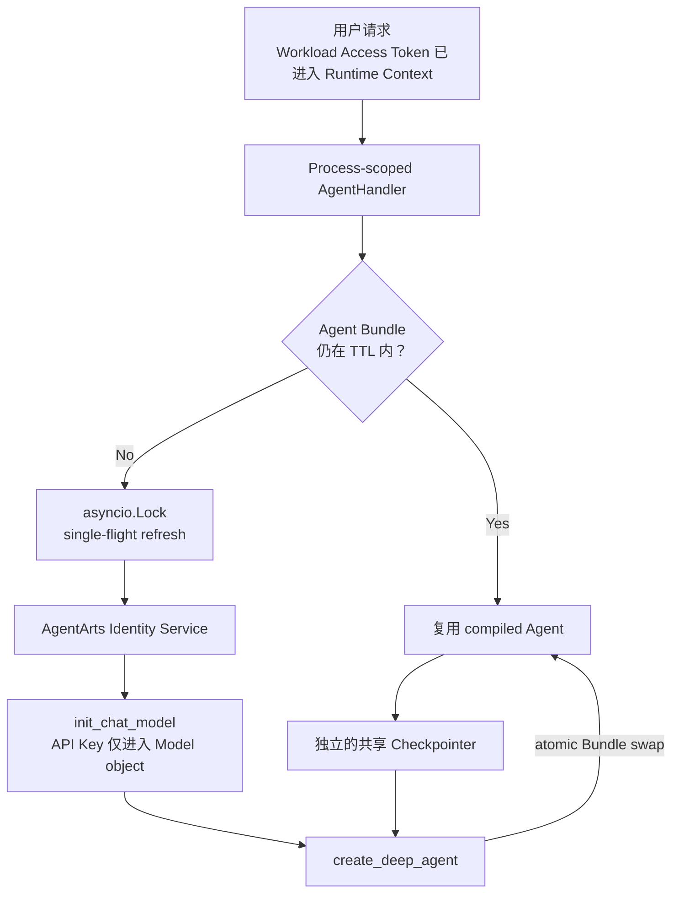

# ADR-016: Secretless Credential Injection via AgentArts Identity

> 状态：Accepted | 日期：2026-06-17

> **2026-06-19 修订**：用户配置入口统一为 `.env.example`，Runtime 参数由
> Pydantic Settings 管理，Provider metadata 位于 typed Python catalog。下文
> `config.yaml` 和旧 Runtime variable 图示仅保留为历史背景。

---

## 背景

Personal Assistant 作为 AI Agent 应用，需要多种凭据来调用外部服务：

| 凭据类型 | 用途 | 示例 |
|----------|------|------|
| LLM API Key | 调用大模型推理 | DeepSeek API Key |
| OAuth2 Access Token | 以用户身份访问外部 API | Microsoft Graph（邮件/日历）、GitHub API |
| STS Token | Agent 自身访问云资源 | 华为云 IAM/OBS |

这些凭据是**极度敏感的高价值凭证**——LLM API Key 泄露可能在数小时内产生数千美元账单，OAuth Token 泄露等同于用户数据泄露。

传统做法（环境变量注入、GitHub Secrets + 构建时注入）存在三大问题：

1. **AWS/云平台控制台裸奔**：部署后凭据以明文出现在容器环境变量配置页，任何有云平台访问权限的人可直接复制
2. **CI/CD 污染**：凭据经过 GitHub Secrets → Workflow → 部署配置，链路长、接触面大
3. **轮转困难**：更换凭据需重新跑 CI/CD 流水线，而非在平台侧秒级更新

业界（AWS AgentCore / Secrets Manager）已有成熟方案：**凭据声明依赖，平台运行时注入**——代码只声明"我需要一个叫 X 的 API Key"，不持有真实值。本项目需在 AgentArts 平台上落地该方案。

## 决策

**所有敏感凭据通过 AgentArts Identity 存储与管理。代码通过 `agentarts-sdk` 装饰器声明依赖，运行时由平台注入解密后的凭据。代码仓库、CI/CD 流水线、容器环境变量中不得出现任何明文凭据。**

### 三层分离架构

```
┌─────────────────────────────────────────────────┐
│  Layer 1: Platform (AgentArts Identity)          │
│  ┌─────────────────────────────────────────────┐ │
│  │ DEEPSEEK_API_KEY  provider (API Key)        │ │
│  │ m365-provider       provider (OAuth2)       │ │
│  │ github-provider     provider (OAuth2)       │ │
│  │ iam-users-readonly  provider (STS)          │ │
│  └─────────────────────────────────────────────┘ │
│  唯一可信源。密钥明文仅在此层。                      │
└─────────────────────────────────────────────────┘
                        │
                        │ @require_api_key / @require_access_token
                        ▼
┌─────────────────────────────────────────────────┐
│  Layer 2: Code (typed Settings + Python catalog) │
│  ┌─────────────────────────────────────────────┐ │
│  │ credential_provider_name: DEEPSEEK_API_KEY   │ │
│  │ base_url: https://api.deepseek.com           │ │
│  │ model: deepseek-chat                         │ │
│  └─────────────────────────────────────────────┘ │
│  只存指针（provider name），不存密钥明文。           │
└─────────────────────────────────────────────────┘
                        │
                        │ agentarts deploy
                        ▼
┌─────────────────────────────────────────────────┐
│  Layer 3: CI/CD (GitHub Actions)                 │
│  ┌─────────────────────────────────────────────┐ │
│  │ .agentarts_config.yaml 只注入 canonical       │ │
│  │ Runtime Settings，不包含 credential value     │ │
│  │   （无 API Key）                              │ │
│  └─────────────────────────────────────────────┘ │
│  GitHub 完全不知道 API Key 是什么。                │
└─────────────────────────────────────────────────┘
```

### 装饰器体系

| 装饰器 | 凭据类型 | 使用场景 |
|--------|----------|----------|
| `@require_api_key` | 静态 API Key（M2M） | LLM 推理、企业内部 API |
| `@require_access_token` | OAuth2 Access Token（User Federation） | Microsoft Graph、GitHub API |
| `@require_sts_token` | 云平台临时凭证（M2M） | 华为云 IAM、OBS |

### 运行时流程（以 LLM API Key 为例）



`AgentHandler` lazy 创建不可变 Agent Bundle，并在
`LLM_AGENT_BUNDLE_TTL_SECONDS`（默认 300 秒）内复用。TTL 到期时，第一个请求
获取最新 Key 并重建 Model + compiled Agent，其他并发请求等待同一次 refresh。
Checkpointer 不属于 Bundle，因此 credential rotation 不影响 Session 状态。

API Key 不写入 `os.environ`、Settings、日志或 metric label。

### 选择依据

| 维度 | 本方案（AgentArts Identity） | 环境变量注入 | GitHub Secrets + CI 注入 |
|------|---------------------------|-------------|------------------------|
| **平台控制台可见性** | 不可见（显示为 provider 引用） | 明文可见 ❌ | 明文可见 ❌ |
| **轮转便捷性** | 平台侧秒级更新 | 需重启服务 | 需重新触发 CI/CD ❌ |
| **CI/CD 接触面** | 零接触 ✅ | 经过 GitHub Secrets | 经过 GitHub Secrets ❌ |
| **审计能力** | CloudTrail 级审计 | 无审计 | GitHub Audit Log |
| **代码仓库安全性** | 零密钥 ✅ | 零密钥 ✅ | 零密钥 ✅ |
| **本地开发体验** | SDK fallback 到 `.agent_identity.json` | 需手动设 env var | 需手动设 env var |
| **平台耦合度** | 绑定 AgentArts Identity | 无 | 无 |
| **重复调用开销** | TTL 内复用 Agent Bundle；refresh 时调用 Identity Service API | 0ms（内存读取） | 0ms（内存读取） |

## 拒绝的方案

### 环境变量注入（12-Factor）

在 `.agentarts_config.yaml` 的 `environment_variables` 或 Dockerfile 中直接通过环境变量传入 API Key。

- **拒绝理由**：平台控制台明文可见。任何有 AgentArts 控制台访问权限的人都能看到 Key。违反了 "Defense in Depth" 原则——即使 AgentArts 平台本身安全，也不应假设所有有权限的人都是可信的。

### GitHub Secrets + 构建时注入

将 API Key 存在 GitHub Secrets，CI/CD 构建时将 Key 注入到容器环境变量。

- **拒绝理由**：(1) 部署后同样在控制台明文可见；(2) 换 Key 需要重新触发 CI/CD 流水线（编译 → 打包 → 部署），耗时数分钟，而平台侧修改只需 5 秒；(3) Key 经过 GitHub Secrets → Workflow runner → 部署 API 三条链路，每一条都是潜在泄露面。

### API Key dict + `os.environ` write-back

曾考虑在首次获取 Key 后同时写入模块级字典和 `os.environ`。

- **拒绝理由**：形成两个可变状态源；扩大明文 Secret 的进程可见范围和 subprocess
  继承面；无法同步刷新已经持有旧 Key 的 Model/Agent；rotation 依赖 container
  restart。最终采用可轮转 Agent Bundle，详见
  [Refactor 8](../../issues/refactor/backlog/refactor-8-llm-api-key-caching/issue.md)。

## 影响

### 与 AWS AgentCore 方案的对比

本方案与 AWS Bedrock AgentCore 的推荐实践高度一致：

| | AWS AgentCore | 本项目 (AgentArts) |
|---|---|---|
| 密钥存储 | Secrets Manager | AgentArts Identity |
| 代码注入 | `@requires_api_key` | `@require_api_key` |
| 配置引用 | provider name | `credential_provider_name` |
| CI 可见性 | 不可见 | 不可见 |
| 运行时复用 | 应用生命周期管理 | TTL Agent Bundle，不写 `os.environ` |
| 本地开发 | AWS CLI credential chain | `.agent_identity.json` |

### 依赖

- [ADR-003](ADR-003-agentarts-platform.md) — AgentArts 平台选型（提供 Identity Service）
- [ADR-011](ADR-011-multi-llm-provider.md) — 多 LLM Provider 可配置架构（`credential_provider_name` 字段的设计基础）

### 当前凭据清单

| Provider Name | 类型 | 用途 | 配置位置 |
|---------------|------|------|----------|
| `DEEPSEEK_API_KEY` | API Key provider name | DeepSeek LLM 推理 | `LLM_CREDENTIAL_PROVIDER` → `llm_config.py` |
| `m365-provider` | OAuth2 | Microsoft 365 邮件/日历 | AgentArts Identity 平台 |
| `github-provider` | OAuth2 | GitHub 仓库操作 | AgentArts Identity 平台 |
| `gitee-provider` | OAuth2 | Gitee 仓库操作 | `GITEE_PROVIDER_NAME` Setting |
| `iam-users-readonly` | STS | 华为云 IAM 只读 | `IAM_USERS_PROVIDER_NAME` Setting |

## 参考

- [AWS Bedrock AgentCore — Identity and API Key Management](https://docs.aws.amazon.com/bedrock-agentcore/)
- [AWS Secrets Manager Best Practices](https://docs.aws.amazon.com/secretsmanager/latest/userguide/best-practices.html)
- [12-Factor App: Config](https://12factor.net/config)（本项目对密钥管理做了高于 12-Factor 的 stricter 要求）
- [ADR-011: 多 LLM Provider 可配置架构](ADR-011-multi-llm-provider.md)
- [ADR-003: AgentArts 平台选型](ADR-003-agentarts-platform.md)
