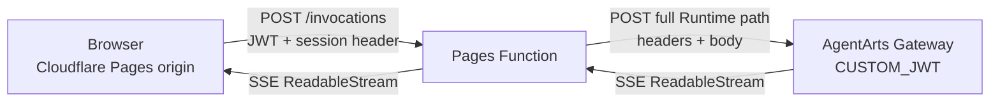
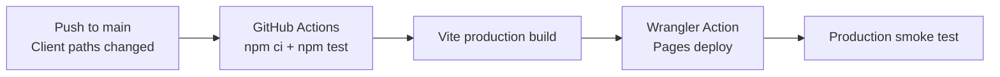

# ADR-017: Cloudflare Pages 托管与 Same-Origin API Proxy

> 状态：Accepted | 日期：2026-06-18 | 关联文档：[`ADR-014`](./ADR-014-netlify-edge-function-auth-proxy.md)

## 背景

AgentArts Gateway 在 `CUSTOM_JWT` 模式下会对 Browser 自动发送且不携带 JWT
的 CORS preflight `OPTIONS` 执行认证并返回 401，因此 Browser 无法跨域直连
Gateway。Netlify Proxy 可以消除 CORS preflight，但亚洲访问延迟不满足当前
需求。

## 决策

Production Web Chat 迁移到 Cloudflare Pages。Cloudflare 同时托管 Vite
静态文件，并通过 Pages Function 提供 same-origin `/invocations`：

```text
https://agentarts-personal-assistant.pages.dev
```



Browser 只请求 Cloudflare Pages origin，因此不产生 CORS preflight。
Pages Function 不验证或生成 JWT，只透明转发 authentication headers；
AgentArts Gateway 继续承担 JWT validation。

Production Client 固定使用相对路径 `/invocations`，无需环境变量切换 API
base URL。

Netlify deployment configuration 删除，不作为 fallback 或并行 production
环境保留。

## Deployment Automation



GitHub Actions 使用以下 repository secrets：

- `CLOUDFLARE_API_TOKEN`
- `CLOUDFLARE_ACCOUNT_ID`

API Token 仅授予目标 Account 的 `Cloudflare Pages: Edit`。Token 由 Cloudflare
Dashboard 创建并存储于 GitHub Secrets，不放入 repository、OpenTofu state
或 `wrangler.toml`。当前 `personal-assistant-infra` 只管理 HuaweiCloud
resources，因此不使用 `cloudflare_account_token` 管理 CI Token lifecycle。

本地预览、手动 deployment、deployment list 和 Function log tail 命令见
[`cloud-service/cloudflare/pages.md`](../cloud-service/cloudflare/pages.md)。

## 约束

- Pages Function 必须使用完整 Runtime path：
  `/runtimes/personal-assistant/invocations`。
- 必须显式复制 `Authorization`、session header 和 request body。
- Response body 必须以 stream 透传，不能调用 `response.text()` 或
  `response.json()` 后重新组装。
- API response 设置 `Cache-Control: no-store`。
- Cloudflare Pages deployment URL 必须加入 Microsoft Entra SPA Redirect
  URI。

## Four-Question Gate

| 问题 | 结论 |
|------|------|
| Is it best practice? | Yes。Browser 使用 same-origin API，Gateway 保持认证职责 |
| Is it industry standard? | Yes。Edge-hosted SPA + serverless reverse proxy 是常见 BFF pattern |
| Is it conventional? | Yes。Frontend 使用相对 `/invocations` path，部署层负责 upstream routing |
| Is it modern? | Yes。Pages Functions 与 Web Streams 原生支持 edge streaming |
