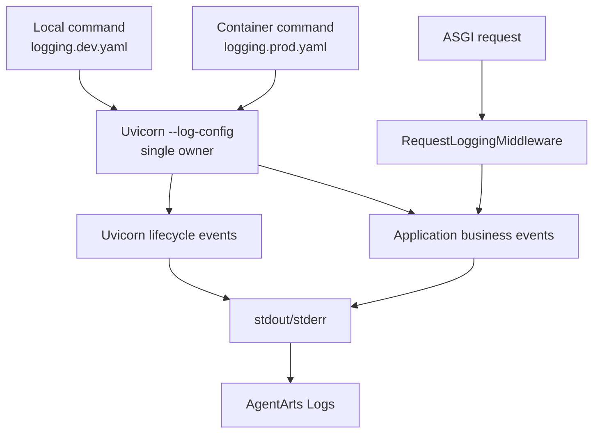

# ADR-018: Service Structured Logging 与统一配置所有权

> 状态：Accepted | 日期：2026-06-22 | 关联 Issue：[Refactor 12](../../issues/refactor/resolved/refactor-12-unify-structured-logging/issue.md)

## 背景

Uvicorn 在导入 ASGI application 之前配置自身 logger。原实现又在 `app.main`
import 时调用 `dictConfig`，导致 Uvicorn lifecycle logs 与 application logs
采用不同 formatter。该结构无法从 reloader 的第一条日志开始统一输出，也没有稳定的
request/session/trace correlation。

## 决策

使用 Uvicorn 官方 `--log-config` 作为 process logging 的唯一配置 owner：

- local：`config/logging.dev.yaml`，UTC console text
- production：`config/logging.prod.yaml`，stdout single-line JSON
- 配置统一覆盖 `root`、`app`、`agentarts`、`uvicorn`、`uvicorn.error`
- 清除 AgentArts SDK 自带的 `agentarts` handler，仅向 root propagation，
  防止同一 SDK event 同时输出 plain text 与 JSON
- 禁用 `uvicorn.access` handler，使用 pure ASGI middleware 记录结构化 HTTP event
- application 不在 import 时调用 `logging.config.dictConfig`
- 现有 `LOG_LEVEL` 通过 handler filter 同时约束 Uvicorn、application 与第三方日志
- OpenTelemetry span 有效时自动加入 `trace_id` 与 `span_id`

## 选择 pure ASGI middleware

Uvicorn access logger 在 protocol 层生成 record，无法可靠获得 application route、
session context 和完整 streaming duration。middleware 位于 request lifecycle 内，
可以在 response 完成时记录统一字段，并在 `finally` 中清理 ContextVar。

不使用 `BaseHTTPMiddleware`，避免 streaming response buffering 与 context propagation
边界问题。

## Alternatives

| Alternative | Decision | Reason |
|-------------|----------|--------|
| 修改 `uvicorn.config.LOGGING_CONFIG` | Rejected | CLI 已在导入 application 前消费配置；reload parent 不导入 application |
| lifespan 后重新配置 | Rejected | 无法覆盖 reloader 与 early startup logs |
| `app.__main__` 程序化启动 | Deferred | 可行但当前不需要自定义 process launcher |
| structlog 全量迁移 | Rejected | 现有标准 logging 与 Uvicorn 兼容，迁移收益不足 |
| 直接 OTLP Logs export | Deferred | AgentArts 已采集 container logs；先稳定 stdout JSON contract |

## Security

日志不得记录：

- `Authorization` header
- Workload access token 或任何 credential
- 原始 user ID、email 等个人身份信息
- 用户 prompt、LLM 完整 response

session ID 仅作为 technical correlation identifier；request ID 只接受有限字符与长度，
非法值替换为 server-generated UUID。

## Consequences

- 所有标准启动方式必须显式提供 `--log-config`
- dev/prod YAML 必须通过 tests 防止 logger coverage 漂移
- request completion event 取代 Uvicorn 默认 access line
- 第三方库日志可通过 root logger 进入统一 schema

## Four-Question Gate

| Question | Answer |
|----------|:------:|
| Is it best practice? | Yes。单一配置 owner、Separation of Concerns、structured event 与敏感信息最小化 |
| Is it industry standard? | Yes。Container stdout JSON 和 trace correlation 是 cloud-native observability 标准模式 |
| Is it conventional? | Yes。Uvicorn `--log-config` 与 Python logging dictConfig/YAML 均为官方常规接口 |
| Is it modern? | Yes。采用 request context、OpenTelemetry correlation 与 machine-queryable event schema |
