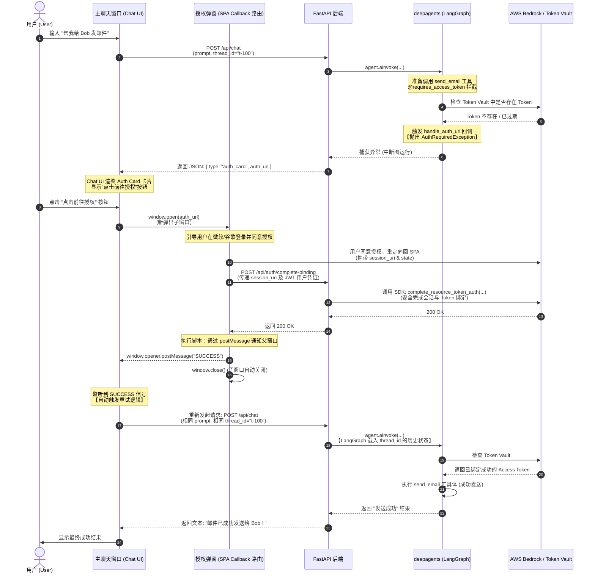
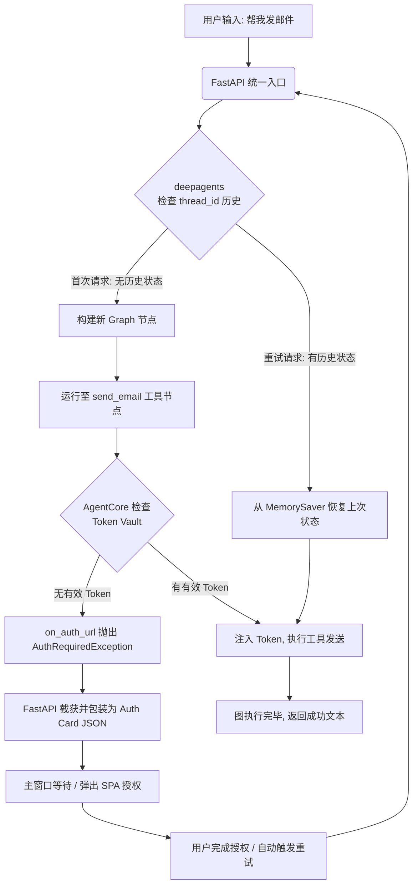

这份总结为你梳理了 **`deepagents` 框架 + AWS Bedrock AgentCore SDK + SPA 前端** 实现第三方授权（如 M365 邮箱发送）的完整、生产级闭环方案。它完美避开了 SDK 默认的同步阻塞，实现了高性能、无缝的用户交互。

你可以直接将这份设计文档保存，作为后续系统实现的技术指南。

---

# 🚀 架构设计总览

**核心思想**：
* **后端不阻塞**：当 Agent 执行高危/授权工具时，如无 Token，后端立即抛出自定义异常中止请求，释放服务器资源。
* **前端变卡片**：前端捕获异常，就地渲染为漂亮的 **“授权卡片 (Auth Card)”**。
* **SPA 闭环中转**：授权完成后，SPA 重定向路由接收参数并调用后端安全绑定，通过 `postMessage` 通知主聊天窗。
* **断点续传（Resuming）**：主聊天窗接收到成功信号，利用 `thread_id` 自动重发请求，`deepagents`（LangGraph）凭借状态记忆（MemorySaver）无缝恢复执行并发送邮件。

---

## 🎨 业务交互时序图

```text
[ 主 Chat 窗口 ]                [ 授权子窗口 (SPA) ]               [ 后端 FastAPI ]              [ AWS Bedrock / IDP ]
       |                                |                              |                             |
       |--- 1. 帮我给 Bob 发邮件 ------------------------------------->|                             |
       |                                                               |--- 2. 调用 deepagents ------|
       |                                                               |    (检测到无 Token，抛异常)   |
       |<-- 3. 返回 Auth Card JSON (含 auth_url) -----------------------|                             |
       |                                |                              |                             |
  [渲染 Auth Card]                      |                              |                             |
       |--- 4. 点击按钮 (window.open) -->|                              |                             |
       |                                |--- 5. 跳转三方登录并同意 ---------------------------------->|
       |                                |<-- 6. 回调重定向到 SPA 页面 ---------------------------------|
       |                                |    (含 session_uri & state)  |                             |
       |                                |                              |                             |
       |                                |--- 7. POST /api/complete --->|                             |
       |                                |       (携带 session_uri)      |--- 8. 触发 AWS 绑定 --------|
       |                                |                              |<-- 9. 绑定成功 -------------|
       |                                |<-- 10. 返回 200 OK ----------|                             |
       |                                |                              |                             |
       |<-- 11. postMessage("SUCCESS") -|                              |                             |
       |    (自动 window.close())       |                              |                             |
       |                                                               |                             |
  [触发自动重试]                                                         |                             |
       |--- 12. 帮我给 Bob 发邮件 (带相同 thread_id) ------------------>|                             |
       |                                                               |--- 13. 载入 Graph 状态 -----|
       |                                                               |    (这次有 Token, 直接发信)  |
       |<-- 14. 发送成功！ --------------------------------------------|                             |
```

---

# 💻 核心代码实现指南

## 第一部分：后端工具定义与异常拦截 (`deepagents`)

在 Agent 运行的后端，定义自定义异常，并将其绑定到工具装饰器上。

```python
import json
from typing import Any, Dict, AsyncGenerator
from langchain_core.tools import tool
from bedrock_agentcore.identity.auth import requires_access_token
from bedrock_agentcore.runtime import BedrockAgentCoreApp
from deepagents import create_deep_agent
from langgraph.checkpoint.memory import MemorySaver

# 1. 定义自定义授权异常
class AuthRequiredException(Exception):
    def __init__(self, auth_url: str):
        self.auth_url = auth_url
        super().__init__(f"Authorization required: {auth_url}")

# 2. 授权回调函数
def handle_auth_url(url: str):
    # 核心：立刻抛异常，强制打断工具调用链，释放线程
    raise AuthRequiredException(url)

# 3. 定义工具 (堆叠装饰器)
@tool
@requires_access_token(
    provider_name="m365-provider-common",
    scopes=["https://graph.microsoft.com/Mail.Send"],
    auth_flow="USER_FEDERATION",
    on_auth_url=handle_auth_url,  # 绑定异常抛出函数
    force_authentication=False,   # 允许使用 Token 缓存
    callback_url="https://chat.yourcompany.com/oauth2/callback"  # 指向你的前端 SPA 路由！
)
async def send_email(
    to: list[str],
    subject: str,
    body: str,
    access_token: str | None = None, # 成功时，AWS 自动注入
) -> dict[str, Any]:
    """发送邮件工具。"""
    # 你的邮件发送逻辑...
    return {"status": "success", "message": "Email sent successfully."}
```

---

## 第二部分：Agent API 统一入口与异常捕获

在此处捕获工具抛出的 `AuthRequiredException`，不报错，而是将其结构化为 **Auth Card** 协议返回给前端。

```python
app = BedrockAgentCoreApp()
checkpointer = MemorySaver() # 用于记忆 Agent 会话断点

# 实例化 Agent
agent = create_deep_agent(
    model="openai:gpt-4o",  # 或 Bedrock Anthropic Claude
    tools=[send_email],
    checkpointer=checkpointer
)

@app.post("/api/chat")
async def chat_endpoint(payload: Dict[str, Any]):
    user_input = payload.get("prompt")
    thread_id = payload.get("thread_id") # 断点续传的核心凭证
  
    config = {"configurable": {"thread_id": thread_id}}
  
    try:
        # 启动 Agent
        result = await agent.ainvoke(
            {"messages": [("user", user_input)]}, 
            config=config
        )
        return {
            "status": "success",
            "type": "text",
            "content": result["messages"][-1].content
        }
      
    except AuthRequiredException as e:
        # 【关键适配点】将捕获到的异常转化为前端卡片 JSON
        return {
            "status": "auth_required",
            "type": "auth_card",
            "auth_card": {
                "title": "需要邮箱授权",
                "description": "执行发送邮件前，系统需要获取您的 Outlook 邮件授权权限。",
                "auth_url": e.auth_url,
                "button_text": "点击前往授权"
            }
        }
```

---

## 第三部分：前端 SPA 实现与跨窗口通信

### 1. 主聊天窗口 (Chat UI)
监听来自弹出子窗口的 `postMessage`。收到成功信号后，带着**一模一样的参数（特别是 `thread_id`）**自动触发重试。

```javascript
import React, { useEffect, useState } from 'react';

const ChatInterface = () => {
  const [messages, setMessages] = useState
```


没问题！使用 **Mermaid Diagram** 可以非常直观、清晰地展现这套“断点续传（Resuming）”和 SPA 弹窗通信的交互链路。

这里为你绘制了两个图：
1. **系统架构与交互时序图 (Sequence Diagram)** —— 重点展示前后端、SPA 弹窗及 AWS SDK 之间的通信细节。
2. **状态流转与断点恢复图 (Flowchart)** —— 重点展示 `deepagents` (LangGraph) 状态是如何被打断，并在授权后无缝恢复执行的。

---

### 1. 系统架构与交互时序图 (Sequence Diagram)

这个图详细拆解了从“用户发出指令”到“触发授权卡片”、“弹出 SPA 窗口”、“后端安全绑定”、“跨窗口通信关闭”到最终“自动重试发送”的完整 14 步闭环。



---

### 2. 状态流转与断点恢复图 (Flowchart)

这个图展示了 `deepagents` 底层的 **LangGraph 状态机** 如何借助 `MemorySaver` 配合异常拦截实现“断点续传”。



---

### 💡 总结你的核心备忘录

1. **`thread_id` 是灵魂**：重试时，前端**必须**传递和第一次请求完全一致的 `thread_id`。这样 `deepagents` (LangGraph) 才知道要去 `MemorySaver` 里把刚才卡在“邮件发送”节点的状态给捞出来，直接跳过前面的废话，直奔主题。
2. **异常抛出是油门**：不要在后端写任何 `while` 轮询去等用户。后端一抛异常，就像踩油门一样快速结束 HTTP 会话、释放服务器资源，将“等用户授权”的等待时间全部转嫁给浏览器端，系统并发能力提升 100 倍。
3. **`postMessage` 是桥梁**：SPA 弹出窗拿到 `session_uri` 并让后端绑定后，必须通过 `window.opener.postMessage` 告诉主聊天窗：“我好了！”。主聊天窗一听，立刻静默重发刚才的请求，从而实现了惊艳的“无缝自动重试”体验。