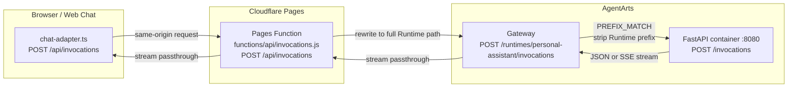

# Personal Assistant — API 路径与映射

> 状态：Active | 更新时间：2026-06-18

本文描述当前 Web Chat、Cloudflare Pages Function、AgentArts Gateway 与
FastAPI 容器之间的 API path 及映射关系。当前生产对话 API 最终统一收敛到
容器内的 `POST /invocations`。

## 1. 总体映射



生产路径的逐层映射如下：

| 层 | Client 可见 URL/path | 上游目标 | 说明 |
|----|----------------------|----------|------|
| Web Chat | `POST /api/invocations` | Cloudflare Pages Function | `VITE_API_BASE_URL=/api`，`chat-adapter.ts` 再追加 `/invocations` |
| Cloudflare Pages Function | `POST /api/invocations` | `https://defaultgw-ha3wenzqga.cn-southwest-2.huaweicloud-agentarts.com/runtimes/personal-assistant/invocations` | Function 文件路径 `functions/api/invocations.js` 自动映射为 URL path |
| AgentArts Gateway | `POST /runtimes/personal-assistant/invocations` | Runtime 容器 `:8080/invocations` | Gateway 使用完整 Runtime path 对外提供 ExecuteRuntime API |
| FastAPI | `POST /invocations` | `AgentHandler` | `stream: true` 返回 SSE；否则返回 JSON |

因此，以下三个 path 指向同一个对话能力，但分别属于不同网络边界：

```text
Browser:           /api/invocations
AgentArts Gateway: /runtimes/personal-assistant/invocations
FastAPI container: /invocations
```

## 2. Production Web Chat

### 2.1 URL 构造

Production build 从 `personal-assistant-client/.env.production` 读取：

```bash
VITE_API_BASE_URL=/api
```

`chat-adapter.ts` 使用以下规则构造 URL：

```text
${VITE_API_BASE_URL}/invocations
→ /api/invocations
```

Browser 与 Pages Function 使用相同 origin，因此该请求不会因为访问
AgentArts Gateway 的跨域地址而产生 CORS preflight。

### 2.2 Pages Function 映射

Cloudflare Pages 按文件系统约定将：

```text
functions/api/invocations.js
```

映射为：

```text
POST /api/invocations
```

Function 不处理 Agent 业务，也不验证 JWT。它执行以下 Proxy 行为：

1. 将请求固定转发到完整 AgentArts Runtime URL。
2. 仅转发 allowlist 中的 request headers。
3. 原样转发 request body。
4. 以 `ReadableStream` 原样透传 JSON 或 SSE response body。
5. 对 response 设置 `Cache-Control: no-store`。
6. 上游网络调用失败时返回 HTTP `502`：
   `{"message":"AgentArts Gateway is unavailable"}`。

转发的 request headers 为：

| Header | 来源 | 用途 |
|--------|------|------|
| `Accept` | Web Chat | 请求 `text/event-stream` |
| `Authorization` | Microsoft Entra ID 登录结果 | 由 AgentArts Gateway 验证 JWT |
| `Content-Type` | Web Chat | 当前为 `application/json` |
| `x-hw-agentarts-session-id` | Browser `localStorage` 中的 UUID | 关联 Session 与 LangGraph checkpoint |
| `X-HW-AgentGateway-User-Id` | Web Chat 从 JWT `sub` 或 `oid` claim 提取 | 向后端传递用户 ID |

其他 headers（例如 `Cookie`）不会转发。

### 2.3 Gateway 映射

AgentArts Gateway 的外部 path 必须包含 Runtime prefix：

```text
/runtimes/personal-assistant/invocations
```

Gateway 当前使用 `PREFIX_MATCH`，转发 `/invocations` 及其子路径。外部请求
仍必须包含 `/runtimes/personal-assistant` Runtime prefix；直接请求 Gateway
origin 的 `/invocations` 不会命中 policy。

Gateway 完成 JWT validation，并在转发到容器时注入或提供平台 headers，
包括：

- `X-HW-AgentGateway-User-Id`
- `x-hw-agentarts-session-id`
- `X-HW-AgentGateway-Workload-Access-Token`

容器接收到的应用路由仍是根级 `POST /invocations`，而不是带
`/runtimes/personal-assistant` prefix 的路径。

## 3. FastAPI API

当前 `personal-assistant-service/app/main.py` 定义以下应用入口：

| Method | 容器 path | 请求方 | Production Gateway 可达 | 说明 |
|--------|-------------|--------|-------------------------|------|
| `GET` | `/ping` | AgentArts 控制面、本地开发者 | 否 | Liveness health check，返回 `{"status":"ok"}` |
| `POST` | `/invocations` | Web Chat、AgentArts SDK、其他 AgentArts Client | 是 | 统一对话入口，支持同步 JSON 和 SSE |
| `GET` | `/invocations/playground` | 开发者 | 是，通过 Gateway full Runtime path | Redirect 到 `/invocations/playground/` |
| `GET` / WebSocket | `/invocations/playground/*` | Chainlit Browser Client | 是，通过 Gateway full Runtime path | Chainlit Playground 静态资源、HTTP API 与 WebSocket |

### 3.1 Invocation request

```json
{
  "message": "你好",
  "stream": true
}
```

| 字段 | 类型 | 必填 | 说明 |
|------|------|------|------|
| `message` | `string` | 是 | 用户输入；空字符串返回 HTTP `400` |
| `stream` | `boolean` | 否 | 默认 `false`；为 `true` 时使用 SSE |

### 3.2 Response

同步模式（`stream` 未传或为 `false`）：

```json
{
  "response": "..."
}
```

流式模式（`stream: true`）返回 `Content-Type: text/event-stream`。当前事件
payload 包括：

| 字段 | 说明 |
|------|------|
| `token` | LLM 流式文本片段 |
| `system_message` | 不经过 LLM 的系统消息 |
| `auth_url` / `auth_required` | OAuth 授权提示 |
| `auth_complete` | OAuth 授权完成提示 |
| `error` | 流处理错误 |
| `done` | 流结束标记 |

## 4. Local development 映射

### 4.1 本地 FastAPI

后端直接运行在 `http://localhost:8080`：

```text
GET  http://localhost:8080/ping
POST http://localhost:8080/invocations
GET  http://localhost:8080/invocations/playground
```

### 4.2 Vite + 本地 FastAPI

本地 `npm run dev` 时，`VITE_API_BASE_URL` 必须未设置或为空。Web Chat 请求：

```text
http://localhost:5173/invocations
```

Vite Proxy 映射为：

```text
http://localhost:8080/invocations
```

并注入：

```text
X-HW-AgentGateway-User-Id: dev-user
```

完整映射为：


> `personal-assistant-client/.env.example` 当前示例值为
> `VITE_API_BASE_URL=/api`，该值适用于 Cloudflare Pages production 或
> `wrangler pages dev`，不适用于只运行 `vite` 的本地 Proxy；仅运行
> `npm run dev` 时应覆盖为空。

### 4.3 Vite + Production Gateway

设置 `PROXY_TARGET=prod` 且 `VITE_API_BASE_URL` 为空时，Browser 仍请求：

```text
/invocations
```

Vite Proxy 将其重写为：

```text
/runtimes/personal-assistant/invocations
```

并转发到 production Gateway origin。该模式用于本地前端联调 production
Runtime，不经过 Cloudflare Pages Function。

Vite 也配置了 `/invocations/playground` 的 production rewrite。由于
production Gateway 使用 `PREFIX_MATCH`，该子路径可重写为：

```text
/runtimes/personal-assistant/invocations/playground
```

并转发到 production Runtime。Cloudflare Pages Function 当前没有对应
`/api/invocations/playground` Function，因此 Cloudflare Pages origin 不暴露
Playground。

## 5. Path 可达性矩阵

| 场景 | Browser 请求 path | 中间映射 | 最终 FastAPI path | 当前可用 |
|------|-------------------|----------|-------------------|----------|
| Cloudflare production | `/api/invocations` | Pages Function → Gateway full Runtime path | `/invocations` | 是 |
| Wrangler Pages local preview | `/api/invocations` | Local Pages Function → production Gateway | `/invocations` | 是，需要有效 JWT |
| Vite + local Backend | `/invocations` | Vite Proxy → `localhost:8080` | `/invocations` | 是 |
| Vite + production Gateway | `/invocations` | Vite rewrite → full Runtime path | `/invocations` | 是，需要有效 JWT |
| Backend direct local | `/invocations` | 无 | `/invocations` | 是 |
| Backend Playground local | `/invocations/playground` | 无 | `/invocations/playground` | 是 |
| Gateway direct invocation | `/runtimes/personal-assistant/invocations` | Gateway | `/invocations` | 是，需要有效 JWT |
| Gateway direct `/invocations` | `/invocations` | 无匹配 policy | — | 否 |
| Gateway direct Playground | `/runtimes/personal-assistant/invocations/playground` | Gateway `PREFIX_MATCH` | `/invocations/playground` | 是，需要有效 JWT |
| Cloudflare Pages Playground | `/api/invocations/playground` | 无对应 Pages Function | — | 否 |
| Public `/ping` through Gateway | `/runtimes/personal-assistant/ping` | 无匹配 policy | — | 否 |

## 6. Source of truth 与已知不一致

当前 path 映射以以下实现文件为准：

- Frontend URL 构造：`personal-assistant-client/src/lib/chat-adapter.ts`
- Vite Proxy：`personal-assistant-client/vite.config.ts`
- Cloudflare Pages Function：`personal-assistant-client/functions/api/invocations.js`
- Production build 环境变量：`personal-assistant-client/.env.production`
- FastAPI routes：`personal-assistant-service/app/main.py`

`personal-assistant-service/openapi.json` 是由当前 FastAPI app 自动生成的
versioned artifact。修改 FastAPI route 或 schema 后，必须在 Service 目录
重新生成：

```bash
uv run python scripts/generate_openapi.py
```

当前流式调用已经合并到 `POST /invocations`，由 request body 的 `stream`
字段控制；OpenAPI 中不存在独立的 `/invocations/stream`。
