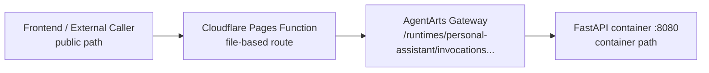

# Personal Assistant — API 路径映射

> 状态：Active | 更新时间：2026-07-08

本文以**生产环境 API**为主，只回答一个问题：**Frontend path、
Cloudflare Pages Function、AgentArts Gateway full Runtime path、Backend
container path 如何对应。**

Local/Vite/Wrangler dev 的特殊路径不混入生产表格，统一放在
[Local-only Exceptions](#3-local-only-exceptions)。

## 1. Production 路径对应规则

生产 API 路径必须同时看四个位置：`Frontend path` 是浏览器或外部系统访问的
public same-origin path；`Cloudflare Function route` 是 Cloudflare Pages
file-based routing 命中的 Function；`Gateway full Runtime path` 是 AgentArts
Gateway 对外暴露的完整 Runtime path；`Backend container path` 是 Gateway 去掉
Runtime prefix 后进入 FastAPI container 的 path。

图类型：**Flowchart（四层 API 映射图）**。用于说明请求从 Frontend 到
Cloudflare Pages Functions、AgentArts Gateway、Backend container 的路径变化。


```mermaid
flowchart LR
    FE["Frontend / External Caller<br/>public path"] --> CF["Cloudflare Pages Function<br/>file-based route"]
    CF --> GW["AgentArts Gateway<br/>/runtimes/personal-assistant/invocations..."]
    GW --> BE["FastAPI container :8080<br/>container path"]
```

生产路径映射遵循下表。`{suffix}` 表示追加在 Gateway Runtime root 后面的路径片段，
不带开头 `/`。新增 production public API 时，必须在这个形态下显式列出，不要靠
Frontend `/invocations/{suffix}` 作为隐式 contract。

| 规则 | Frontend path | Cloudflare Function route | Gateway full Runtime path | Backend container path |
|------|---------------|--------------------------|---------------------------|------------------------|
| 对话根入口 | `/invocations` | `functions/invocations.js` → `functions/invocations/[[path]].js` | `/runtimes/personal-assistant/invocations` | `/invocations` |
| 显式 BFF public route | 明确设计的 public path，例如 `/auth/callback/m365-calendar` | 对应的 Pages Function 文件，例如 `functions/auth/callback/m365-calendar.js` | `/runtimes/personal-assistant/invocations/{suffix}` | `/{suffix}` |

关键约束：

- Frontend 不直接访问 AgentArts Gateway domain。
- Gateway root `/runtimes/personal-assistant/invocations` 对应 Backend
  `/invocations`。
- Gateway suffix `/runtimes/personal-assistant/invocations/{suffix}` 对应 Backend
  `/{suffix}`。
- `/invocations/{suffix}` 是当前 `functions/invocations/[[path]].js` 的 proxy
  implementation capability，不是 production public API contract。
- `AGENTARTS_OAUTH_CALLBACK_URL` 不属于 production path mapping；它是 local-only
  direct upstream override。

## 2. Production API Instances

| 能力 | Frontend path | Cloudflare Function route | Gateway full Runtime path | Backend container path |
|------|---------------|--------------------------|---------------------------|------------------------|
| Web Chat invocation | `POST /invocations` | `functions/invocations.js` → `functions/invocations/[[path]].js` | `POST /runtimes/personal-assistant/invocations` | `POST /invocations` |
| Calendar OAuth callback | `GET /auth/callback/m365-calendar` | `functions/auth/callback/m365-calendar.js` | `GET /runtimes/personal-assistant/invocations/auth/oauth2/callback/m365-calendar` | `GET /auth/oauth2/callback/m365-calendar` |

以下 backend paths 不是 production public API entrypoint：

- `GET /ping`：AgentArts 控制面和本地开发 health check，不通过 public Gateway
  policy 暴露。
- `GET /invocations/playground`：Chainlit playground，本地/直连调试入口，不作为
  Cloudflare production public entrypoint。

## 3. Local-only Exceptions

下表只记录本地开发或 Wrangler preview 的特例路径，不参与 production API 映射。
Vite chat dev 使用 proxy 是为了让浏览器始终请求 `http://localhost:5173/invocations`
这个同源 path，避免 FastAPI 为本地 `localhost:5173 -> localhost:8080` 跨端口请求
额外开启 CORS。
Calendar OAuth callback 的本地 full-flow 测试必须走 local Cloudflare Pages Functions
（`npm run pages:dev:local`），不走 Vite dev proxy。

| 场景 | Local frontend path | Local proxy / route | Gateway full Runtime path | Backend container path |
|------|---------------------|---------------------|---------------------------|------------------------|
| Local Vite chat dev | `POST http://localhost:5173/invocations` | Vite dev proxy | `N/A` | `POST http://localhost:8080/invocations` |
| Local Pages full-flow callback | `GET http://localhost:5173/auth/callback/m365-calendar` | `functions/auth/callback/m365-calendar.js` | `AGENTARTS_OAUTH_CALLBACK_URL=http://localhost:8080/auth/oauth2/callback/m365-calendar` | `GET http://localhost:8080/auth/oauth2/callback/m365-calendar` |
| Backend health check | `GET http://localhost:8080/ping` | direct backend | `N/A` | `GET /ping` |
| Backend Chainlit playground | `GET http://localhost:8080/invocations/playground` | direct backend | `N/A` | `GET /invocations/playground` |

## 4. Source Of Truth

- Frontend URL 构造：`personal-assistant-client/src/lib/chat/chat-api-client.ts`
- Vite proxy：`personal-assistant-client/vite.config.ts`
- Cloudflare exact shim：`personal-assistant-client/functions/invocations.js`
- Cloudflare shared proxy：`personal-assistant-client/functions/invocations/[[path]].js`
- Cloudflare OAuth callback BFF：`personal-assistant-client/functions/auth/callback/m365-calendar.js`
- FastAPI routes：`personal-assistant-service/app/main.py`
- Cloudflare runtime var：`personal-assistant-client/wrangler.toml`

修改 FastAPI route 或 schema 后，必须在 Service 目录重新生成 OpenAPI：

```bash
uv run python scripts/generate_openapi.py
```
