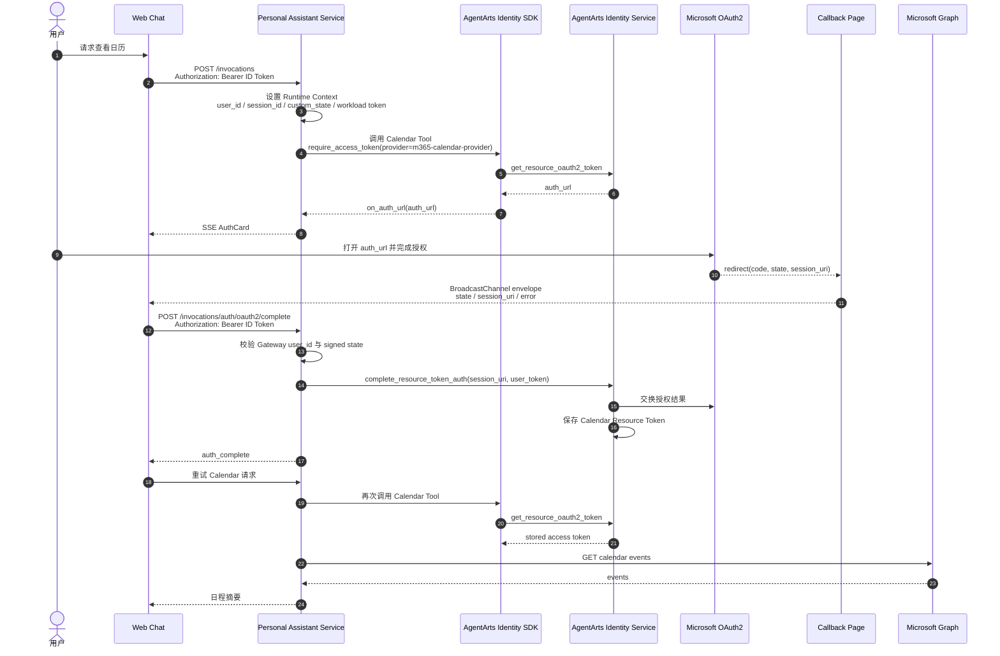

# Feature 15 Calendar OAuth2 Architecture

> 状态：Draft | 范围：Calendar Tool / AgentArts OAuth2 full flow | 关联：Feature 15、`backend_architecture.md`、`frontend_architecture.md`

本文记录 Feature 15 的 Calendar OAuth2 架构：用户首次授权 Microsoft 365 Calendar 时，Web Chat、Personal Assistant Service、AgentArts Identity Service 与 Microsoft OAuth2 如何协作完成 `complete_resource_token_auth` session binding。

## 1. 设计目标

Calendar Tool 是本项目第一个覆盖 AgentArts OAuth2 full flow 的示范能力。目标是：

- Calendar Tool 以 User Federation 模式读取用户 Microsoft Calendar。
- 用户未授权时，服务端通过 `@require_access_token` / `on_auth_url` 向 Web Chat 下发 AuthCard。
- 浏览器 callback page 只负责 relay callback envelope，不直接调用 AgentArts Identity Service。
- 主聊天窗口携带当前登录态调用后端 complete endpoint。
- 后端验证 signed state 后调用 `complete_resource_token_auth`，完成 Resource Token Auth session binding。
- Microsoft Graph access token 只保存在 AgentArts Identity Token Vault，不暴露给浏览器、LLM 或日志。

## 2. 端到端流程



## 3. 组件职责

| 组件 | 职责 | 不负责 |
|------|------|--------|
| Web Chat 主窗口 | 持有当前 Inbound ID Token；接收 callback envelope；调用 `/invocations/auth/oauth2/complete` | 不保存 Microsoft Graph access token |
| Callback Page | 读取 OAuth2 callback 参数；通过 `BroadcastChannel` 通知主窗口 | 不直接调用 AgentArts Identity Service |
| Personal Assistant Service | 校验 request JSON、Gateway `user_id`、signed state；调用 `complete_resource_token_auth` | 不把第三方 access token 写入 response 或 prompt |
| AgentArts Gateway | 校验 Inbound JWT；注入可信 user/session/workload headers | 不执行 Calendar 业务逻辑 |
| AgentArts Identity Service | 维护 Resource Token Auth session；保存 Calendar Resource Token | 不信任浏览器 body 中的 user identity |
| Microsoft OAuth2 / Graph | 完成用户授权；提供 Calendar API | 不感知 Agent conversation state |

## 4. URL 与路由映射

Feature 15 使用“双 URL”模型：

| URL | 调用方 | 目的 |
|-----|--------|------|
| `/auth/callback/m365-calendar` | Microsoft OAuth2 redirect 到前端 | 用户可见 callback page，读取 `state`、`session_uri`、`error` |
| `/invocations/auth/oauth2/complete` | Web Chat 主窗口调用 | 后端完成 AgentArts Resource Token Auth session binding |

生产路径逐层映射：

```text
Browser:
  POST /invocations/auth/oauth2/complete

Cloudflare Pages Function:
  /invocations/auth/oauth2/complete
  -> AgentArts Gateway /runtimes/personal-assistant/invocations/auth/oauth2/complete

AgentArts Gateway:
  /runtimes/personal-assistant/invocations/auth/oauth2/complete
  -> Runtime container :8080 /auth/oauth2/complete

FastAPI:
  @app.post("/auth/oauth2/complete")
```

`AgentArtsRuntimeContext.set_oauth2_callback_url(...)` 必须指向前端 callback page，而不是后端 complete endpoint：

```python
AgentArtsRuntimeContext.set_oauth2_callback_url(
    "https://<frontend-domain>/auth/callback/m365-calendar"
)
```

## 5. Identity 参数选择

`complete_resource_token_auth` 的 `UserIdentifier` 在本项目有两种可用来源：

| 字段 | 来源 | 使用场景 |
|------|------|----------|
| `user_id` | Gateway 注入的 `X-HW-AgentGateway-User-Id`，或本地 mock header | 本地测试、mock、无真实 Gateway JWT 的开发路径 |
| `user_token` | 请求 `Authorization: Bearer <jwt>` 中的 JWT | 生产 AgentArts Gateway JWT 路径 |

生产路径必须使用 `user_token`：

```python
client.complete_resource_token_auth(
    session_uri=complete_request.session_uri,
    user_identifier=UserIdentifier(user_token=user_token),
)
```

## 6. 已知约束：`user_id` 与 `user_token` 互斥

AgentArts Identity Service 不允许在同一个 `UserIdentifier` 中同时传入 `user_id` 和 `user_token`。如果这样调用：

```python
UserIdentifier(user_id=user_id, user_token=user_token)
```

Identity Service 会返回：

```text
huaweicloudsdkcore.exceptions.exceptions.ClientRequestException:
ClientRequestException - {
  status_code:400,
  request_id:7526f369349e30796b6953953c35adbb,
  error_code:AgentIdentityTokenVault.1015,
  error_msg:User ID and user token cannot both exist,
  encoded_authorization_message:None
}
```

因此：

- 本地测试或 mock 场景可以选择 `user_id`。
- 生产 Gateway JWT 场景必须从 `Authorization` header 提取 JWT，并且只传 `user_token`。
- 不要为了兼容本地与生产而同时传两者；这会让生产 complete step 直接失败。

## 7. 安全边界

- 浏览器 body 中的 `user_id` 永远不可信。
- `state` 必须由服务端签名并绑定 Gateway `user_id`、session 和 provider。
- callback page 只传递 `state`、`session_uri` 和 error envelope，不传递 Microsoft access token。
- 后端日志只能记录 redacted prefix，不记录完整 JWT、OAuth2 code 或 third-party access token。
- complete endpoint 只做 session binding，不直接读取 Calendar 数据。

## 8. Four-Question Gate

| 问题 | 结论 |
|------|------|
| Is it best practice? | Yes。浏览器只做 OAuth callback relay，可信校验与 Identity client 调用留在服务端。 |
| Is it industry standard? | Yes。主窗口持有登录态、callback page relay、服务端完成 token/session binding 是常见 OAuth architecture。 |
| Is it conventional? | Yes。Inbound JWT 与 Outbound OAuth2 User Federation 分层清晰，新成员能按 Gateway、Service、Identity、Provider 四层理解。 |
| Is it modern? | Yes。使用 same-origin `BroadcastChannel`、Gateway JWT、managed Token Vault 与 server-side session binding。 |
