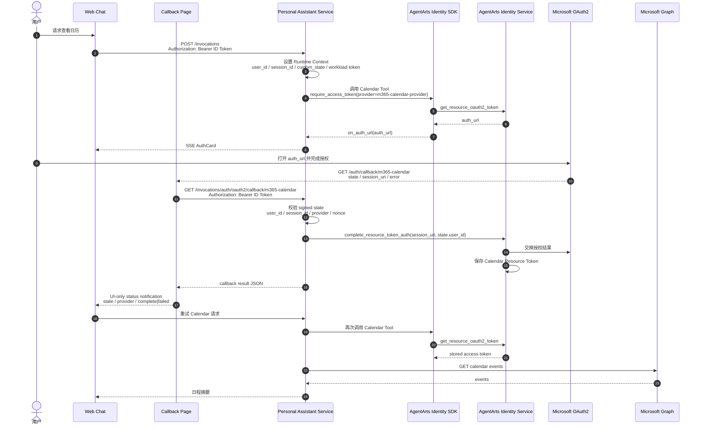

# Feature 15 Calendar OAuth2 Architecture

> 状态：Draft | 范围：Calendar Tool / AgentArts OAuth2 full flow | 关联：Feature 15、`backend_architecture.md`、`frontend_architecture.md`

本文记录 Feature 15 的 Calendar OAuth2 架构：用户首次授权 Microsoft 365 Calendar 时，Web Chat、Personal Assistant Service、AgentArts Identity Service 与 Microsoft OAuth2 如何协作完成 `complete_resource_token_auth` session binding。

## 1. 设计目标

Calendar Tool 是本项目第一个覆盖 AgentArts OAuth2 full flow 的示范能力。目标是：

- Calendar Tool 以 User Federation 模式读取用户 Microsoft Calendar。
- 用户未授权时，服务端通过 `@require_access_token` / `on_auth_url` 向 Web Chat 下发 AuthCard。
- OAuth2 callback 直接回到 Personal Assistant Service，由后端验证 signed state 后调用
  `complete_resource_token_auth`，完成 Resource Token Auth session binding。
- Web Chat 只负责展示 AuthCard、打开授权 URL、根据后端 callback status 更新 UI，不参与
  OAuth2 complete 业务决策。
- Microsoft Graph access token 只保存在 AgentArts Identity Token Vault，不暴露给浏览器、LLM 或日志。

## 2. 端到端流程


```mermaid
sequenceDiagram
    autonumber
    actor User as 用户
    participant UI as Web Chat
    participant CB as React Callback Shell
    participant Agent as Personal Assistant Service
    participant SDK as AgentArts Identity SDK
    participant IdSvc as AgentArts Identity Service
    participant MS as Microsoft OAuth2
    participant CB as Callback Page
    participant Graph as Microsoft Graph

    User->>UI: 请求查看日历
    UI->>Agent: POST /invocations<br/>Authorization: Bearer ID Token
    Agent->>Agent: 设置 Runtime Context<br/>user_id / session_id / custom_state / workload token
    Agent->>SDK: 调用 Calendar Tool<br/>require_access_token(provider=m365-calendar-provider)
    SDK->>IdSvc: get_resource_oauth2_token
    IdSvc-->>SDK: auth_url
    SDK-->>Agent: on_auth_url(auth_url)
    Agent-->>UI: SSE AuthCard
    User->>MS: 打开 auth_url 并完成授权
    MS-->>CB: GET /auth/callback/m365-calendar<br/>state / session_uri / error
    CB->>Agent: GET /invocations/auth/oauth2/callback/m365-calendar<br/>Authorization: Bearer ID Token
    Agent->>Agent: 校验 signed state<br/>user_id / session_id / provider / nonce
    Agent->>IdSvc: complete_resource_token_auth(session_uri, state.user_id)
    IdSvc->>MS: 交换授权结果
    IdSvc->>IdSvc: 保存 Calendar Resource Token
    Agent-->>CB: callback result JSON
    CB-->>UI: UI-only status notification<br/>state / provider / complete|failed
    UI->>Agent: 重试 Calendar 请求
    Agent->>SDK: 再次调用 Calendar Tool
    SDK->>IdSvc: get_resource_oauth2_token
    IdSvc-->>SDK: stored access token
    Agent->>Graph: GET calendar events
    Graph-->>Agent: events
    Agent-->>UI: 日程摘要
```

## 3. 组件职责

| 组件 | 职责 | 不负责 |
|------|------|--------|
| Web Chat 主窗口 | 展示 AuthCard；打开授权 URL；监听 callback shell 的 UI status；按 `oauth2_state` 更新匹配 AuthCard | 不调用 `complete_resource_token_auth`；不决定 OAuth2 session ownership |
| React Callback Shell | 承接 OAuth provider redirect；通过 MSAL shared cache 静默取得当前 Web Chat ID Token，向后端 callback API 发起一次 authenticated request；展示后端返回的完成/失败状态；通知 Web Chat 更新 UI | 不执行业务判断；不通过 `postMessage` / BroadcastChannel 传递 bearer token；不调用 AgentArts Identity SDK |
| Personal Assistant Service | 生成 signed state；校验 callback state；调用 `complete_resource_token_auth`；控制 replay / stale callback 语义 | 不把第三方 access token 写入 response 或 prompt |
| AgentArts Gateway | 校验 Inbound JWT；注入可信 user/session/workload headers | 不执行 Calendar 业务逻辑 |
| AgentArts Identity Service | 维护 Resource Token Auth session；保存 Calendar Resource Token | 不信任浏览器 body 中的 user identity |
| Microsoft OAuth2 / Graph | 完成用户授权；提供 Calendar API | 不感知 Agent conversation state |

## 4. URL 与路由映射

> UI status notification 当前实现可使用 same-origin `BroadcastChannel` /
> `window.postMessage`。这只是完成后的展示同步通道，不承载 `session_uri` completion
> 决策，也不允许任何 Web Chat tab 调用 `complete_resource_token_auth`。
>
> Inbound Web Chat 使用 MSAL `localStorage` cache。OAuth callback 由 `noopener`
> 新窗口/新 tab 承接，因此不能依赖主窗口内存状态或 opener token handoff；callback shell
> 通过 MSAL `acquireTokenSilent` 从 same-origin shared cache 取得 ID Token。

Feature 15 使用 frontend callback shell + backend-owned completion 模型：

| URL | 调用方 | 目的 |
|-----|--------|------|
| `/auth/callback/m365-calendar` | Microsoft OAuth2 redirect 到 React Callback Shell | 前端只作为 credential-bearing transport shell，携带 Web Chat ID Token 调用后端 callback API |
| `/invocations/auth/oauth2/callback/m365-calendar` | React Callback Shell authenticated fetch | 通过 Pages `/invocations` proxy / Gateway 到 Service-owned callback，由后端完成 AgentArts Resource Token Auth session binding |
| `/auth/oauth2/callback/m365-calendar` | FastAPI container route | Service 内部 route；校验 signed state、调用 `complete_resource_token_auth`、返回 callback result |

生产路径逐层映射：

```text
Browser:
  GET /auth/callback/m365-calendar?state=...&session_uri=...

React Callback Shell:
  GET /invocations/auth/oauth2/callback/m365-calendar?state=...&session_uri=...
  Authorization: Bearer <Web Chat ID Token>

Cloudflare Pages Function:
  /invocations/auth/oauth2/callback/m365-calendar
  -> AgentArts Gateway /runtimes/personal-assistant/invocations/auth/oauth2/callback/m365-calendar

AgentArts Gateway:
  /runtimes/personal-assistant/invocations/auth/oauth2/callback/m365-calendar
  -> Runtime container :8080 /auth/oauth2/callback/m365-calendar

FastAPI:
  @app.get("/auth/oauth2/callback/m365-calendar")
```

本地 Web Chat 测试使用同形状路径，只是由 Vite proxy 代替 Cloudflare Pages Function：

```text
http://localhost:5173/auth/callback/m365-calendar
-> React Callback Shell
-> http://localhost:5173/invocations/auth/oauth2/callback/m365-calendar
-> Vite proxy
-> http://localhost:8080/auth/oauth2/callback/m365-calendar
```

`AgentArtsRuntimeContext.set_oauth2_callback_url(...)` 必须指向 React Callback Shell：

```python
AgentArtsRuntimeContext.set_oauth2_callback_url(
    "https://<frontend-domain>/auth/callback/m365-calendar"
)
```

## 5. Identity 参数选择

`complete_resource_token_auth` 的 `UserIdentifier` 在本项目有两种可用来源：

| 字段 | 来源 | 使用场景 |
|------|------|----------|
| `user_id` | Gateway 注入的 `X-HW-AgentGateway-User-Id`，或本地 mock header | 本地测试、mock、无真实 Gateway JWT 的开发路径 |
| `user_token` | 请求 `Authorization: Bearer <jwt>` 中的 JWT | 当前 Calendar backend callback 主流程不使用；保留为 AgentArts API 可用字段说明 |

主流程中 React Callback Shell 调用后端 callback API 时会携带 Web Chat
`Authorization` header；Service 仍使用 signed state 中的 `user_id` 作为
`complete_resource_token_auth` 的 trust boundary。该 `user_id` 不是浏览器 body
提供的值，而是 Service 在创建 OAuth2 state 时从 AgentArts Gateway trusted header
读取并签名绑定的值：

```python
client.complete_resource_token_auth(
    session_uri=callback.session_uri,
    user_identifier=UserIdentifier(user_id=state_claims.user_id),
)
```

## 6. 已知约束：`user_id` 与 `user_token` 互斥

AgentArts Identity Service 不允许在同一个 `UserIdentifier` 中同时传入 `user_id` 和 `user_token`。如果这样调用：

```python
UserIdentifier(user_id=user_id, user_token=user_token)
```

Identity Service 会返回：

```text
huaweicloudsdkcore.exceptions.exceptions.ClientRequestException:
ClientRequestException - {
  status_code:400,
  request_id:7526f369349e30796b6953953c35adbb,
  error_code:AgentIdentityTokenVault.1015,
  error_msg:User ID and user token cannot both exist,
  encoded_authorization_message:None
}
```

因此：

- 主流程 backend callback 使用 signed state 中的 trusted `user_id`；React shell 携带
  Authorization 只是为了通过 Gateway auth，不作为 completion ownership 决策来源。
- 不要为了兼容不同环境而同时传 `user_id` 与 `user_token`；这会让 complete step 直接失败。

## 7. 安全边界

- 浏览器 body 中的 `user_id` 永远不可信。
- `state` 必须由服务端签名并绑定 Gateway `user_id`、session 和 provider。
- callback shell 只把 OAuth callback 参数转交给 Service，并接收完成/失败 UI status；
  浏览器不负责 complete 业务决策。
- callback shell 需要 bearer token 时，只能通过 MSAL same-origin shared cache 静默获取；
  不通过 opener、BroadcastChannel 或 URL 传递 bearer token。
- 后端日志只能记录 redacted prefix，不记录完整 JWT、OAuth2 code 或 third-party access token。
- Service-owned callback 只做 session binding，不直接读取 Calendar 数据。

## 8. Four-Question Gate

| 问题 | 结论 |
|------|------|
| Is it best practice? | Yes。OAuth callback、state 校验、session binding 与 replay control 留在服务端；浏览器只更新 UI。 |
| Is it industry standard? | Yes。后端 callback / BFF-style OAuth completion 避免让浏览器 tab 拓扑参与业务协议。 |
| Is it conventional? | Yes。Inbound JWT 与 Outbound OAuth2 User Federation 分层清晰，新成员能按 Gateway、Service、Identity、Provider 四层理解。 |
| Is it modern? | Yes。使用 same-origin UI-only status notification、Gateway JWT、managed Token Vault 与 server-side session binding。 |
