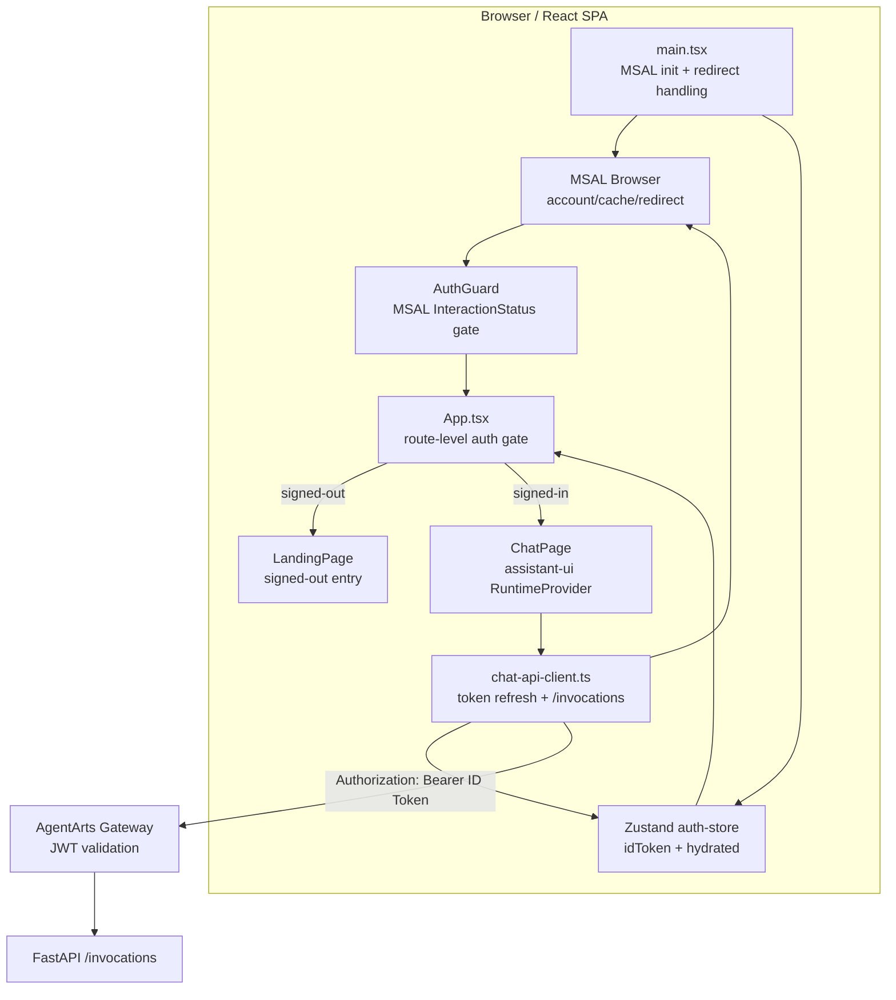
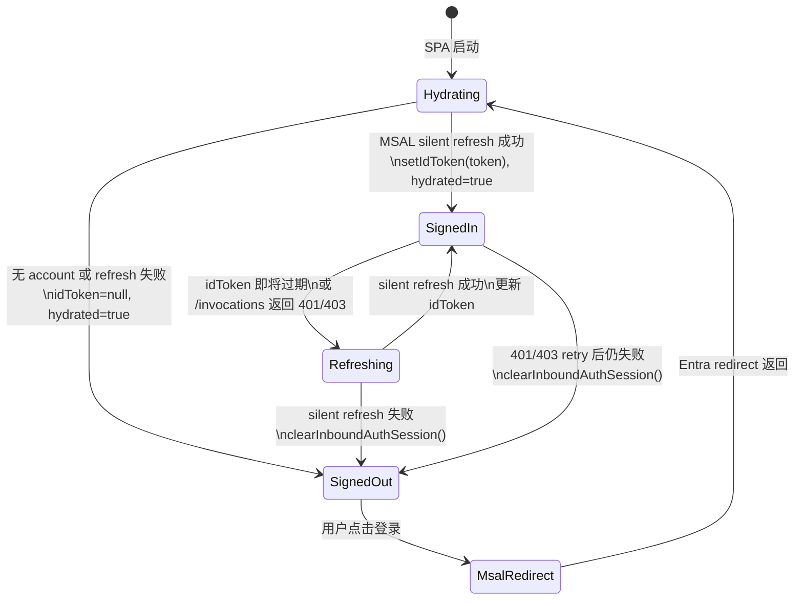
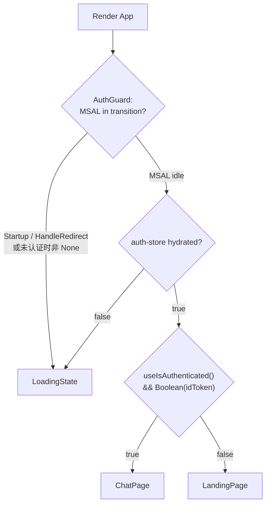
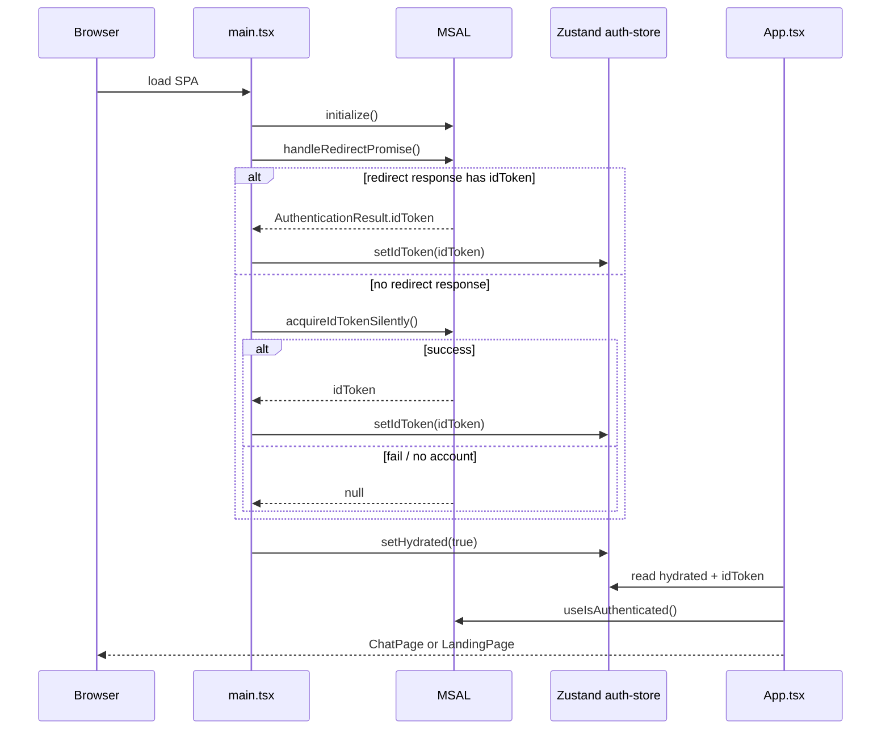
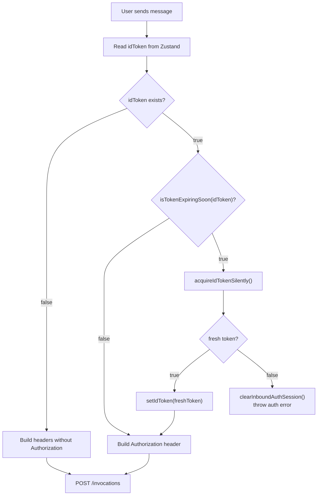
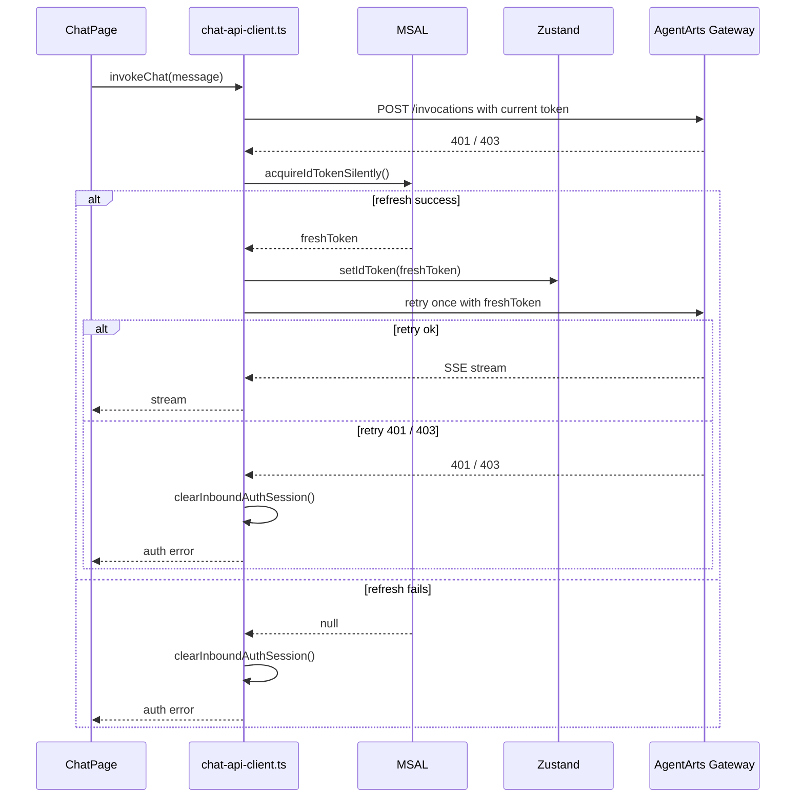
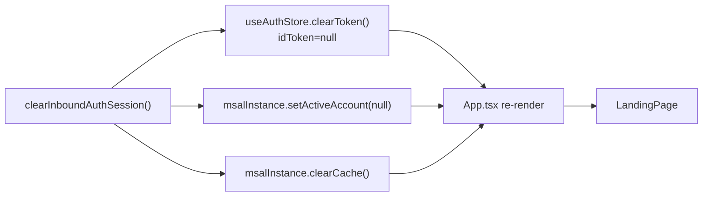
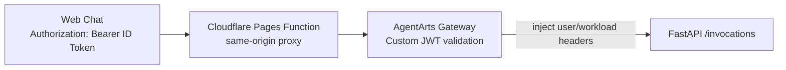

# Web Chat Inbound Auth Lifecycle

> 状态：Draft | 范围：Web Chat Inbound Auth | 关联：`frontend_architecture.md`、`ADR/ADR-007-identity-provider.md`

本文描述 Web Chat Inbound Auth lifecycle 的当前架构：MSAL、Zustand `auth-store`、ID Token、silent refresh、AuthGuard、LandingPage、ChatPage 以及 `/invocations` 请求之间如何协作。

---

## 1. 设计目标

Web Chat 的 Inbound Auth 负责回答一个问题：浏览器端什么时候可以代表用户向 AgentArts Gateway 发送 `/invocations` 请求？

核心目标：

- 用户完成 Microsoft Entra ID 登录后进入 ChatPage。
- 请求 `/invocations` 前必须携带当前可用的 ID Token。
- ID Token 临近过期时优先 silent refresh，用户无感续期。
- token 已过期且无法 refresh 时，不发送旧 token，进入 signed-out 状态。
- `/invocations` 返回 401/403 时最多执行一次 refresh + retry，避免请求循环。
- 页面认证状态与 token 状态保持一致：没有可用 ID Token 时不显示 ChatPage。

---

## 2. 组件与职责

| 组件 | 当前职责 |
|------|----------|
| `msalInstance` | Microsoft Entra ID SPA 登录、redirect 处理、MSAL account/cache 管理 |
| `acquireIdTokenSilently()` | 从 MSAL cache/account 获取或 refresh ID Token；失败返回 `null` |
| `clearInboundAuthSession()` | 清理 Zustand token，并清理 MSAL active account/cache |
| `useAuthStore` | 保存当前可用于请求的 `idToken`，以及初始化是否完成的 `hydrated` |
| `AuthGuard` | 只处理 MSAL transition loading，例如 Startup、HandleRedirect |
| `App.tsx` | 决定显示 LandingPage 还是 ChatPage |
| `chat-api-client.ts` | 发送 `/invocations` 前做 token 检查、silent refresh、401/403 retry |
| `LandingPage` | signed-out 状态入口，用户可重新触发登录 |
| `ChatPage` | signed-in 状态入口，包含 assistant-ui 对话运行时 |

---

## 3. 认证状态模型

状态含义：

| 状态 | MSAL | Zustand | UI |
|------|------|---------|----|
| `Hydrating` | 初始化或处理 redirect 中 | `hydrated=false` | `LoadingState` |
| `SignedIn` | 有可用 account/cache | `idToken` 非空 | `ChatPage` |
| `Refreshing` | silent token acquisition 中 | 保留旧 token 直到结果确定 | 通常仍在 ChatPage，不显示全局 loading |
| `SignedOut` | 无可用 account，或已清理 cache | `idToken=null` 且 `hydrated=true` | `LandingPage` |

`clearToken()` 只清除 `idToken`，不把 `hydrated` 改回 `false`。原因是 token 失效不是“应用尚未初始化”，而是“已经判定为 signed-out”。如果把 `hydrated` 回滚为 `false`，UI 容易卡在 LoadingState。

---

## 4. 页面渲染 gate

`AuthGuard` 与 `App.tsx` 分工不同：

- `AuthGuard` 只关心 MSAL 是否处于 transition。
- `App.tsx` 关心当前是否可以显示 ChatPage。

关键约束：

- `useIsAuthenticated()` 为 true 但 Zustand 没有 `idToken` 时，仍然显示 LandingPage。
- 这样可以覆盖 MSAL account/cache 与本地 token 状态短暂不一致的情况。
- ChatPage 是“可以安全发起 Agent 请求”的状态，不只是“MSAL 看起来有 account”的状态。

---

## 5. 启动与 hydration 流程

启动阶段的原则是：无论是否恢复登录，都必须最终 `setHydrated(true)`，否则页面无法从 LoadingState 进入确定状态。

---

## 6. `/invocations` 请求前 token 决策

`chat-api-client.ts` 在发送请求前执行 `getRequestToken()`。

重要约束：

- 过期、临近过期、无法解析的 ID Token 都视为需要 refresh。
- refresh 成功时，请求 header 使用新 token。
- refresh 失败时，不发送旧 token。
- `Authorization` 与 `X-HW-AgentGateway-User-Id` 必须来自同一个最终 token；替换 token 时会重建这两个 header。

---

## 7. 401/403 refresh + retry

Gateway 或后端返回 401/403 时，Client 只允许一次受控恢复。

这个设计避免两类问题：

1. 旧 token 在 refresh 失败后继续被发送。
2. 401/403 触发无限 refresh/request 循环。

---

## 8. Signed-out 清理语义

统一 signed-out 入口是 `clearInboundAuthSession()`：

清理后预期：

- Zustand 不再保存 ID Token。
- MSAL 不再保留可恢复当前登录的 account/cache。
- `App.tsx` 的 `canShowChat` 变为 false。
- 用户回到 LandingPage，可重新点击登录。

---

## 9. 与 AgentArts Gateway 的边界

浏览器侧只负责获取并发送 Microsoft Entra ID 的 ID Token。真正的 JWT 校验由 AgentArts Gateway 完成。

边界原则：

- Client 不自行信任 token 内容作为最终授权结论；它只用 `exp` 做发送前防御和从 token 提取本地 dev/proxy 需要的 user id。
- Gateway 是生产环境 JWT 验证的 authority。
- Service 不负责浏览器登录态恢复；它只处理 Gateway 已转发的合法请求。

---

## 10. 当前代码映射

| 文件 | 说明 |
|------|------|
| `personal-assistant-client/src/lib/auth.ts` | MSAL config、silent token acquisition、signed-out 清理 |
| `personal-assistant-client/src/stores/auth-store.ts` | `idToken` 与 `hydrated` 状态 |
| `personal-assistant-client/src/components/landing/AuthGuard.tsx` | MSAL transition loading gate |
| `personal-assistant-client/src/App.tsx` | LandingPage / ChatPage gate |
| `personal-assistant-client/src/lib/chat/chat-api-client.ts` | `/invocations` 请求、proactive refresh、401/403 retry |
| `personal-assistant-client/src/lib/chat/jwt.ts` | JWT payload decode、`exp` 检查、user id 提取 |
| `personal-assistant-client/src/components/landing/LandingPage.tsx` | signed-out 入口 |
| `personal-assistant-client/src/components/chat/ChatPage.tsx` | signed-in 对话入口 |

---

## 11. Regression 覆盖

| 场景 | 覆盖 |
|------|------|
| token 临近过期 + silent refresh 成功 | `personal-assistant-client/src/lib/chat-adapter.test.ts` |
| token 临近过期 + silent refresh 失败 | `personal-assistant-client/src/lib/chat-adapter.test.ts` |
| 401/403 refresh + retry | `personal-assistant-client/src/lib/chat-adapter.test.ts` |
| MSAL authenticated 但无 `idToken` | `personal-assistant-client/src/App.test.tsx` |
| `clearToken()` 不回滚 hydration | `personal-assistant-client/src/stores/auth-store.test.ts` |
| 已过期 token 不发送 `/invocations`，自动回 LandingPage | `personal-assistant-e2e/tests/regression/test_bug_18_expired_login_token_not_logging_out.py` |

---

## 12. Out of Scope

本文只描述 Web Chat 的 Inbound Login，即用户如何登录 Web Chat，以及浏览器如何维护可用于访问 `/invocations` 的登录态。

本文不描述 Agent 代表用户访问 Microsoft 365、GitHub 等外部服务的授权流程；那属于 Outbound Auth，应由独立文档或对应的 frontend/backend architecture 章节承载。
