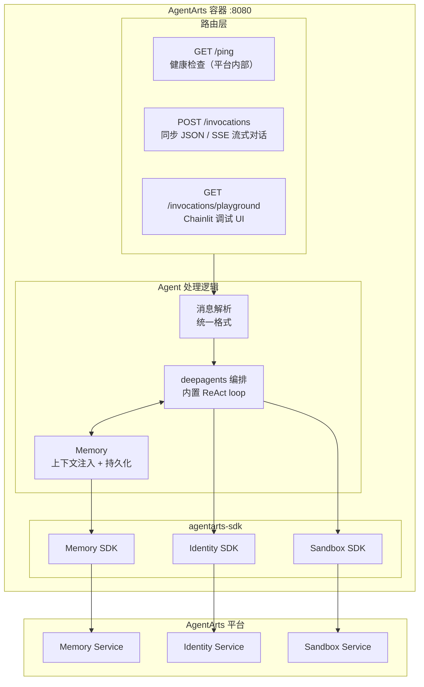
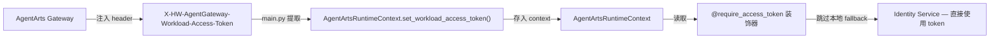
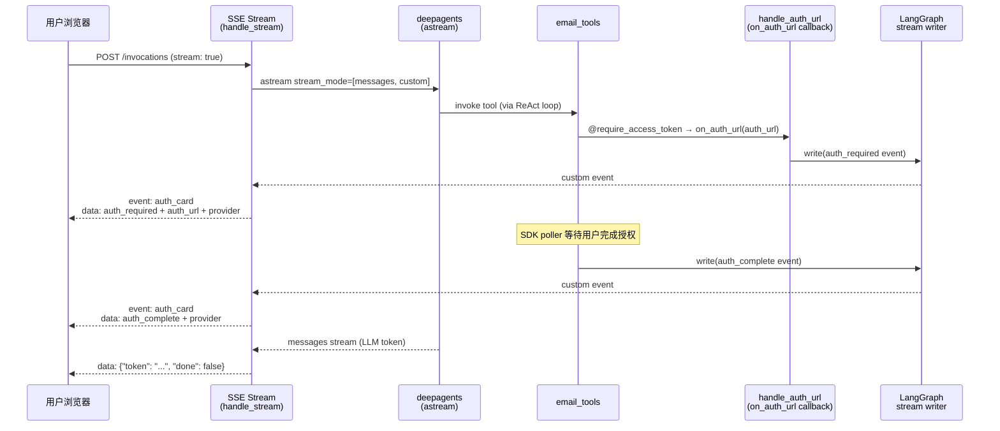

# Personal Assistant — 后端架构

> 版本：v0.1 | 状态：Draft | 关联文档：`frontend_architecture.md`

---

## 1. 概述

后端统一使用 **FastAPI** 应用，部署在 AgentArts 容器中（`:8080`）。不依赖 `AgentArtsRuntimeApp`，而是直接以标准 HTTP Server 方式暴露路由，通过 `agentarts-sdk` 调用平台能力。



---

## 2. 路由设计

### 2.1 AgentArts Gateway 路由约束

AgentArts 部署的容器通过 **AgentArts API Gateway** 接收外部请求。生产环境当前配置为 `PREFIX_MATCH`，Gateway 转发 `/invocations` 及其所有子路径。

```
浏览器/客户端 ──→ Gateway (defaultgw-xxx...) ──→ 容器 :8080
                       │
                   PREFIX_MATCH: /invocations → ✅ 转发
                   /invocations/* 子路径 → ✅ 转发
```

**关键约束**：
- `/ping` 是平台内部健康检查端点，**不走 Gateway**，AgentArts 控制面直接调容器。必须保留在根路径。
- `/invocations` 是 AgentArts SDK invoke 入口，**必须保留在根路径**，也是浏览器 Web Chat 的生产流式入口。
- Web Chat 对话调用收敛到 `POST /invocations` 单一路径，通过 JSON body 字段区分同步或流式模式。
- `/invocations/playground` 可通过 Gateway 的完整 Runtime 子路径访问，但 Cloudflare Pages Function 当前不代理该路径。

> **Inbound authentication**：Gateway 使用 `authorizer_type: CUSTOM_JWT`。
> Browser 将 Microsoft JWT 发送到 same-origin Cloudflare Pages Function，
> Function 透明转发给 Gateway，由 Gateway 验证后再转发业务请求。该拓扑避免
> Browser CORS preflight，同时不改变 Gateway 的认证职责。详见
> [ADR-017](ADR/ADR-017-cloudflare-pages-proxy.md)。

配置方式（`.agentarts_config.yaml`）：

```yaml
runtime:
  invoke_config:
    protocol: HTTP
    port: 8080
    url_match_type: PREFIX_MATCH  # 转发 /invocations 及其子路径
```

### 2.2 路由表

```python
from fastapi import FastAPI, Request
from fastapi.responses import StreamingResponse

app = FastAPI()

# ── AgentArts 平台协议（AgentArts / OfficeClaw 调用入口）──

@app.get("/ping")
async def ping():
    """健康检查 — AgentArts 平台用此判断容器是否存活"""
    return {"status": "ok"}

@app.post("/invocations")
async def agent_arts_invoke(request: Request):
    """AgentArts Runtime / OfficeClaw / Web Chat 统一调用入口"""
    payload = await request.json()

    if payload.get("stream") is True:
        return StreamingResponse(
            agent_handler.handle_stream(
                message=payload.get("message", ""),
                user_id=request.headers.get("X-AgentArts-User-Id", "anonymous"),
            ),
            media_type="text/event-stream",
        )

    result = await agent_handler.handle(
        message=payload.get("message", ""),
        user_id=request.headers.get("X-AgentArts-User-Id", "anonymous"),
        session_id=request.headers.get("X-AgentArts-Session-Id"),
    )
    return {"response": result}

# ── 飞书直连 ──

@app.post("/feishu/webhook")
async def feishu_webhook(request: Request):
    """飞书事件回调 — 处理消息、卡片交互、URL 验证"""
    body = await request.json()
    # URL 验证
    if body.get("type") == "url_verification":
        return {"challenge": body["challenge"]}
    # 消息处理
    msg = parse_feishu_message(body)
    reply = await agent_handler.handle(
        message=msg["text"],
        user_id=msg["user_id"],
        session_id=msg["chat_id"],
    )
    await send_feishu_reply(body, reply)
    return {"code": 0}

# ── Web Chat OAuth（当前不通过 AgentArts Gateway 暴露）──

@app.get("/auth/callback")
async def oauth_callback(code: str):
    """OAuth 回调 — 用 code 换 JWT，设置 Cookie"""
    token = await exchange_oauth_code(code)
    response = RedirectResponse(url="/chat")
    response.set_cookie("session", token["id_token"])
    return response

# Chainlit 调试 UI（PREFIX_MATCH Gateway 可转发该子路径）
mount_chainlit(app=app, target=..., path="/invocations/playground")
```

| 路由 | 方法 | 调用方 | 用途 | Gateway 可见 |
|------|------|--------|------|-------------|
| `/ping` | GET | AgentArts 平台（控制面） | 健康检查 | ❌ 平台内部 |
| `/invocations` | POST | AgentArts SDK / OfficeClaw / 浏览器 | `stream: false` 或未传返回 JSON；`stream: true` 返回 SSE | ✅（PREFIX_MATCH） |
| `/invocations/playground` | GET | 浏览器 | Chainlit 调试 UI | ✅ 通过完整 Runtime path；Cloudflare Function 不代理 |

> **注意**：`/feishu/webhook`、`/auth/callback` 等需要独立 URL 的路由无法通过 Gateway 暴露。这些路由对应的功能需要通过 AgentArts 平台侧 MCP Gateway 或 Identity 组件实现，或由 Web Chat 前端在浏览器侧直接处理 OAuth 流程并将结果回传。

### 2.3 AgentArts Gateway Header 注入

AgentArts Gateway 在转发请求到 Runtime 容器时，会注入以下 header。后端需在请求处理入口（`main.py` 的 `invocations()` 或 `auth.py`）提取并使用：

| Header | 用途 | 当前状态 |
|--------|------|----------|
| `X-HW-AgentGateway-User-Id` | 经 Gateway 认证后的用户 ID（CUSTOM_JWT 模式为 decoded claim，API Key 模式为 key 别名） | ✅ 已提取（`extract_gateway_user_id()`） |
| `x-hw-agentarts-session-id` | AgentArts Session ID，用于 Memory Session 关联和 LangGraph checkpoint `thread_id` 构造 | ✅ 已提取 |
| `X-HW-AgentGateway-Workload-Access-Token` | Workload Access Token — Agent 容器以 Workload Identity 认证 Identity Service 的短期凭证。Gateway 自动注入，无需容器自行获取 | ⚠️ Chore 5 新增提取 |

**Workload Access Token 数据流**：



> **Fallback 行为**：若 header 不存在（本地开发环境），不报错，`AgentArtsRuntimeContext` 无 token → SDK 的 `_get_workload_access_token()` 自动 fallback 到本地 `.agent_identity.json` + Identity Service API 调用。不改变现有本地开发体验。

<!-- updated by issue: chore-5-workload-access-token-from-header -->

---

## 3. Agent 处理逻辑

> Session 状态管理（Checkpoint + Memory 两阶段模型）的完整架构设计见 [session-state-management.md](session-state-management.md)。

所有路由最终解析为统一消息格式，调用共享的 Agent 处理逻辑：

```python
from deepagents import create_deep_agent
from langgraph.checkpoint.memory import MemorySaver

class AgentHandler:
    """共享 Agent 处理逻辑 — 所有前端共用"""

    def __init__(self):
        from app.llm_config import get_model
        from app.tools import build_tools  # ✅ Feature 10a: 工具注册工厂
        self.model = get_model()
        self.checkpointer = self._init_checkpointer()  # 新增
        self.agent = create_deep_agent(
            model=self.model,
            system_prompt="你是 Personal Assistant...",
            tools=build_tools(),  # ✅ Feature 10a: 动态加载工具
            checkpointer=self.checkpointer,  # ✅ 注入 Checkpointer
        )

    def _init_checkpointer(self, settings):
        """通过 typed Settings 选择 Checkpointer 后端。"""
        if settings.postgres_dsn:
            from langgraph.checkpoint.postgres import PostgresSaver
            return PostgresSaver.from_conn_string(settings.postgres_dsn)
        if settings.sqlite_db_path:
            from langgraph.checkpoint.sqlite.aio import AsyncSqliteSaver
            return AsyncSqliteSaver.from_conn_string(str(settings.sqlite_db_path))
        return MemorySaver()  # 默认：进程内存

    @staticmethod
    def _build_config(user_id: str, session_id: str | None) -> dict:
        """构造 LangGraph config，thread_id = {user_id}:{session_id}。"""
        sid = session_id or "default"
        return {"configurable": {"thread_id": f"{user_id}:{sid}"}}

    async def handle(self, message: str, user_id: str,
                     session_id: str = None) -> str:
        config = self._build_config(user_id, session_id)  # ✅ 新增
        result = await self.agent.ainvoke(
            {"messages": [{"role": "user", "content": message}]},
            config=config,  # ✅ 传递 config
        )
        return result["messages"][-1].content

    async def handle_stream(self, message: str, user_id: str,
                            session_id: str = None):
        """通过 LangGraph messages/custom stream 输出 SSE。"""
        config = self._build_config(user_id, session_id)
        try:
            async for mode, data in self.agent.astream(
                {"messages": [{"role": "user", "content": message}]},
                stream_mode=["messages", "custom"],
                config=config,
            ):
                if mode == "custom":
                    event_name = (
                        "auth_card"
                        if isinstance(data, dict)
                        and (data.get("auth_required") or data.get("auth_complete"))
                        else None
                    )
                    prefix = f"event: {event_name}\\n" if event_name else ""
                    yield f"{prefix}data: {json.dumps(data, ensure_ascii=False)}\\n\\n"

                elif mode == "messages":
                    token_chunk, _metadata = data
                    if getattr(token_chunk, "type", None) == "tool":
                        continue
                    token = getattr(token_chunk, "content", "") or ""
                    if token:
                        payload = {"token": token, "done": False}
                        yield f"data: {json.dumps(payload, ensure_ascii=False)}\\n\\n"

            yield f"data: {json.dumps({'token': '', 'done': True})}\\n\\n"

        except Exception as error:
            yield f"data: {json.dumps({'error': str(error), 'done': True})}\\n\\n"
```

---

## 4. deepagents 编排

Agent 推理使用 deepagents，底层是 LangGraph，封装了标准 ReAct loop。无需手写 StateGraph：

```python
from deepagents import create_deep_agent

agent = create_deep_agent(
    model=model,
    system_prompt="你是 Personal Assistant...",
    tools=[...],  # Identity SDK 装饰的工具
)
```

内置能力：

- **ReAct loop** — agent 推理 → 工具调用 → 结果反馈 → 循环，由 deepagents 内置
- **conversation summarization** — 长对话自动 compact，控制 token 消耗
- **skills 系统** — SKILL.md 文件驱动，按需加载领域知识和工具使用指南
- **planning tool** — 内置 write_todos，复杂任务自动拆解（可按需关闭）
- **sub-agents** — 内置 task tool，上下文隔离执行子任务（本项目不依赖）

deepagents 是 LangGraph 的 harness，不是替代品。需要自定义图编排时可直接 drop 到 LangGraph。

---

## 5. AgentArts 平台能力集成

### 5.1 Memory（跨 Session 记忆）

```python
from agentarts.sdk.memory import MemoryClient
from agentarts.sdk.memory.session import MemorySession
from agentarts.sdk.memory.inner.config import TextMessage, MemorySearchFilter

class PersonalAssistantMemory:
    def __init__(self):
        self.space_id = os.environ["MEMORY_SPACE_ID"]

    async def get_context(self, user_id: str) -> str:
        session = MemorySession(
            space_id=self.space_id,
            actor_id=f"pa-user-{user_id}",
            assistant_id="personal-assistant"
        )
        results = session.search_long_term_memories(
            filters=MemorySearchFilter(query="user preferences", top_k=5)
        )
        return "\n".join(r["record"]["content"] for r in results.results)

    async def save(self, user_id: str, query: str, response: str):
        session = MemorySession(
            space_id=self.space_id,
            actor_id=f"pa-user-{user_id}",
            assistant_id="personal-assistant"
        )
        session.add_messages([
            TextMessage(role="user", content=query[:2000]),
            TextMessage(role="assistant", content=response[:2000]),
        ])
```

### 5.2 Identity（Outbound 认证）

通过 `agentarts.sdk.identity` 提供的装饰器，Agent 以用户委托身份调用外部服务：

```python
from agentarts.sdk import require_access_token

@require_access_token(
    provider_name="github-provider",
    scopes=["repo", "read:user"],
    auth_flow="USER_FEDERATION"
)
async def list_github_issues(owner: str, repo: str, access_token: str = None):
    async with httpx.AsyncClient() as client:
        resp = await client.get(
            f"https://api.github.com/repos/{owner}/{repo}/issues",
            headers={"Authorization": f"Bearer {access_token}"}
        )
        return resp.json()
```

支持三种 Outbound 模式：
- **USER_FEDERATION**：以用户身份调 GitHub/Microsoft 365（OAuth2）。邮件部分（`m365-provider`）由 Feature 10a 实现，详见 [overall_architecture.md §4.2](overall_architecture.md#42-outbound--agent-代表用户调用外部服务)。
- **M2M**：以 Agent 自身身份调企业内部 API（API Key）
- **STS**：获取云资源临时凭证（STS Token）

> **Workload Access Token 优化**：生产环境中，AgentArts Gateway 在转发请求时自动注入 `X-HW-AgentGateway-Workload-Access-Token` header（见 §2.3）。后端提取该 token 并存入 `AgentArtsRuntimeContext` 后，`@require_access_token` 等装饰器内部优先从 context 读取，直接使用 Gateway 注入的 token 向 Identity Service 换取 OAuth2 access token，跳过本地 `.agent_identity.json` 的 fallback 流程。本地开发时 header 不存在，行为不变。
<!-- updated by issue: chore-5-workload-access-token-from-header -->

### 5.2.1 OAuth2 鉴权 URL 呈现（Out-of-Band 消息投递）

当 `@require_access_token` 的 `on_auth_url` callback 被触发时（即用户尚未授权
该 OAuth2 provider），需要将授权 URL **直接呈现给用户**，而非通过 LLM
转述。本系统使用 LangGraph 原生 `get_stream_writer()` 将事件写入 `custom`
stream，`AgentHandler` 同时消费 `messages` 和 `custom` 两种 stream mode。



**实现要点**：

1. **Callback 写入 custom stream**：`handle_auth_url` 从当前 LangGraph execution
   context 获取 writer：

   ```python
   async def handle_auth_url(auth_url: str) -> None:
       writer = get_stream_writer()
       writer({
           "type": "system_message",
           "system_message": "邮件功能需要您的授权。请点击该链接进行授权：",
           "auth_url": auth_url,
           "auth_required": True,
           "provider": "m365-provider-common",
       })
   ```

2. **完成事件**：tool 获得 access token 后发送 provider-scoped
   `auth_complete`。该事件表示 provider credential 当前可用；Client 仅在存在
   相同 provider 的 pending Auth Card 时更新 UI：

   ```python
   def _push_auth_complete(provider: str) -> None:
       writer = get_stream_writer()
       writer({
           "type": "system_message",
           "system_message": "授权已完成 ✅",
           "auth_complete": True,
           "provider": provider,
       })
   ```

3. **Stream routing**：`handle_stream` 将 auth custom event 输出为 named
   `auth_card` SSE；`messages` mode 只输出 LLM token，并过滤 ToolMessage：

   ```python
   async for mode, data in agent.astream(
       input,
       stream_mode=["messages", "custom"],
       config=config,
   ):
       if mode == "custom":
           yield f"event: auth_card\ndata: {json.dumps(data)}\n\n"
       elif mode == "messages":
           token_chunk, _metadata = data
           if token_chunk.type != "tool":
               yield token_sse(token_chunk.content)
   ```

4. **Tool function guard**：各 tool function body 顶部添加正常控制流 guard，替代异常跳转：
   ```python
   def _auth_required_response() -> dict:
       return {"auth_required": True, "error": "Authorization pending. Please follow the authorization link sent to you."}

   @require_access_token(...)
   async def list_emails(..., access_token: str | None = None):
       if not access_token:
           return _auth_required_response()
       # ... normal tool logic ...
   ```

**关键设计决策**：
- 使用 LangGraph 原生 custom stream，不维护 module-level queue 或并发 drain
  lifecycle。
- 不使用 `@_handle_provider_error` 装饰器——正常的 Identity Service 错误（如 provider 未配置、500 内部错误）改为在各 tool function 顶部统一 guard 处理，不再需要包装层。
- `AuthUrlRequired` 异常类被删除——鉴权 URL 通过 custom stream 直接推送给用户，不再作为异常抛出。

<!-- updated by issues: refactor-email-auth-normal-control-flow, bug-16-auth-card-system-message-duplicated-in-chat -->

### 5.3 Sandbox（代码执行隔离）

```python
from agentarts.sdk.tools import SandboxClient

sandbox = SandboxClient()
result = sandbox.execute("print('hello')")
```

---

## 6. 技术栈

| 层级 | 选型 | 说明 |
|------|------|------|
| **Web 框架** | FastAPI | 替代 AgentArtsRuntimeApp，统一管理所有路由。详见 [ADR-004](ADR/ADR-004-fastapi-over-agentarts-runtime-app.md) |
| **Agent 编排** | deepagents (LangChain) | LangGraph 之上的 batteries-included harness，封装 ReAct loop + summarization + skills。详见 [ADR-009](ADR/ADR-009-deepagents.md) |
| **LLM** | typed Settings + internal Provider catalog | `.env.example` 是唯一用户配置入口；`app/settings.py` 校验 Runtime Settings，`provider_catalog.py` 保存随代码发布的非敏感 metadata，credential 由 AgentArts Identity 提供。详见 ADR-011 |
| **Memory** | AgentArts Memory SDK | 短期+长期记忆，三种抽取策略 |
| **Identity** | AgentArts Identity SDK | Inbound JWT/API Key + Outbound OAuth2/M2M/STS |
| **Gateway** | AgentArts MCP Gateway | API → MCP Tool 自动转换 |
| **Sandbox** | AgentArts Sandbox SDK | 安全隔离代码执行 |
| **包管理** | uv (Astral) | 替代 pip/virtualenv，Rust 实现，uv.lock 确定性构建。详见 [ADR-010](ADR/ADR-010-astral-ecosystem-tooling.md) |
| **Lint / Format** | ruff (Astral) | 替代 flake8 + black + isort，Rust 实现，单一配置。详见 [ADR-010](ADR/ADR-010-astral-ecosystem-tooling.md) |
| **Container** | Docker (linux/arm64) | Python 3.12+。详见 [ADR-001](ADR/ADR-001-python-3.12.md) |
| **数据库** | PostgreSQL 16 | SQLAlchemy 2.0 async + asyncpg，本地 Docker Compose，生产华为云 RDS。详见 [ADR-012](ADR/ADR-012-database-postgresql.md) |

---

## 7. 项目结构

```
personal-assistant/
├── .agentarts_config.yaml          # AgentArts 部署配置
├── Dockerfile                       # ARM64 镜像
├── .env.example                     # 唯一面向使用者的 Service 配置入口
├── pyproject.toml                   # Python 依赖 + ruff 配置
├── uv.lock                           # 确定性锁文件
├── app/
│   ├── main.py                      # FastAPI 应用入口 + 路由定义
│   ├── agent_handler.py             # Agent 处理逻辑（deepagents + Identity SDK）
│   ├── settings.py                  # typed Runtime Settings（内部实现）
│   ├── provider_catalog.py          # 内置 Provider metadata（非用户配置）
│   ├── llm_config.py                # Settings + Identity → LLM model
│   ├── feishu_adapter.py            # 飞书消息解析 + 回复
│   ├── oauth.py                     # OAuth 流程 (Microsoft Entra ID)
│   └── tools/
│       ├── __init__.py              # 工具目录初始化 + ToolNode 工厂 ✅ Feature 10a
│       ├── email_tools.py           # Microsoft 365 邮件工具 (OAuth2) ✅ Feature 10a
│       ├── github_tools.py          # GitHub 工具 (OAuth2) [Planned]
│       ├── internal_tools.py        # 内部 API 工具 (API Key) [Planned]
│       └── cloud_tools.py           # 云资源工具 (STS) [Planned]
```

---

## 8. 与 AgentArtsRuntimeApp 的关系

**不使用 AgentArtsRuntimeApp。** 原因：

| AgentArtsRuntimeApp | 本方案 (FastAPI) |
|---------------------|------------------|
| 仅提供 `/ping` + `/invocations` | 可定义任意路由 |
| 不能添加 OAuth 回调 | `/auth/callback`（仅本地调试可用） |
| 不能添加 SSE 流式 | `POST /invocations` + `stream: true` |
| 不能添加飞书 Webhook | 飞书通过平台 MCP Gateway 集成 |
| `agentarts dev` 启动 | `uvicorn main:app --port 8080` |
| `agentarts launch` 自动部署 | 同样可以用 `agentarts launch` |

AgentArts 平台只看容器 `:8080` 上有没有 `/ping` 和 `/invocations`，不关心 HTTP Server 用什么框架启动。

> **关键限制**：AgentArts Gateway 生产环境使用 `PREFIX_MATCH`，因此仅
> `/invocations` 及其子路径可对外转发；其他 root-level FastAPI route 不会
> 自动暴露。外部 URL 仍必须使用完整
> `/runtimes/personal-assistant/invocations...` Runtime path。
