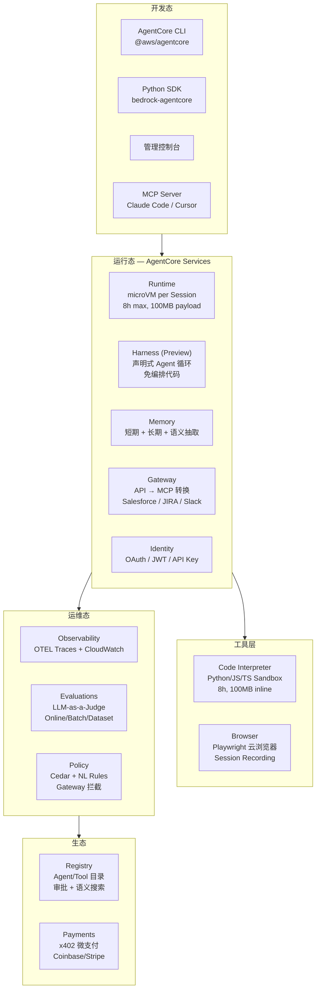
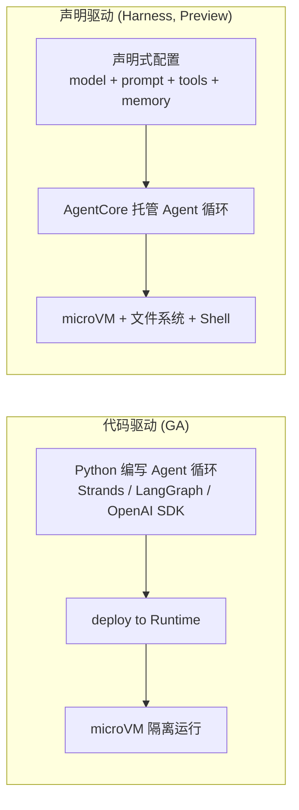
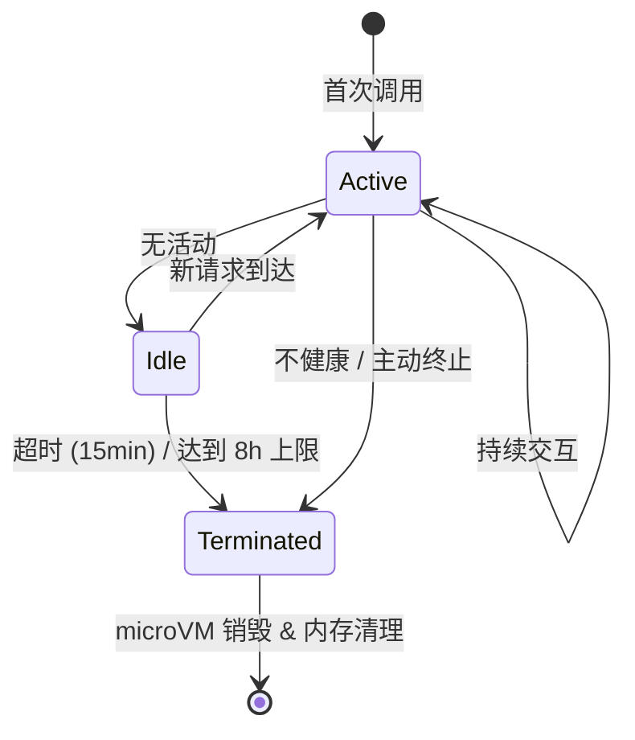

# AWS Bedrock AgentCore - 开发参考

> 信息来源：AWS 官方文档，`https://docs.aws.amazon.com/bedrock-agentcore/latest/devguide/`
> 本文档用于 Personal Assistant 基于 AgentArts 平台开发的架构参考，与 AgentArts 进行交叉对比。

---

## 1. 产品概述

Amazon Bedrock AgentCore 是 AWS 推出的 **agentic AI 平台**，用于构建、部署和运营大规模生产级 Agent。核心设计理念：**将开源框架的灵活性与企业级安全、可靠性结合起来**，无需管理基础设施。

> **注意**：AgentArts（华为云）很大程度上借鉴了 AgentCore 的架构设计，两者在概念模型上有高度的对应关系。阅读本文档时应与 [agentarts.md](../agentarts.md) 交叉对比。

### 核心能力一览

| 服务 | 说明 | 状态 |
|------|------|------|
| **Runtime** | 无服务器运行时环境，基于 microVM 的会话级隔离 | GA |
| **Harness** | 声明式 Agent 循环（配置驱动，无需编排代码） | Preview |
| **Memory** | 短期记忆（会话内）+ 长期记忆（跨会话），语义抽取 | GA |
| **Gateway** | MCP 兼容工具网关，将 API/Lambda 转为 MCP Tool | GA |
| **Identity** | Agent 身份认证，入站/出站 OAuth、API Key、JWT | GA |
| **Code Interpreter** | 沙箱代码执行（Python/JS/TS），最长 8 小时 | GA |
| **Browser** | 托管云浏览器，Agent 可浏览网页、填表、截图 | GA |
| **Observability** | OpenTelemetry 全链路 Trace + CloudWatch 仪表板 | GA |
| **Evaluations** | LLM-as-a-Judge 自动评估，支持在线/批量/数据集评估 | GA |
| **Policy** | Cedar 策略语言 + 自然语言规则，通过 Gateway 拦截 | GA |
| **Registry** | 企业内 Agent/MCP Server/Tool 统一目录 | Preview |
| **Payments** | x402 协议 Agent 微支付（代币/法币） | Preview |

---

## 2. 产品架构



---

## 3. 开发路径

### 3.1 两种构建模式



### 3.2 CLI 开发流程

```bash
# 1. 安装 CLI（Node.js 20+）
npm install -g @aws/agentcore

# 2. 创建项目（交互式向导）
agentcore create
# 选择：Framework (Strands/LangGraph/OpenAI SDK)
#       Model Provider (Bedrock/OpenAI/Anthropic/Gemini)
#       Memory (None/Short-term/Long-term)
#       Build Type (CodeZip/Container)

# 3. 本地开发（热重载 + Agent Inspector）
agentcore dev
# 自动：创建 venv → 安装依赖 → 启动本地服务 → 打开浏览器 Inspector
# 支持：--no-browser (TUI), --port <N>, --no-traces

# 4. 部署
agentcore deploy
# 自动：CDK 合成 → 创建 Runtime Endpoint → 配置 CloudWatch
# 支持：--plan (dry-run 预览)

# 5. 调用
agentcore invoke --prompt "Hello, what can you do?"

# 6. 迭代
# 修改 app/MyAgent/main.py → agentcore dev 测试 → agentcore deploy 部署
```

### 3.3 添加能力

```bash
agentcore add memory      # 对话记忆
agentcore add agent       # 多 Agent
agentcore add gateway     # 外部 API/MCP 工具
agentcore add credential  # 非 Bedrock 模型的 API Key
agentcore add evaluator   # 质量评估
```

### 3.4 项目结构

```
MyAgent/
├── agentcore/
│   ├── agentcore.json       # 项目与资源配置
│   ├── aws-targets.json     # 部署目标（Account + Region）
│   └── cdk/                 # CDK 基础设施（自动管理）
└── app/
    └── MyAgent/
        ├── main.py          # Agent 入口
        └── pyproject.toml   # Python 依赖
```

---

## 4. AgentCore Runtime 详解

### 4.1 核心概念

| 概念 | 说明 |
|------|------|
| **Runtime** | 托管 Agent 代码的容器化应用，拥有唯一 Identity，支持版本控制 |
| **Version** | 不可变快照，每次配置更新生成新版本 |
| **Endpoint** | 指向特定版本的访问地址，DEFAULT endpoint 自动创建 |
| **Session** | 独立 microVM（隔离 CPU/内存/文件系统），最长 8 小时，15 分钟无活动超时 |

### 4.2 Session 生命周期



### 4.3 协议支持

| 协议 | 端口 | 用途 | Session Header |
|------|------|------|----------------|
| **HTTP** | 8080 | REST/SSE/WebSocket | `X-Amzn-Bedrock-AgentCore-Runtime-Session-Id` |
| **MCP** | 8000 | JSON-RPC, Tool listing | `Mcp-Session-Id` |
| **A2A** | 9000 | Agent-to-Agent 通信 | `X-Amzn-Bedrock-AgentCore-Runtime-Session-Id` |
| **AG-UI** | 8080 | 交互式 UI 事件流 | `X-Amzn-Bedrock-AgentCore-Runtime-Session-Id` |

> 一个部署可同时暴露多种协议。

### 4.4 安全特性

- **入站认证**：AWS IAM (SigV4) 或 OAuth 2.0 + 外部 IdP (Cognito/Okta/Entra ID)
- **出站认证**：OAuth 或 API Key（用户委托模式 / 自主模式）
- **microVM 隔离**：每 Session 独立 microVM，终结后内存清理
- **Policy 拦截**：通过 Gateway 的 Cedar 策略引擎，每次 Tool Call 前策略评估
- **VPC 集成**：支持私有子网 + ENI + PrivateLink

---

## 5. AgentCore Memory 详解

### 5.1 记忆类型

| 类型 | 说明 | 示例 |
|------|------|------|
| **Short-term Memory** | 单次会话内的轮次交互上下文 | "西雅图天气？"→"明天呢？"→ Agent 理解指代 |
| **Long-term Memory** | 跨会话持久化存储，自动抽取用户偏好、事实、摘要 | 用户喜欢靠窗座位 → 下次自动推荐 |

### 5.2 概念模型

```
Memory Store → Session → Messages (Conversational Turns) → Long-term Records
```

### 5.3 代码示例

```python
from bedrock_agentcore.memory import MemorySessionManager
from bedrock_agentcore.memory.constants import ConversationalMessage, MessageRole

# 创建 Memory Session Manager
session_manager = MemorySessionManager(
    memory_id=memory_id,
    region_name="us-west-2"
)

# 创建 Session
session = session_manager.create_memory_session(
    actor_id="User1",
    session_id="OrderSupportSession1"
)

# 添加对话轮次
session.add_turns(messages=[
    ConversationalMessage(
        content="Hi, I need help with my order #12345",
        role=MessageRole.USER
    ),
    ConversationalMessage(
        content="I found your order. It's scheduled for delivery tomorrow.",
        role=MessageRole.ASSISTANT
    ),
])

# 语义搜索长期记忆
records = session.search_long_term_memories(
    query="summarize the support issue",
    namespace_path="/",
    top_k=3
)

for record in records:
    print(record["content"], record["score"])
```

### 5.4 记忆策略

- **Semantic Extraction**：从对话中自动抽取语义信息
- **Summarization**：对话摘要（可配置）
- 与 Strands Agents 深度集成：`AgentCoreMemorySessionManager`

---

## 6. AgentCore Gateway 详解

### 6.1 核心能力

将现有 API、Lambda 函数、第三方服务**一键转换为 MCP-compatible Tool**：

- **Security Guard**：OAuth 授权（入站 + 出站）
- **Translation**：Agent 请求（MCP）→ API 请求 / Lambda 调用
- **Composition**：多个 API/Tool 组合为单个 MCP Endpoint
- **Semantic Tool Selection**：Agent 可跨 Tool 语义搜索匹配
- **Serverless**：无服务器基础设施，内置审计/观测

### 6.2 支持的 Target 类型

- OpenAPI Spec
- Smithy Model
- AWS Lambda Function
- Pre-built Integrations：Salesforce、Slack、Jira、Asana、Zendesk

### 6.3 快速上手

```bash
# 安装 CLI
npm install -g @aws/agentcore

# 创建项目
agentcore create --name MyGatewayAgent --defaults

# 添加 Gateway
agentcore add gateway --name TestGateway --authorizer-type NONE

# 添加 Target（Lambda）
agentcore add gateway-target --name TestLambdaTarget --type lambda-function-arn

# 部署
agentcore deploy

# Gateway MCP URL
# https://{gateway-id}.gateway.bedrock-agentcore.{region}.amazonaws.com/mcp
```

---

## 7. AgentCore Harness (Preview)

> 声明式 Agent 循环，无需编写编排代码 — AgentCore 托管运行。

### 7.1 工作原理

声明 Agent 的模型、System Prompt、工具 → AgentCore 自动处理编排、工具执行、记忆管理、响应生成。

### 7.2 特性

- **有状态默认**：每 Session 独立 microVM
- **文件系统 + Shell**：Agent 拥有自己的文件系统和 Shell 访问
- **跨 Session 记忆**：短期 + 长期记忆持久化
- **任意模型**：同一 Session 中可切换模型提供商
- **自定义环境**：通过容器镜像引入自定义依赖
- **底层引擎**：由 AWS 开源的 Strands Agents 框架驱动
- **Preview 区域**：`us-west-2`, `us-east-1`, `eu-central-1`, `ap-southeast-2`

### 7.3 流式响应事件

`messageStart` → `contentBlockStart` → `contentBlockDelta` → `contentBlockStop` → `messageStop`

Stop Reason: `end_turn` | `tool_use` | `max_tokens` | `max_iterations_exceeded` | `timeout_exceeded`

---

## 8. 其他服务

### 8.1 Code Interpreter

- 语言：Python、JavaScript、TypeScript
- 预装常用库的 Runtime
- 文件：100MB inline / 5GB via S3
- 执行时间：默认 15 分钟，最长 8 小时
- 网络模式：支持 Internet / VPC
- 容器化隔离环境

### 8.2 Browser

- 托管云浏览器（Playwright / BrowserUse）
- Session 录制（DOM 变更、用户操作、Console 日志、网络事件）
- 录制内容存 S3，可通过控制台回放
- Live View 实时监控
- 容器隔离，Session 到期自动终止

### 8.3 Observability

- OpenTelemetry (OTEL) 兼容遥测
- 全链路 Trace 可视化（推理步骤 → Tool 调用 → 模型交互）
- 指标：Session 数、延迟、Token 用量、错误率
- CloudWatch 控制台仪表板
- 跨账号监控

### 8.4 Evaluations

- 支持 Strands、LangGraph 框架
- OpenTelemetry / OpenInference 插桩
- LLM-as-a-Judge 评分
- 评估类型：Online / On-demand / Batch / Dataset / Simulation
- 限制：每 Region 1000 配置，100 活跃

### 8.5 Policy

- Cedar 策略语言（AWS 开源）+ 自然语言规则
- 通过 Gateway 拦截每次 Tool Call
- 自动推理检查：过度宽松/严格、不可满足条件
- 基于用户身份和 Tool 输入参数的细粒度权限

### 8.6 Registry (Preview)

- 企业内 Agent / MCP Server / Tool / Skill 统一目录
- 审批工作流发布
- 混合语义 + 关键词搜索
- MCP-native 访问（Registry 作为远程 MCP Endpoint）

### 8.7 Payments (Preview)

- x402 协议（HTTP 402 Payment Required）
- 钱包集成：Coinbase CDP、Stripe (Privy)
- Coinbase x402 Bazaar：10000+ 付费端点
- 每 PaymentSession 可设 `maxSpendAmount`、币种、过期时间

---

## 9. VPC 网络与安全

### 9.1 VPC 集成

Runtime、Code Interpreter、Browser 均可接入 VPC：

- Elastic Network Interface (ENI) 分配私有 IP
- Security Group 控制资源访问
- ENI 可在使用相同子网/SG 配置的 Agent 间共享
- VPC PrivateLink：入站连接 AgentCore API

### 9.2 无 Internet 环境的 VPC Endpoints

| Endpoint | 用途 |
|----------|------|
| `com.amazonaws.{region}.ecr.dkr` | ECR Docker |
| `com.amazonaws.{region}.ecr.api` | ECR API |
| `com.amazonaws.{region}.s3` | S3 Gateway |
| `com.amazonaws.{region}.logs` | CloudWatch Logs |

### 9.3 IAM 权限

- Identity-based policies（用户/组/角色）
- Resource-based policies（如 Evaluator 访问）
- AWS Managed Policy：`BedrockAgentCoreFullAccess`
- Service-linked role：`AWSServiceRoleForBedrockAgentCoreNetwork`

---

## 10. 开发接口汇总

| 接口 | 说明 | 安装 |
|------|------|------|
| **AgentCore CLI** | 项目脚手架、本地开发、部署、调用 | `npm install -g @aws/agentcore` |
| **Python SDK** | Runtime / Memory / Tools / Identity / Evaluations | `pip install bedrock-agentcore` |
| **MCP Server** | 通过 Claude Code / Cursor 等 MCP 客户端操作 | `agentcore` 自带 |
| **AWS SDK** | Control Plane (`bedrock-agentcore-control`) + Data Plane (`bedrock-agentcore`) | `aws sdk` |
| **AWS Console** | 可视化管理 | `https://console.aws.amazon.com/bedrock-agentcore/home#` |

### API 端点

| 平面 | 域名 | 用途 |
|------|------|------|
| **Control Plane** | `https://bedrock-agentcore-control.{region}.amazonaws.com` | 资源的 CRUD 管理 |
| **Data Plane** | `https://bedrock-agentcore.{region}.amazonaws.com` | `InvokeAgentRuntime` 等运行时操作 |
| **Gateway MCP** | `https://{gateway-id}.gateway.bedrock-agentcore.{region}.amazonaws.com/mcp` | MCP Tool 端点 |

---

## 11. 约束与限制

| 约束项 | 说明 |
|--------|------|
| **可用区域** | 16+ 商用区域 + GovCloud。Harness Preview 仅 4 个区域 |
| **Session 最长** | 8 小时 |
| **Session 空闲超时** | 15 分钟（可配置） |
| **Code Interpreter 执行** | 默认 15 分钟，最长 8 小时 |
| **Code Interpreter 文件** | 100MB inline / 5GB via S3 |
| **Browser 超时** | 默认 15 分钟，最长 8 小时 |
| **Payload 大小** | 100MB |
| **Session ID 长度** | 最少 33 字符 |
| **Evaluation 配置** | 每 Region 每 Account 1000 个，100 个活跃 |
| **运行时** | Python 3.10+（Agent 代码），Node.js 20+（CLI） |
| **构建方式** | CodeZip（zip 上传）或 Container（ECR 镜像） |
| **定价** | 按消耗计费（CPU 活跃时间，不计 I/O 等待） |

---

## 12. AgentCore vs AgentArts — 交叉对比

> AgentArts 在很大程度上借鉴了 AgentCore 的架构设计理念，两者在概念模型上高度对应。
> 以下对比基于截至 2026-06-02 的公开文档。

### 12.1 架构概念映射

| AgentCore (AWS) | AgentArts (华为云) | 相似度 |
|------------------|-------------------|--------|
| **Runtime** — microVM per Session | **Agent Runtime** — 容器化进程级隔离 | ★★★★☆ |
| **Harness** — 声明式 Agent 循环 (Preview) | **低代码工作流** — 可视化编排 | ★★★☆☆ |
| **Memory** — Short-term + Long-term | **Memory** — 长短期记忆 + 抽取策略 | ★★★★★ |
| **Gateway** — API→MCP 转换 | **MCP Gateway** — API→MCP 转换 | ★★★★★ |
| **Identity** — OAuth/JWT/API Key | **Identity** — IAM 鉴权 + API Key | ★★★★☆ |
| **Code Interpreter** — 沙箱代码执行 | **Sandbox Tools** — 安全隔离执行 | ★★★★★ |
| **Browser** — 托管云浏览器 | _(暂无对应)_ | — |
| **Observability** — OTEL + CloudWatch | **观测** — 全链路 Trace + 会话分析 | ★★★★☆ |
| **Evaluations** — LLM-as-a-Judge | **评估** — 代码/大模型双模式 + 40+ 评估器 | ★★★★☆ |
| **Policy** — Cedar + NL Rules | _(暂无独立的 Policy 服务)_ | — |
| **Registry** — Agent/Tool 目录 (Preview) | **资产广场** — 300+ 预置工具 | ★★★☆☆ |
| **Payments** — x402 微支付 (Preview) | _(暂无对应)_ | — |
| **—** | **OfficeClaw** — PC 客户端 + Office Skill | _(暂无对应)_ |
| **—** | **RAG 知识库** — 多格式文档混合检索 | _(AgentCore 无独立 KB 服务)_ |

### 12.2 关键差异分析

| 维度 | AgentCore (AWS) | AgentArts (华为云) |
|------|------------------|-------------------|
| **Session 隔离** | microVM 级别（更强隔离） | 容器/进程级 |
| **部署架构** | 仅支持 ARM64 Linux |
| **部署 Region** | 16+ 全球区域 | 仅 cn-southwest-2 |
| **框架支持** | Strands / LangGraph / CrewAI / OpenAI SDK / Google ADK / LlamaIndex | LangChain / LangGraph |
| **模型支持** | 任意 FM（Bedrock / OpenAI / Anthropic / Gemini / Nova / Llama / Mistral） | DeepSeek / Qwen / Kimi + OpenAI 兼容 |
| **构建方式** | CodeZip 或 Container | Container (Docker) 仅 |
| **CLI 语言** | Node.js (npm) | Python (pip) |
| **MCP 支持** | Runtime + Gateway 均原生 MCP | SDK 中 MCP Gateway SDK |
| **A2A 协议** | 原生支持 (port 9000) | 未明确提及 |
| **定位差异** | 无 Agent 客户端 | OfficeClaw PC 客户端 |
| **差异化能力** | Browser / Policy / Payments / Registry | RAG 知识库 / OfficeClaw / NL2Agent |

### 12.3 Personal Assistant 视角的选型考量

| 考量点 | AgentCore 优势 | AgentArts 优势 |
|--------|---------------|---------------|
| **全球部署** | 16+ Region | 仅 1 Region |
| **记忆能力** | 两者均提供短期+长期记忆，功能对等 | — |
| **工具集成** | 更丰富的 Pre-built Integrations (Salesforce/JIRA/Slack) | 国内生态集成更好 |
| **安全隔离** | microVM 更强隔离 | 进程级隔离 |
| **开发体验** | CLI 更成熟 (dev/hot reload/inspector) | agentarts-sdk 本地化支持 |
| **本地办公集成** | — | OfficeClaw (PPT/Word/Excel) |
| **知识库** | —（需自行集成 S3/RDS） | 内置 RAG 知识库 + 多格式解析 |
| **国内使用** | 需克服网络访问问题 | 国内 Region，低延迟 |
| **生态开放度** | 开源框架全兼容，MCP/A2A 原生 | 主要 LangChain/LangGraph |
| **定价** | 按 CPU 活跃时间计费 | 套餐订阅 |

---

## 13. 参考文档索引

| 文档 | 链接 |
|------|------|
| 产品概述 | `https://docs.aws.amazon.com/bedrock-agentcore/latest/devguide/what-is-bedrock-agentcore.html` |
| 快速开始 (CLI) | `https://docs.aws.amazon.com/bedrock-agentcore/latest/devguide/agentcore-get-started-cli.html` |
| Runtime | `https://docs.aws.amazon.com/bedrock-agentcore/latest/devguide/agents-tools-runtime.html` |
| Runtime 工作原理 | `https://docs.aws.amazon.com/bedrock-agentcore/latest/devguide/how-it-works.html` |
| Runtime Sessions | `https://docs.aws.amazon.com/bedrock-agentcore/latest/devguide/runtime-sessions.html` |
| Harness | `https://docs.aws.amazon.com/bedrock-agentcore/latest/devguide/harness.html` |
| Memory | `https://docs.aws.amazon.com/bedrock-agentcore/latest/devguide/memory.html` |
| Memory 快速开始 | `https://docs.aws.amazon.com/bedrock-agentcore/latest/devguide/memory-get-started.html` |
| Gateway | `https://docs.aws.amazon.com/bedrock-agentcore/latest/devguide/gateway.html` |
| Identity | `https://docs.aws.amazon.com/bedrock-agentcore/latest/devguide/identity.html` |
| Code Interpreter | `https://docs.aws.amazon.com/bedrock-agentcore/latest/devguide/code-interpreter-tool.html` |
| Browser | `https://docs.aws.amazon.com/bedrock-agentcore/latest/devguide/browser-tool.html` |
| Observability | `https://docs.aws.amazon.com/bedrock-agentcore/latest/devguide/observability.html` |
| Evaluations | `https://docs.aws.amazon.com/bedrock-agentcore/latest/devguide/evaluations.html` |
| Policy | `https://docs.aws.amazon.com/bedrock-agentcore/latest/devguide/policy.html` |
| Registry | `https://docs.aws.amazon.com/bedrock-agentcore/latest/devguide/registry.html` |
| Payments | `https://docs.aws.amazon.com/bedrock-agentcore/latest/devguide/payments.html` |
| VPC 配置 | `https://docs.aws.amazon.com/bedrock-agentcore/latest/devguide/agentcore-vpc.html` |
| 代码示例 (GitHub) | `https://github.com/awslabs/amazon-bedrock-agentcore-samples` |
| CLI (GitHub) | `https://github.com/aws/agentcore-cli` |
| 管理控制台 | `https://console.aws.amazon.com/bedrock-agentcore/home#` |
| 定价 | `https://aws.amazon.com/bedrock/agentcore/pricing/` |
