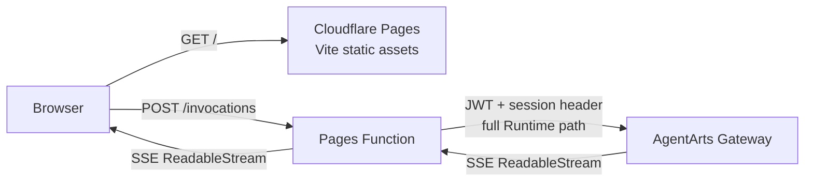
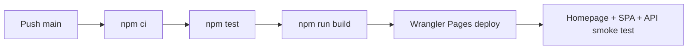

# Cloudflare Pages 部署与 Wrangler CLI

> 状态：Active | Production URL：`https://agentarts-personal-assistant.pages.dev`

## 架构

Cloudflare Pages 同时承担 Vite 静态前端托管和 same-origin API Proxy：



Browser 只访问 Pages origin，因此不会产生 CORS preflight。Pages Function
透明转发必要 headers、request body 和 SSE response body；JWT validation
仍由 AgentArts Gateway 完成。

## Repository 配置

| 文件 | 职责 |
|------|------|
| `personal-assistant-client/wrangler.toml` | Pages project name、build output 与 compatibility date |
| `personal-assistant-client/functions/invocations.js` | `/invocations` same-origin Proxy |
| `personal-assistant-client/src/lib/chat/chat-api-client.ts` | 固定请求 same-origin `/invocations` |
| `.github/workflows/deploy-frontend-to-cloudflare.yml` | `main` branch 自动测试、构建、部署和 smoke test |

Cloudflare project name 为 `agentarts-personal-assistant`，production branch
为 `main`。

## Wrangler CLI

以下命令均在 `personal-assistant-client/` 目录执行。

### 安装依赖

```bash
npm ci
```

Wrangler 已固定在项目 `devDependencies`，优先通过 npm scripts 或
`npx wrangler` 使用，不要求全局安装。

### 登录与账号检查

```bash
npx wrangler login
npx wrangler whoami
```

`login` 会打开 Browser 完成 OAuth。CI 不使用交互式登录，而是读取
`CLOUDFLARE_API_TOKEN` 和 `CLOUDFLARE_ACCOUNT_ID`。

### 查看 Pages projects

```bash
npx wrangler pages project list
```

### 本地运行 Pages + Functions

```bash
npm run pages:dev
```

等价于：

```bash
npm run build
npx wrangler pages dev dist
```

本地默认地址由 Wrangler 输出。可显式指定端口：

```bash
npx wrangler pages dev dist --port 8788
```

### 手动部署 production

```bash
npm run pages:deploy
```

等价于：

```bash
npm run build
npx wrangler pages deploy dist \
  --project-name=agentarts-personal-assistant \
  --branch=main
```

日常 production deployment 应由 GitHub Actions 完成；手动部署用于首次
bootstrap、CI 故障恢复或紧急验证。

### 查看 deployments

```bash
npx wrangler pages deployment list \
  --project-name=agentarts-personal-assistant
```

### 查看 Pages Function 实时日志

```bash
npx wrangler pages deployment tail \
  --project-name=agentarts-personal-assistant
```

停止 tail 使用 `Ctrl+C`。

## GitHub Actions

当 `main` branch 中以下路径变化时触发 production deployment：

- `personal-assistant-client/**`
- `.github/workflows/deploy-frontend-to-cloudflare.yml`

Pipeline：



Required repository secrets：

- `CLOUDFLARE_API_TOKEN`
- `CLOUDFLARE_ACCOUNT_ID`

API Token 最小权限为目标 Account 的 `Cloudflare Pages: Edit`。

## 验证

```bash
curl -I https://agentarts-personal-assistant.pages.dev/
curl -I https://agentarts-personal-assistant.pages.dev/chat
```

两者都应返回 HTTP 200。

未携带 JWT 的 Proxy probe：

```bash
curl -i -X POST \
  https://agentarts-personal-assistant.pages.dev/invocations \
  -H "Content-Type: application/json" \
  -H "x-hw-agentarts-session-id: smoke-test" \
  -d '{"message":"ping","stream":true}'
```

预期返回 Gateway 401。这证明 Pages Function 已将请求转发到 Gateway；完整
业务验证必须通过 Browser 登录后携带真实 Microsoft JWT。

## Microsoft Entra

Microsoft Entra App Registration 的 SPA Redirect URI 必须包含：

```text
https://agentarts-personal-assistant.pages.dev/
```
