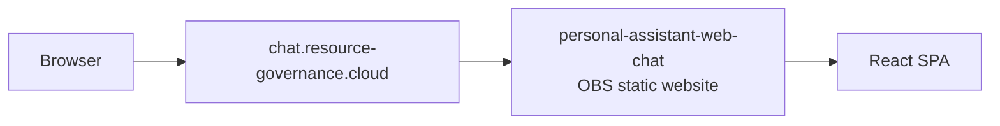
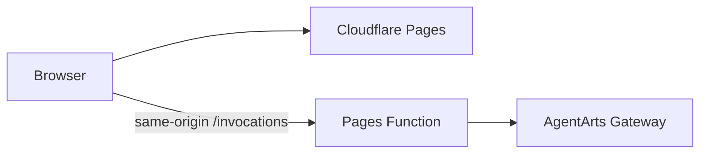

# Domain — Legacy OBS 自定义域名

> 状态：Historical | 退役日期：2026-06-19 | 当前入口：
> `https://agentarts-personal-assistant.pages.dev`

本文仅保留 Legacy topology、退役边界和排障经验。Production Web Chat 当前由
Cloudflare Pages 承载，详见
[`cloudflare/pages.md`](../cloudflare/pages.md) 与
[`ADR-017`](../../ADR/ADR-017-cloudflare-pages-proxy.md)。

## Historical topology

该 topology 曾用于规避 OBS 默认 website domain 对 HTML 响应附加
`Content-Disposition: attachment` 的行为。自定义域名通过 HuaweiCloud DNS
CNAME 指向 OBS website endpoint。

## 退役边界

2026-06-19 审计结果：

| 对象 | 处理 |
|------|------|
| `chat.resource-governance.cloud` CNAME | 删除 |
| `personal-assistant-web-chat` OBS bucket | 清理全部 versions 与 delete markers 后删除 |
| `resource-governance.cloud` DNS Zone | 保留，不再由 OpenTofu 管理 |
| `pa-terraform-state` OBS bucket | 保留，供未来 HuaweiCloud IaC 使用 |

DNS Zone 审计时仅包含 SOA、NS 和上述 Legacy CNAME。OBS bucket 启用
versioning，审计到 508 个 object versions 与 74 个 delete markers，因此不能
按普通空 bucket 流程删除。

## 当前 topology

Browser 不直接访问 AgentArts Gateway，也不依赖 FastAPI CORS allowlist。

## Historical 排障经验

- OBS 默认 website domain 可能强制下载 HTML；自定义 domain 曾用于正常渲染。
- OBS S3-compatible API 要求 virtual-host addressing。
- AWS CLI 新 checksum trailers 与 OBS 存在兼容性差异时，需要使用
  `AWS_REQUEST_CHECKSUM_CALCULATION=when_required` 和
  `AWS_RESPONSE_CHECKSUM_VALIDATION=when_required`。
- Versioned bucket 删除前必须清理所有 object versions 和 delete markers。

历史 ADR、resolved issues 和旧 deployment 方案保留原文，不作为当前
Production runbook。
