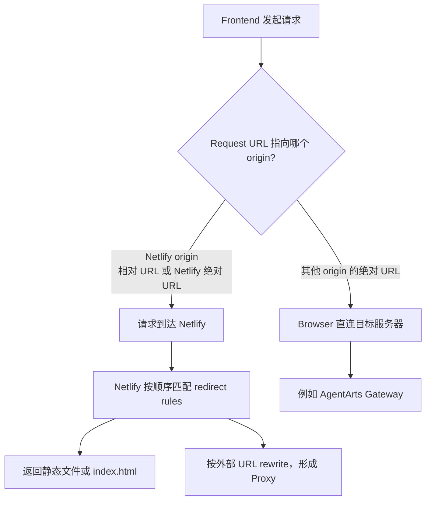
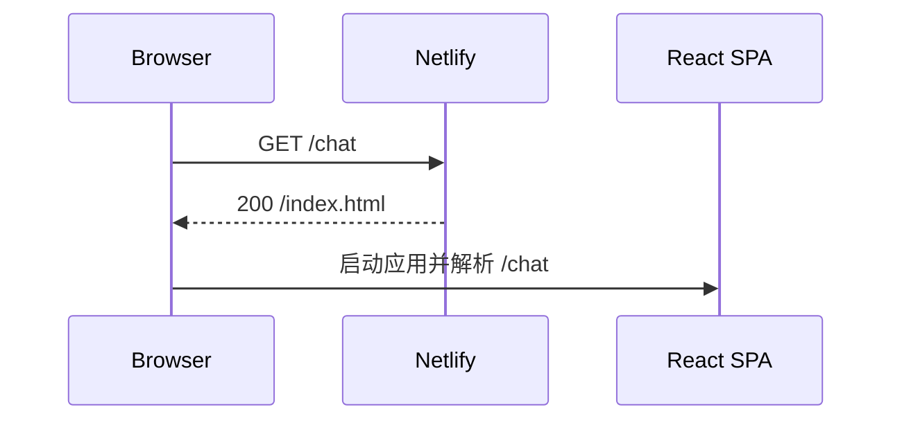
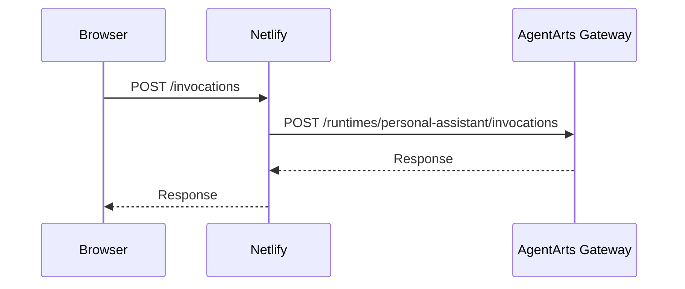

# Netlify Routing 与 Proxy 判定规则

> 状态：Historical | Production 已迁移到
> [`Cloudflare Pages`](../cloudflare/pages.md)。本文仅保留 Netlify routing
> 的通用原理和迁移背景。

## 核心规律

Netlify redirect rules 不是 Browser 的全局请求拦截器。请求是否经过 Netlify，
由以下两个阶段决定：



判断顺序必须是：

1. Browser 根据 Request URL 确定目标 origin。
2. 只有目标 origin 是 Netlify 时，请求才会到达 Netlify。
3. 请求到达 Netlify 后，`netlify.toml` 中的 redirect rules 才可能生效。

因此，`from = "/*"` 的准确含义是：

> 匹配所有已经到达当前 Netlify site 的 path，而不是匹配 Browser 发出的所有
> 网络请求。

## 相对 URL 与绝对 URL

假设页面 origin 为：

```text
https://agentarts-personal-assistant.netlify.app
```

### 相对 URL：请求会到达 Netlify

```ts
fetch("/invocations")
```

Browser 将其解析为：

```text
https://agentarts-personal-assistant.netlify.app/invocations
```

请求先到达 Netlify，然后由 Netlify 判断是否存在匹配的 redirect rule。

### 外部绝对 URL：请求不会到达 Netlify

```ts
fetch(
  "https://defaultgw-ha3wenzqga.cn-southwest-2.huaweicloud-agentarts.com/runtimes/personal-assistant/invocations",
)
```

该 URL 的 origin 是 AgentArts Gateway。Browser 直接连接 Gateway，Netlify
看不到该请求，`netlify.toml` 中的任何 rule 都不会参与处理。

## SPA Fallback 不是 API Proxy

历史 Netlify 配置曾保留以下 rule：

```toml
[[redirects]]
  from = "/*"
  to = "/index.html"
  status = 200
```

这是 SPA fallback。它让 Netlify site 上不存在对应静态文件的前端路由返回
`index.html`，再由 React Router 处理：



因为没有设置 `force = true`，已有静态资源不会被该 fallback 覆盖。例如
`/assets/app.js` 会返回实际文件，而不是 `index.html`。

该 rule 的 `to` 是 Netlify site 内部路径 `/index.html`，所以它不是 API
Proxy。

## 什么配置才会形成 Netlify Proxy

当以下条件同时成立时，API 请求才经过 Netlify Proxy：

1. Frontend 请求 Netlify origin，例如使用 `fetch("/invocations")`。
2. Netlify rule 将该 path rewrite 到外部 URL。

示例：

```toml
[[redirects]]
  from = "/invocations"
  to = "https://defaultgw-ha3wenzqga.cn-southwest-2.huaweicloud-agentarts.com/runtimes/personal-assistant/invocations"
  status = 200
  force = true
```



删除该外部 rewrite，并让 Frontend 使用 Gateway 的绝对 URL 后，API 请求不再
经过 Netlify。

## 迁移后的项目判定

Production Client 请求：

```ts
fetch("/invocations", ...)
```

最终 Request URL 指向 Cloudflare Pages origin 的 `/invocations`，再由
Pages Function 转发到 AgentArts Gateway。当前 Production 不再访问 Netlify。

## 如何验证

在 Browser DevTools 的 Network 面板查看 `invocations` 请求：

| Request URL | 结论 |
|-------------|------|
| `https://defaultgw-...agentarts.com/runtimes/.../invocations` | Browser 直连 AgentArts Gateway |
| `https://agentarts-personal-assistant.netlify.app/invocations` | 请求先到达 Netlify |

判断时优先看 Request URL 的 origin，不要仅根据 `netlify.toml` 中是否存在
`/*` 推断请求路径。
