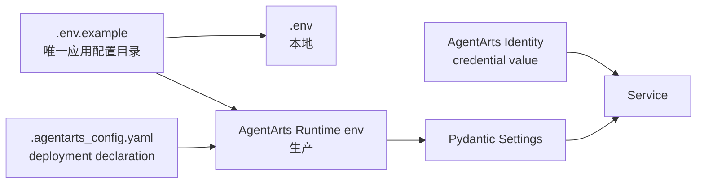

# AgentArts Deployment Runbook

> 当前配置架构基线：2026-06-19，Refactor 10。

## 1. 配置入口与边界



- 配置应用：从 `personal-assistant-service/.env.example` 开始
- 本地：复制为 `.env`
- 生产：通过 AgentArts Runtime / CI/CD 注入同名 canonical variables
- Secret：只配置在 AgentArts Identity
- `.agentarts_config.yaml`：管理 Runtime、Gateway、认证、可观测和 env mapping

禁止：

- 在 `.agentarts_config.yaml`、`.env` 或 repository 中写入真实 API Key
- 创建根目录应用配置 YAML
- 使用 legacy model variables、API-key environment variable 或 CORS variable
- 将 `.env` COPY 进 container image

## 2. Preflight

```bash
test -f personal-assistant-service/.env.example
test -f personal-assistant-service/.agentarts_config.yaml
test ! -f personal-assistant-service/config.yaml

cd personal-assistant-service
uv sync --frozen
uv run ruff check .
uv run pytest tests/
```

确认 `.agentarts_config.yaml`：

- `runtime.arch: arm64`
- `invoke_config.port: 8080`
- Gateway routing 与 current architecture 一致
- environment variable 只使用 `.env.example` 中的 canonical names
- 不包含 credential value

## 3. AgentArts Identity

在部署前创建或验证需要的 credential providers。

LLM 默认引用：

| Setting | Default |
|---------|---------|
| `LLM_PROVIDER` | `deepseek` |
| `LLM_MODEL` | `deepseek-v4-pro` |
| `LLM_CREDENTIAL_PROVIDER` | `DEEPSEEK_API_KEY` |

`DEEPSEEK_API_KEY` 在这里是 AgentArts Identity provider name。真实 DeepSeek API
Key 只存储在该 provider 中。

Outbound integrations：

| Integration | Provider name |
|-------------|---------------|
| GitHub | `github-provider` |
| Gitee | `GITEE_PROVIDER_NAME` Setting，默认 `gitee-provider` |
| Microsoft 365 | `m365-provider-common` |
| Huawei Cloud IAM | `IAM_USERS_PROVIDER_NAME` Setting，默认 `iam-users-readonly` |

## 4. Build

从 repository root 构建 ARM64 image：

```bash
docker build \
  --platform linux/arm64 \
  -f personal-assistant-service/Dockerfile \
  -t personal-assistant:latest \
  .
```

Dockerfile 只复制 dependency files、`app/` 和 `.agentarts_config.yaml`。不得复制
`.env` 或任何 Secret。

## 5. Deploy

```bash
cd personal-assistant-service
agentarts launch
```

部署完成后检查 Runtime 状态、image digest、CPU architecture 和日志。

## 6. Smoke Tests

### Health

```bash
curl https://<runtime-host>/ping
```

期望：

```json
{"status":"ok"}
```

### Invocation

通过 AgentArts 官方 invoke 能力或带合法认证的 same-origin proxy 调用
`POST /invocations`。验证：

- non-streaming JSON response
- streaming `text/event-stream`
- Gateway user/session headers 正确注入
- 日志中无 credential value

### Configuration failure

错误的 `LLM_PROVIDER`、非法 URL、非法 `LOG_LEVEL` 或同时设置
`POSTGRES_DSN`/`SQLITE_DB_PATH` 时，Service 必须 fail fast，并指出 canonical
variable name。

## 7. Rollback

1. 将 Runtime image 指回上一个已验证 digest
2. 恢复上一版本对应的 canonical Runtime Settings
3. 不恢复 legacy variables 或根目录配置文件
4. 重新执行 health、invocation 和 streaming smoke tests

## 8. Security Checklist

- [ ] repository、image layer 和 Runtime env 中无真实 API Key
- [ ] credential value 只存在于 AgentArts Identity
- [ ] `.env` 未提交、未复制进 image
- [ ] deployment env names 与 `.env.example` 一致
- [ ] Service 日志不输出 token、API Key 或完整 credential
- [ ] Web Chat 只通过 same-origin proxy 访问 Service
- [ ] FastAPI 未启用 CORS middleware
