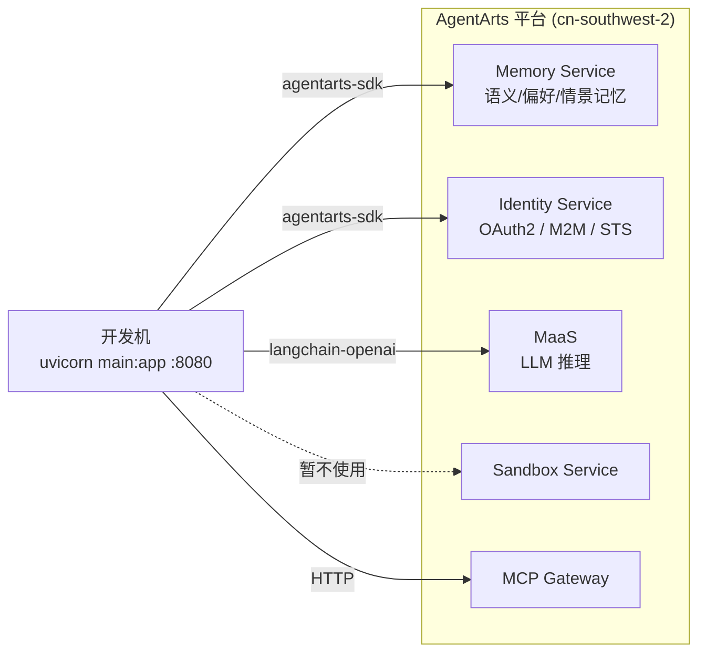

# DevOps — 开发环境

> 版本：v0.1 | 状态：Draft | 关联文档：`overall_architecture.md`

---

## 1. 本地开发模式

Personal Assistant 的本地开发不需要任何本地服务 Mock。所有后端能力（Memory、Identity、MaaS、Sandbox、MCP Gateway）均为 AgentArts 云端 API，通过 `agentarts-sdk` 网络调用。本地只需启动 FastAPI 即可。

### 1.1 依赖关系



### 1.2 网络要求

**核心前提：必须在华为内网环境。**

| 环境 | Memory | Identity | MaaS | 状态 |
|------|--------|----------|------|------|
| 办公室有线网络 | ✅ | ✅ | ✅ | 全功能 |
| 办公室 Wi-Fi (Huawei-Internal) | ✅ | ✅ | ✅ | 全功能 |
| VPN (AnyConnect / SecoClient) | ✅ | ✅ | ✅ | 全功能 |
| 家庭网络（无 VPN） | ❌ | ❌ | ❌ | 不可用 |
| 手机热点 | ❌ | ❌ | ❌ | 不可用 |

> 这不是平台绑定问题。所有云服务（AWS/GCP/Azure）都要求网络可达。AgentArts 服务的特殊性仅在于它们部署在华为云内网而非公网。

### 1.3 本地启动

```bash
# 1. 配置环境变量（从 AgentArts 控制台获取）
export MODEL_API_KEY="<MaaS API Key>"
export MODEL_NAME="deepseek-v4-pro"
export MODEL_URL="https://api.modelarts-maas.com/openai/v1"
export MEMORY_SPACE_ID="<Memory Space ID>"

# 2. 启动
cd personal-assistant
uvicorn app.main:app --port 8080 --reload
```

`--reload` 开启热重载，代码改动自动重启。

### 1.4 验证

```bash
# 健康检查
curl http://localhost:8080/ping
# → {"status": "ok"}

# 调用 Agent（非流式）
curl -X POST http://localhost:8080/invocations \
  -H "Content-Type: application/json" \
  -H "X-AgentArts-User-Id: dev-user" \
  -d '{"message": "你好"}'
# → {"response": "..."}
```

---

## 2. Identity 开发说明

### 2.1 Outbound 认证的预配置

Identity 的三种 Outbound 模式依赖 AgentArts 控制台预创建的 Credential Provider：

| Provider | 用途 | 认证模式 | 预配置内容 |
|----------|------|----------|-----------|
| `github-provider` | GitHub API | OAuth2 / USER_FEDERATION | GitHub OAuth App 的 client_id + client_secret |
| `m365-provider` | Microsoft 365 (Outlook/Calendar) | OAuth2 / USER_FEDERATION | Microsoft Entra ID 应用注册的 client_id + client_secret |
| `internal-api-provider` | 企业内部 API | API Key / M2M | API Key |
| `huaweicloud-sts-provider` | 华为云资源 | STS / M2M | Agency URN |

> 这些 Provider 在 AgentArts 控制台一次性创建，代码中通过 `provider_name` 引用。本地开发和云端部署共用同一套 Provider 配置。

### 2.2 首次使用 OAuth2 Provider 的授权

USER_FEDERATION 模式需要用户完成一次 OAuth 授权：

1. Agent 首次调用 `@require_access_token(provider_name="github-provider", ...)` 时，Identity Service 发现用户未授权
2. 返回 OAuth 授权 URL
3. 用户在浏览器中完成授权
4. 后续调用自动使用刷新后的 token

> 开发阶段可用 API Key（`key_auth`）方式绕过 OAuth，直接在 `agentarts_config.yaml` 中配置。

---

## 3. Memory 开发说明

### 3.1 Memory Space 创建

```bash
# 在 AgentArts 控制台创建 Memory Space，获取 Space ID
# Space ID 格式：xxxxxxxx-xxxx-xxxx-xxxx-xxxxxxxxxxxx
export MEMORY_SPACE_ID="<your-space-id>"
```

一个 Personal Assistant 实例对应一个 Memory Space。开发环境和生产环境可以使用不同的 Space。

### 3.2 记忆生成延迟

AgentArts Memory 的记忆抽取是异步的。文档示例中使用 **30s 等待** 确保记忆生成完成。开发时如果发现刚保存的记忆查不到，这是正常行为。

---

## 4. 环境变量一览

| 变量 | 必需 | 说明 | 获取方式 |
|------|------|------|----------|
| `MODEL_API_KEY` | ✅ | MaaS API Key | AgentArts 控制台 → MaaS → 服务详情 |
| `MODEL_NAME` | ✅ | 模型名称 | MaaS 模型广场 |
| `MODEL_URL` | ✅ | MaaS API 端点 | `https://api.modelarts-maas.com/openai/v1` |
| `MEMORY_SPACE_ID` | ✅ | Memory Space ID | AgentArts 控制台 → Memory |
| `HUAWEICLOUD_SDK_AK` | ⚠️ | 华为云 AK | IAM 控制台（使用 Identity SDK 时需要） |
| `HUAWEICLOUD_SDK_SK` | ⚠️ | 华为云 SK | IAM 控制台（使用 Identity SDK 时需要） |

---

## 5. 常见问题

### Q: 本地启动后 `/invocations` 返回 500？

检查：MaaS API Key 是否有效、网络是否在华为内网、`MEMORY_SPACE_ID` 是否正确。

### Q: GitHub 工具调用失败？

检查 `github-provider` 是否在 AgentArts 控制台正确创建，OAuth 授权是否完成。

### Q: 在家无法开发怎么办？

连接公司 VPN（AnyConnect / SecoClient）后即可正常开发。VPN 连通后所有 AgentArts 服务可达。
