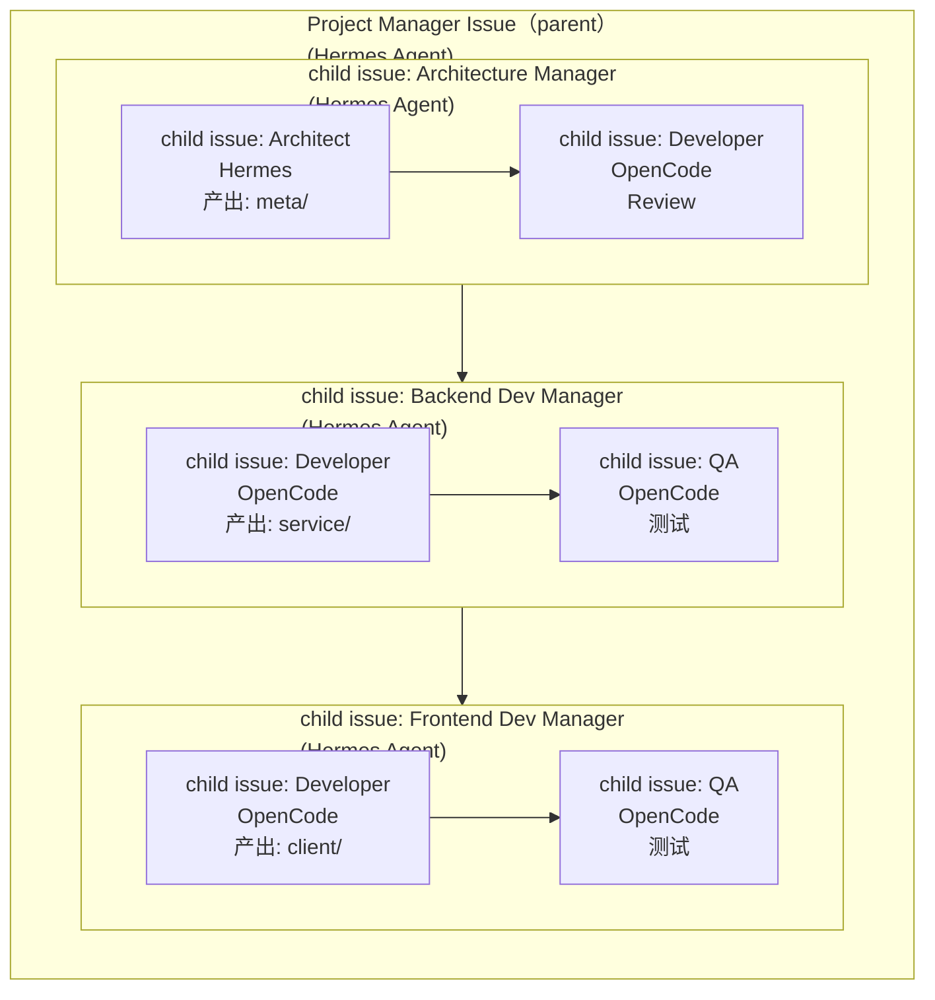

# DevOps — Coding Agent 最佳实践（Multica 适配版）

本文档面向 Multica 平台的 CEO Agent，定义 Personal Assistant 项目所需的 coding agent 团队结构，以及每个角色的职责划分和管辖范围。

Multica 使用 parent-child issue 关系替代 sub-issue。每个 manager 创建独立 parent issue，内部通过 child issue 分配给执行角色。

## 角色

### 1. Project Manager
- 运行载体：Hermes Agent
- 负责所有 manager 相关任务的派发与最终验收

instructions：
  1. 创建 child issue 分配给 Architecture Manager
  2. Architecture Manager 完成后，创建 child issue 分配给 Backend Dev Manager
  3. Backend Dev Manager 完成后，创建 child issue 分配给 Frontend Dev Manager
  4. 任一步骤验收不通过时，重新按照上面的步骤顺序发起下一轮迭代，直至通过

### 2. Architecture Manager
- 运行载体：Hermes Agent
负责架构设计相关任务的派发与验收。

instructions：
1. 创建 child issue 分配给 Architect，完成架构设计，产出落在 `personal-assistant-meta` 目录下
2. Architect 完成后，创建 child issue 分配给 Developer 进行 review
3. 验收不通过时，重新按照上面的步骤顺序发起下一轮迭代，直至通过

### 3. Backend Dev Manager
- 运行载体：Hermes Agent
负责后端开发任务的派发与验收。

instructions：
1. 创建 child issue 分配给 Developer，完成后端代码开发，产出落在 `personal-assistant-service` 目录下
2. Developer 完成后，创建 child issue 分配给 QA 进行测试
3. 验收不通过时，重新按照上面的步骤顺序发起下一轮迭代，直至通过

### 4. Frontend Dev Manager
- 运行载体：Hermes Agent
负责前端开发任务的派发与验收。

instructions：
1. 创建 child issue 分配给 Developer，完成前端代码开发，产出落在 `personal-assistant-client` 目录下
2. Developer 完成后，创建 child issue 分配给 QA 进行测试
3. 验收不通过时，重新按照上面的步骤顺序发起下一轮迭代，直至通过

### 5. Architect
- 运行载体：Hermes Agent
- instructions: 专职架构设计

### 6. Developer
- 运行载体：OpenCode
- instructions: 专职代码开发

### 7. QA
- 运行载体：OpenCode
- instructions: 专职代码测试

## 工作流程理念

本质上是多层嵌套的控制回路（control loop）：

- 每一个 manager 都是一个独立的控制回路，不断循环重复，直至验收通过
- 验收不通过 → 重新走一遍自己管辖的步骤 → 再次验收 → 重复，直到通过

## 与 Paperclip 的差异

| 维度 | Paperclip | Multica |
|------|-----------|---------|
| Issue 组织方式 | sub-issue（父子 issue 属于同一 issue 树） | parent-child issue（各自独立 issue，通过 parent 链接） |
| Manager issue | 所有 manager 作为父 issue 的 sub-issue | 每个 manager 拥有独立 parent issue |
| 工作流 | 串行：Architecture → Backend → Frontend | 串行：Architecture → Backend → Frontend（相同） |

## Control Loop 全景图

