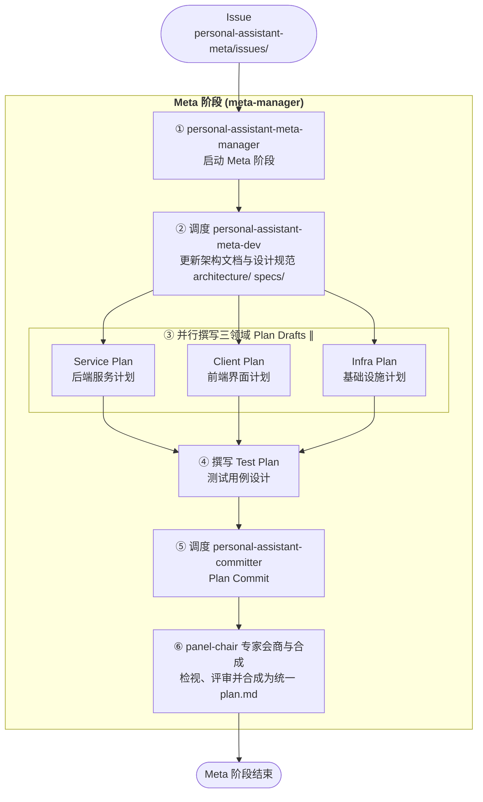
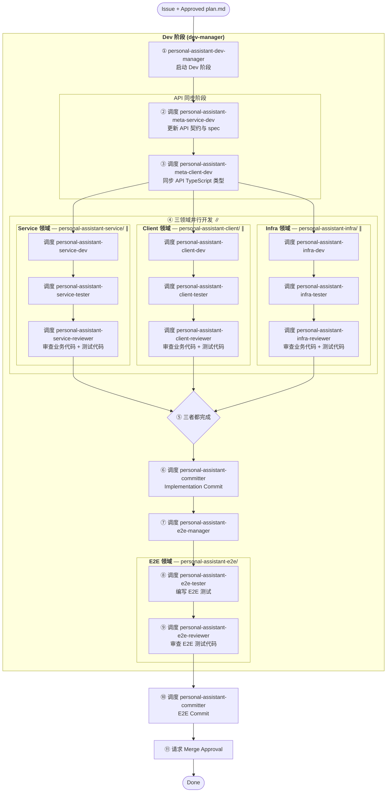

# OpenCode Agent Workflow — Tree-Structured with Control Loops

## Overview

OpenCode sub-agent 工作流采用 **三层树状结构**。工作流是 **Issue 驱动的**——输入是 `personal-assistant-meta/issues/` 下的一个 Issue，输出是 Mono-Repo 内的完整实现。

与 AnyWear 的关键区别：**单仓库**（无 Git Submodule）。四个领域对应四个目录：`personal-assistant-meta/`、`personal-assistant-service/`、`personal-assistant-client/`、`personal-assistant-infra/`，共享同一个 Git 仓库和分支。

核心设计：

1. **两阶段架构设计**：整个开发流水线分为 **Meta 阶段** 和 **Dev 阶段**，分别由 **`personal-assistant-meta-manager`** 和 **`personal-assistant-dev-manager`** 独立调度。不再存在单一顶层 `personal-assistant-manager`，中间通过物理的 Plan Approval Gate 作为隔离。
2. **每个领域 Manager 跑独立的 Control Loop**：领域 Manager 在自己的领域内调度 Dev → Tester → Reviewer，根据反馈决定通过还是重来。Reviewer 先审查业务代码，再审查 Tester 产出的测试代码，确保一次 review 覆盖全部产出。
3. **层级化决策**：`personal-assistant-meta-manager` 负责设计计划的闭环，`personal-assistant-dev-manager` 负责开发交付阶段的统筹和 E2E 验证，领域 Manager 管自己领域内的局部实现质量。
4. **统一 Committer**：所有 Git 提交由 `personal-assistant-committer` 执行，分别在 Plan 完成后（Plan Commit）、Service/Client/Infra 交付后（Implementation Commit）、以及 E2E 通过后（E2E Commit）这三个检查点统一执行，领域 loop 内部不再进行局部提交。
5. **E2E Control Loop**：`personal-assistant-e2e-manager` 管理 E2E 测试的质量闭环，调度 `personal-assistant-e2e-tester` 编写测试 → `personal-assistant-e2e-reviewer` 审查测试代码。

## Agent 组织结构

四个领域与目录一一对应：`personal-assistant-meta/`、`personal-assistant-service/`、`personal-assistant-client/`、`personal-assistant-infra/`。

```mermaid
graph TD
    MM["<b>personal-assistant-meta-manager</b><br/>Meta Phase Orchestrator<br/>架构更新 · 计划设计 · 专家评审"]
    DM["<b>personal-assistant-dev-manager</b><br/>Dev Phase Orchestrator<br/>API 契约更新 · 领域实现 · E2E 闭环"]
    AM_C["<b>personal-assistant-committer</b><br/>统一提交<br/>git add 全仓库"]
    HUMAN["👤 Human in the Loop<br/>Plan Approval Gate"]

    subgraph META["<b>Meta 领域</b> — personal-assistant-meta/"]
        MD["personal-assistant-meta-dev<br/>架构更新与并行分部计划撰写<br/>(Service/Client/Infra/Test)"]
        PC["<b>panel-chair</b><br/>专家评审面板<br/>检视、评审并合成 Plan"]
    end

    subgraph SERVICE["<b>Service 领域</b> — personal-assistant-service/"]
        SM["<b>personal-assistant-service-manager</b><br/>领域 Orchestrator"]
        SD["personal-assistant-service-dev<br/>后端功能实现"]
        ST["personal-assistant-service-tester<br/>单元测试 · 集成测试"]
        SR["personal-assistant-service-reviewer<br/>后端代码审查"]
    end

    subgraph CLIENT["<b>Client 领域</b> — personal-assistant-client/"]
        CM["<b>personal-assistant-client-manager</b><br/>领域 Orchestrator"]
        CD["personal-assistant-client-dev<br/>前端功能实现"]
        CT["personal-assistant-client-tester<br/>单元测试 · 集成测试"]
        CR["personal-assistant-client-reviewer<br/>前端代码审查"]
    end

    subgraph INFRA["<b>Infra 领域</b> — personal-assistant-infra/"]
        IM["<b>personal-assistant-infra-manager</b><br/>领域 Orchestrator"]
        ID["personal-assistant-infra-dev<br/>IaC 实现 (HCL)"]
        IT["personal-assistant-infra-tester<br/>cdktf synth · 测试"]
        IR["personal-assistant-infra-reviewer<br/>IaC 代码审查"]
    end

    subgraph E2E["<b>E2E 领域</b> — personal-assistant-e2e/"]
        EM["<b>personal-assistant-e2e-manager</b><br/>领域 Orchestrator<br/>E2E 测试闭环"]
        ET["personal-assistant-e2e-tester<br/>端到端联调测试<br/>跨 Service + Client"]
        ER["personal-assistant-e2e-reviewer<br/>E2E 测试审查"]
    end

    subgraph DEV_API["<b>API 阶段 (Dev 开头)</b>"]
        SD_API["personal-assistant-meta-service-dev<br/>API 接口更新"]
        CD_API["personal-assistant-meta-client-dev<br/>API 类型同步"]
    end

    MM --> MD
    MM --> PC
    MM --> AM_C
    MM -.-> HUMAN

    DM --> SD_API
    DM --> CD_API
    DM --> SM
    DM --> CM
    DM --> IM
    DM --> EM
    DM --> AM_C

    SD_API --> CD_API

    SM --> SD
    SM --> ST
    SM --> SR

    CM --> CD
    CM --> CT
    CM --> CR

    IM --> ID
    IM --> IT
    IM --> IR

    EM --> ET
    EM --> ER
```



共 26 个 Agent。Meta 领域下的 personal-assistant-meta-service-dev / personal-assistant-meta-client-dev 移动到了 Dev 阶段的开头，但它们与 Service/Client 领域下的同名 Agent 仍是**不同实例**，前者只做 API 同步，后者只做功能开发。E2E 领域独立构成 control loop：personal-assistant-e2e-manager 调度 personal-assistant-e2e-tester 编写测试、personal-assistant-e2e-reviewer 审查测试代码。Issue Analyzer 独立负责 issue 分析/创建/更新，通过三个不同模型的咨询 sub-agent 获取多角度建议。

### 与 AnyWear 的结构差异

| | AnyWear | personal-assistant |
|---|---|---|
| 仓库模型 | Root + 3 Submodule | 单仓库，3 个目录 |
| Agent 总数 | 19 | 22（统一 Committer + E2E Manager + E2E Reviewer） |
| 分支管理 | 4 个 repo 需同步分支 | 1 个分支 |
| Commit 方式 | 每个 submodule 独立 commit | 统一 Committer 在三阶段完成后执行对应的 commit |
| Commit 时机 | 每个领域 loop 内各自 commit | Plan 完成、所有开发领域完成、以及 E2E 完毕后统一 commit |
| Meta Commit | — | Meta 阶段完成并输出 plan.md 后进行 Plan Commit (`plan:`) |
| API 同步 | Service 生成 spec → Client 拉 submodule | Service 生成 spec → Client 直接引用（同仓库） |
| Merge | 递归 merge（submodule 先，root 后） | 单次 `git merge` |

## 执行顺序（Happy Path）

**相同序号 = 并行执行**。整个流水线显式拆分为 **Meta 阶段**（由 `personal-assistant-meta-manager` 管理）与 **Dev 阶段**（由 `personal-assistant-dev-manager` 管理）。

### 1. Meta 阶段流程图（meta-manager）

首先更新 architecture 架构文件与 specs 业务设计规范（主要是 `personal-assistant-meta/specs/` 目录下的业务/技术规格书与领域词典）；随后 Service Plan、Client Plan、Infra Plan 三个计划并行编写；在前三者完成后再编写 Test Plan。一旦所有的分部计划编写完毕，在 `panel-chair` 会商合成之前，**立即调度 Committer 执行 Plan Commit**，确保专家面板评审的是已经被版本化管理的确定产物。最后由 `panel-chair` 进行会商并合成最终的 `plan.md`。



### 2. Dev 阶段流程图（dev-manager）

进入开发阶段，首先执行 API 接口契约更新及 TypeScript 类型同步。之后启动 Service, Client, Infra 三领域的并行开发。开发完成后进行统一的 Implementation Commit，最后进入 E2E 验证、E2E Commit 及请求 Merge。



**与 AnyWear 执行顺序的差异**：

- **两阶段物理隔离**：摒弃了单一的顶层 manager。整个流程切分为 Meta 阶段（由 `personal-assistant-meta-manager` 管理）和 Dev 阶段（由 `personal-assistant-dev-manager` 管理），由两阶段独立调度。
- **架构文档与设计规范在 Plan 前更新**：要求在撰写具体实现计划前，先由 `meta-dev` 更新 `personal-assistant-meta/architecture/` 下的架构文件以及 `personal-assistant-meta/specs/` 下的业务与技术规格书，确保后续计划有高保真的设计依据。
- **分部计划串并行**：仅让 Service、Client、Infra Plan 并行设计，随后在前三者产出后再由 `meta-dev` 撰写 Test Plan，提高测试用例设计的准确性。
- **Plan Commit 纳入 Control Loop**：步骤 ⑤ 的 Plan Commit 动作移至了 Test Plan 完成后、`panel-chair` 会商合成之前。这使得专家评审面板拿到的直接就是已经提交到 feature branch 上的版本化草稿，提高了评审和版本锁定的严密性。
- **API 同步移动 to Dev 阶段**：原在 Meta 阶段（对实际代码文件产生修改），现移动到 Dev 阶段的开头，使 Meta 阶段真正做到"设计不落地、代码零修改"，所有实际代码改动均局限在 Dev 阶段内部。
- **E2E 联调与提交**：开发都完成后进行一次 Implementation Commit 再开始联调，E2E review 通过后再进行 E2E Commit。

## Control Loop

### 领域 Control Loop（Service / Client / Infra）

每个领域 Manager 内部跑 control loop：Dev → Tester → Reviewer。Manager 不写代码，只做调度和决策。**领域 loop 内不再包含 commit 步骤**——commit 由顶层的 `personal-assistant-committer` 在三个检查点执行：Meta 完成后（Plan Commit）、所有领域完成后（Implementation Commit）、E2E review 通过后（E2E Commit）。

Reviewer 的审查分两阶段：（1）先审查 Dev 产出的业务代码；（2）再审查 Tester 产出的测试代码。一次 review 覆盖全部产出，避免 review 遗漏测试代码。Reviewer 还需**审计 Tester 移除的 stale 测试**——Tester 负责识别并移除当前 issue 范围内不再有意义的测试，Reviewer 确保没有误删正确测试。

Tester 报告失败时，Manager 做三级决策：

| 测试结果 | Manager 决策 | 动作 |
|----------|-------------|------|
| 实现 bug（空指针、类型错误等） | 可修复 | 带错误信息回退到 Dev |
| 设计缺陷（API 语义不对等） | 需重新设计 | 上报 personal-assistant-dev-manager，等 Meta 侧调整 |
| 非阻塞问题（覆盖率略低等） | 接受 | 记录 known issue，验收通过 |

### E2E Control Loop

personal-assistant-e2e-manager 管理 E2E 领域的质量闭环：调度 personal-assistant-e2e-tester 编写 E2E 测试 → personal-assistant-e2e-reviewer 审查测试代码。E2E-Manager 的决策逻辑与领域 Manager 一致：Tester 产出后 Reviewer 审查，Reviewer 发现问题时 Manager 根据问题类型决定回退 Tester 修复或上报 personal-assistant-dev-manager。Tester 负责识别并移除当前 issue 范围内不再有意义的回归测试，Reviewer 审计确保无误删。

## Exceptional Control Flow

所有 Agent（包括 Worker 和 Manager）在遇到超出自身决策权限 of 异常时，都应上报而非自行处理。上报链路逐级向上，**Human 是整条链的根节点**——任何一层无法解决的异常最终都会到达 Human。

**Meta 阶段上报链路**：
```
Worker (meta-dev / panel-chair)
  → personal-assistant-meta-manager
    → 👤 Human (root)
```

**Dev 阶段上报链路**：
```
Worker (Dev / Reviewer / Tester / Committer / E2E-Tester / E2E-Reviewer)
  → Domain Manager (Service / Client / Infra / E2E)
    → personal-assistant-dev-manager
      → 👤 Human (root)
```

**Worker 是第一道防线**——他们是实际执行者，最先接触异常。Worker 不判断是否"值得上报"，只要遇到 scope 之外的问题就上报给直属 Manager。Manager 再根据自身决策权限决定闭环还是继续上报。

### 各级处置权限

| 层级 | 可自行处理 | 需上报 |
|------|-----------|--------|
| Worker | 自身职责范围内的实现/审查/测试 | 任何超出 scope 的异常、不确定项、或需要跨 Agent 协调的问题 |
| Domain Manager | 领域内的三级决策：回退 Dev 修复、接受 known issue | 跨领域影响、设计缺陷、API 语义错误、自身 loop 内无法闭合的问题 |
| personal-assistant-meta-manager | Meta 阶段内各分部计划的调整与重新分配 | 设计矛盾、需求冲突、需要 Human 裁决的事项（例如方案重大调整） |
| personal-assistant-dev-manager | 跨领域的协调和重新分配、异常重试、测试决策 | 需要 Human 输入或裁决的事项（需求模糊、约束冲突、合并决策） |

### 上报规范

Manager 收到子 Agent 的异常报告后，先判断是否在自身决策权限内：

1. **可处理**：在自己的 control loop 内闭环（回退 Dev 修复、接受 non-blocking issue、重新分配任务等），无需上报。
2. **超出权限**：整理上下文后上报给直属上级。上报内容应包含：原始异常、已尝试的处理步骤、以及需要上级决策的具体问题。

各级 Manager 的 agent 文件中"Decision Authority"表格的 `Escalate` 行即对应各自的上报触发条件。

## Committer 规范（Mono-Repo 三检查点提交）

`personal-assistant-committer` 是**唯一的提交 Agent**，分别由 `personal-assistant-meta-manager`（第 ① 检查点）及 `personal-assistant-dev-manager`（第 ②、③ 检查点）进行调度：

| 检查点 | 调用时机 | Commit 消息前缀 | 内容 |
|--------|---------|---------------|------|
| Plan Commit | Meta 阶段完成后，Human 评审前 | `plan:` | Implementation Plan + 架构更新设计 |
| Implementation Commit | Service、Client、Infra 都完成后，E2E 测试前 | `feat:` / `fix:` / `refactor:` | 完整实现（API 契约 + 后端 + 前端 + Infra） |
| E2E Commit | E2E review 通过后，Merge Approval 前 | `test:` | E2E 测试代码 |

Plan Commit 和 Implementation Commit 时 Committer `git add` 全部四个目录（`personal-assistant-meta/` + `personal-assistant-service/` + `personal-assistant-client/` + `personal-assistant-infra/`）。E2E Commit 时额外 `git add personal-assistant-e2e/`，将 E2E 测试代码纳入版本控制。

**设计理由**：

- **Plan Commit**：将设计架构文件和计划版本化后再进入 Human 评审，用户看到的是已提交的确定版本，评审反馈有明确的 commit 锚点。
- **Implementation Commit**：一次 commit 包含完整的 feature 变更（设计文档 + 契约代码 + 后端 + 前端 + Infra），便于 code review 和回滚。
- **去耦合**：领域 Manager 不再关心 Git 操作，专注于自己的质量控制。
- **简化**：从 3 个 Committer 合并为 1 个，减少 Agent 数量和协调复杂度。

不再有 per-domain Committer，也不再需要 Root Committer（无 submodule pointer 需要跟踪）。

## Agent Permissions

### 权限模型

OpenCode 子代理采用**完全隔离模型**：subagent 不从父 Agent 继承任何权限、tools、session state 或数据。所有能力必须在 agent 声明文件（`.opencode/agents/*.md`）中通过 `permission` 字段显式授予。

**动态叠加机制**：Manager 通过 `delegate_task` 启动 subagent 时，可传入 `task_permissions` 临时追加权限。追加的权限在任务结束时自动收回。Agent 声明文件中应配置**最小必要权限**作为基线，Manager 按需叠加。

### 权限配置格式

```yaml
# 全局允许（Agent frontmatter）
permission:
  edit: allow
  bash: allow

# 细粒度控制（支持 pattern matching）
permission:
  bash:
    "*": ask           # 所有命令需确认
    "git *": allow     # git 命令直接允许
    "git push *": deny # 禁止 git push
  edit:
    "*": deny
    "packages/web/src/**/*.tsx": allow
```

值：`allow`（直接允许）、`ask`（需用户确认）、`deny`（禁止）。

### 可用工具权限 Key

除 `task`、`edit` 、`bash`、`skill` 外，还支持以下工具权限：

| 权限 Key | 工具 | 说明 | 前置条件 |
|----------|------|------|---------|
| `webfetch` | WebFetch | 抓取 URL 内容，支持 HTML/Text/Markdown 格式 | 无 |
| `websearch` | WebSearch | 网络搜索 | 需设置环境变量 `OPENCODE_ENABLE_EXA=1`，否则 websearch 不可用 |

其他未列出的内置工具（如 `read`、`grep`、`glob`、`write`、`question`）为所有 subagent 默认可用，无需显式声明。

### 完整权限矩阵（22 个 Agent）

| Agent | task | edit | bash | skill | todowrite | webfetch | websearch | 设计理由 |
|-------|:----:|:----:|:----:|:-----:|:---------:|:--------:|:---------:|---------|
| `personal-assistant-meta-manager` | allow | — | allow | — | allow | — | — | Meta 阶段 Orchestrator；bash 用于 `git checkout` |
| `personal-assistant-dev-manager` | allow | — | allow | — | allow | — | — | Dev 阶段 Orchestrator；bash 用于 `git checkout`/`git merge` |
| `personal-assistant-meta-dev` | — | allow | — | — | — | allow | allow | 架构更新与撰写 plan.md，需要写文件；webfetch/websearch 用于引用外部文档 |
| `panel-chair` | allow | allow | allow | allow | allow | allow | allow | 专家评审面板主席。task 用于调度各模型 panelist；edit/bash/skill 用于 panelist-hermes 做本地代码/命令执行及合成最终 plan.md |
| `personal-assistant-meta-service-dev` | — | allow | allow | — | — | — | — | 更新 API schema（edit）+ 生成 OpenAPI spec（bash） |
| `personal-assistant-meta-client-dev` | — | allow | allow | — | — | — | — | 生成 TypeScript 类型（bash）+ commit（bash） |
| `personal-assistant-service-manager` | allow | — | — | — | allow | — | — | 纯调度 |
| `personal-assistant-service-dev` | — | allow | allow | — | — | — | — | 写后端代码 + 运行 type check/test/commit |
| `personal-assistant-service-reviewer` | — | deny | — | — | — | — | — | 审查业务代码 + 测试代码；审计 stale 测试移除 |
| `personal-assistant-service-tester` | — | allow | allow | — | — | — | — | 写测试文件、移除 stale 测试（reviewer 审计）+ 运行 pytest/mypy |
| `personal-assistant-client-manager` | allow | — | — | — | allow | — | — | 纯调度 |
| `personal-assistant-client-dev` | — | allow | allow | — | — | — | — | 写前端代码 + 运行 tsc/lint/test/commit |
| `personal-assistant-client-reviewer` | — | deny | — | — | — | — | — | 审查业务代码 + 测试代码；审计 stale 测试移除 |
| `personal-assistant-client-tester` | — | allow | allow | — | — | — | — | 写测试文件、移除 stale 测试（reviewer 审计）+ 运行 tsc/lint/test/build |
| `personal-assistant-infra-manager` | allow | — | — | — | allow | — | — | 纯调度 |
| `personal-assistant-infra-dev` | — | allow | allow | — | — | — | — | 写 CDKTF 代码 + 运行 cdktf synth/commit |
| `personal-assistant-infra-reviewer` | — | deny | — | — | — | — | — | 审查业务代码 + 测试代码；审计 stale 测试移除 |
| `personal-assistant-infra-tester` | — | allow | allow | — | — | — | — | 写测试文件、移除 stale 测试（reviewer 审计）+ 运行 jest/cdktf/tsc |
| `personal-assistant-committer` | — | deny | allow | — | — | — | — | bash 用于 git 操作；显式 deny edit 防止意外修改源码 |
| `personal-assistant-e2e-manager` | allow | — | — | — | allow | — | — | 纯调度，管理 E2E Tester → Reviewer 闭环 |
| `personal-assistant-e2e-tester` | — | allow | allow | allow | — | — | — | primary agent（mode: all），需要完整工具链；skill 用于加载 hermes-e2e-testing。负责 E2E 测试编写、执行及移除 stale 测试（reviewer 审计） |
| `personal-assistant-e2e-reviewer` | — | deny | — | — | — | — | — | 审查 E2E 测试代码；审计 stale 测试移除 |
| `personal-assistant-issue-analyzer` | allow | allow | — | — | allow | allow | allow | 管理 issue；task 用于 delegate 咨询 sub-agent；edit 用于创建/更新 issue 文件；webfetch/websearch 用于外部参考 |
| `personal-assistant-issue-analyzer-deepseek` | — | — | — | — | — | allow | allow | 纯咨询，只读。webfetch/websearch 用于外部文档 |
| `personal-assistant-issue-analyzer-gemini` | — | — | — | — | — | allow | allow | 纯咨询，只读。webfetch/websearch 用于外部文档 |
| `personal-assistant-issue-analyzer-gpt` | — | — | — | — | — | allow | allow | 纯咨询，只读。webfetch/websearch 用于外部文档 |

### 按角色分类

| 角色 | 必须权限 | 典型 deny | 说明 |
|------|---------|----------|------|
| Manager（Orchestrator） | `task: allow` | — | 只调度，不操作文件和命令 |
| Dev（实现者） | `edit: allow`, `bash: allow` | — | 写代码 + 运行命令 |
| Reviewer（审查者） | — | `edit: deny` | 审查业务代码 + 测试代码；审计 stale 测试移除，防止误删 |
| Tester（测试者） | `edit: allow`, `bash: allow` | — | 写测试文件、移除 stale 测试 + 运行测试套件 |
| Committer（提交者） | `bash: allow` | `edit: deny` | `git add/commit/push`，禁止修改源码 |
| E2E Tester（端到端测试） | `edit: allow`, `bash: allow`, `skill: allow` | — | primary agent，完整工具链。负责 E2E 测试编写、执行及移除 stale 测试（reviewer 审计） |

### 权限审计经验

**问题来源**：reviewer 有 `edit: deny`（保护性约束），但 dev 和 tester 长期缺少显式权限声明。subagent 的"完全隔离"默认可能导致静默失败——agent 以为自己能写文件，实际被 deny。

**审计方法**：

1. 逐 agent 检查职责 → 列出所需操作 → 对照 permission block
2. 用 script 批量 grep `permission:` 字段，确保 22 个 agent 都有显式声明
3. 修改后验证：每个 agent 文件 frontmatter 中必须存在 `permission:` 块

**常见遗漏**：
- Dev agent 缺 `bash: allow`（能写代码但不能跑编译/测试/commit）
- Tester agent 缺 `bash: allow`（能写测试但不能跑测试套件）
- Committer 缺 `edit: deny`（无约束，可能意外修改源码）
- Top-level Manager 缺 `bash: allow`（无法执行 git checkout/merge）

**验证脚本**（bash 一行）：

```bash
for f in .opencode/agents/*.md; do
  name=$(basename "$f" .md)
  if grep -q "^permission:" "$f"; then
    echo "$name: $(grep -A5 '^permission:' "$f" | head -6 | tail -5 | tr '\n' ' ')"
  else
    echo "$name: NO PERMISSION BLOCK"
  fi
done
```

### 设计理由

- **显式优于隐式**：每个 subagent 必须声明权限，不依赖默认值。避免"以为有权限、实际没有"的静默失败。
- **最小权限原则**：agent 声明只包含其核心职责所需的最小权限集。Manager 在 delegate 时按需通过 `task_permissions` 追加，任务结束自动收回。
- **Reviewer `edit: deny`**：从技术上防止 Reviewer 越权修改 Dev 的产出。这不只是语义约束，而是权限级别的硬阻断。
- **Committer `edit: deny`**：Committer 的唯一职责是 `git add/commit/push`，显式 deny edit 防止意外修改源码文件。
- **Manager `task: allow`**：Manager 只调度 sub-agent，`task: allow` 显式授权 delegate 能力。Manager 自身不需要 `edit` 或 `bash`（除顶层 Manager 需要 bash 做 git 操作外）。

## E2E 领域

personal-assistant-e2e-manager 管理 E2E 测试的质量闭环，调度 personal-assistant-e2e-tester 编写 E2E 测试 → personal-assistant-e2e-reviewer 审查测试代码。E2E 领域与其他四个领域并行存在，在 Implementation Commit（步骤 ⑬）之后执行。

personal-assistant-e2e-tester 与领域 Tester（personal-assistant-service-tester / personal-assistant-client-tester / personal-assistant-infra-tester）定位不同：

| | 领域 Tester | personal-assistant-e2e-tester |
|---|---|---|
| 测试范围 | 单个目录 | 跨目录（Service + Client 联调） |
| 测试类型 | 单元测试、内部集成测试 | 端到端场景测试 |
| 运行方式 | 直接跑测试套件 | 调用 Hermes 启动完整环境后执行 |
| 调度者 | 领域 Manager | personal-assistant-e2e-manager |
| Agent 类型 | subagent | primary agent |

personal-assistant-e2e-reviewer 审查 E2E 测试代码，确保测试覆盖和代码质量。其权限与领域 Reviewer 一致（`edit: deny`），只检查报告，不修改被审查内容。

## Agent 编写规范

以下规范来自 AnyWear 的实践经验，Agent 文件和本文档应保持一致。

### 知识边界 — Orchestrator 只知道直属下级

每个 Manager（Orchestrator）的 agent 文件只描述：

- **自己的直属下级**（委托给哪些 agent）
- **给什么输入、期望什么输出**
- **自己做什么决策**（三级决策表）

**不应出现**的内容：
- 下级 Manager 的内部 worker 结构（Dev/Reviewer/Tester 列表）
- 下级 Manager 的内部控制回路细节
- 具体命令（`pytest`、`npm run build` 等）—— 这些属于 worker 的 agent 文件

| 层级 | 应该知道 | 不应该知道 |
|------|---------|-----------|
| personal-assistant-meta-manager | 3 个直属：personal-assistant-meta-dev、panel-chair、personal-assistant-committer | personal-assistant-meta-dev 具体怎么撰写各个分部计划 |
| personal-assistant-dev-manager | 7 个直属：personal-assistant-meta-service-dev (API)、personal-assistant-meta-client-dev (API)、service/client/infra-manager、e2e-manager、committer | personal-assistant-service-manager 内部有 personal-assistant-service-dev/tester 等 |
| personal-assistant-service-manager | 3 个直属：personal-assistant-service-dev/personal-assistant-service-tester/personal-assistant-service-reviewer | Tester 跑 `pytest` 还是 `pytest --cov` |
| personal-assistant-client-manager | 3 个直属：personal-assistant-client-dev/personal-assistant-client-tester/personal-assistant-client-reviewer | Tester 跑 `vitest` 还是 `jest` |
| personal-assistant-infra-manager | 3 个直属：personal-assistant-infra-dev/personal-assistant-infra-tester/personal-assistant-infra-reviewer | Tester 跑 `cdktf synth` 还是 `cdktf deploy` |
| personal-assistant-e2e-manager | 2 个直属：personal-assistant-e2e-tester/personal-assistant-e2e-reviewer | Tester 具体怎么运行 E2E 测试套件 |

### 每个 delegate 必须声明 input 和 return

无论是图中还是文字描述，每次委托调用都应明确：

```
delegate(AgentName)
  input: 具体参数列表
  returns: 返回值描述
```

Pipeline 图中用 `-- "returns: xxx" -->` 标注返回值。Delegation Reference 表格用 `input → returns output` 格式。

**检查方法**：分别从 `personal-assistant-meta-manager` 与 `personal-assistant-dev-manager` 开始，逐层追踪每个 delegate 的 input 来源（上一层的 return）和 return 去向（下一层的 input），不能有断链。

### 模式声明 — 同类型 Worker 的不同模式

当同一个 Worker 概念存在多个实例（如 personal-assistant-meta-service-dev 在 Meta 领域做 API 同步、personal-assistant-service-dev 在 Service 领域做功能开发），Manager 委托时必须明确声明 **mode**：

```
Delegate to `personal-assistant-meta-service-dev` in **API sync mode**:
  - explicit scope: update API contracts only. No feature logic.

Delegate to `personal-assistant-service-dev` in **feature development mode**:
  - explicit scope: full backend implementation.
```

Worker 的 agent 文件也应明确自己的 scope 边界（DO / DO NOT 表）。

### task_id 复用 — OpenCode Subagent 上下文保持

OpenCode 的 subagent 模型是**同步阻塞**的：Manager 调用 `delegate_task(goal, context)` 后阻塞等待，subagent 完成后返回结果和一个 `task_id`。

**基本规则**：

```
首次委托: delegate_task(goal, context)  → 返回 { result, task_id }
重复委托: delegate_task(goal, context, task_id=上次返回的)  → subagent 保留历史上下文
```

**Manager 文件中的写法**：每个 worker 的委托说明必须包含 `Record the returned task_id. Reuse on re-delegation.`

**层级隔离**：
- `personal-assistant-meta-manager` 与 `personal-assistant-dev-manager` 分别只跟踪其直属 Worker/Manager/Committer 的 `task_id`。
- 每个领域 Manager 跟踪自己 worker 的 `task_id`。
- 上层 Manager **不跟踪**下层 Manager 内部 worker 的 `task_id`。

### 图规范

**Happy Path 图**（执行顺序）：
- 只画正向流程，不画 reject/loop/回退路径
- 回退和异常处理在文字中描述
- 人类审批作为独立步骤编号（非菱形分支）
- 并行分支用 `├` `└` 和 `∥` 标注

**Pipeline 图**（Manager 内部）：
- 用函数调用风格：`delegate(Agent)`、`delegate_parallel()`、`merge()`
- 子图 `subgraph LOOP["loop body"]` 框出可重试区域
- 不在图中画循环箭头 —— Happy Path 是线性的

**组织结构图**（graph TD）：
- 纯树状 org chart，无流程箭头
- 领域间不画跨 subgraph 的箭头
- 同名 Worker 在不同 subgraph 内各自声明（不同实例）
- Human 节点用虚线边框区分

### 公共节点命名

| 图中节点 | 对应的 Agent 文件 |
|---------|------------------|
| personal-assistant-meta-manager | `personal-assistant-meta-manager.md` |
| personal-assistant-dev-manager | `personal-assistant-dev-manager.md` |
| personal-assistant-meta-dev | `personal-assistant-meta-dev.md` |
| panel-chair | `panel-chair.md` |
| personal-assistant-meta-service-dev（API） | `personal-assistant-meta-service-dev.md` |
| personal-assistant-meta-client-dev（API） | `personal-assistant-meta-client-dev.md` |
| personal-assistant-service-manager | `personal-assistant-service-manager.md` |
| personal-assistant-service-dev | `personal-assistant-service-dev.md` |
| personal-assistant-service-reviewer | `personal-assistant-service-reviewer.md` |
| personal-assistant-service-tester | `personal-assistant-service-tester.md` |
| personal-assistant-client-manager | `personal-assistant-client-manager.md` |
| personal-assistant-client-dev | `personal-assistant-client-dev.md` |
| personal-assistant-client-reviewer | `personal-assistant-client-reviewer.md` |
| personal-assistant-client-tester | `personal-assistant-client-tester.md` |
| personal-assistant-infra-manager | `personal-assistant-infra-manager.md` |
| personal-assistant-infra-dev | `personal-assistant-infra-dev.md` |
| personal-assistant-infra-reviewer | `personal-assistant-infra-reviewer.md` |
| personal-assistant-infra-tester | `personal-assistant-infra-tester.md` |
| personal-assistant-committer | `personal-assistant-committer.md` |
| personal-assistant-e2e-manager | `personal-assistant-e2e-manager.md` |
| personal-assistant-e2e-tester | `personal-assistant-e2e-tester.md` |
| personal-assistant-e2e-reviewer | `personal-assistant-e2e-reviewer.md` |
| personal-assistant-issue-analyzer | `personal-assistant-issue-analyzer.md` |
| personal-assistant-issue-analyzer-deepseek | `personal-assistant-issue-analyzer-deepseek.md` |
| personal-assistant-issue-analyzer-gemini | `personal-assistant-issue-analyzer-gemini.md` |
| personal-assistant-issue-analyzer-gpt | `personal-assistant-issue-analyzer-gpt.md` |

命名规则：`personal-assistant-{domain}-{role}.md`，domain ∈ {meta, service, client, infra, e2e}，role ∈ {manager, dev, reviewer, tester}。例外：`personal-assistant-committer.md`（统一 Committer，无 domain 限定）和 `personal-assistant-issue-analyzer*.md`（独立 issue 分析 Agent 及其咨询 sub-agent）。
