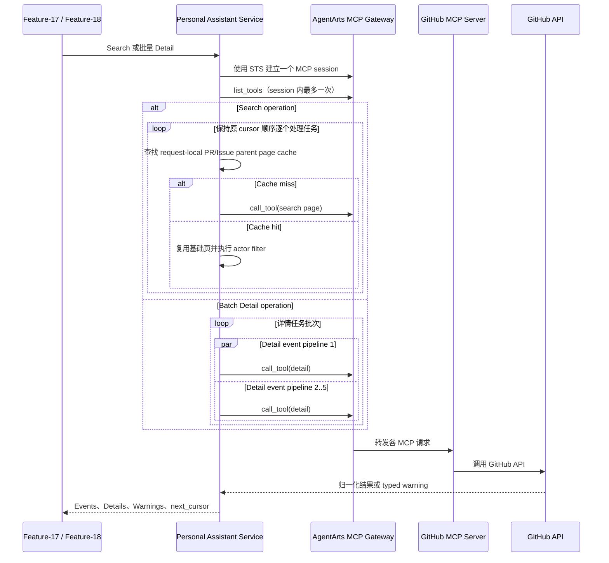

# Feature-17 / Feature-18 GitHub MCP 性能与详情完整性分析

> 初始分析：2026-07-16
>
> 最近验证：2026-07-22
>
> 范围：Feature-17 `github_mcp_search_activity`、Feature-18 GitHub 搜索与详情补全
>
> 方法：静态调用链分析、受控并发 unit tests；尚未执行 production Gateway 基准测试

## 1. 调用链路

GitHub 活动数据经过 STS、AgentArts MCP Gateway 和 GitHub MCP Server，不直接从 GitHub 用户事件流读取。

图类型：**Sequence Diagram（时序图）**。用于说明 Search 如何复用父对象页，以及批量 Detail 如何复用 MCP session 并限制并发。



## 2. 修正后的调用数量基线

原分析按每仓库 3 个根调用估算，但全选 5 种事件类型时，当前任务队列实际创建 6 个根任务：

| 根任务 | 每仓库调用数 | 说明 |
|---|---:|---|
| Commit 搜索 | 1 | `list_commits` |
| PR 活动搜索 | 1 | `list_pull_requests` |
| Issue 活动搜索 | 1 | `list_issues` |
| Issue comment 的父对象发现 | 1 | 再次调用 `list_issues` |
| PR comment 的父对象发现 | 1 | 再次调用 `list_pull_requests` |
| PR review 的父对象发现 | 1 | 第三次调用 `list_pull_requests` |

在 1 个仓库、5 个 Issue、3 个 PR、5 种事件类型全选且每类都只有一页时：

| 调用 | Feature-17 facade | internal 默认调用 | Feature-18 | 说明 |
|---|---:|---:|---:|---|
| `list_tools` | 1 | 1 | 1 | 每个 MCP session 一次 |
| `get_me` | 0 | 1 | 0 | facade 使用 `actor=None`；internal 默认使用 `actor="platform"`；Report 显式传 OAuth login |
| 6 个根任务 | 6 | 6 | 6 | 同上表 |
| Issue comments | 5 | 5 | 5 | 每个父 Issue 一次 |
| PR comments | 3 | 3 | 3 | 每个父 PR 一次 |
| PR reviews | 3 | 3 | 3 | 每个父 PR 一次 |
| **合计** | **18** | **19** | **18** | 未计 repository discovery 和额外分页 |

静态调用数近似为：

```text
Search calls = list_tools(1) + identity(0 or 1)
             + repositories * 6
             + issue_parents
             + 2 * pull_request_parents
             + repository_discovery_pages
             + remote_continuation_pages
```

当前优化直接减少重复 GitHub API 调用，不改变每页活动组成。若 direct PR/Issue 与 comment/review parent discovery 在同一次 source operation 内处理，相同 repository/pagination 的 PR 根调用可由 3 次降为 1 次，Issue 根调用可由 2 次降为 1 次。典型场景的 Search 调用因此约为 Feature-17 facade 15 次、internal 默认调用 16 次、Feature-18 15 次。若 `limit` 导致相关任务分散到不同 cursor 请求，request-local cache 不跨 session 保留，实际调用数会介于优化值与基线值之间。

## 3. 已落地的性能优化

### 3.1 MCP session 复用

已于 2026-07-17 将 `MCPGatewayClient` 改为 async context manager。一次 source operation 只建立一个 MCP session，详见 [session-per-call 修复文档](./feature-17-mcp-session-per-call-performance.md)。

### 3.2 Search parent page request-local cache

`github_mcp_search_activity` 保持原有串行任务顺序和 cursor contract，同时在一次 source operation 内缓存 PR/Issue 基础页：

- cache key 包含 repository、parent kind、page size、pagination kind/value；
- PR/Issue 基础页以 `actor=None` 读取，direct activity 再按原规则做 case-insensitive actor filter；
- comment/review parent discovery 复用同一基础页，不重复读取 PR/Issue 列表；
- cache hit 不消耗远端 page-call budget；
- error 不缓存，typed warning 和 retryable cursor 行为保持不变；
- cache 不跨 session/cursor 请求，避免跨用户数据和配置陈旧问题；
- 不修改 Feature-17 facade、参数、返回 schema、活动组成或 cursor version。

曾评估过通用 `asyncio.gather` Search 调度，但 strict global `limit` 会让已完成的 sibling response 无法安全放入当前结果，只能在下一 cursor 重发；固定 page quota 又会增加 dense repository 的分页调用并改变每页组成。因此本轮不采用该方案。

### 3.3 Feature-18 Detail 批量复用

优化前，Feature-18 对截断后的最多 100 条活动逐条调用 `github_mcp_get_detail`。虽然调用方用 semaphore 限制为 5 路，但每条活动仍重新获取 STS、建立 session 和执行 `list_tools`：

| Detail 阶段资源 | 优化前上限 | 优化后上限 |
|---|---:|---:|
| STS-backed operation | 100 | 1 |
| MCP session | 100 | 1 |
| `list_tools` | 100 | 1 |
| 并发 event pipeline | 5 | 5 |

现在 `github_mcp_get_details` 在一个 STS/MCP session 中完成整批详情补全，保持输入顺序，并将每条活动的失败隔离为对应 `GitHubMCPWarning`。原 `github_mcp_get_detail` 保持原签名和单条语义，Feature-17 不需要改调用方式。

### 3.4 `list_tools` session-local single-flight cache

`MCPGatewayClient.list_tools` 在当前打开的 session 内缓存成功结果，并用 `asyncio.Lock` 合并并发首请求：

- 成功和空工具列表会缓存；
- 失败不会缓存，后续调用仍可重试；
- 进入和退出 session 时清空；
- 不做跨 session 全局缓存，避免 Target 配置变化长期不可见。

## 4. 当前验证结果

2026-07-22 的核心回归结果为 `81 passed`，覆盖：

- `list_tools` 并发 single-flight，只产生一个底层请求；
- Search 相同 PR/Issue parent page 分别只产生一个底层请求；
- 小 `limit` 跨 cursor 无重复活动，也不增加重复 comment page call；
- retryable task 保留在 cursor，成功 sibling 不会越过它提前暴露；
- 100 条 Report 候选先全局排序、截断，再走一次批量详情入口；
- 批量详情只执行一个 source operation、一次 `list_tools`，结果顺序不变；
- Feature-17 facade 和既有 detail/search 行为保持兼容。

上述测试证明调度与资源复用合同，不代表真实 AgentArts Gateway 延迟。部署后仍需记录 Search/Detail 的 p50、p95、MCP call 数、session 数和 429/403/5xx 分布。


## 5. 下一步验收标准

性能优化上线后，先采集真实错误分布，再实施 P0/P1 可靠性改造。建议验收指标：

| 指标 | 目标 |
|---|---|
| Feature-18 Detail session 数 | 每份报告 1 个 |
| session 内 `list_tools` 次数 | 最多 1 次 |
| Search 重复父页 | 同一 source operation、相同 key 的 PR/Issue page 各最多 1 次远端读取 |
| Detail 并发 | 最多 5，可因 rate limit 自适应降低 |
| retry | 仅瞬态错误，受 `Retry-After`、deadline 和 budget 约束 |
| partial detail | 保留成功 section 和搜索摘要，不全量回退 |
| 用户 warning | 包含失败数量与分类，不包含 secret |
| Feature-17 兼容 | facade/schema/cursor contract 与现有行为保持一致 |
