# Personal Assistant — 前端架构

> 版本：v0.1 | 状态：Draft | 关联文档：`backend_architecture.md`

---

## 1. 概述

Personal Assistant 前端采用**多客户端架构**，所有客户端通过统一协议与 FastAPI 后端通信，共享同一套 Agent 处理逻辑和 Memory 空间。

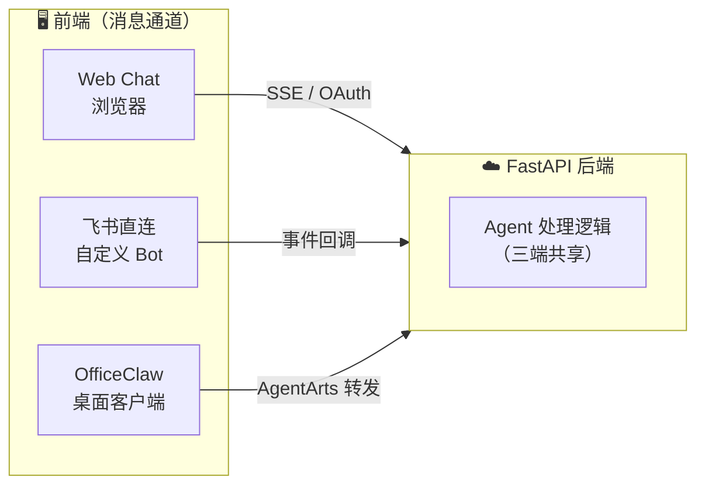

**核心原则**：前端只负责消息通道和协议适配，不做 Agent 逻辑。所有 Agent 推理、Memory、Tool 调用都在后端。

---

## 2. 三种前端方案

### 2.1 Web Chat

**接入方式**：React SPA 通过 same-origin `POST /invocations` 调用
Cloudflare Pages Function，由 Function 转发至 AgentArts Gateway 的
`POST /invocations`。请求 body 使用 `stream: true`，响应为 SSE。

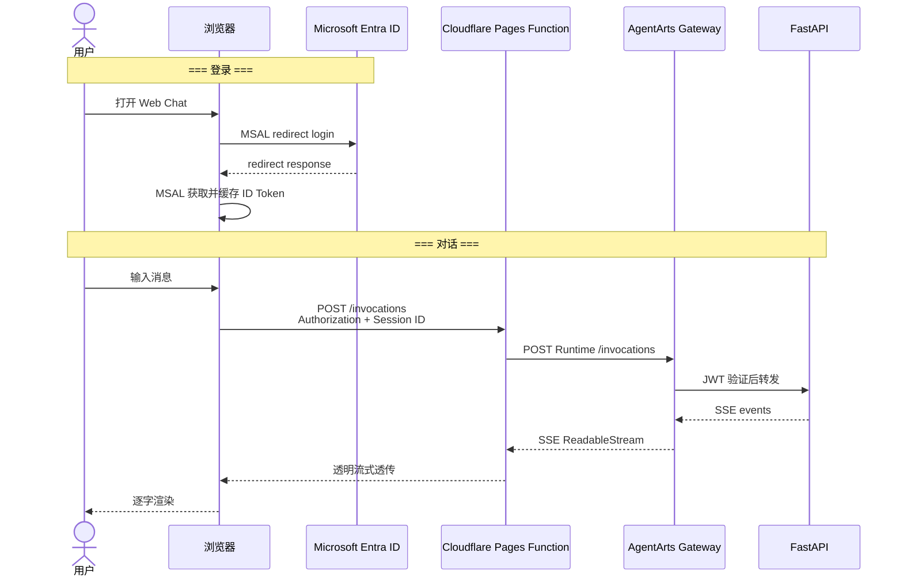

| 维度 | 说明 |
|------|------|
| **协议** | `POST /invocations` + `{"stream": true}`，响应为 SSE |
| **认证** | MSAL SPA 登录 Microsoft Entra ID；ID Token 存于 Zustand，并通过 `Authorization: Bearer` 发送。详见 [ADR-007](ADR/ADR-007-identity-provider.md) |
| **路由** | Browser 与 Runtime 均为 `/invocations` |
| **优势** | 完全自定义 UI/UX，不受平台限制 |
| **代价** | 需要自己开发前端页面 |
| **技术栈** | Vite + React 19 + TypeScript + Tailwind CSS + assistant-ui + Zustand。详见 [ADR-013](ADR/ADR-013-assistant-ui-chat-library.md) |
| **SSE 事件类型** | `token`、`done`、`error`、`system_message`、`auth_required`、`auth_complete`。详见 §2.1.4 |

**Inbound Auth 与 Outbound Auth 分离**：

- Inbound Auth（用户登录 Web Chat）由 Browser 内的 MSAL SPA 完成，不使用后端
  `/auth/callback` 或 JWT Cookie。
- Outbound Auth（Agent 调用 Microsoft 365）由 AgentArts Identity SDK 管理。
  Web Chat 只负责展示 SDK 产生的 Auth Card，不接触 Microsoft Graph access
  token。

#### 2.1.1 Chainlit Playground（调试工具）

Web Chat（Vite + React）面向最终用户，需要工程化构建。在开发阶段，需要一个零构建的轻量调试界面直接与 Agent 交互，观察推理过程。

Chainlit 定位为**同容器唯一的对话 UI**，挂载在 `/invocations/playground`，覆盖开发调试、Agent 链路验证和运维访问需求：

```
FastAPI 容器 :8080
  ├── /invocations/playground  → Chainlit app（对话/调试 UI）
  ├── /invocations             → 同步对话 / SSE 流式对话（body stream:true）
  └── /ping                    → 健康检查
```

> Web Chat 前端（Vite + React）不再打包进容器，部署到 Cloudflare Pages
>（见 §6.2）。

| 维度 | 说明 |
|------|------|
| **定位** | 开发调试 + 运维访问，同容器唯一 UI |
| **语言** | Python，与后端同一进程，零构建 |
| **LangChain 集成** | 原生 `@cl.on_chat_start` + LangChain callback，直接观察 Agent 推理步骤 |
| **流式** | 内置 `cl.Message.stream_token()` |
| **路径** | `/invocations/playground` — 与生产 Web Chat SPA 分离 |
| **生命周期** | 与项目长期共存。开发阶段快速验证 Agent 链路，生产环境保留给运维调试 |

Chainlit 与 Web Chat 共享同一 FastAPI 进程内的 `agent_handler`，只是接入的 UI 层不同：Web Chat 走 SSE + assistant-ui（React，独立部署于 Cloudflare Pages），Playground 走 Chainlit 的 WebSocket 协议（Python 原生，同容器）。

#### 2.1.2 本地开发与网关模拟（Vite Proxy）

在生产环境中，**AgentArts Gateway（API 网关）** 扮演着身份认证与安全过滤的角色。它会拦截请求、校验 Token，并将解析后的用户 ID 通过特有 Header（`X-HW-AgentGateway-User-Id`）透传给后端容器。

为了在本地开发时实现**环境对齐（Environment Parity）**，同时规避浏览器的**同源策略（CORS）**限制，Web Chat 在本地开发阶段引入了 **Vite Proxy** 机制：

##### 1) 架构与数据流向

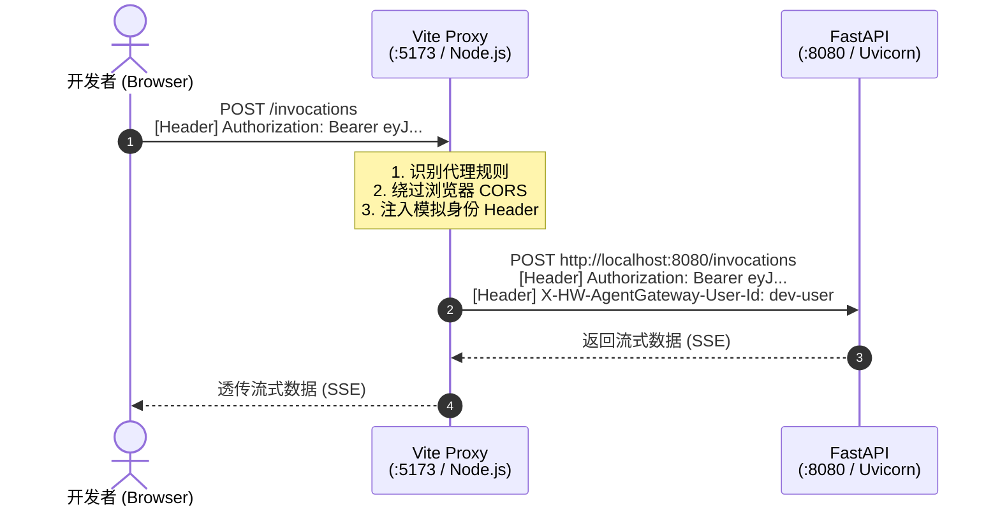

##### 2) 核心实现原理

- **同源伪装（避开 CORS）**：前端代码中所有发往后端的 API 请求（如 `/invocations`），都以相对路径形式发出，即请求 `http://localhost:5173/invocations`（与前端自身同源）。浏览器检测到请求同源，**不会触发 CORS 校验，亦不会发起 OPTIONS 预检请求**。
- **Node.js 侧转发与 Header 注入（Cosplay 华为云网关）**：运行在开发机上的 Vite 进程（Node.js 端）拦截到 `/invocations` 路径请求，在服务器端将其转发至真正的后端 `http://localhost:8080/invocations`。在转发之前，Vite 的 `vite.config.ts` 会利用 `proxyReq.setHeader` 钩子，强行在请求头中注入 `X-HW-AgentGateway-User-Id: dev-user`。
- **后端 Uvicorn**：无论是本地还是云端，直接读取 `X-HW-AgentGateway-User-Id` 头即可，无感知调用方是 Vite 还是真实的 AgentArts Gateway。

#### 2.1.3 Landing Page

未登录用户访问 Web Chat 时展示遵循 Apple Design Language 的 Landing Page，替代原有的"请登录以开始对话"占位文本。

**架构**：

App.tsx 通过 AuthGuard 将 MSAL 认证流程中的三种状态分流：

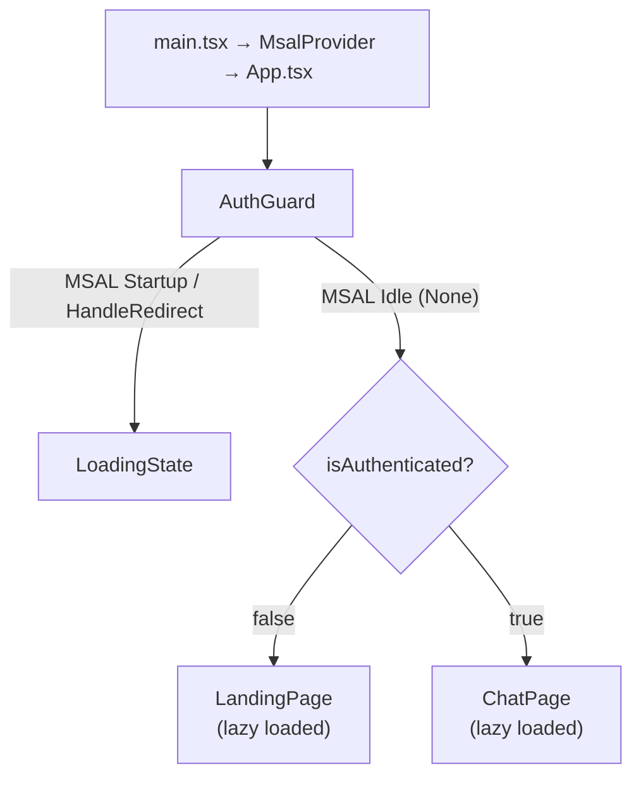

**AuthGuard 逻辑**：

- 检查 MSAL `InteractionStatus` 枚举：`Startup`、`HandleRedirect` 或未认证期间任何非 `None` 状态 → 渲染 LoadingState
- 排除 `acquireToken`（静默 token 刷新不触发 loading）
- MSAL idle 后交由 `isAuthenticated` 决定渲染 LandingPage 或 ChatPage

**Landing Page Tile 序列**（自上而下，全出血，tile 间 0 gap，颜色变化即为分割线）：

| Order | Tile | 背景色 | 内容 |
|-------|------|--------|------|
| — | GlobalNav | `#000000` (surface-black) | 44px 纯黑导航栏，右侧 "登录" 按钮；≤833px 时仅保留登录按钮 |
| 1 | LandingHero | `#ffffff` | 品牌名 + 价值主张（hero-display 56px）+ 双 CTA Pill Button |
| 2 | CapabilityGrid | `#f5f5f7` (parchment) | Section headline + 4 格能力卡片（日程/邮件/笔记/任务） |
| 3 | FeatureTile (Dark) | `#272729` (tile-1) | 核心能力展示（display-lg 40px headline + body 17px 描述 + CTA） |
| 4 | FeatureTile (Light) | `#ffffff` | 核心能力展示 |
| 5 | FeatureTile (Parchment) | `#f5f5f7` | 核心能力展示 |
| 6 | ClosingCTA | `#2a2a2c` (tile-2) | "立即开始" + 大号 Pill CTA |
| 7 | LandingFooter | `#f5f5f7` | 链接列 + 法律信息 |

**Code Splitting 策略**：

- `ChatPage` 和 `LandingPage` 均通过 `React.lazy()` + `<Suspense>` 实现按需加载
- `RuntimeProvider`（含 assistant-ui 依赖）仅在 ChatPage 内挂载，未登录用户永不加载
- `LoadingState` 组件同时作为 AuthGuard transition 和 Suspense fallback 的 loading 指示器

**组件清单**：

| 组件 | 职责 |
|------|------|
| `AuthGuard` | MSAL InteractionStatus 认证状态 gate |
| `LoadingState` | Apple-style 简约 spinner（含 `role="status"` accessibility） |
| `ChunkErrorBoundary` | React.lazy() chunk 加载失败降级 UI（Error Boundary） |
| `GlobalNav` | 44px 纯黑全局导航栏，右侧 "登录" 按钮 |
| `LandingPage` | 顶层容器，编排 GlobalNav + tile 序列，注入 login CTA handler |
| `LandingHero` | 首屏 typography-first hero（hero-display 56px + 双 CTA） |
| `FeatureTile` | 可复用全出血 tile（variant: light/parchment/dark/dark-2） |
| `CapabilityCard` | 单张能力卡片（store-utility-card 样式，18px 圆角，hairline 边框） |
| `CapabilityGrid` | 响应式能力卡片网格（1/2/4 列） |
| `ClosingCTA` | FeatureTile dark-2 变体包装 |
| `LandingFooter` | parchment 背景页脚 |
| `ChatPage` | RuntimeProvider + Thread（从 App.tsx 提取） |

**设计 Token**：

- `--primary: #0066cc`（Action Blue，hex 格式）
- 新增 Tailwind CSS v4 `@theme` 表面颜色 token：`canvas-parchment`、`surface-tile-1`、`surface-tile-2`、`surface-tile-3`、`surface-black`
- Apple 排版通过 `.landing-page` scope 限制，不污染全局（不覆写 `html, body` 或 `font-weight-medium`）
- Body 基准字号 17px（仅 `.landing-page` 作用域内）
- 全出血 tile：`rounded-none`，无阴影，无渐变
- shadcn Button 新增 `apple-primary` / `apple-secondary` pill 变体（`rounded-full`、`h-auto`、`active:scale-95`，使用 `bg-primary` CSS variable 引用）

**设计系统依据**：[`DESIGN.md`](../../personal-assistant-client/DESIGN.md)

#### 2.1.4 SSE 事件协议

Web Chat 通过 `POST /invocations` 发起请求，Pages Function 将
AgentArts Gateway 返回的 SSE `ReadableStream` 透明传回 Browser。Service 的
`handle_stream` 使用 LangGraph `stream_mode=["messages", "custom"]` 产生以下
事件：

| 事件字段 | 类型 | 说明 | 示例 |
|----------|------|------|------|
| `token` | `string` | LLM 流式输出的单个 token | `{"token": "你好", "done": false}` |
| `done` | `boolean` | 流结束标记。`done: true` 表示 agent 推理完成 | `{"token": "", "done": true}` |
| `error` | `string` | 流式过程中发生的异常（exception handler yield） | `{"error": "...", "done": true}` |
| `system_message` | `string` | 非 LLM 的带外系统消息；auth 事件中作为 Auth Card 文案 | `"邮件功能需要您的授权..."` |
| `auth_url` | `string` | Outbound OAuth2 授权 URL | `"https://..."` |
| `auth_required` | `boolean` | 标记需要显示 pending Auth Card | `true` |
| `auth_complete` | `boolean` | 标记 provider 的凭据当前可用；仅更新匹配的 pending Auth Card | `true` |
| `provider` | `string` | Auth Card 与完成事件的关联键 | `"m365-provider-common"` |

**Outbound OAuth 事件流**：

当 `@require_access_token` 的 `on_auth_url` callback 触发时，
`handle_auth_url` 使用 LangGraph `get_stream_writer()` 写入
`auth_required` custom event。SDK 内部 poller 等待用户完成授权；tool 获取
access token 后发送 `auth_complete` custom event。

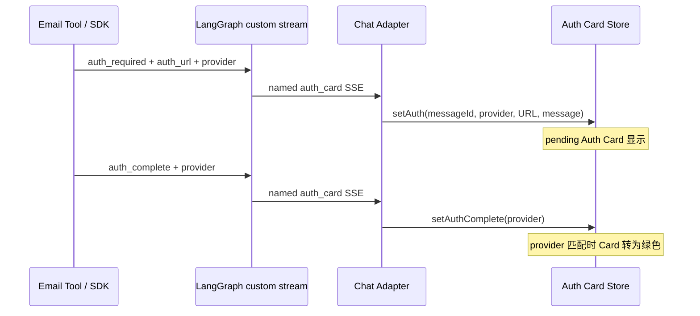

Auth 事件拥有专用 UI channel，因此其 `system_message` **不得**追加到普通
assistant message text。普通非 auth `system_message` 仍追加到聊天正文。Service
可以在每次取得 access token 后发送 `auth_complete`；若 Client 没有相同
`provider` 的 pending Card，Store 会幂等忽略该事件。

#### 2.1.5 Chat Adapter 模块边界

`assistant-ui` 通过 `RuntimeProvider` 注册 `chatAdapter`。Adapter 只负责流程
编排，HTTP、协议解析和业务事件分发按职责拆分：

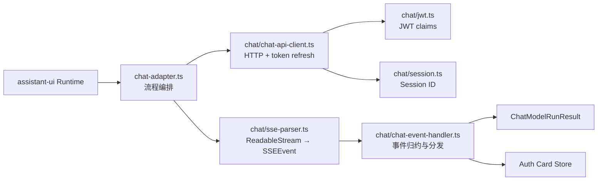

| 模块 | 稳定职责 |
|------|----------|
| `chat-adapter.ts` | 提取最后一条用户消息，编排 invoke/parse/handle，向 assistant-ui yield |
| `chat-api-client.ts` | 构造请求 header/body、proactive refresh、401/403 retry、HTTP error |
| `sse-parser.ts` | 处理 stream chunk、CRLF normalization、`data:` line 和 JSON decode |
| `chat-event-handler.ts` | 累积 token，区分普通 system message 与 auth event，更新 Auth Card Store |
| `session.ts` | `localStorage` Session ID persistence 与 reset |
| `jwt.ts` | base64url JWT payload decode、`sub/oid` 和 `exp` 提取 |

该分层保持 `chatAdapter` 的公共 API 不变，不引入额外 networking library 或
event bus。

<!-- updated by issues: refactor-email-auth-normal-control-flow, bug-16-auth-card-system-message-duplicated-in-chat, refactor-9-modularize-chat-adapter -->

### 2.2 飞书直连

**接入方式**：自行创建飞书 Bot，飞书事件回调到 FastAPI `/feishu/webhook`

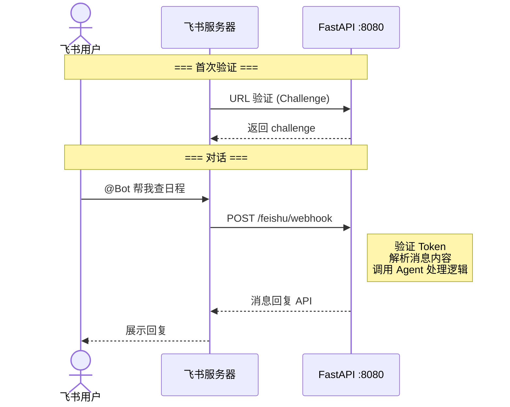

| 维度 | 说明 |
|------|------|
| **协议** | 飞书 Webhook 事件回调 |
| **认证** | 飞书 Token 验证 + API Key |
| **路由** | `/feishu/webhook` |
| **优势** | 完全自主可控，支持飞书卡片等高级交互 |
| **代价** | 需要公网回调 URL，需要写飞书消息解析代码 |

### 2.3 OfficeClaw

**接入方式**：OfficeClaw 桌面客户端作为飞书/微信桥接器，通过 AgentArts 调用后端 `/invocations`

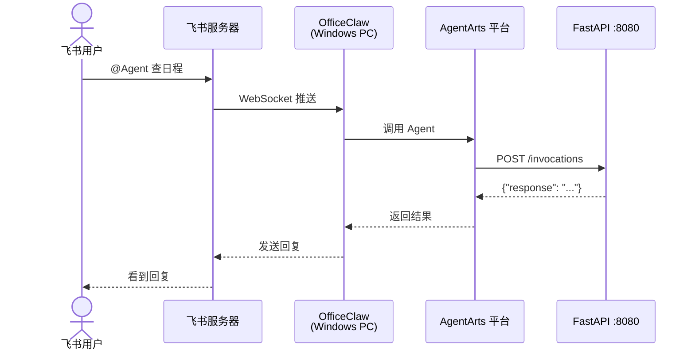

| 维度 | 说明 |
|------|------|
| **协议** | AgentArts `/invocations` (JSON-in/JSON-out) |
| **认证** | AgentArts IAM / API Key |
| **路由** | `/invocations`（AgentArts 平台调用） |
| **优势** | 零代码接飞书/微信，不需要公网回调 URL |
| **代价** | 需要 Windows PC 常驻运行 OfficeClaw，不能自定义飞书交互 |

---

## 3. 渠道对比

| | Web Chat | 飞书直连 | OfficeClaw |
|---|---|---|---|
| **自定义 UI** | ✅ 完全自由 | ❌ 飞书原生 | ❌ 飞书原生 |
| **SSE 流式** | ✅ 原生支持 | ⚠️ 需转飞书消息 | ❌ 不支持 |
| **OAuth 登录** | ✅ 完整流程 | ❌ 不适用 | ❌ 不适用 |
| **飞书卡片** | ❌ 不适用 | ✅ 支持 | ❌ 不支持 |
| **飞书高级交互** | ❌ 不适用 | ✅ 支持 | ❌ 不支持 |
| **微信接入** | ❌ 不适用 | ❌ 需要额外开发 | ✅ 内置 |
| **公网 IP 要求** | AgentArts 提供 | 需要回调 URL | 不需要 |
| **额外软件** | 浏览器即可 | 无 | Windows PC + OfficeClaw |
| **开发工作量** | 前端页面 + OAuth | 飞书 Bot 代码 | 仅 Agent 逻辑 |

---

## 4. 渠道选择指南

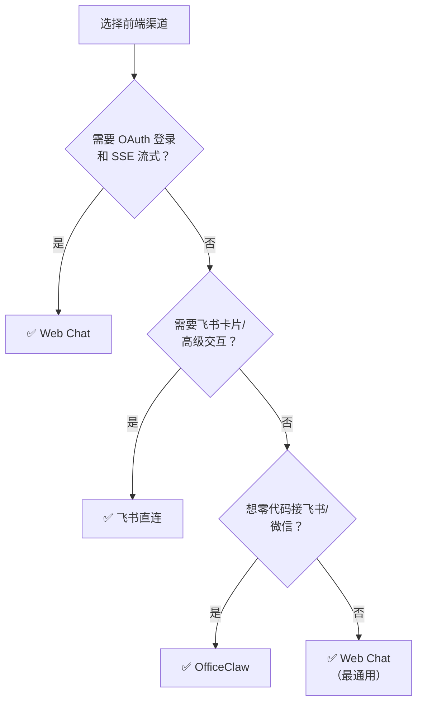

---

## 5. 跨渠道 Memory 共享

同一用户从不同渠道发起对话，通过统一的 `user_id` 关联到同一 Memory Space：

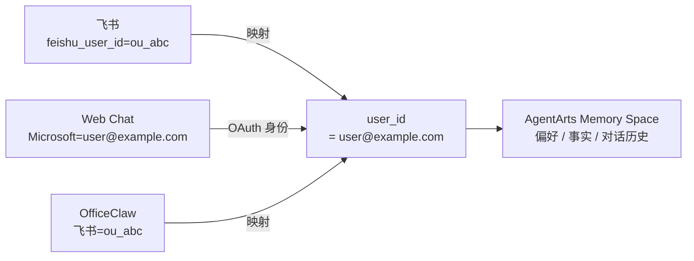

- **Web Chat**：OAuth 登录后直接获得 `user_id`（Microsoft account email）
- **飞书直连**：`feishu_user_id` → 查绑定表映射到 `user_id`
- **OfficeClaw**：同飞书直连，OfficeClaw 传递飞书用户身份

---

## 6. 部署拓扑

### 6.1 整体拓扑

#### 当前配置：Cloudflare Pages + Same-Origin API Proxy

Web Chat 前端部署在 Cloudflare Pages。Client 请求 same-origin
`/invocations`，Pages Function 将请求转发到 AgentArts Gateway 的完整
Runtime path。详见
[ADR-017](ADR/ADR-017-cloudflare-pages-proxy.md)。

Production URL：`https://agentarts-personal-assistant.pages.dev`

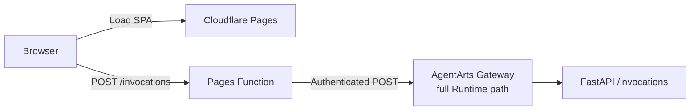

| 维度 | 说明 |
|------|------|
| **同源** | SPA 与 `/invocations` 使用同一 Pages origin，不触发 CORS preflight |
| **认证** | Browser 发送 Microsoft JWT，Gateway 通过 `CUSTOM_JWT` 验证 |
| **Streaming** | Pages Function 透明透传 Gateway SSE `ReadableStream` |

### 6.2 Web Chat 前端部署

Web Chat 独立部署于 Cloudflare Pages，不打包进 FastAPI container。Vite
production build 由 Pages 托管，Pages Function 接收 same-origin
`POST /invocations` 并转发到 AgentArts Gateway。

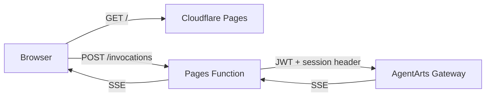

| 维度 | 说明 |
|------|------|
| **Production URL** | `https://agentarts-personal-assistant.pages.dev` |
| **API base URL** | `/api` |
| **CORS** | Browser 与 Proxy same-origin，不产生 preflight |
| **认证** | Pages Function 透传 JWT，Gateway 执行 `CUSTOM_JWT` validation |
| **Streaming** | Gateway SSE body 以 `ReadableStream` 透明返回 |
| **Deployment** | GitHub Actions + Wrangler；手动 CLI 用于 bootstrap/恢复 |

Browser CORS 直连 Gateway 不可用，因为 Gateway 会对无 JWT 的 preflight
`OPTIONS` 返回 401。历史 Netlify 和 OBS + CDN 方案分别记录在 ADR-014 与
ADR-015，当前 decision 见 ADR-017。

#### 容器内 UI：Chainlit Playground

FastAPI 容器内仅保留 Chainlit Playground（`/invocations/playground`）作为对话 UI，覆盖以下场景：

| 用途 | 说明 |
|------|------|
| **开发调试** | 本地 `uvicorn` 启动后直接访问 `/invocations/playground`，零构建验证 Agent 链路 |
| **内部运维访问** | 直连容器地址可拿到 Chainlit 对话界面，调试时绕过 CDN |
| **深度健康检查** | 用聊天请求探测端到端链路（见下方） |

#### 聊天式健康检查

传统 `/health` 或 `/ping` 端点只验证"进程存活"，无法探测 AI Agent 核心链路。Chainlit Playground 路径可以作为**深度健康检查**的入口：

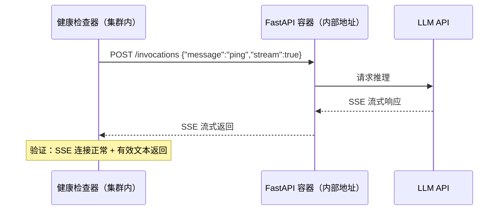

一次"聊天式 ping"覆盖的关键路径：

| 验证项 | 传统 `/health` | 聊天式 `POST /invocations` |
|--------|:---:|:---:|
| FastAPI 进程存活 | ✅ | ✅ |
| LLM API 连通性 | ❌ | ✅ |
| SSE 流式中间件正常 | ❌ | ✅ |
| Memory / Identity SDK 可用 | ❌ | ✅ |
| Microsoft JWT / Gateway 验证链路 | ❌ | ✅（带 token） |

**实现建议**：在 AgentArts 或 K8s 的 readiness probe 中配置直连容器的聊天式检查（绕过 CDN），间隔可设长一些（如 5 分钟），因为 LLM 调用有成本。`/ping` 仍用于高频 liveness check（30 秒）。
