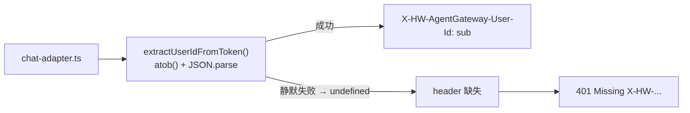

# Bug 13: 部分 Azure AD B2B Guest 用户调用 /invocations 返回 401

Azure AD 租户中 4 个用户，2 个正常（MA Lu Member + 汤宇鹏 Guest），2 个返回 401（奇奇 Guest Outlook、程智凌 Guest QQ）。所有用户均可正常登录（MSAL 认证成功），仅发送消息调用 `/invocations` 时报错。

## 现象

```
POST /invocations → 401
{"detail": "Missing X-HW-AgentGateway-User-Id header"}
```

| 用户 | 类型 | 身份提供方 | 状态 |
|------|------|-----------|:---:|
| MA Lu | Member | outlook.com | ✅ |
| 奇奇 | Guest | outlook.com (MSA) | ❌ 401 |
| 汤宇鹏 | Guest | qq.com (Federated) | ✅ |
| 程智凌 | Guest | qq.com (Federated) | ❌ 401 |

## 根因

前端 `extractUserIdFromToken()` 使用 `atob()` 直接解码 JWT payload，存在三个问题：

1. **base64url 字符集不兼容**：JWT 使用 `-` `_`（base64url），`atob()` 期望 `+` `/`（base64）
2. **缺失 padding**：JWT 省略 `=` 填充，`atob()` 要求 4 字节对齐
3. **UTF-8 解码缺失**：B2B Guest 用户的 `name` claim 含中文，`atob()` 按 Latin-1 逐字节解码后产生非法 JSON 字符

当以上任一条件触发 `JSON.parse` 失败时，catch 返回 `undefined` → `X-HW-AgentGateway-User-Id` header 缺失 → App 层 401。

**为何部分用户正常**：取决于 JWT payload 的具体字节序列，`atob()` 碰巧能成功解码某些 payload（如纯 ASCII 或无填充问题的短 payload），但对另一些则静默失败。本质是 `atob()` 非标准 JWT 解码器，行为不稳定。

### 受影响的调用点



- `chat-adapter.ts:36-43` — `extractUserIdFromToken`：提取 `sub`/`oid` claim
- `chat-adapter.ts:47-54` — `isTokenExpiringSoon`：同用 `atob()`，token 可能被误判过期
- 两处（初始请求 + 401 静默刷新重试）均受影响，无 fallback

## 解决方案

替换为标准 base64url 解码器 `base64UrlDecode()`：

```typescript
function base64UrlDecode(str: string): string {
  let base64 = str.replace(/-/g, "+").replace(/_/g, "/");
  while (base64.length % 4 !== 0) {
    base64 += "=";
  }
  const binary = atob(base64);
  return new TextDecoder().decode(
    Uint8Array.from(binary, (c) => c.charCodeAt(0)),
  );
}
```

步骤：
1. base64url → base64（`-`→`+`, `_`→`/`）
2. 补齐 padding
3. `atob()` 解码为 binary string
4. `TextDecoder` 将 UTF-8 字节序列还原为 JavaScript 字符串

## 实施任务

- [x] 修改 `personal-assistant-client/src/lib/chat-adapter.ts`：`extractUserIdFromToken` 和 `isTokenExpiringSoon` 改用 `base64UrlDecode()`
- [ ] 构建前端并部署到 OBS/Netlify
- [ ] 验证：奇奇、程智凌 登录后发送消息正常返回 200
- [ ] 验证：MA Lu、汤宇鹏 功能不受影响（回归）
- [ ] 更新 `personal-assistant-meta/issues/bugs/README.md` 添加 Bug 13

## 四问闸门

| 维度 | 评估 | 说明 |
|------|:---:|------|
| **Best practice?** | **Yes** | 正确处理 base64url + UTF-8 是 JWT 解码的标准做法（jwt-decode / jose 库均含此逻辑） |
| **Industry standard?** | **Yes** | `TextDecoder` API 是 Web 标准，所有现代浏览器原生支持 |
| **Conventional?** | **Yes** | `atob()` + `TextDecoder` 是前端解码 JWT 中 UTF-8 claims 的常见模式 |
| **Modern?** | **Yes** | 无新增依赖，利用平台原生 API |

## 参考

- `personal-assistant-client/src/lib/chat-adapter.ts:14-55` — 受影响代码
- `personal-assistant-service/app/auth.py:4-21` — App 层 401 逻辑
- `personal-assistant-meta/architecture/cloud-service/agentarts.md:712-767` — CUSTOM_JWT 认证层次与 header 来源
- Feature 4: `personal-assistant-meta/issues/features/resolved/feature-4-inbound-identity/plan.md`
