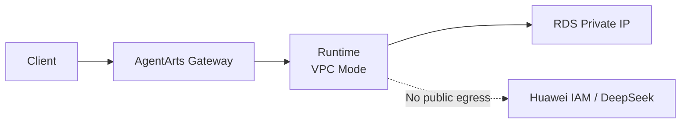

# Bug 15: AgentArts VPC Runtime 无公网 Egress

## 背景

Feature 1.2 将 AgentArts Runtime 切换为 VPC Mode，以私网连接 RDS。
部署后 Runtime 可以接收 `/invocations`，但请求内的 AgentArts Identity
credential 获取会访问公网 IAM Endpoint，并在 60 秒后超时：

```text
HTTPSConnectionPool(host='iam.cn-southwest-2.myhuaweicloud.com', port=443)
Connection timed out
```

## 根因



VPC Mode 解决了 RDS 私网连接，但目标 Subnet 没有 Public NAT Gateway 和
SNAT，因此 Runtime 无法访问 IAM、LLM 和其他公网 API。

## 决策

Demo 环境优先降低基础设施复杂度：

- Runtime 恢复 `PUBLIC` Mode；
- RDS 绑定独立 EIP；
- RDS Security Group 允许公网 TCP 5432；
- `POSTGRES_DSN` 使用 RDS EIP，并启用 `sslmode=require`；
- 不引入 NAT Gateway；
- Demo 结束后可解绑 EIP，回退到私网架构。

## 影响范围

- `personal-assistant-infra/`：新增 EIP 和 RDS EIP Association；Runtime
  专用 Security Group 在迁移完成后 cleanup；
- `personal-assistant-service/.agentarts_config.yaml`：恢复 PUBLIC Mode；
- Service deployment workflow：不再要求 VPC/Subnet/Security Group Variables；
- ADR-012、Backend Architecture 和 Feature 1.2 Plan 同步目标架构。

## 预期结果

Runtime 能同时访问：

- RDS PostgreSQL 公网 Endpoint；
- AgentArts Identity / Huawei IAM；
- DeepSeek、Microsoft Graph、GitHub 和 Gitee 等公网 API。
