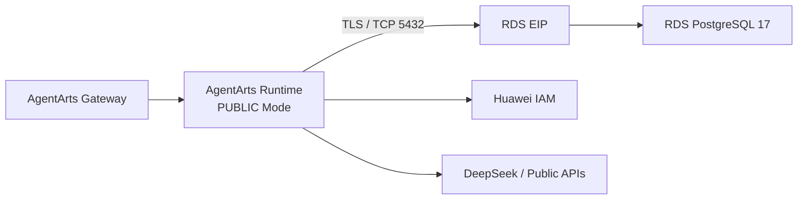

# Bug 15 Implementation Plan

## 目标架构



## Infra

1. 创建按需、按流量计费、1 Mbit/s 的 `pa-rds-eip`。
2. 使用 `huaweicloud_rds_instance_eip_associate` 将 EIP 绑定到 RDS。
3. 保留独立 `pa-rds-sg`，允许 `0.0.0.0/0` 访问 TCP 5432。
4. 首次 rollout 暂时保留 `pa-runtime-sg`，避免当前 VPC Runtime 占用导致
   Infra Apply 删除失败；PUBLIC Runtime 稳定后再 cleanup。
5. 输出 `rds_public_ip`，不输出 password 或完整 DSN。

## Runtime

1. `network_mode` 改为 `PUBLIC`。
2. 删除 VPC/Subnet/Security Group Variable substitution。
3. 手工更新 GitHub Secret `POSTGRES_DSN`：

```text
postgresql://pa_app:<url-encoded-password>@<rds_public_ip>:5432/personal_assistant?sslmode=require
```

## Rollout 顺序

1. 先 Apply Infra，创建并绑定 RDS EIP。
2. 使用 `rds_public_ip` 更新 `POSTGRES_DSN`。
3. 再 Deploy Service，将 Runtime 切换到 PUBLIC。
4. 验证成功后删除不再使用的 `pa-runtime-sg`。

## 验证

- `tofu fmt -check -recursive`
- `tofu validate`
- `tofu plan`
- EIP 与 RDS Association 创建成功
- Runtime 启动时 `AsyncPostgresSaver.setup()` 成功
- `/invocations` 不再出现 IAM 60 秒连接超时
- 相同 `thread_id` 能恢复 Checkpoint
