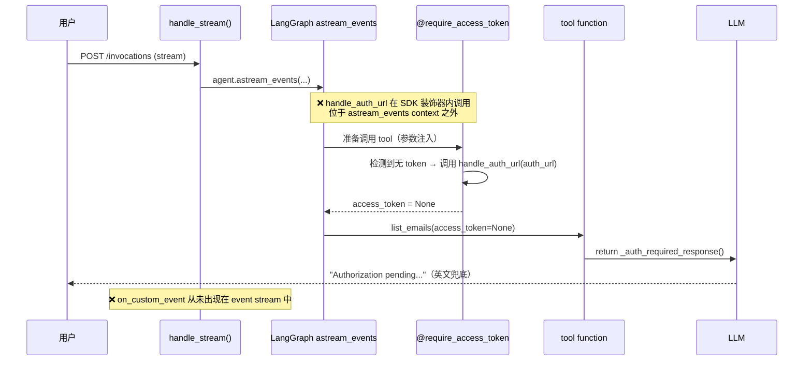
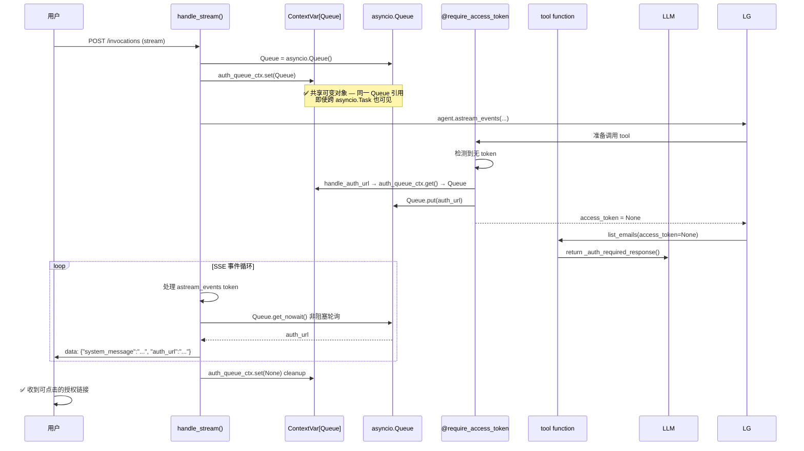

# Bug 15: `adispatch_custom_event` 无法将 Auth URL 推送到 SSE Stream — 用户收不到授权消息

`handle_auth_url()` 回调通过 `adispatch_custom_event` 向 LangGraph `astream_events` 推送 `auth_required` custom event，期望 `agent_handler.py` 的 `handle_stream()` 事件循环拦截后，以 SSE 下发到客户端。但实际测试中，用户触发邮件工具后**始终收不到授权链接**，只能看到 `_auth_required_response()` 返回的兜底英文文案 `"Authorization pending. Please follow the authorization link sent to you."`。

## 现象

1. 未授权用户触发任一邮件工具（如 `list_emails`）
2. AgentArts SDK 的 `@require_access_token` 装饰器检测到无 token，调用 `on_auth_url=handle_auth_url` 回调
3. `handle_auth_url` 内部调用 `adispatch_custom_event("auth_required", {...})` — **日志中能看到 logger.info 输出，但 SSE stream 中不会出现 `on_custom_event` 事件**
4. `agent_handler.py:198` 的 `kind == "on_custom_event"` 分支从未命中
5. LLM 仅收到 `_auth_required_response()` 返回的 `{"auth_required": True, "error": "Authorization pending..."}` 作为 tool result
6. 用户看到的是 LLM 转述的英文兜底文案，没有收到可点击的授权链接

## 根因分析

**核心问题**：`handle_auth_url` 运行在 `@require_access_token` SDK 装饰器**内部**，在 LangGraph agent 的 `astream_events` 执行上下文**之外**。

```
@require_access_token(...)     ← SDK 装饰器，在 tool function 之前执行
async def list_emails(
    ...,
    access_token: str | None = None,  ← SDK 装饰器注入
):
    if not access_token:
        return _auth_required_response()  ← LLM 看到这个
    # ... 正常业务逻辑
```

LangChain 的 `adispatch_custom_event` 依赖 active run context（由 LangGraph 的 `RunnableConfig` 传播）。SDK 装饰器在解析参数、调用 `handle_auth_url` 时，可能尚未进入 LangGraph 的 run context（或位于一个隔离的 context 中），导致 `adispatch_custom_event` 无法找到目标 run 来附着 custom event，event 被**静默丢弃**。

这在 `refactor-email-auth-normal-control-flow` 中已被预见——issue 描述明确指出：

> `handle_auth_url` 运行在 `@require_access_token` 装饰器内部，早于 tool function body 执行，且位于 LLM 的 SSE token stream 之外

当前实现已改用 `adispatch_custom_event`（正常控制流），但**未验证该 dispatch 是否在 SDK 装饰器 context 内有效**。

### 数据流对比



### 为什么之前的异常控制流也有同样问题

在 refactor 之前，`handle_auth_url` 抛出 `AuthUrlRequired` 异常，由 `@_handle_provider_error` 装饰器捕获后构造 dict 返回给 LLM。该方案**同样无法将 auth URL 直接呈现给用户**，只是将问题隐藏了——LLM 看到 error dict 后自行决定如何引导用户，导致不可控的体验（LLM 可能引导用户去错误的地方、可能形成重授权循环等）。

两种方案共同的根因：**SDK 装饰器将 auth 回调隔离在 SSE stream 之外，需要一种 out-of-band 的通信机制将 auth URL 传输到 `handle_stream()` 事件循环。**

## 解决方案

### 短期方案：`ContextVar[asyncio.Queue]` 桥接（Panel 共识方案）

在 `handle_stream()` 中创建 per-session 的 `asyncio.Queue`，通过 `contextvars.ContextVar` 共享给 `handle_auth_url`，利用 **共享可变对象** 实现跨 Task 通信：

1. **`handle_stream()` 端**：创建 Queue → 存入 ContextVar → 事件循环中非阻塞轮询 → 最后清理
2. **`handle_auth_url` 端**：从 ContextVar 读取 Queue → `queue.put(auth_url)` → 事件被 `handle_stream()` 轮询消费

**关键设计**：使用 `ContextVar[asyncio.Queue]` 而非 `ContextVar[str]`。因为 Queue 是可变对象，即使 LangGraph 内部使用了 `asyncio.create_task` 导致 ContextVar 被 Copy-on-Write，**两个 Task 持有的是同一个 Queue 对象引用**——写入和读取操作的都是同一个队列实例。

优点：
- ✅ Session 天然隔离（每个 `handle_stream()` 调用创建独立 Queue）
- ✅ 无跨用户数据泄露风险（Queue 生命周期绑定到 `handle_stream()` 调用）
- ✅ 实时交付（事件循环中 `get_nowait()` 非阻塞轮询，延迟 < 1 个 event 间隔）
- ✅ 不依赖 LangGraph run context
- ✅ 无需 thread_id 解析或 dict 注册表
- ✅ 无额外依赖（`contextvars` + `asyncio` 均为标准库）



### 长期方案：SDK 层支持 Auth URL 回调注册

将此问题反馈给 AgentArts SDK 团队，建议 SDK 提供一种机制让应用层能**直接拿到 auth URL**（而非仅在 callback 中处理）。例如：
- `@require_access_token` 返回一个 `RequireAuth` sentinel 对象，包含 `auth_url` 和 `scopes`
- 应用层可自行决定如何呈现 auth URL

这需要 AgentArts 平台侧的支持，不在本次 bug 的修复范围内。

## 实施任务

- [ ] 在 `email_tools.py` 中创建一个模块级 `asyncio.Queue`（用于 handle_auth_url → handle_stream 的 auth URL 桥接）
- [ ] 修改 `handle_auth_url` 回调：将 auth URL 写入 Queue，不再调用 `adispatch_custom_event`
- [ ] 修改 `agent_handler.py` 的 `handle_stream()`：在事件循环中非阻塞轮询 Queue（`queue.get_nowait()`），有消息时 yield SSE payload
- [ ] 移除 `email_tools.py` 中不再需要的 `from langchain_core.callbacks.manager import adispatch_custom_event`
- [ ] 验证：Session A 未授权 → 触发邮件工具 → 无 token → handle_auth_url 写入 Queue → SSE 推送 auth_url → 前端渲染 `[点击授权](url)` 链接
- [ ] 验证：Session B 已授权 → 触发邮件工具 → 有 token → 正常调用 Graph API → Queue 为空（无额外事件）
- [ ] 更新 `personal-assistant-meta/issues/bugs/README.md`，添加 Bug 15

## 四问闸门（Four-Question Gate）

| 维度 | 评估结果 | 说明 |
|------|:---:|------|
| **Is it best practice?** | **Yes** | 使用 `asyncio.Queue` 进行跨上下文的 out-of-band 通信是 Python 异步编程的公认模式，比依赖隐式 run context 更可靠 |
| **Is it industry standard?** | **Yes** | 回调与事件循环之间的消息桥接（如 channel/queue）是生产系统中处理 SDK 回调的标准做法 |
| **Is it conventional?** | **Yes** | `asyncio.Queue` 是 asyncio 标准库的一部分，无需引入第三方依赖，符合 Python 生态惯例 |
| **Is it modern?** | **Yes** | asyncio 原生 queue 是现代 Python 异步编程的基础设施，库本身持续维护且稳定 |

## 参考

| 文档 | 路径 |
|------|------|
| 邮件工具实现 | `personal-assistant-service/app/tools/email_tools.py` |
| SSE 事件循环 | `personal-assistant-service/app/agent_handler.py:190-218` |
| 前端 SSE 解析 | `personal-assistant-client/src/lib/chat-adapter.ts:207-218` |
| SSE 事件类型定义 | `personal-assistant-client/src/types/chat.ts:9-16` |
| 相关 Refactor | `personal-assistant-meta/issues/refactor/refactor-email-auth-normal-control-flow/issue.md` |
| Bug 14（同类邮箱问题） | `personal-assistant-meta/issues/bugs/bug-14-email-tool-b2b-guest-401/issue.md` |
