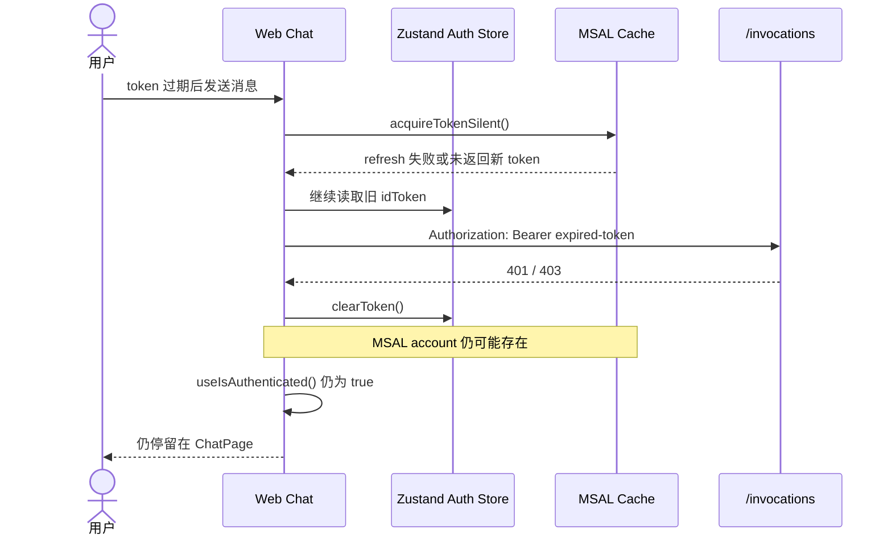

# Bug 18: 前端登录 token 过期后未自动登出并继续发送旧 token

## 现象

用户完成 Web Chat 登录后，如果页面保持打开直到 ID Token 过期，前端仍可能继续
显示 ChatPage，并在后续 `/invocations` 请求中携带已经过期的 token。用户不会被
自动带回 Landing Page，也没有收到明确的重新登录提示。

## 复现步骤

1. 登录 Web Chat，并保持页面与 Session 不关闭。
2. 等待当前 ID Token 超过 `exp`。
3. 在聊天界面发送一条新消息。
4. 在 Browser DevTools Network 中检查 `/invocations` 请求及响应。
5. 观察页面是否仍保持登录状态，以及 `Authorization` header 是否仍使用旧 token。

## 当前行为

## 疑似根因

以下判断基于当前代码阅读，需在 Implementation 阶段通过测试确认：

1. `getRequestToken()` 检测到 token 即将过期后会调用
   `acquireIdTokenSilently()`；如果 silent refresh 返回 `null`，当前逻辑不会清除
   或丢弃旧 `idToken`，请求仍可能携带原 token。
2. `/invocations` 返回 401/403 后，Client 只调用 Zustand
   `clearToken()`，没有清理 MSAL account/session 或触发重新登录。
3. 页面路由状态由 MSAL `useIsAuthenticated()` 决定，而不是 Zustand 中是否存在
   可用 token。因此只清空 Zustand 不一定会让用户退出 ChatPage。
4. 当前缺少覆盖“token 已过期 + silent refresh 失败 + 401/403”的完整 UI 回归测试。

## 预期行为

- 请求发送前不得使用已过期或无法刷新的 token。
- silent refresh 成功时，使用新 token 发送请求，用户无需感知。
- silent refresh 无法恢复登录状态时，停止请求并进入统一的 signed-out 状态。
- 401/403 经一次受控 refresh/retry 后仍失败时，不得继续循环发送旧 token。
- 用户应返回 Landing Page 或看到明确的“登录已过期，请重新登录”入口。
- Zustand、MSAL cache/account 和页面认证状态保持一致。

## 修复范围

### In Scope

- 梳理并统一 Client 的 token expiry、silent refresh、401/403 retry 和 logout 状态转换。
- 修复 refresh 失败后继续复用旧 token 的行为。
- 确保不可恢复的认证失败会清理本地认证状态并退出 ChatPage。
- 增加 Client 单元/集成测试及 E2E regression test。
- 根据最终方案同步 `architecture/frontend_architecture.md` 的 Inbound Auth 生命周期。

### Out of Scope

- 修改 AgentArts Gateway 的 JWT 校验规则。
- 修改 Microsoft Entra ID 的 token lifetime policy。
- Outbound OAuth Auth Card 或 Microsoft Graph access token 生命周期。
- 引入新的 Identity Provider。

## 验收标准

- [x] 已过期 token 不会出现在新的 `/invocations` 请求 header 中。
- [x] token 临近过期且 silent refresh 成功时，请求使用刷新后的 token。
- [x] silent refresh 失败时，不发送旧 token，并将用户切换到 signed-out 状态。
- [x] 401/403 最多触发一次 refresh/retry；重试仍失败后自动登出，不形成请求循环。
- [x] 自动登出后 ChatPage 不再显示，用户可从 Landing Page 重新登录。
- [x] Zustand 与 MSAL 的认证状态在自动登出后保持一致。
- [x] 刷新页面后不会从 MSAL cache 恢复已经失效的登录状态。
- [x] `npm run test` 和 `npm run build` 通过。
- [x] `personal-assistant-e2e` 中新增并通过 token expiry regression test。

## Affected Specs / Architecture Docs

| 文档 | 影响 |
|------|------|
| `personal-assistant-meta/architecture/frontend_architecture.md` | 补充 Inbound Auth token refresh、失效和自动登出的状态转换 |
| `personal-assistant-meta/specs/overall_specifications.md` | Implementation 阶段确认是否需要补充登录失效后的用户体验要求 |

## 参考实现

| 文件 | 关联点 |
|------|--------|
| `personal-assistant-client/src/lib/auth.ts` | `acquireIdTokenSilently()` |
| `personal-assistant-client/src/lib/chat/chat-api-client.ts` | 请求前 refresh、Authorization header、401/403 retry |
| `personal-assistant-client/src/lib/chat/jwt.ts` | token `exp` 检测 |
| `personal-assistant-client/src/stores/auth-store.ts` | Zustand token 状态 |
| `personal-assistant-client/src/main.tsx` | MSAL event 与 Zustand 同步 |
| `personal-assistant-client/src/App.tsx` | `useIsAuthenticated()` 决定 ChatPage/LandingPage |
