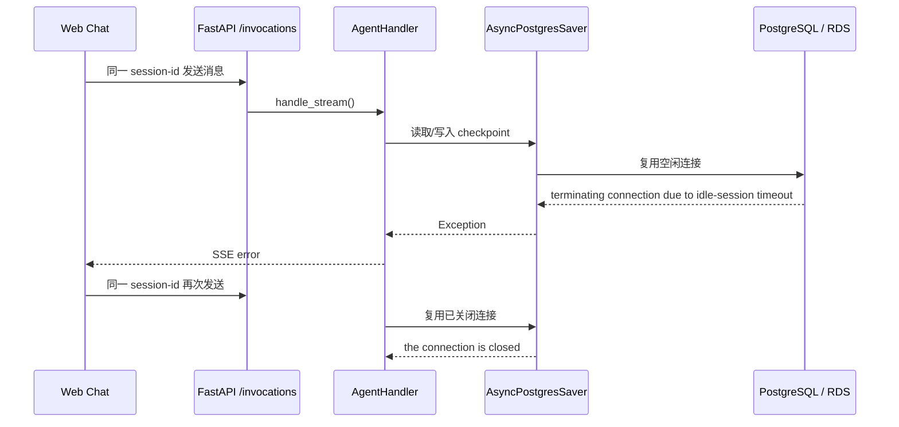

# Bug 19: PostgreSQL idle-session timeout 后同一 Chat Session 持续失败

## 现象

用户在 Web Chat 中持续复用同一个 `x-hw-agentarts-session-id` 时，前半天可正常对话。
长时间空闲后，同一个 Session 的下一次 `/invocations` 可能首次返回：

```text
terminating connection due to idle-session timeout
```

之后继续使用同一个 Session 请求，会稳定返回：

```json
{"error": "the connection is closed", "done": true}
```

点击“创建新对话”生成新的 Session ID 后，错误暂时消失。

## 复现步骤

1. 部署带 `POSTGRES_DSN` 的 Service，使 LangGraph 使用 `AsyncPostgresSaver`。
2. 使用同一个用户和同一个 `x-hw-agentarts-session-id` 连续对话，确认多轮上下文可恢复。
3. 保持 Runtime 进程存活，但让数据库连接空闲超过 RDS/PostgreSQL
   `idle_session_timeout`。
4. 再次使用同一个 Session 发送 `/invocations` 请求。
5. 观察第一次请求出现 `terminating connection due to idle-session timeout`，
   后续请求出现 `the connection is closed`。

## 根因



`AsyncPostgresSaver` 持有的数据库连接在长时间 idle 后被服务端关闭。当前
`AgentHandler` 没有在 checkpoint 连接失效后重新打开 persistent Checkpointer，
因此同一 Runtime 进程会继续复用已关闭连接。

## 预期行为

- 同一个 Chat Session 即使在数据库 idle connection 被关闭后，也应自动恢复。
- 首次检测到可恢复的 checkpoint connection 错误时，Service 应重新打开
  persistent Checkpointer、刷新 Agent Bundle，并对当前请求重试一次。
- Streaming 请求在尚未向客户端输出 token 前可以安全重试；若已输出部分内容，则
  不重复输出，继续返回受控 error。
- 用户不需要点击“创建新对话”来恢复服务。

## 修复范围

### In Scope

- 在 `AgentHandler` 中识别 PostgreSQL idle timeout / closed connection 类错误。
- 为 sync `/invocations` 增加一次 checkpointer restart + retry。
- 为 streaming `/invocations` 增加“输出前失败才 retry”的保护。
- 增加 Service unit regression tests。

### Out of Scope

- 修改 RDS `idle_session_timeout` 参数。
- 改变 Chat Session ID 生成规则。
- 重写 LangGraph checkpoint schema。
- 引入新的数据库连接池框架。

## 验收标准

- [ ] sync invocation 首次遇到 `terminating connection due to idle-session timeout`
      后会重启 checkpointer 并重试成功。
- [ ] streaming invocation 在输出 token 前遇到 `the connection is closed`
      后会重启 checkpointer 并重试成功。
- [ ] streaming invocation 已输出 token 后不会重复 retry 导致重复内容。
- [ ] 非 checkpoint 连接错误仍按原有错误路径返回。
- [ ] `uv run pytest tests/test_agent_handler.py tests/test_checkpointer.py` 通过。

## Affected Specs / Architecture Docs

| 文档 | 影响 |
|------|------|
| `personal-assistant-meta/architecture/session-state-management.md` | 后续可补充 persistent Checkpointer stale connection 自愈策略 |
| `personal-assistant-meta/architecture/backend_architecture.md` | 后续可补充 `/invocations` 对 checkpoint 连接失效的一次性 retry 策略 |

## 参考实现

| 文件 | 关联点 |
|------|--------|
| `personal-assistant-service/app/agent_handler.py` | `AsyncPostgresSaver` 生命周期、sync/stream invocation retry |
| `personal-assistant-service/tests/test_agent_handler.py` | idle timeout / closed connection regression tests |
