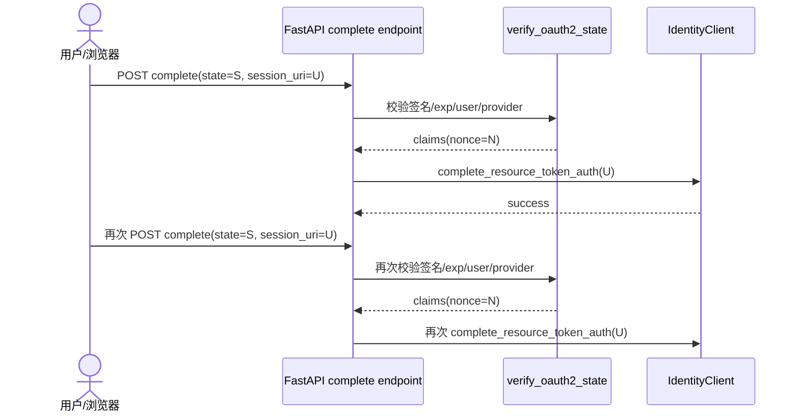

# Bug 20: OAuth2 callback state nonce 未消费，replay protection 未生效

## 现象

当前 Calendar OAuth2 callback flow 已经引入 signed `state`，并在 state claims 中包含
`nonce` 与 `exp`。但同一个有效 `state` 在 TTL 窗口内可被重复提交到
`/invocations/auth/oauth2/complete`，Service 仍会把它当作新的合法 callback 继续处理。

也就是说，当前实现完成了：

- state 签名校验；
- `user_id` / provider 绑定；
- expiry 校验；

但没有真正完成 “single-use state” 的 replay protection。

## 复现步骤

1. 通过 `/invocations` 触发一次 Calendar OAuth2 授权，拿到有效 `state`。
2. 使用可信 `user_id` header 调用
   `/invocations/auth/oauth2/complete`，传入合法的 `provider`、`session_uri`
   和该 `state`。
3. 在 `oauth2_pending_auth_ttl_seconds` 过期前，重复发送完全相同的 complete request。
4. 观察 Service 是否再次把该 callback 当作 fresh request 处理，并再次调用
   `IdentityClient.complete_resource_token_auth(...)`。

## 当前行为

当前代码中虽然存在：

- `is_oauth2_state_completed(claims)`
- `mark_oauth2_state_completed(claims)`

但 complete endpoint 未使用这些 helper，因此 nonce 从未在成功后被标记为已消费。

## 根因

1. `verify_oauth2_state(...)` 只验证 state 的完整性、时效性和主体绑定，不检查
   nonce 是否已经完成。
2. `complete_oauth2_auth(...)` 调用 `verify_oauth2_state(...)` 后，没有基于返回 claims
   做 replay guard，也没有在成功后调用 `mark_oauth2_state_completed(...)`。
3. 当前测试覆盖了 missing/invalid state，但没有覆盖 “同一 valid state 重复提交”
   的 replay regression。

## 预期行为

- 同一个 OAuth2 `state` 应为 single-use。
- 首次合法 callback 成功后，应将该 `nonce` 标记为已消费。
- 重复 callback 不应再次触发新的
  `IdentityClient.complete_resource_token_auth(...)` 调用。
- 对重复 callback 的用户可见结果应受控且可恢复：
  - 要么返回 idempotent success / `already_complete`；
  - 要么返回明确的安全错误；
  - 但不能把它继续当作 fresh callback。

## 修复范围

### In Scope

- 在 Service callback complete 路径中接入 nonce replay guard。
- 为首次 complete 成功后的 nonce 消费建立明确语义。
- 增加 Service regression tests，覆盖：
  - 首次成功 complete；
  - 重复 callback；
  - invalid / expired state 既有行为不回退。
- 在 Implementation 阶段明确当前 in-memory nonce store 的单进程限制，并决定：
  - MVP 先保留为 known limitation；
  - 或直接迁移到 shared store。

### Out of Scope

- 重做整个 Calendar OAuth2 架构。
- 修改 Microsoft Entra / AgentArts provider 配置。
- 在浏览器侧保存 third-party access token。
- 在本 issue 中引入新的分布式缓存基础设施，除非 Implementation 评估认为
  单进程 guard 不足以满足当前部署模型。

## 验收标准

- [ ] 首次合法 callback 仍可成功完成 OAuth2 complete。
- [ ] 同一 `state` 在 TTL 内重复提交时，不会再次触发新的
      `IdentityClient.complete_resource_token_auth(...)` 调用。
- [ ] 重复 callback 返回受控结果（idempotent success 或安全错误），不会形成惊吓式失败。
- [ ] 既有 invalid signature、expired state、user mismatch、provider mismatch 的
      403 行为保持不变。
- [ ] `uv run pytest tests/test_oauth2_complete.py tests/test_main.py` 通过。

## Affected Specs / Architecture Docs

| 文档 | 影响 |
|------|------|
| `personal-assistant-meta/architecture/backend_architecture.md` | 补充 OAuth2 complete endpoint 的 replay / idempotency 语义 |
| `personal-assistant-meta/issues/features/feature-15-calendar-agentarts-full-oauth2/plan.md` | 对账原计划中的 replay guard 承诺与已知限制 |

## 参考实现

| 文件 | 关联点 |
|------|--------|
| `personal-assistant-service/app/oauth2_state.py` | `verify_oauth2_state`、`is_oauth2_state_completed`、`mark_oauth2_state_completed` |
| `personal-assistant-service/app/main.py` | `/invocations/auth/oauth2/complete` callback complete flow |
| `personal-assistant-service/tests/test_oauth2_complete.py` | replay regression tests |
| `personal-assistant-meta/issues/features/feature-15-calendar-agentarts-full-oauth2/issue.md` | AC3: `state` / `session_uri` 做 CSRF 与 replay 防护 |
| `personal-assistant-meta/issues/features/feature-15-calendar-agentarts-full-oauth2/plan.md` | 已承诺 in-memory used-nonce store 与 duplicate callback 语义 |
