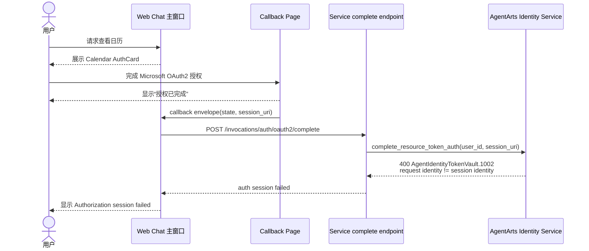

# Bug 21: Calendar OAuth2 complete 偶发 session identity mismatch

## 现象

Feature 15 Calendar OAuth2 授权流程中，用户在前端授权页面看到绿色成功提示：

> 日历授权已完成，可以关闭此窗口并重试刚才的问题。

但回到 Web Chat 主页面后，聊天页同时出现授权失败提示：

```text
Authorization session failed. The user may have denied access or the session expired.
```

Service 端日志显示 AgentArts Identity Token Vault 在
`complete_resource_token_auth` 阶段返回 400：

```text
2026-06-28T12:29:02.628+00:00 [WARNING] app:
Calendar OAuth2 complete failed
provider=m365-calendar-provider
user_id=JiVQK-iNU4PcnLxBpkFu_oQmC8mWpYTDMNq8LYQDPxc
error_type=ClientRequestException
error=ClientRequestException - {
  status_code:400,
  request_id:e22477bb697ff87f0cdd30c0feda6584,
  error_code:AgentIdentityTokenVault.1002,
  error_msg:The identity in the request does not match the session identity information,
  encoded_authorization_message:None
}
```

该问题为偶发，不是稳定复现。用户体感是“授权页面已经成功，但聊天页认为授权 session
失败或过期”。

## 影响

- 用户无法稳定完成 Calendar Tool 的 Microsoft 365 授权。
- UI 状态出现冲突：callback 页面显示 success，主聊天页显示 failure。
- Calendar Tool 后续重试可能仍无法读取日历，破坏 feature-15 的授权完成闭环。
- 错误文案把 identity mismatch 归因成用户拒绝授权或 session 过期，排障信息不准确。

## 复现线索

1. 在 Web Chat 中发送日历查询，例如“查看今日 calendar”。
2. 点击 Calendar AuthCard 进入 Microsoft / AgentArts OAuth2 授权页。
3. 完成授权后，callback 页面显示授权成功。
4. 回到主聊天窗口，观察 AuthCard / system message 是否出现
   `Authorization session failed...`。
5. 检查 Service 日志是否存在
   `AgentIdentityTokenVault.1002` 与
   `The identity in the request does not match the session identity information`。

## 当前行为



## 初步怀疑方向

本 bug 先记录生产现象，不在 issue 阶段锁死根因。Implementation 阶段需重点排查：

- Service complete endpoint 使用的可信 `user_id` 是否与创建 AgentArts OAuth2
  `session_uri` 时的 runtime identity 完全一致。
- `state` / pending auth record 中绑定的 user identity、provider、session 与
  complete request 中的 server-bound user 是否可能跨浏览器窗口、跨 tab、跨登录态或
  reset session 后错配。
- 主聊天窗口 callback coordinator 是否可能处理旧的 callback envelope、重复 callback
  或 stale AuthCard。
- callback 页面是否过早展示“授权完成”，没有等待主窗口 complete API 的真实结果。
- AgentArts Gateway / Cloudflare Pages proxy 是否在 complete request 上丢失或替换了
  inbound identity 相关 header。
- 与 Bug 20 的 replay / duplicate callback 场景是否互相放大。

## 预期行为

- callback 页面只有在主窗口 complete API 真正成功后，才展示最终“授权完成”状态。
- Service 调用 `complete_resource_token_auth` 时使用的 identity 必须与创建
  AgentArts OAuth2 session 的 identity 一致。
- 如果 AgentArts 返回 `AgentIdentityTokenVault.1002`，前端应展示准确、可恢复的错误，
  不应误导为用户拒绝授权或普通 session 过期。
- 重复 callback、旧 callback、跨 tab callback 应被识别并返回受控结果，不应污染当前
  AuthCard 状态。

## 修复范围

### In Scope

- 排查并修复 Calendar OAuth2 complete flow 中 identity / session binding 偶发错配。
- 对 callback 页面与主窗口 AuthCard 的成功/失败状态建立一致语义。
- 增加结构化日志，至少能关联：
  - provider；
  - server-bound user_id；
  - state nonce / pending auth id；
  - session_uri hash；
  - AgentArts request_id；
  - complete result。
- 增加 Service / Client / E2E regression tests，覆盖 identity mismatch、stale callback
  和 duplicate callback 的用户可见状态。

### Out of Scope

- 重做整个 AgentArts OAuth2 架构。
- 修改 Microsoft Entra App 的权限范围，除非排查证明 provider 配置是根因。
- 在浏览器保存 Microsoft access token 或平台 token。
- 将非 Calendar 工具迁移到 complete flow。

## 验收标准

- [ ] Calendar OAuth2 callback 成功时，callback 页面与 Web Chat 主窗口状态一致。
- [ ] `complete_resource_token_auth` 不再因项目侧 identity/session 错配偶发返回
      `AgentIdentityTokenVault.1002`。
- [ ] 真实 `AgentIdentityTokenVault.1002` 场景有明确日志与用户可恢复提示。
- [ ] stale / duplicate callback 不会把当前 AuthCard 标记为失败。
- [ ] 相关 Service tests、Client tests 和 E2E regression 通过。

## Affected Specs / Architecture Docs

| 文档 | 影响 |
|------|------|
| `personal-assistant-meta/issues/features/feature-15-calendar-agentarts-full-oauth2/issue.md` | 对齐 callback page 与主窗口 complete API 的成功语义 |
| `personal-assistant-meta/issues/features/feature-15-calendar-agentarts-full-oauth2/plan.md` | 补充 identity/session mismatch 排查与回归验证 |
| `personal-assistant-meta/architecture/backend_architecture.md` | 如修复改变 OAuth2 complete endpoint 语义，需要同步 |

## 参考实现 / 排查入口

| 路径 | 关联点 |
|------|--------|
| `personal-assistant-service/app/main.py` | `/invocations/auth/oauth2/complete` complete endpoint |
| `personal-assistant-service/app/oauth2_state.py` | signed state、pending auth、nonce / replay guard |
| `personal-assistant-service/app/tools/calendar_tools.py` | Calendar Tool 与 AgentArts Identity SDK provider 使用 |
| `personal-assistant-client/src/` | AuthCard、callback page、主窗口 callback coordinator |
| `personal-assistant-e2e/tests/` | Calendar OAuth2 授权回归测试 |
