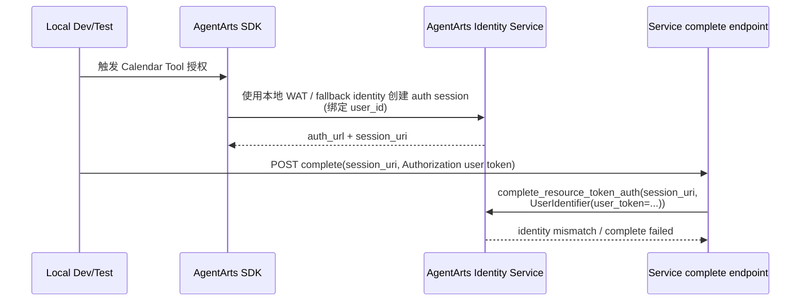

# Bug 22: Calendar OAuth2 本地 complete 使用 user_token 与 WAT identity 不匹配

## 现象

Feature 15 Calendar OAuth2 local test 失败。原因是本地测试环境中，创建 / 获取
AgentArts Resource Token Auth session 时使用的 workload identity WAT 绑定的是
`user_id` 维度；但 complete API 调用 `complete_resource_token_auth` 时传入的是
`UserIdentifier(user_token=...)`。

当前 complete 调用形态：

```python
client.complete_resource_token_auth(
    session_uri=complete_request.session_uri,
    user_identifier=UserIdentifier(user_token=user_token),
)
```

这导致本地测试里的 request identity 与 session identity 不一致，Calendar OAuth2
complete 无法稳定完成。该问题和 Bug 21 的生产偶发 identity mismatch 相关，但触发条件
更明确：本地 / test 环境的 WAT identity strategy 与 complete API 的
`UserIdentifier` strategy 不一致。

## 影响

- Feature 15 的 local integration / manual test 不能可靠跑通。
- 本地开发者容易误判为 Microsoft OAuth2、AgentArts provider 配置或 callback relay
  问题。
- 本地测试无法覆盖真实的 complete success path，削弱后续修复 Bug 21 的信心。
- 如果测试 fixture 只 mock `user_token` success，会掩盖本地 runtime 与 AgentArts
  Identity Service 的真实身份绑定差异。

## 复现线索

1. 在本地启动 Service 与 Client。
2. 使用本地 dev header / local identity 配置触发 Calendar OAuth2 授权。
3. 完成浏览器授权并让主聊天窗口调用
   `POST /invocations/auth/oauth2/complete`。
4. 观察 complete API 调用是否使用：

   ```python
   UserIdentifier(user_token=user_token)
   ```

5. 检查本地 WAT / AgentArts SDK fallback 创建 session 时实际绑定的是 `user_id`
   还是 `user_token`。
6. 如果 session 创建身份为 `user_id`，complete 阶段传 `user_token` 会形成 identity
   mismatch。

## 当前行为



## 根因假设

Feature 15 架构文档已经强调 `UserIdentifier` 的 `user_id` 与 `user_token` 互斥，并倾向
生产 Gateway JWT 路径使用 `user_token`。但本地 dev/test 没有生产 Gateway 注入的同源
身份上下文：

- local WAT / SDK fallback path 可能以 `user_id` 维度创建 auth session；
- complete endpoint 固定从 `Authorization` header 提取 `user_token`；
- 这两者并不是同一个 AgentArts identity 维度，因此 complete 阶段无法匹配 session。

## 预期行为

- 本地 dev/test 的 session 创建 identity 与 complete identity 必须一致。
- Production Gateway 路径仍可使用 `UserIdentifier(user_token=...)`，前提是 session
  创建阶段也绑定同一 user token identity。
- Local dev/test 应有明确策略：
  - 要么完整模拟 Gateway JWT / WAT，使创建与 complete 都走 `user_token`；
  - 要么在 local-only 路径使用 `UserIdentifier(user_id=...)`，并清晰隔离生产路径；
  - 要么在测试中显式跳过真实 AgentArts complete，并用 contract test 覆盖两种策略。
- 错误日志应打印 identity strategy（不打印 token 明文），例如 `user_token` /
  `user_id` / `local_fallback`，方便定位。

## 修复范围

### In Scope

- 梳理 Feature 15 Calendar OAuth2 session 创建阶段与 complete 阶段各自使用的
  identity source。
- 为 local dev/test 定义明确的 `UserIdentifier` 选择策略。
- 防止 local test 用 `user_id` 创建 session、再用 `user_token` complete。
- 增加 regression tests 覆盖：
  - production-like `user_token` path；
  - local `user_id` / fallback path；
  - identity strategy mismatch 的明确错误与日志。
- 如架构文档当前只描述 production `user_token` 路径，补充 local dev/test 约束。

### Out of Scope

- 修改 Microsoft Entra App scope 或 redirect URI。
- 在浏览器保存或生成 AgentArts workload token。
- 把所有工具统一迁移到同一种 User Federation complete strategy。
- 在本 issue 中解决 Bug 21 的生产偶发跨 tab / stale callback 问题，除非排查证明同根。

## 验收标准

- [ ] Feature 15 local Calendar OAuth2 test 可以稳定通过，或明确由可重复的 mock /
      contract test 替代真实 complete。
- [ ] 本地 session 创建 identity 与 complete identity 一致，不再出现
      WAT `user_id` vs `UserIdentifier(user_token=...)` mismatch。
- [ ] Production Gateway JWT 路径继续使用安全的 server-bound user identity，不回退为
      浏览器可伪造的 user id。
- [ ] Service 日志包含 identity strategy 与 AgentArts request_id，但不泄露 token。
- [ ] `uv run pytest tests/test_oauth2_complete.py tests/test_main.py` 通过。

## Affected Specs / Architecture Docs

| 文档 | 影响 |
|------|------|
| `personal-assistant-meta/architecture/auth/feature-15-calendar-oauth2-architecture.md` | 补充 local dev/test 与 production Gateway 的 `UserIdentifier` 策略差异 |
| `personal-assistant-meta/issues/features/resolved/feature-15-calendar-agentarts-full-oauth2/plan.md` | 对账实现计划中的 local fallback / WAT 假设 |
| `personal-assistant-meta/issues/bugs/bug-21-calendar-oauth2-complete-session-identity-mismatch/issue.md` | 关联生产 identity mismatch 排查，但保持独立修复入口 |

## 参考实现 / 排查入口

| 路径 | 关联点 |
|------|--------|
| `personal-assistant-service/app/main.py` | `/invocations/auth/oauth2/complete` 中 `UserIdentifier(user_token=...)` 调用 |
| `personal-assistant-service/app/auth.py` | `extract_authorization_user_token`、`extract_gateway_user_id`、`extract_workload_access_token` |
| `personal-assistant-service/tests/test_oauth2_complete.py` | complete endpoint 当前断言 user_token path |
| `personal-assistant-meta/architecture/auth/feature-15-calendar-oauth2-architecture.md` | `UserIdentifier` 参数约束和 production path 说明 |
