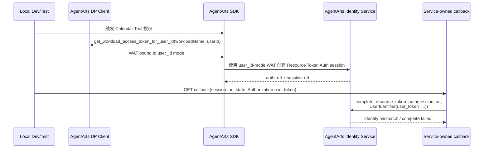

# Bug 22: Calendar OAuth2 本地 WAT identity mode 与 complete UserIdentifier 不匹配

> Reopened / refined: Bug 21 已修复 legacy complete endpoint 与 production callback
> 主流程问题，但本 issue 仍用于追踪 **local development / test** 下的 AgentArts
> workload access token identity mode 与 callback complete `UserIdentifier` 不一致问题。
> 当前入口是 Service-owned callback
> `/invocations/auth/oauth2/callback/m365-calendar`，不是已移除的
> `POST /invocations/auth/oauth2/complete`。

## 现象

Feature 15 Calendar OAuth2 线上使用正常，但本地 local test / manual test 失败。
核心原因不是“创建 auth session”本身，而是 **获取 AgentArts workload access token
时使用的 user identity mode** 与 callback complete 使用的 `UserIdentifier` 不一致。

AgentArts 有两种 user-scoped WAT 获取方式：

```python
dp_client.get_workload_access_token_for_jwt(workloadName, userToken)   # JWT mode
dp_client.get_workload_access_token_for_user_id(workloadName, userId)  # user_id mode
```

线上 remote 环境中，AgentArts Gateway 代替业务服务执行 JWT mode，并通过
`X-HW-AgentGateway-Workload-Access-Token` 注入 WAT；此时 callback complete 使用
`UserIdentifier(user_token=...)` 是正确的。

本地 local 环境没有 Gateway 代取 WAT。为了让本地调用 AgentArts Identity 能运行，
服务需要显式使用 `get_workload_access_token_for_user_id(workloadName, userId)`
获取 WAT；此时 callback complete 也必须使用 `UserIdentifier(user_id=...)`。

当前 callback complete 固定使用：

```python
client.complete_resource_token_auth(
    session_uri=callback.session_uri,
    user_identifier=UserIdentifier(user_token=user_token),
)
```

这导致本地测试里的 WAT identity mode 与 complete identity mode 不一致，Calendar
OAuth2 complete 无法稳定完成。该问题和 Bug 21 的 production identity mismatch
相关，但触发条件更明确：local / test 环境的 WAT identity strategy 与 complete API 的
`UserIdentifier` strategy 不一致。

## 影响

- Feature 15 的 local integration / manual test 不能可靠跑通。
- 本地开发者容易误判为 Microsoft OAuth2、AgentArts provider 配置或 callback relay
  问题。
- 本地测试无法覆盖真实的 complete success path，削弱后续修复 Bug 21 的信心。
- 如果测试 fixture 只 mock `user_token` success，会掩盖本地 runtime 与 AgentArts
  Identity Service 的真实身份绑定差异。

## 复现线索

1. 在本地启动 Service 与 Client。
2. 使用本地 dev header / local identity 配置触发 Calendar OAuth2 授权。
3. 触发 Calendar tool，观察本地是否通过
   `get_workload_access_token_for_user_id(workloadName, userId)` 获取 WAT。
4. 完成浏览器授权后，Microsoft redirect 到 Service-owned callback：
   `/invocations/auth/oauth2/callback/m365-calendar`。
5. 观察 callback complete 是否仍固定使用：

   ```python
   UserIdentifier(user_token=user_token)
   ```

6. 如果本地 WAT 是通过 `user_id` mode 获取，但 complete 阶段传 `user_token`，
   AgentArts Identity 会看到 identity mismatch。

## 当前行为


```mermaid
sequenceDiagram
    participant Local as Local Dev/Test
    participant DP as AgentArts DP Client
    participant SDK as AgentArts SDK
    participant IdSvc as AgentArts Identity Service
    participant API as Service-owned callback

    Local->>SDK: 触发 Calendar Tool 授权
    SDK->>DP: get_workload_access_token_for_user_id(workloadName, userId)
    DP-->>SDK: WAT bound to user_id mode
    SDK->>IdSvc: 使用 user_id-mode WAT 创建 Resource Token Auth session
    IdSvc-->>SDK: auth_url + session_uri
    Local->>API: GET callback(session_uri, state, Authorization user token)
    API->>IdSvc: complete_resource_token_auth(session_uri,<br/>UserIdentifier(user_token=...))
    IdSvc-->>API: identity mismatch / complete failed
```

## 根因假设

Feature 15 架构文档已经强调 `UserIdentifier` 的 `user_id` 与 `user_token` 互斥，并倾向
生产 Gateway JWT 路径使用 `user_token`。但本地 dev/test 没有生产 Gateway 注入的同源
身份上下文：

- remote production：AgentArts Gateway 代业务服务执行 JWT mode WAT 获取，相当于
  `get_workload_access_token_for_jwt(workloadName, userToken)`，并把 WAT 注入 Runtime；
- local development：服务需要自己执行 user_id mode WAT 获取，即
  `get_workload_access_token_for_user_id(workloadName, userId)`；
- 当前 Service-owned callback 固定从 `Authorization` header 提取 `user_token` 并传
  `UserIdentifier(user_token=...)`；
- 因此 local 路径形成 `user_id WAT -> user_token complete` 的不一致组合。

正确约束应为：

| WAT identity mode | WAT 来源 | Callback Complete |
|-------------------|----------|-------------------|
| JWT mode | Gateway 注入，或显式 `get_workload_access_token_for_jwt(workloadName, userToken)` | `UserIdentifier(user_token=user_token)` |
| user_id mode | 本地显式 `get_workload_access_token_for_user_id(workloadName, userId)` | `UserIdentifier(user_id=user_id)` |

## 预期行为

- 获取 WAT 时使用哪种 user identity mode，callback complete 就必须使用同一种
  `UserIdentifier` mode。
- Production Gateway 路径继续使用 JWT mode WAT + `UserIdentifier(user_token=...)`。
- Local dev/test 默认使用 user_id mode WAT +
  `UserIdentifier(user_id=state_claims.user_id)`。
- `PA_LOCATION` / `PA_STAGE` 可作为上层环境矩阵：
  - `PA_LOCATION=remote` 默认 identity mode 为 `jwt`；
  - `PA_LOCATION=local` 默认 identity mode 为 `user_id`；
  - `PA_STAGE=prod` 不允许把 complete strategy 降级为 `user_id`。
- 应提供显式 override，例如 `AGENTARTS_USER_IDENTITY_MODE=auto|jwt|user_id`，
  但 `remote + prod + user_id` 必须 fail-fast。
- 错误日志应打印 identity strategy（不打印 token 明文），例如 `user_token` /
  `user_id` / `local_fallback`，方便定位。

## Solution Design

### 1. Environment matrix

将运行环境拆成两个独立维度，而不是继续使用单一 `APP_ENV`：

| 维度 | 配置 | 可选值 | 职责 |
|------|------|--------|------|
| Location | `PA_LOCATION` | `local` / `remote` | 表示当前进程在哪里运行，决定是否依赖 AgentArts Gateway 注入 WAT |
| Stage | `PA_STAGE` | `dev` / `beta` / `prod` | 表示当前进程连接哪一套资源，决定安全 guardrail 与资源选择 |

环境矩阵：

| `PA_LOCATION` \ `PA_STAGE` | `dev` | `beta` | `prod` |
|----------------------------|-------|--------|--------|
| `local` | 本地开发默认路径，允许 user_id mode WAT | 本地连接 beta 资源，允许显式 override | 本地连接 prod 资源，必须显式 opt-in，禁止 user_id complete |
| `remote` | 云端 dev deployment | 云端 beta / staging deployment | 线上 production deployment，强制 JWT mode |

### 2. AgentArts user identity mode

新增一个显式配置表达 WAT / complete 必须一致的 identity mode：

```env
AGENTARTS_USER_IDENTITY_MODE=auto
# auto | jwt | user_id
```

`auto` 的派生规则：

| `PA_LOCATION` | `AGENTARTS_USER_IDENTITY_MODE=auto` 派生值 | WAT 获取方式 | Callback Complete |
|---------------|-------------------------------------------|--------------|-------------------|
| `remote` | `jwt` | AgentArts Gateway 注入 WAT，等价于 `get_workload_access_token_for_jwt(workloadName, userToken)` | `UserIdentifier(user_token=user_token)` |
| `local` | `user_id` | Service 显式调用 `get_workload_access_token_for_user_id(workloadName, userId)` | `UserIdentifier(user_id=user_id)` |

不要把 callback complete strategy 单独配置成另一个无关变量。它应当由
`AGENTARTS_USER_IDENTITY_MODE` 派生，避免出现 `user_id WAT -> user_token complete`
或 `JWT WAT -> user_id complete` 的交叉组合。

### 3. Service implementation shape

在 `app/settings.py` 增加 typed settings 与 validator：

```python
pa_location: Literal["local", "remote"] = "local"
pa_stage: Literal["dev", "beta", "prod"] = "dev"
agentarts_user_identity_mode: Literal["auto", "jwt", "user_id"] = "auto"
```

并提供派生属性：

```python
@property
def effective_agentarts_user_identity_mode(self) -> Literal["jwt", "user_id"]:
    if self.agentarts_user_identity_mode != "auto":
        return self.agentarts_user_identity_mode
    return "user_id" if self.pa_location == "local" else "jwt"
```

配置 guardrail：

```python
if self.pa_location == "remote" and self.pa_stage == "prod":
    if self.effective_agentarts_user_identity_mode != "jwt":
        raise ValueError("remote prod requires AGENTARTS_USER_IDENTITY_MODE=jwt")
```

在 local WAT acquisition 入口只根据 `effective_agentarts_user_identity_mode` 做分支：

```python
if settings.effective_agentarts_user_identity_mode == "user_id":
    wat = dp_client.get_workload_access_token_for_user_id(workloadName, user_id)
else:
    # remote 通常不调用这里，Gateway 已注入 WAT；
    # 若未来需要 remote-like local test，可显式走 jwt mode。
    wat = dp_client.get_workload_access_token_for_jwt(workloadName, user_token)
```

在 callback complete 入口抽一个 helper，确保 complete strategy 同源派生：

```python
def build_oauth2_complete_user_identifier(
    request: Request,
    state_user_id: str,
    settings: Settings,
) -> UserIdentifier:
    mode = settings.effective_agentarts_user_identity_mode
    if mode == "user_id":
        return UserIdentifier(user_id=state_user_id)

    user_token = extract_authorization_user_token(request)
    return UserIdentifier(user_token=user_token)
```

`main.py` callback 中只调用 helper，不再直接硬编码 `UserIdentifier(user_token=...)`：

```python
client.complete_resource_token_auth(
    session_uri=callback.session_uri,
    user_identifier=build_oauth2_complete_user_identifier(
        request=request,
        state_user_id=state_claims.user_id,
        settings=settings,
    ),
)
```

### 4. Security and testing guardrails

- 不允许 complete 失败后自动 fallback 到另一种 `UserIdentifier`。identity mismatch
  应暴露为配置 / 环境问题，而不是被 silent retry 掩盖。
- 不根据是否存在 `Authorization` header 自动猜 strategy。本地测试也可能携带
  `Authorization`，但 WAT 仍可能是 user_id mode。
- 不同时传 `user_id` 与 `user_token`，AgentArts Identity 会返回
  `AgentIdentityTokenVault.1015`。
- `remote + prod` 强制 `jwt` mode；`local + prod` 如需支持，应额外要求显式 opt-in，
  并保持只读 / debug 语义。
- 日志记录 `pa_location`、`pa_stage`、`effective_agentarts_user_identity_mode`、
  callback complete identity mode 和 AgentArts `request_id`；不记录完整 JWT、WAT、
  OAuth2 code 或 third-party access token。

## 修复范围

### In Scope

- 梳理 Feature 15 Calendar OAuth2 WAT 获取阶段与 callback complete 阶段各自使用的
  identity mode。
- 增加 typed settings，表达 location / stage / AgentArts user identity mode：
  - `PA_LOCATION=local|remote`
  - `PA_STAGE=dev|beta|prod`
  - `AGENTARTS_USER_IDENTITY_MODE=auto|jwt|user_id`
- 为 local dev/test 定义明确的 WAT 获取策略：
  `get_workload_access_token_for_user_id(workloadName, userId)`。
- 为 callback complete 定义与 WAT mode 一致的 `UserIdentifier` 选择策略。
- 防止 local test 用 `user_id` mode WAT，再用 `user_token` complete。
- 防止 remote prod 被配置为 `user_id` complete。
- 增加 regression tests 覆盖：
  - production-like JWT WAT + `UserIdentifier(user_token=...)` path；
  - local user_id WAT + `UserIdentifier(user_id=...)` path；
  - identity strategy mismatch 的明确错误与日志。
- 如架构文档当前只描述 production `user_token` 路径，补充 local dev/test 约束。

### Out of Scope

- 修改 Microsoft Entra App scope 或 redirect URI。
- 在浏览器保存、生成或传输 AgentArts workload token。
- 把所有工具统一迁移到同一种 User Federation complete strategy。
- 在本 issue 中解决 Bug 21 的生产偶发跨 tab / stale callback 问题，除非排查证明同根。

## 验收标准

- [ ] Feature 15 local Calendar OAuth2 test 可以稳定通过，或明确由可重复的 mock /
      contract test 替代真实 complete。
- [ ] 本地 WAT 获取使用 `get_workload_access_token_for_user_id(workloadName, userId)`，
      callback complete 使用 `UserIdentifier(user_id=...)`。
- [ ] Production Gateway JWT 路径继续使用 Gateway 注入 WAT +
      `UserIdentifier(user_token=...)`，不回退为浏览器可伪造的 user id。
- [ ] `remote + prod + AGENTARTS_USER_IDENTITY_MODE=user_id` 配置会 fail-fast。
- [ ] Service 日志包含 WAT identity mode / complete identity mode 与 AgentArts
      request_id，但不泄露 token。
- [ ] `uv run pytest tests/test_oauth2_callback.py tests/test_main.py` 通过。

## Affected Specs / Architecture Docs

| 文档 | 影响 |
|------|------|
| `personal-assistant-meta/architecture/auth/feature-15-calendar-oauth2-architecture.md` | 补充 local dev/test 与 production Gateway 的 WAT identity mode / `UserIdentifier` 策略差异 |
| `personal-assistant-meta/issues/features/resolved/feature-15-calendar-agentarts-full-oauth2/plan.md` | 对账实现计划中的 local fallback / WAT 假设 |
| `personal-assistant-meta/issues/bugs/bug-21-calendar-oauth2-complete-session-identity-mismatch/issue.md` | 关联生产 identity mismatch 排查，但保持独立修复入口 |

## 参考实现 / 排查入口

| 路径 | 关联点 |
|------|--------|
| `personal-assistant-service/app/main.py` | 当前 Service-owned callback 的 `complete_resource_token_auth` 调用 |
| `personal-assistant-service/app/auth.py` | `extract_authorization_user_token`、`extract_gateway_user_id`、`extract_workload_access_token`；需要与 local WAT acquisition mode 对齐 |
| `personal-assistant-service/app/settings.py` | 新增 location / stage / AgentArts user identity mode typed settings |
| `personal-assistant-service/tests/test_oauth2_callback.py` | Service-owned callback 当前断言 production-like user_token path |
| `personal-assistant-meta/architecture/auth/feature-15-calendar-oauth2-architecture.md` | `UserIdentifier` 参数约束和 production path 说明 |
