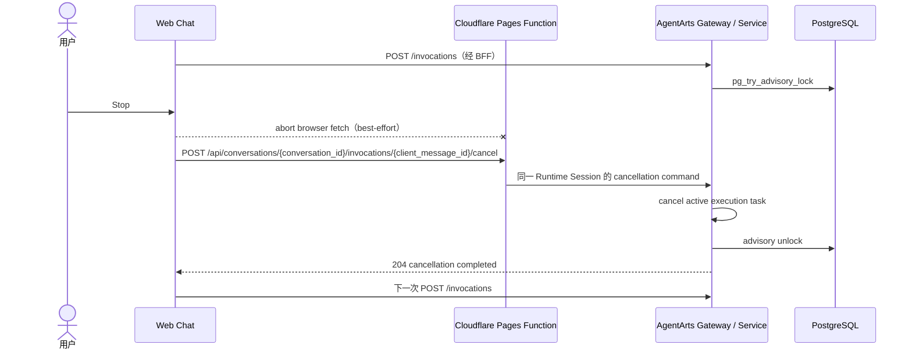

# Bug 23: 中断聊天后 Conversation 仍保持 busy

## 现象

Web Chat 正在接收 SSE 回复时，用户点击 Stop 中断生成并立即再次发送消息，新的
`POST /invocations` 返回：

```json
{"code":"conversation_busy","detail":"conversation is busy"}
```

等待上一轮 Agent 在 Service 端自然结束后才能继续发送。

## 根因

Client 已将 assistant-ui 的 `AbortSignal` 传给浏览器 `fetch()`，Service 也会在
SSE async generator 关闭时通过 `finally` 释放 PostgreSQL advisory lock；但
Browser、Cloudflare Pages、AgentArts Gateway 与 FastAPI 之间的 transport disconnect
不是可靠的业务取消协议。任一中间层未及时向上游传播断连，上一轮 execution 就会
继续运行并持有 Conversation lock。仅开启 Cloudflare `Request.signal` 仍无法保证
Gateway 后的 Service execution 被取消。

图类型：**Sequence Diagram（时序图）**。用于说明 transport abort 与显式 cancellation
command 的差异。



## 修复范围

- 保留 Browser `AbortSignal` 作为 best-effort UI/transport cancellation。
- 新增幂等
  `POST /api/conversations/{conversation_id}/invocations/{client_message_id}/cancel`
  cancellation command；`/invocations` 继续只表示 AgentArts Runtime 对话入口。
- Service 使用 active execution registry 定位并取消同 Runtime Session 的任务，在
  返回 204 前等待 advisory lock 释放。
- Client 在 Stop 时发送 cancellation command，并在同一 Conversation 的下一次 POST
  前等待 cancellation 完成。
- 增加 BFF route、Client sequencing 与 Service lock release 回归测试。
- 增加 Wrangler Pages dev、Service 与 PostgreSQL 的 full-stack 回归测试。

## 验收标准

- [x] 用户点击 Stop 后发送带原 `client_message_id` 的显式 cancellation command。
- [x] Service 的 SSE execution 被取消后立即释放 advisory lock。
- [x] 同一 Conversation 的下一次 POST 等待 cancellation 204 后再发送。
- [x] 真正并发且尚未取消的 Invocation 仍返回 `409 conversation_busy`。
- [x] Client tests、build、Service integration 与 full-stack E2E 通过。

## Affected Specs / Architecture Docs

| 文档 | 影响 |
|------|------|
| `architecture/api.md` | 增加 Invocation cancellation public route |
| `architecture/session-state-management.md` | 明确显式 cancellation command 与 active execution registry |
| `architecture/frontend_architecture.md` | 明确 Stop 与下一次发送的 sequencing |
| `architecture/backend_architecture.md` | 增加 Conversation-scoped cancellation route 与 Service registry |
| `architecture/cloud-service/cloudflare/pages.md` | 记录显式 Pages Function 与 local/production 映射 |
| `architecture/cloud-service/huaweicloud/agentarts.md` | 记录 AgentArts Runtime suffix 到 FastAPI path 的精确映射 |
| `architecture/devops/test/test-strategy.md` | 增加 Stop/cancel/continue full-stack regression |
| `issues/features/feature-14-multi-session-runtime-prewarm/plan.md` | 已定义 disconnect/cancel 释放 lock，本 Bug 补齐实现与测试 |

## Verification（2026-07-20）

- Client：`165 passed`；production build passed。
- Service：`334 passed, 9 skipped`；Ruff lint passed。
- E2E：Feature 14 Wrangler Pages full-stack `2 passed`；E2E Ruff lint/format passed。
- Pages Functions：Wrangler Worker compile passed；unit tests 分别断言 production Gateway
  suffix 和 local direct Service 使用相同 FastAPI cancellation path。
