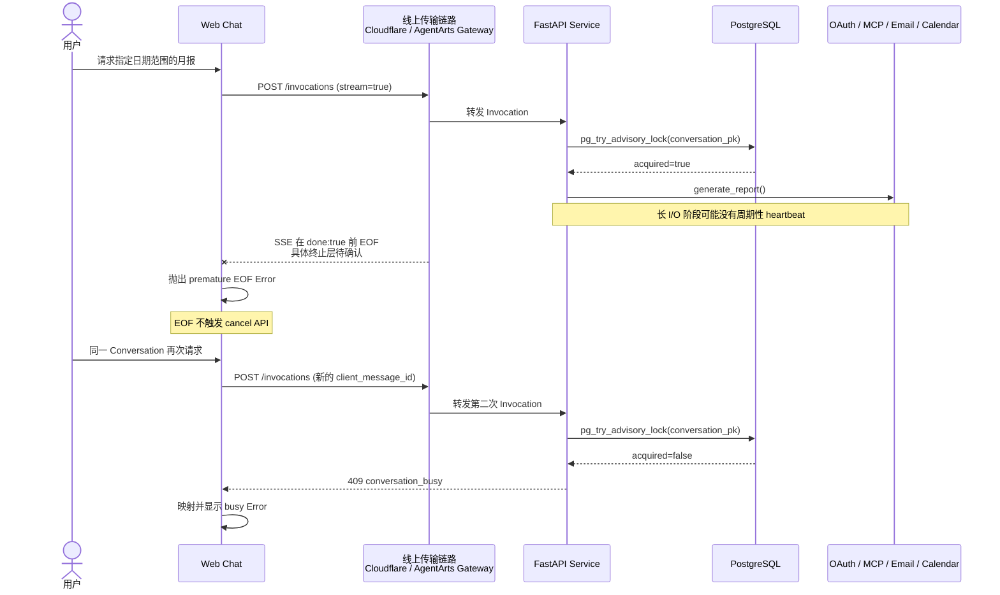

# Bug 27: Feature-18 在线上提前断流并使 Conversation 保持 busy

## 现象

线上部署后使用 Feature-18 `generate_report` 生成报表时，Web Chat 在报告完成前显示：

```text
The chat stream ended before a completion event.
```

用户随后在同一个 Conversation 再次请求月报，Web Chat 显示：

```text
This conversation is already processing a message. Try again when it finishes.
```

本地开发环境正常。线上实验记录了以下顺序：

1. 请求“写个月报，时间范围 2026.6.23-2026.7.23”，Chat 流在没有完成事件时结束。
2. 在同一个 Conversation 请求“写个月报，时间范围 2026.7.20-2026.7.29”。
3. 第二次请求收到 `conversation_busy` 对应的前端错误。

第二个错误是关键证据：第一次请求的浏览器响应已经结束，但同一 Conversation 的后端
Invocation 或其 PostgreSQL advisory lock 在第二次请求到达时仍未结束。


## 定位结论

### 已确认的应用故障链

这不是 DeepAgents、LangGraph 或 MCP SDK 生成的错误文案，而是项目自己的 Client 对两种
异常状态的映射。

| 现象 | 代码来源 | 能够证明的事实 |
|------|----------|----------------|
| `The chat stream ended before a completion event.` | [chat-adapter.ts:103](../../../../personal-assistant-client/src/lib/chat-adapter.ts#L103) | `ReadableStream` 已结束，但 Client 没有解析到 `done: true` |
| `This conversation is already processing...` | [chat-api-client.ts:93](../../../../personal-assistant-client/src/lib/chat/chat-api-client.ts#L93) | 第二次请求收到了 `409` 且错误码为 `conversation_busy` |
| `conversation_busy` | [main.py:541](../../../../personal-assistant-service/app/main.py#L541) | `InvocationService.prepare()` 未取得 Conversation lock |
| PostgreSQL lock conflict | [locks.py:38](../../../../personal-assistant-service/app/conversations/locks.py#L38) | `pg_try_advisory_lock(conversation_pk)` 在第二次请求时返回 false |

已确认的根因是 **premature EOF 后的 Invocation lifecycle 没有完成跨端收敛**：

1. Service 仅在 Agent 流正常结束、回复非空且 assistant message 持久化成功后发送
   `done: true`（[service.py:111](../../../../personal-assistant-service/app/invocations/service.py#L111)）。
2. Feature-18 在 OAuth、MCP Search/Detail、Email 和 Calendar I/O 期间可能形成较长的
   无业务 SSE 输出窗口；当前没有独立于 Agent event 的周期性 heartbeat。
3. 线上传输链路在 `done: true` 前结束了浏览器侧流。Client 因此抛出 premature EOF
   错误。
4. Client 只在 assistant-ui 的 `AbortSignal` 被触发时调用 cancel API
   （[chat-adapter.ts:52](../../../../personal-assistant-client/src/lib/chat-adapter.ts#L52)）；
   clean EOF 且缺少 `done: true` 的路径只抛错，不会取消或查询后端 Invocation。
5. 第一次 Invocation 或其 lock 因而可以继续存活到浏览器流结束之后。用户再次向同一个
   Conversation 发送消息时，PostgreSQL advisory lock 仍被占用，Service 返回
   `409 conversation_busy`。

图类型：**Sequence Diagram（时序图）**。用于说明线上 premature EOF 与随后
`conversation_busy` 的已确认顺序，以及尚未确定的传输终止边界。




## 预期行为

- Feature-18 使用用户指定日期范围完成报告，并最终发送 `done: true`。
- 任意长 Tool 调用期间，Invocation transport 保持可观测且活跃，不依赖 Tool 自己输出
  progress event。
- 如果 Client 在 `done: true` 前收到 EOF，应使用原 `client_message_id` 收敛后端
  Invocation；在 cancel 确认前禁止同一 Conversation 再次发送。
- 内部总 deadline 超时时，在连接仍可用时发送结构化 error SSE；外部连接已经断开时，
  Client 显示可恢复错误和 correlation ID，而不是把后端执行留在未知状态。
- 真正并行发送到同一 Conversation 时仍返回 `conversation_busy`，不得移除现有并发保护。
- Feature-17 的独立 GitHub MCP tools 和 session 语义保持可用，不因 Feature-18 修复回归。

## 修复方案（按优先级排序）

| 优先级 | 方案 | 原因 / 依据 | 风险 |
|--------|------|-------------|------|
| P0 | 在 Invocation SSE 层增加通用 heartbeat，而不是只在 `generate_report` 内写 progress | 覆盖 Feature-18 及所有长 Tool；能够验证并缓解 idle timeout，但不能绕过总执行 timeout | 低 |
| P0 | Client 在 premature EOF 路径调用现有 cancel API，并复用 cancellation barrier 等待 `204` | 直接修复“前端已失败、后端仍持锁、重试 busy”的生命周期缺口 | 中 |
| P0 | 增加 request ID、最后事件、source/search/detail phase、session/tool-call 数与 completion status 指标 | 先区分总 timeout、idle timeout、网络截断和后端卡住，避免继续凭估算定位 | 低 |
| P1 | 为 Report、Source、Search cursor 和 Detail 增加分层总 budget；内部超时返回结构化 warning/error | 单次 MCP 30 秒 timeout 不是总预算，当前一次报告可无界累加 | 中 |
| P1 | 核实 AgentArts 托管 Gateway 的流式 timeout/SSE 配置，并按官方能力调整 | heartbeat 对总 backend timeout 无效，必须确认平台 contract | 中 |
| P2 | 在不改变 Feature-17 公共 tool contract 的前提下评估 Report-scoped MCP session 复用、Detail 数量上限和数据源并行 | 降低暴露窗口，但不是 premature EOF 生命周期缺口的替代修复 | 中 |

实现不引入新的第三方库：heartbeat 使用标准 SSE comment/event，恢复流程复用已有 cancel
endpoint、cancellation barrier 和 PostgreSQL Conversation lock。

## Implementation Plan

### Service

- 在 `InvocationExecution.stream_sse()` 或其上层 transport wrapper 中泵送 Agent event，
  在等待下一业务事件时周期性发送 SSE heartbeat。
- 保证正常完成仍只有一个 terminal `done: true`；内部 exception/timeout 发送结构化 error。
- 为 report source、GitHub cursor round、Detail batch、MCP session/list_tools/tool call 增加
  duration 与 count metrics，并携带 Invocation correlation ID。
- 引入明确的 Report 总 budget 和阶段 budget；确保 timeout/cancel 的 `finally` 路径释放
  advisory lock 并注销 Invocation registry。

### Client

- 区分正常 terminal、SSE error、用户 Abort 和 premature EOF。
- premature EOF 时使用原 `conversation_id + client_message_id` 调用 cancel endpoint；成功前
  保持 cancellation barrier，失败时复用 Bug 26 的 `cancel_failed` / retry 交互。
- 校验流式响应 Content-Type，并在 EOF 时处理 decoder 尾部与完整 residual SSE frame；
  malformed/truncated frame 记录诊断信息，不静默吞掉。
- 用户可见错误使用稳定中文文案并附 correlation ID，避免直接暴露内部英文 fallback。

### Infra / Platform

- 核对 AgentArts Runtime/Gateway 的总调用 timeout、stream timeout、SSE strategy 与日志字段。
- 核对 Cloudflare Worker 的 request outcome、wall time、CPU time 和上游断开原因；不把 CPU
  time 与 wall time 混为一谈。

### E2E

- 增加 production-like proxy 测试：Agent 阻塞超过 heartbeat interval 时连接保持活跃并
  最终收到 `done: true`。
- 增加强制 premature EOF 测试：Client 自动取消第一次 Invocation，随后同一
  Conversation 可以再次发送，不出现 `conversation_busy`。
- 保留真正并行 Invocation 返回 `409 conversation_busy` 的回归测试。
- 覆盖 GitHub-only、Email-only、Calendar-only、三源组合、指定日期范围和最大 Detail
  数据量。
- 运行 Feature-17 GitHub MCP regression，确认其独立调用能力未受影响。

## 验收标准

- [ ] 线上 Web Chat 使用显式日期范围生成日/周/月报，报告内容与下载功能正常。
- [ ] 三源组合在代表性最大数据量下不会因无 heartbeat 而提前 EOF。
- [ ] 每次成功 Invocation 都能在原始 SSE 中观察到唯一 `done: true`。
- [ ] 强制截断 SSE 后，Client 会收敛原 Invocation；同一 Conversation 的下一次请求不再
      因前一轮遗留 lock 返回 `conversation_busy`。
- [ ] cancel 失败时禁止同一 Conversation 直接重试，并提供有限重试和可恢复 UI。
- [ ] 真正的并发请求仍稳定返回 `409 conversation_busy`。
- [ ] 日志能够按 request ID 关联 Client、Cloudflare、AgentArts、Service 和 MCP phases。
- [ ] 已确认具体 timeout 类型和阈值，或以实验排除 timeout；Issue 不再保留无证据的
      30-60 秒 idle 假设。
- [ ] Client tests/build、Service Ruff/pytest、E2E Ruff/pytest 通过。
- [ ] Feature-17 GitHub MCP tests 通过。

## Affected Specs / Architecture Docs

| 文档 | 影响 |
|------|------|
| `architecture/frontend_architecture.md` | 补充 premature EOF、cancel reconciliation 与错误展示 contract |
| `architecture/session-state-management.md` | 明确 Client stream、Service Invocation、registry 和 PostgreSQL lock 的跨端生命周期 |
| `architecture/devops/test/test-strategy.md` | 增加长 SSE、heartbeat、强制 EOF 与 busy recovery 测试 |
| `architecture/devops/troubleshooting/feature-17-mcp-performance-analysis.md` | 增加 production phase/session/tool-call metrics，区分估算与实测 |
| `issues/features/backlog/feature-18-report-root-capability/plan.md` | 补充 Report 总 budget、可观测性和 Feature-17 regression 约束 |

## 受影响文件

| 文件 | 关联点 |
|------|--------|
| `personal-assistant-client/src/lib/chat-adapter.ts` | premature EOF 检测与 cancel reconciliation |
| `personal-assistant-client/src/lib/chat/chat-api-client.ts` | `conversation_busy` 映射、Content-Type 与 correlation ID |
| `personal-assistant-client/src/lib/chat/sse-parser.ts` | decoder 尾部、residual frame 与 malformed event 诊断 |
| `personal-assistant-client/src/lib/chat/cancellation-coordinator.ts` | premature EOF cancellation barrier/retry |
| `personal-assistant-service/app/invocations/service.py` | heartbeat、terminal event、timeout/cancel cleanup |
| `personal-assistant-service/app/main.py` | StreamingResponse wrapper、completion metrics 与 registry cleanup |
| `personal-assistant-service/app/tools/report_tools.py` | Report/source budget 与 phase metrics |
| `personal-assistant-service/app/mcp/github_activity_source.py` | Search/Detail metrics 与可选 Report-scoped session 接线 |
| `personal-assistant-service/app/mcp/gateway_client.py` | MCP session/tool-call metrics 与 timeout 语义 |
| `personal-assistant-service/tests/integration/test_invocations.py` | heartbeat、cancel、lock release 与 true concurrency regression |
| `personal-assistant-e2e/tests/` | production-like proxy、forced EOF 和 Feature-17/18 回归 |
