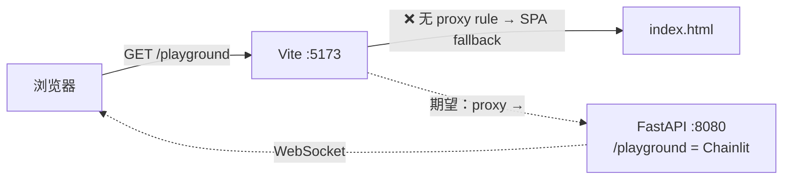
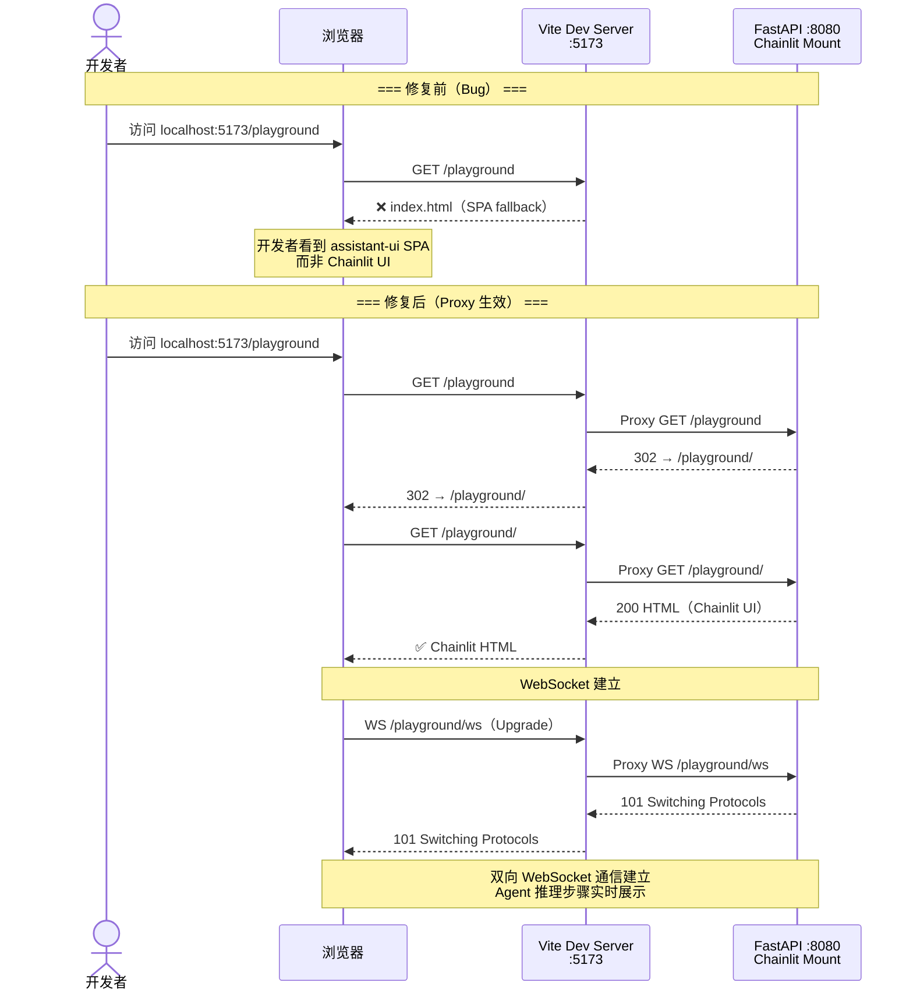

# Bug 6 — Implementation Plan

## 0. Issue Evaluation

| 维度 | 结果 | 说明 |
|------|------|------|
| Staleness | ✅ | 引用的架构文档（`frontend_architecture.md` §2.1.1）存在且内容匹配；Feature 1.4 已实现 |
| Feasibility | ✅ | 实现路径明确：添加 Vite proxy rule，Vite 底层 `http-proxy` 原生支持 WebSocket |
| Completeness | ✅ | Issue 包含完整的症状、复现、根因、环境影响 |
| Impact Scope | ✅ | 单文件变更 `personal-assistant-client/vite.config.ts`，无 API/DB/生产影响 |

**判定：ACCEPT**

---

## 1. Issue Summary

- **Category**: Bug
- **Reference Architecture**: `personal-assistant-meta/architecture/frontend_architecture.md` §2.1.1
- **Root Cause**: `vite.config.ts` `server.proxy` 仅配置了 `/api` proxy rule，缺少 `/playground` proxy rule
- **Affected File**: `personal-assistant-client/vite.config.ts`

当开发者在 Vite dev server（port 5173）访问 `http://localhost:5173/playground` 时，由于没有 proxy rule，Vite 的 SPA fallback 捕获该路径并返回 `index.html`（assistant-ui SPA），而非代理到后端的 Chainlit 调试 UI。



---

## 2. API Changes

**无**。这是一个纯 Vite dev-server 配置变更，不影响 FastAPI 路由、Pydantic schema、OpenAPI spec 或任何 TypeScript 接口。`personal-assistant-meta-service-dev` 和 `personal-assistant-meta-client-dev` 无需介入。

---

## 3. Service Tasks

**无**。Service 侧已完成 Chainlit mount（Feature 1.4），后端在 `http://localhost:8080/playground/` 已正常工作。本 Bug 仅需 Client 侧修复。

---

## 4. Client Tasks

### 4.1 修改 `vite.config.ts` — 添加 `/playground` proxy rule

**文件**: `personal-assistant-client/vite.config.ts`

在 `server.proxy` 对象中添加 `/playground` 规则：

```typescript
server: {
    proxy: {
      '/api': {
        target: 'http://localhost:8080',
        changeOrigin: true,
      },
      '/playground': {
        target: 'http://localhost:8080',
        changeOrigin: true,
        ws: true,                     // Chainlit 使用 WebSocket 协议
      },
    },
},
```

#### 配置项说明

| 配置项 | 值 | 原因 |
|--------|-----|------|
| `target` | `'http://localhost:8080'` | 后端 FastAPI 容器运行端口，Chainlit mount 在此 |
| `changeOrigin` | `true` | 修改请求头 `Origin` 为目标 URL，避免后端 Host 校验问题 |
| `ws` | `true` | Chainlit 使用 WebSocket 协议进行双向通信（`/playground/ws` 端点），必须启用 WebSocket upgrade 代理 |

#### 不需要配置的项

| 配置项 | 不需要的原因 |
|--------|------------|
| `rewrite` | **不设置** — 路径必须原样转发。后端 Chainlit 期望请求路径为 `/playground/**`，不应 rewrite 为 `/` 或其他路径 |
| `secure` | **不设置**（默认 `true`）— localhost 不使用 HTTPS，但 `changeOrigin: true` 已处理 |
| `configure` | **不设置** — 默认行为已满足需求（转发所有子路径和 WebSocket） |

### 4.2 变更后完整文件预期

```typescript
/// <reference types="vitest" />
import { defineConfig } from 'vite'
import react from '@vitejs/plugin-react'
import tailwindcss from '@tailwindcss/vite'
import path from 'path'

export default defineConfig({
  test: {
    environment: 'jsdom',
    globals: true,
    setupFiles: './src/test/setup.ts',
  },
  resolve: {
    alias: {
      '@': path.resolve(__dirname, './src'),
    },
  },
  plugins: [react(), tailwindcss()],
  build: {
    outDir: 'dist',
    sourcemap: false,
  },
  server: {
    proxy: {
      '/api': {
        target: 'http://localhost:8080',
        changeOrigin: true,
      },
      '/playground': {
        target: 'http://localhost:8080',
        changeOrigin: true,
        ws: true,
      },
    },
  },
})
```

---

## 5. Edge Cases & Technical Details

### 5.1 WebSocket Upgrade

Chainlit 客户端在页面加载后会尝试建立 WebSocket 连接到 `/playground/ws`。Vite proxy 的 `ws: true` 选项告诉 `http-proxy-middleware` 监听 HTTP Upgrade 请求并将 WebSocket 连接代理到后端。

**验证要点**：打开 `/playground` 后，在浏览器 DevTools → Network → WS 标签中应能看到 WebSocket 连接成功（状态 101 Switching Protocols）。

### 5.2 路径转发行为（No Rewrite）

Vite proxy 默认**不 rewrite 路径**。例如：

| 请求 | 代理到 |
|------|--------|
| `GET http://localhost:5173/playground` | `GET http://localhost:8080/playground` |
| `GET http://localhost:5173/playground/` | `GET http://localhost:8080/playground/` |
| `GET http://localhost:5173/playground/static/some.css` | `GET http://localhost:8080/playground/static/some.css` |
| `WS http://localhost:5173/playground/ws` | `WS http://localhost:8080/playground/ws` |

这正好匹配后端 FastAPI 的 Chainlit mount（Chainlit 注册在 `/playground` 路径下）。

### 5.3 Trailing Slash

Chainlit 的 `/playground`（无 trailing slash）在后端会触发 redirect 到 `/playground/`。此 redirect 是 HTTP 301/302，通过 proxy 透传回浏览器，浏览器自动跟随跳转到 `/playground/`，整个过程正常工作。

### 5.4 Proxy Rule 优先级

Vite 的 proxy rules 按**注册顺序**匹配。`/playground` 规则独立于已有的 `/api` 规则，两者不冲突。Vite 在匹配请求时先检查所有 proxy rules，只有未命中时才回退到 static files / SPA fallback。

### 5.5 不影响 Web Chat（`/` 和 `/api/chat/stream`）

- `/api/*` 已有的 proxy rule 不变
- `/` 及 Web Chat 相关路径继续走 Vite SPA（React + assistant-ui）
- `/playground` 新规则仅匹配该前缀路径

---

## 6. Verification Steps

### 6.1 手动验证

| # | 步骤 | 预期结果 |
|---|------|---------|
| 1 | 启动后端：`cd personal-assistant-service && uv run uvicorn app.main:app --port 8080` | 后端启动，Chainlit mount 就绪 |
| 2 | 启动前端：`cd personal-assistant-client && npm run dev` | Vite dev server 在 5173 启动 |
| 3 | 浏览器访问 `http://localhost:5173/playground` | 显示 Chainlit 调试 UI（非 assistant-ui SPA） |
| 4 | 浏览器访问 `http://localhost:5173/playground/` | 同上，Chainlit UI |
| 5 | 在 Chainlit 中输入消息 | Agent 正常回复，流式渲染正常 |
| 6 | DevTools → Network → WS 标签 | 看到 `/playground/ws` WebSocket 连接成功（101） |
| 7 | 浏览器访问 `http://localhost:5173/` | Web Chat 界面正常（assistant-ui SPA） |
| 8 | 浏览器访问 `http://localhost:5173/api/ping` | 返回 `{"status": "ok"}`（`/api` proxy 不受影响） |

### 6.2 E2E 测试（建议）

在 `personal-assistant-e2e/` 下新增一条回归测试，验证 Vite proxy 的 `/playground` 行为：

```python
# 测试场景：Vite dev server 正确代理 /playground 到 Chainlit 后端
# 1. 启动 Service + Client
# 2. GET http://localhost:5173/playground/
# 3. 验证响应 HTML 包含 Chainlit 特征标记（如 <title>Chainlit</title>、id="chainlit-custom-css" 等）
# 4. 验证响应 NOT 包含 assistant-ui SPA 特征（如 id="root"、React mount point 等）
```

---

## 7. Sequence Diagram



---

## 8. Task Assignment

| Agent | Task |
|-------|------|
| **personal-assistant-client-dev** | 修改 `vite.config.ts`，添加 `/playground` proxy rule（含 `ws: true`） |
| **personal-assistant-client-tester** | 运行 `npm run dev` + TypeScript 类型检查，验证配置语法正确 |
| **personal-assistant-client-reviewer** | Review 变更：确认 `ws: true` 已设置、路径未 rewrite、不影响 `/api` 规则 |
| **personal-assistant-e2e-tester** | 按 §6.2 编写回归测试，验证 `/playground` 代理正常 |
| **personal-assistant-meta-client-dev** | 无需介入（无 API schema 变更） |
| **personal-assistant-meta-service-dev** | 无需介入（无 API schema 变更） |
| **personal-assistant-service-dev** | 无需介入（后端无需改动） |
