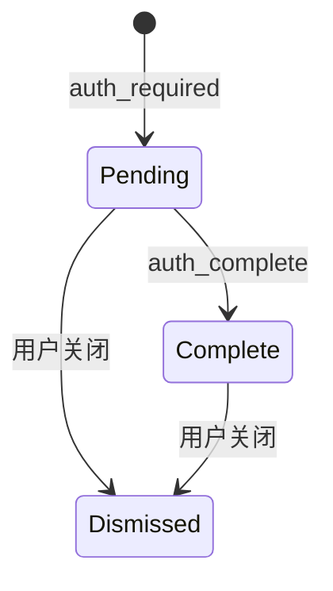

# Bug 17: 发送新消息时 Auth Card 被意外清除

## 现象

用户触发 Outbound OAuth 授权后，聊天中会显示 pending Auth Card。此时如果用户
继续发送任意消息，Auth Card 会立即消失，即使授权尚未完成、用户未关闭卡片，
新请求也没有产生替代的授权状态。

## 复现步骤

1. 在未授权状态下请求邮件操作，例如“查看收件箱”。
2. 等待页面显示 Microsoft 365 Auth Card。
3. 不完成授权，直接发送另一条聊天消息。
4. Auth Card 在新请求开始时消失。

## 根因

`chatAdapter.run` 在每次请求开始前无条件调用
`useAuthCardStore.getState().clearAuth()`。消息发送事件与 OAuth 授权状态没有
因果关系，因此该调用使 Client UI 与真实授权状态脱节。

## 预期行为

Auth Card 的生命周期应由授权状态或显式用户操作驱动：

发送普通聊天消息不应触发任何 Auth Card 状态转换。

## 修复范围

### In Scope

- 移除 `chatAdapter.run` 在请求开始时对 Auth Card 的无条件清理。
- 增加 Client 回归测试，验证 pending 和 completed Auth Card 在后续消息发送后
  均保持原状态。

### Out of Scope

- 授权 URL 的过期检测。当前 SSE 协议没有 `expires_at` 或 `auth_expired` 事件，
  Client 无法可靠判断链接是否过期。
- 多 provider Auth Card 并存。
- Auth Card 样式或位置调整。

## 验收标准

- [x] pending Auth Card 不因发送新消息而消失。
- [x] completed Auth Card 不因发送新消息而消失。
- [x] 用户点击 Auth Card 关闭按钮时仍可显式清除。
- [x] 新的 `auth_required` 事件仍可更新当前 Auth Card。
- [x] Client tests 和 production build 通过。

## Affected Architecture Docs

无需修改 baseline architecture。现有
`architecture/frontend_architecture.md` 已将 Auth Card 定义为由
`auth_required` / `auth_complete` 事件驱动；本修复使实现重新符合该设计。

## Four-Question Gate

| Question | Answer | Notes |
|----------|--------|-------|
| Is it best practice? | Yes | UI 状态由对应 domain event 和显式用户操作驱动。 |
| Is it industry standard? | Yes | OAuth consent prompt 在完成、取消或被替代前保持可访问。 |
| Is it conventional? | Yes | 发送聊天消息不会隐式撤销未完成的授权操作。 |
| Is it modern? | Yes | 使用 event-driven lifecycle，避免无关交互造成状态丢失。 |

