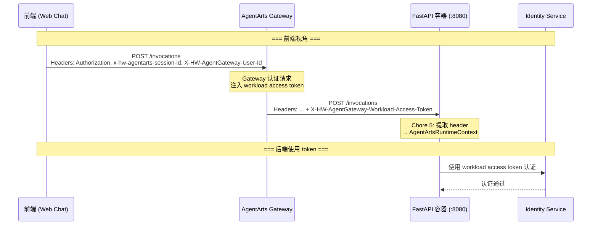
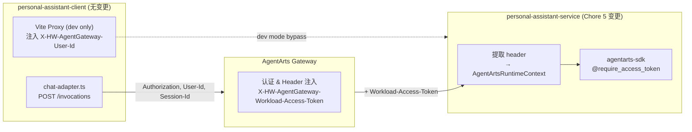

# Client Plan — Chore 5: 从 Request Header 提取 Workload Access Token

> 版本：v1.0 | 状态：Draft | 关联 issue：`chore-5-workload-access-token-from-header`

---

## 1. 结论：无前端变更

**本 Chore 不涉及 `personal-assistant-client/` 的任何代码、配置或构建变更。** 变更范围 100% 在后端（`personal-assistant-service/`）。

### 1.1 原因

`X-HW-AgentGateway-Workload-Access-Token` header 的完整生命周期如下：

**关键事实**：

| 事实 | 依据 |
|------|------|
| Header 由 **AgentArts Gateway 注入**，非客户端发送 | `backend_architecture.md` §2.3："AgentArts Gateway 在转发请求到 Runtime 容器时，会注入以下 header" |
| 前端代码中**没有任何引用** `Workload-Access-Token` 的地方 | 全面搜索 `personal-assistant-client/` 目录：0 匹配 |
| 前端仅发送 `X-HW-AgentGateway-User-Id`（用户身份 header） | `src/lib/chat-adapter.ts` lines 120-126 |
| Vite dev proxy 仅注入 `X-HW-AgentGateway-User-Id: dev-user` | `vite.config.ts` lines 30-38 |

### 1.2 变更摘要

| 变更项 | 位置 | 类型 |
|--------|------|------|
| 提取 `X-HW-AgentGateway-Workload-Access-Token` header | `personal-assistant-service/app/main.py` 或 `app/auth.py` | 后端新增 ~4 行代码 |
| 调用 `AgentArtsRuntimeContext.set_workload_access_token()` | 同上 | 后端新增 ~1 行代码 |
| Header 不存在时的 fallback 行为 | 同上 | 无变更（自然 fallback） |

**无 API 契约变更**：无新 endpoint、无 schema 变更、无请求/响应格式变更。

---

## 2. 验证：现有前端行为不受影响

### 2.1 API 契约一致性检查

| 检查项 | 状态 | 说明 |
|--------|------|------|
| Endpoint 路径变更？ | ❌ 无 | 仍为 `POST /invocations` |
| Request body schema 变更？ | ❌ 无 | 仍为 `{ message, stream }` |
| Response body schema 变更？ | ❌ 无 | 仍为 SSE `text/event-stream` 或 JSON `{ response }` |
| 新增必需 header？ | ❌ 无 | `Workload-Access-Token` 由 Gateway 注入，前端无需也不能发送 |
| 认证流程变更？ | ❌ 无 | MSAL + zustand token store 不变 |
| 错误码变更？ | ❌ 无 | 不引入新错误码 |

### 2.2 前端请求路径验证

前端三条请求路径均不受影响：

| 路径 | 场景 | 影响 |
|------|------|------|
| `src/lib/chat-adapter.ts` → `POST /invocations` | 生产对话请求 | ✅ 无影响。Header 由 Gateway 在转发时注入，前端不可见 |
| `vite.config.ts` proxy → `localhost:8080/invocations` | 本地开发 | ✅ 无影响。Proxy 仅注入 `X-HW-AgentGateway-User-Id`，不注入 workload token。本地无 Gateway → header 不存在 → SDK 自然 fallback 到 `.agent_identity.json` |
| `src/lib/auth.ts` → Microsoft Graph | 获取头像 | ✅ 无关。此调用完全不经过 AgentArts Gateway |

### 2.3 开发模式行为

本地 `npm run dev` 场景：
- Vite proxy 将 `/invocations` 转发到 `localhost:8080`
- 无 AgentArts Gateway → `X-HW-AgentGateway-Workload-Access-Token` header 不存在
- 后端提取代码对 `None` 值不做处理（仅当 header 存在时才 set context）
- SDK 的 `_get_workload_access_token()` 自动 fallback 到本地 `.agent_identity.json` + Identity Service API
- **本地开发体验完全不变**

---

## 3. 风险评估

### 3.1 前端是否会意外发送冲突的 `X-HW-AgentGateway-Workload-Access-Token` header？

**不会。** 原因：

1. 前端代码（`src/lib/chat-adapter.ts`）仅显式设置以下 header：
   - `Accept`
   - `Content-Type`
   - `x-hw-agentarts-session-id`
   - `Authorization`（条件）
   - `X-HW-AgentGateway-User-Id`（条件）
2. 不存在可以注入额外 header 的中间件或拦截器
3. 即使理论上前端发送了此 header，AgentArts Gateway 在生产环境中会**剥离/覆盖**客户端伪造的 Gateway 内部 header（这是 API Gateway 的标准安全行为）

### 3.2 构建配置是否需要变更？

**不需要。** 无新增环境变量、无 Vite config 变更、无 Tailwind config 变更、无 TypeScript 类型变更。

### 3.3 前端 TypeScript 类型需要同步吗？

**不需要。** 本次变更无 API schema 变更，`personal-assistant-meta-client-dev`（API type sync agent）无工作可做。

### 3.4 前端测试需要更新吗？

**不需要。** 现有前端单元测试（组件测试、adapter 测试）覆盖的请求路径和 header 集合不变。E2E 测试无需额外场景——workload token 的注入和提取完全是后端 + Gateway 的内部行为，前端和测试脚本均不可见。

---

## 4. 任务清单

**本 Chore 无前端任务。** 以下为记录性质的"确认清单"，供 `personal-assistant-client-dev` 在收到实现通知时快速验证零变更：

- [x] 确认 `personal-assistant-client/` 目录无代码变更需求
- [x] 确认 API type sync（OpenAPI → TypeScript types）无需执行
- [x] 确认 `vite.config.ts` 无需修改
- [x] 确认 `.env.example` / 环境变量无需新增
- [x] 确认 `DESIGN.md` 设计 token 无需变更
- [x] 确认 `AGENTS.md` 无需更新

---

## 5. 架构参考

> **前端职责边界**：前端只负责用户身份传递（`Authorization` + `X-HW-AgentGateway-User-Id`）和会话标识（`x-hw-agentarts-session-id`）。Workload Identity 认证是 Agent 容器与平台之间的服务间通信，对前端完全透明。
