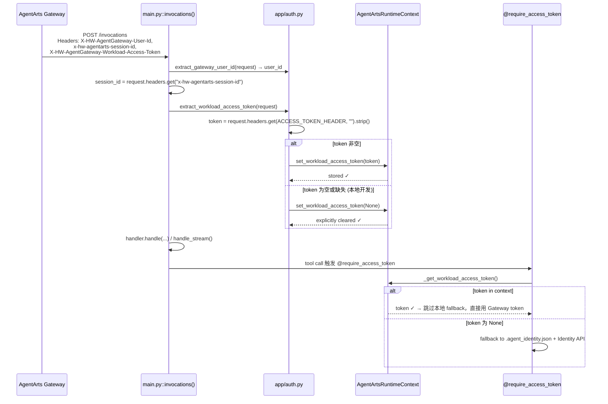
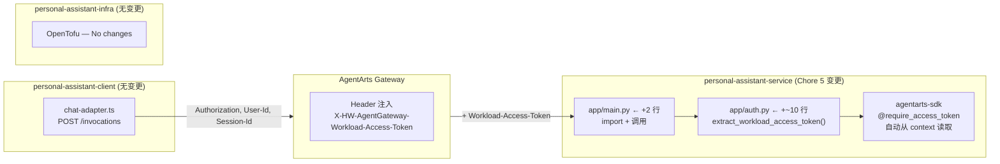

# Chore 5 Implementation Plan: 从 Request Header 提取 Workload Access Token

> **Issue**: [chore-5-workload-access-token-from-header](./issue.md)
> **Target Branch**: `chore-5-workload-access-token-from-header`
> **Panel Verdict**: ✅ **APPROVED** (with refinements noted below)
> **Review Date**: 2026-06-15
> **Review Scale**: GRAND (4 panelists)

---

## Executive Summary

AgentArts Gateway 在转发每个请求到 Runtime 容器时，自动注入 `X-HW-AgentGateway-Workload-Access-Token` header——这是容器以 Workload Identity 认证 Identity Service 的短期凭证。当前 `personal-assistant-service` 已手动提取 `X-HW-AgentGateway-User-Id` 和 `x-hw-agentarts-session-id`，但遗漏了此 token header，导致 `@require_access_token` 等装饰器每次都走本地 `.agent_identity.json` + Identity Service API 的完整认证流程，而非直接复用 Gateway 已注入的 token。

**变更范围**：`personal-assistant-service/` 仅两个文件新增 ~8 行代码。无客户端、无 IaC、无 API Schema 变更。生产环境中 Gateway 已持续注入此 header——本次变更仅"接通最后一公里"。

**设计原则**：fail-open（header 缺失时不报错，静默跳过）——确保本地 `uvicorn` 开发体验完全不变，SDK 自动 fallback 到本地认证。

---

## Proposed Architecture / Flow Diagram

### Header 注入与提取完整数据流



### 变更边界（仅后端，零触达前端/基础设施）



---

## Integrated Implementation Plan

### 1. 文件变更矩阵

| 文件 | 变更类型 | 行数变化 | 说明 |
|------|----------|----------|------|
| `personal-assistant-service/app/auth.py` | 修改 | +~10 | 新增 `extract_workload_access_token()` 函数 |
| `personal-assistant-service/app/main.py` | 修改 | +2 | import 扩展 + 函数调用 |
| `personal-assistant-service/tests/test_auth.py` | 修改 | +~40 | 新增 `TestExtractWorkloadAccessToken` 类（3 tests） |
| `personal-assistant-service/tests/test_main.py` | 修改 | +~25 | 新增 2 个集成测试 |
| **以上仅 4 个文件**，总计 **~77 行新增，0 行删除** |

> **Zero-touch**: `email_tools.py`, `tools/__init__.py`, `agent_handler.py`, `pyproject.toml`, `personal-assistant-client/`, `personal-assistant-infra/`, `personal-assistant-e2e/` 均无变更。

---

### 2. 详细实现步骤

#### Step 1: `app/auth.py` — 新增 `extract_workload_access_token()`

在现有 `extract_gateway_user_id` 函数下方新增。完整实现：

```python
# app/auth.py — 在现有 import 下方新增两行 import
from agentarts.sdk.runtime.context import AgentArtsRuntimeContext
from agentarts.sdk.runtime.model import ACCESS_TOKEN_HEADER

# ... 现有 extract_gateway_user_id 保持不变 ...

def extract_workload_access_token(request: Request) -> None:
    """提取并存入 AgentArts Gateway 注入的 Workload Access Token。

    生产环境中，AgentArts Gateway 在转发请求时注入
    X-HW-AgentGateway-Workload-Access-Token header（常量:
    agentarts.sdk.runtime.model.ACCESS_TOKEN_HEADER）。

    提取后存入 AgentArtsRuntimeContext，使 @require_access_token
    等装饰器可以直接使用，跳过本地 .agent_identity.json 的 fallback 流程。

    若 header 不存在或为空（本地开发环境），显式设为 None，
    确保 context 干净。SDK 的 _get_workload_access_token() 自动
    fallback 到本地认证。
    """
    token = request.headers.get(ACCESS_TOKEN_HEADER, "").strip()
    AgentArtsRuntimeContext.set_workload_access_token(token or None)
```

**设计要点**：

| 设计决策 | 理由 |
|----------|------|
| **从 SDK 导入常量** `ACCESS_TOKEN_HEADER` | SDK 已定义该常量（`agentarts.sdk.runtime.model`）。若未来 header 名称变更，SDK 版本升级时会在 import 阶段暴露，而非静默失效 |
| **`.strip()` 空白值** | 防御性编程。即使 Gateway 注入的 header 不应有空白，`.strip()` 成本为零，消除潜在的下游校验失败 |
| **`token or None` 显式清空** | 若 header 不存在或为空，显式设 `None` 而非跳过调用。防止 `contextvars` 在任务重用时残留前次请求的 token（详细分析见 §5 Risk C1） |
| **返回 `None`** | 纯 side-effect 函数。调用者不需要返回值，token 已通过 SDK context 传递给下游装饰器 |
| **Colocated in `auth.py`** | 与 `extract_gateway_user_id` 同属 Gateway header 提取逻辑，便于发现和维护 |

#### Step 2: `app/main.py` — Import 和调用

**2a. 扩展 import**（第 38 行）：

```python
# 变更前:
from app.auth import extract_gateway_user_id  # noqa: E402

# 变更后:
from app.auth import extract_gateway_user_id, extract_workload_access_token  # noqa: E402
```

**2b. 插入函数调用**（第 122 行之后，即 session_id 检查块之后）：

```python
    session_id = request.headers.get("x-hw-agentarts-session-id")
    if not session_id:
        raise HTTPException(
            status_code=400,
            detail="x-hw-agentarts-session-id header is required",
        )
    extract_workload_access_token(request)  # ← Chore 5: 新增

    if not message:
        raise HTTPException(status_code=400, detail="message is required")
```

**插入位置分析**：

```
invocations() 执行顺序:
  body = await request.json()        ← 可能 400 (JSONDecodeError)
  extract_gateway_user_id(request)   ← 可能 401 (header missing)
  session_id check                    ← 可能 400 (header missing)
  ✨ extract_workload_access_token()  ← NEW: fail-open, 永不抛异常
  message check                       ← 可能 400 (empty)
  handler.handle() / handle_stream()  ← token 已可用
```

- 所有早期返回错误路径（JSONDecodeError→400, user_id→401, session_id→400）**执行不到新函数**——零回归风险。
- Token 在 handler 执行前已设置，覆盖同步和流式两条路径。
- 若 message 为空→400，token 已写入 context 但该 asyncio Task 立即销毁——无泄漏。

> **不推荐将调用后移至 message 验证之后**：虽然可以避免为无效请求设置 context，但增加代码复杂度（需要在 stream 分支前和 sync 分支前各插入一次，或重构结构）。当前插入点简洁可靠，`contextvars` 的 Task 级生命周期确保不会泄漏。

---

### 3. 测试计划

#### 3.1 单元测试（`test_auth.py`）

在文件末尾新增 `TestExtractWorkloadAccessToken` 类，复用已有的 `_make_request()` helper：

```python
from unittest.mock import patch
from app.auth import extract_workload_access_token

class TestExtractWorkloadAccessToken:
    """Tests for extract_workload_access_token()."""

    def test_stores_token_when_header_present(self) -> None:
        """Header present with valid token →
        set_workload_access_token called with token value."""
        token_value = "eyJhbGciOiJSUzI1NiIsInR5cCI6IkpXVCJ9.test-token"
        request = _make_request(
            {"X-HW-AgentGateway-Workload-Access-Token": token_value}
        )
        with patch(
            "app.auth.AgentArtsRuntimeContext.set_workload_access_token"
        ) as mock_set:
            extract_workload_access_token(request)
            mock_set.assert_called_once_with(token_value)

    def test_sets_none_when_header_missing(self) -> None:
        """No header → set_workload_access_token called with None."""
        request = _make_request({"other-header": "value"})
        with patch(
            "app.auth.AgentArtsRuntimeContext.set_workload_access_token"
        ) as mock_set:
            extract_workload_access_token(request)
            mock_set.assert_called_once_with(None)

    def test_sets_none_when_header_empty_string(self) -> None:
        """Header present but empty string →
        set_workload_access_token called with None."""
        request = _make_request(
            {"X-HW-AgentGateway-Workload-Access-Token": ""}
        )
        with patch(
            "app.auth.AgentArtsRuntimeContext.set_workload_access_token"
        ) as mock_set:
            extract_workload_access_token(request)
            mock_set.assert_called_once_with(None)

    def test_strips_whitespace_and_stores_token(self) -> None:
        """Header with surrounding whitespace → stripped token stored."""
        request = _make_request(
            {"X-HW-AgentGateway-Workload-Access-Token": "  valid-token  "}
        )
        with patch(
            "app.auth.AgentArtsRuntimeContext.set_workload_access_token"
        ) as mock_set:
            extract_workload_access_token(request)
            mock_set.assert_called_once_with("valid-token")

    def test_sets_none_when_header_whitespace_only(self) -> None:
        """Header with whitespace only → set_workload_access_token called with None."""
        request = _make_request(
            {"X-HW-AgentGateway-Workload-Access-Token": "   "}
        )
        with patch(
            "app.auth.AgentArtsRuntimeContext.set_workload_access_token"
        ) as mock_set:
            extract_workload_access_token(request)
            mock_set.assert_called_once_with(None)
```

| # | 测试 | 输入 | 期望 |
|---|------|------|------|
| TC-U1 | header present | `"eyJhbGci..."` | `set_workload_access_token("eyJhbGci...")` |
| TC-U2 | header missing | 无此 header | `set_workload_access_token(None)` |
| TC-U3 | header empty string | `""` | `set_workload_access_token(None)` |
| TC-U4 | header with whitespace | `"  token  "` | `set_workload_access_token("token")` |
| TC-U5 | header whitespace only | `"   "` | `set_workload_access_token(None)` |

> **Mock 策略**：`AgentArtsRuntimeContext` 是第三方 SDK 类。单元测试 mock 其 `set_workload_access_token` classmethod，验证"是否以正确的参数调用了 SDK 公开 API"——不测试 SDK 内部实现。

**验证命令**：
```bash
cd personal-assistant-service
uv run pytest tests/test_auth.py -v -k "TestExtractWorkloadAccessToken"
```

#### 3.2 集成测试（`test_main.py`）

在 `TestHeaderHandling` 类中新增 2 个测试，**直接 mock SDK 边界**以验证完整调用链（`main.py → auth.py → SDK context`）：

```python
@pytest.mark.asyncio
async def test_workload_token_passed_to_context(self, client, fake_handler):
    """POST with workload token header → SDK context receives the token."""
    token_value = "test-token-abc123"
    with patch(
        "app.auth.AgentArtsRuntimeContext.set_workload_access_token"
    ) as mock_set:
        response = await client.post(
            "/invocations",
            json={"message": "Hi"},
            headers={
                "X-HW-AgentGateway-User-Id": "test-user",
                "x-hw-agentarts-session-id": "sess-test",
                "X-HW-AgentGateway-Workload-Access-Token": token_value,
            },
        )
        assert response.status_code == 200
        mock_set.assert_called_once_with(token_value)


@pytest.mark.asyncio
async def test_no_workload_token_no_error(self, client, fake_handler):
    """POST without workload token header → 200, SDK context gets None."""
    with patch(
        "app.auth.AgentArtsRuntimeContext.set_workload_access_token"
    ) as mock_set:
        response = await client.post(
            "/invocations",
            json={"message": "Hi"},
            headers={
                "X-HW-AgentGateway-User-Id": "test-user",
                "x-hw-agentarts-session-id": "sess-test",
            },
        )
        assert response.status_code == 200
        mock_set.assert_called_once_with(None)
```

> **注意**：不在集成测试中 mock `extract_workload_access_token` 本身——这只能验证路由接线，无法验证管道完整性。直接 mock SDK context 的 `set_workload_access_token` 可以验证从 HTTP 请求 → `main.py` → `auth.py` → SDK 的完整调用链。

**验证命令**：
```bash
cd personal-assistant-service
uv run pytest tests/test_main.py::TestHeaderHandling -v -k "workload"
```

#### 3.3 回归测试

运行完整测试套件，确认零回归：

```bash
cd personal-assistant-service
uv run pytest tests/ -v
```

关键回归点：

| 检查项 | 验证方式 | 期望 |
|--------|----------|------|
| `extract_gateway_user_id` 行为不变 | `test_auth.py::TestExtractGatewayUserId` (4 tests) | 全部通过 |
| `session_id` 400 行为不变 | `test_main.py` session_id tests | 全部通过 |
| `@require_access_token` 装饰器行为不变 | `tests/test_email_tools.py` | 全部通过 |
| stream/sync 路径不变 | `test_main.py` stream/sync tests | 全部通过 |
| 所有现有测试 | `tests/` full suite | 100% pass rate |

#### 3.4 无需新增的测试

| 类别 | 原因 |
|------|------|
| **E2E 测试** | Client 层零变更；`Workload-Access-Token` header 由 Gateway 注入，E2E 直连 FastAPI 无 Gateway → header 不存在 → 行为与变更前完全一致 |
| **Client 测试** | 前端不发送、不感知、不依赖此 header。Header 生命周期完全在后端 + Gateway 内部 |
| **Infra 测试** | `tofu validate` + `tofu plan` 验证无 IaC 变更即可。Header 注入是 AgentArts 平台内置行为，不可配置 |

#### 3.5 Infra 验证（即使零变更）

```bash
cd personal-assistant-infra
tofu validate    # 期望: 无错误
tofu plan        # 期望: No changes. Your infrastructure matches the configuration.
```

---

### 4. 验证步骤

#### 4.1 本地开发验证

```bash
cd personal-assistant-service
uv run uvicorn app.main:app --host 0.0.0.0 --port 8080 --reload
```

```bash
# 带 workload token header（模拟 Gateway 注入）
curl -X POST http://localhost:8080/invocations \
  -H "Content-Type: application/json" \
  -H "X-HW-AgentGateway-User-Id: test-user" \
  -H "x-hw-agentarts-session-id: sess-123" \
  -H "X-HW-AgentGateway-Workload-Access-Token: test-token-value" \
  -d '{"message": "你好"}'
# 期望: 200 OK。Token 被提取并存入 context。

# 不带 workload token header（本地开发模式，无 Gateway）
curl -X POST http://localhost:8080/invocations \
  -H "Content-Type: application/json" \
  -H "X-HW-AgentGateway-User-Id: test-user" \
  -H "x-hw-agentarts-session-id: sess-123" \
  -d '{"message": "你好"}'
# 期望: 200 OK。Header 缺失 → context 设 None → SDK 自动 fallback。
```

#### 4.2 生产部署验证（Post-Deploy）

```bash
agentarts launch
```

通过 Gateway 调用：

```bash
curl -X POST https://<runtime-domain>/invocations \
  -H "Content-Type: application/json" \
  -H "Authorization: Bearer <jwt-token>" \
  -d '{"message": "列出我的收件箱"}'
```

验证点：
1. `/invocations` 返回 200
2. 邮件工具（使用 `@require_access_token`）正常工作
3. 容器日志无 `.agent_identity.json` 相关错误（说明 Gateway token 被成功使用）
4. 容器日志无 `@require_access_token` 认证失败

---

### 5. 风险与缓解

| # | 风险 | 提出者 | 可能性 | 影响 | 缓解措施 |
|---|------|--------|--------|------|----------|
| **C1** | `contextvars` 任务重用导致跨请求 token 泄漏 | GPT, DeepSeek | 低 | 中 | `token or None` 确保缺失 header 时显式清空上下文。若未来出现任务重用场景（如后台协程），可通过 `@app.middleware("http")` 在响应后调用 `AgentArtsRuntimeContext.clear()` 彻底隔离——当前 ASGI 每请求独立 Task，此风险可控 |
| **C2** | SDK 版本不匹配，`set_workload_access_token` 不存在 | Gemini | 低 | 高 | `pyproject.toml` 已固定 `agentarts-sdk >= 0.1.3`。CI 构建时必须重新安装依赖（`uv sync`），确保不使用缓存旧版本 |
| **C3** | 客户端伪造 `X-HW-AgentGateway-*` header 注入恶意 token | Gemini | 低 | 中 | AgentArts Gateway 在生产环境中会**剥离/覆盖**客户端发送的 `X-HW-AgentGateway-*` header——这是 API Gateway 的标准安全行为。网络层面通过 VPC 安全组限制仅 Gateway 可访问容器 |
| **C4** | Gateway header 名称在将来版本变更 | DeepSeek | 低 | 中 | 使用 SDK 常量 `ACCESS_TOKEN_HEADER` 替代硬编码字符串。若 header 名变更，SDK 常量同步变更 → import 阶段即失败 → 版本升级时自动暴露 |
| **C5** | Chainlit playground 路径不经过 `invocations()` | GPT | 低 | 低 | `/invocations/playground` 仅用于本地调试，不走 Gateway。若 playground 触发的工具需要 workload token，SDK 会自动 fallback 到本地认证——行为与变更前一致 |

---

### 6. 架构文档同步

本次 Chore 已更新以下架构文档（Meta Phase 前置工作）：

| 文档 | 位置 | 变更内容 |
|------|------|----------|
| `backend_architecture.md` | §2.3 | 新增 Gateway Header 注入表格行（Workload Access Token）+ Mermaid 数据流图 + fallback 说明 |
| `backend_architecture.md` | §5.2 | 新增 Workload Access Token 优化说明段落 |
| `overall_architecture.md` | §4.1 | 补充 Gateway Header 注入中的 Workload Access Token 说明 + 交叉引用 |
| `specs/dictionary.md` | §2.2 | 新增 "Workload Access Token" 术语定义 |

所有变更均携带 `<!-- updated by issue: chore-5-workload-access-token-from-header -->` 标签，方便追溯。

---

### 7. 实现任务清单

- [ ] **Task 1**: `app/auth.py` — 新增 `extract_workload_access_token()` 函数 + 2 行 import
- [ ] **Task 2**: `app/main.py` — 扩展 import + 在 `invocations()` 中插入调用
- [ ] **Task 3**: `tests/test_auth.py` — 新增 `TestExtractWorkloadAccessToken` 类（5 tests）
- [ ] **Task 4**: `tests/test_main.py` — 新增 2 个集成测试
- [ ] **Task 5**: 运行完整测试套件验证零回归
- [ ] **Task 6**: 运行 `tofu validate` + `tofu plan` 确认 infra 无变更
- [ ] **Task 7**: 本地 `uvicorn` 手动验证（带/不带 header 两种场景）
- [ ] **Task 8**: Docker build + `agentarts launch` 部署到生产
- [ ] **Task 9**: 生产验证：通过 Gateway 调用邮件工具确认 token 被使用
- [ ] **Task 10**: Commit 并合并到 `main`

---

## Panel Review & Consensus

### Consensus Points

1. **核心设计正确且可行** — 4/4 panelists 一致认可在 `auth.py` 新增 fail-open 提取函数的方案
2. **插入位置安全** — 在 session_id 检查之后、message 检查之前，所有早期返回错误路径不受影响
3. **零客户端/基础设施变更** — 四个子计划完全一致，无矛盾
4. **四道闸门全通过** — 所有 panelists 对四个问题的回答均为 Yes

### Complementary Insights & Refinements

| 来源 | 洞察 | 是否采纳 |
|------|------|----------|
| **DeepSeek** | 从 SDK 导入 `ACCESS_TOKEN_HEADER` 常量替代硬编码字符串 | ✅ 已采纳——提升健壮性，header 名称变更时在 import 阶段暴露 |
| **DeepSeek, Hermes** | 新增仅空白 header 边界测试 | ✅ 已采纳——新增 TC-U4 (whitespace strip) 和 TC-U5 (whitespace only) |
| **Gemini** | 对 token 值应用 `.strip()` | ✅ 已采纳——防御性编程，零成本消除空白干扰 |
| **GPT** | `token or None` 显式清空上下文，防止状态残留 | ✅ 已采纳——相比 `if token:` 的 conditionally-set 方式更安全 |
| **GPT** | 集成测试应 mock SDK context 而非业务函数 | ✅ 已采纳——验证完整调用链（HTTP → main → auth → SDK） |
| **Hermes** | 文档中测试数量修正（8→6, ~20→~13） | ✅ 已修正——本次 plan 使用精确计数 |

### Trade-off Resolutions

| 争议点 | 观点分歧 | 最终决定 |
|--------|----------|----------|
| **插入位置** | GPT 建议后移至 message 验证之后，避免为无效请求设置 context；DeepSeek/Gemini/Hermes 认同当前位置 | **保持当前位置**（session_id 检查之后）。理由：`contextvars` 的 Task 级生命周期确保无泄漏；后移需要重构代码结构（在 stream/sync 两个分支前各插入一次），增加不必要的复杂度 |
| **context 清理中间件** | GPT/DeepSeek 推荐添加；Gemini/Hermes 认为非必要 | **不作为本次 Chore 的阻塞项**。当前 `token or None` 已满足隔离需求。若未来出现 ASGI 任务重用场景，可通过独立 Chore 添加 `@app.middleware("http")` + `AgentArtsRuntimeContext.clear()` |
| **FastAPI Header 依赖注入** | Gemini 建议未来迁移到 `Header(alias=...)` | **留待后续重构**。当前手动提取模式与已有 `extract_gateway_user_id` 一致，保持代码库风格统一优先于引入新模式 |

---

## Four-Question Gate Assessment

| 问题 | 评估 | 说明 |
|------|------|------|
| **Is it best practice?** | ✅ Yes | 关注点分离到 `auth.py`，遵循已有 `extract_gateway_user_id` 模式。使用 `contextvars` 实现 async-safe 请求级上下文。fail-open/fail-closed 根据 header 的必需性正确区分 |
| **Is it de facto standard?** | ✅ Yes | Gateway 注入 + 容器提取 + context 传递 是云原生微服务架构的标准模式，正是 AgentArts 平台设计此 header 的预期用途 |
| **Is it conventional?** | ✅ Yes | 函数命名、测试模式、mock 策略完全符合项目已有约定（见 `TestExtractGatewayUserId`），新成员能立即理解 |
| **Is it modern?** | ✅ Yes | 使用现代 Python `contextvars`（PEP 567），ASGI 原生 async 安全，SDK 版本 >=0.1.3 活跃维护 |

---

## Appendix: Panelist Individual Reports

<details>
<summary>panelist-deepseek Report (DeepSeek V4 Flash)</summary>

### Key Findings
1. **SDK API verified**: `AgentArtsRuntimeContext.set_workload_access_token(value: str | None)` is a `@classmethod` using `contextvars.ContextVar`. Confirmed via `uv run python` introspection.
2. **Insertion point correct**: Line 123 is between session_id guard (118-122) and message check (124).
3. **Four sub-plans consistent**: No contradictions found.

### Recommendations
1. **Critical**: Import `ACCESS_TOKEN_HEADER` from `agentarts.sdk.runtime.model` instead of hardcoded string.
2. **Recommended**: Mock `AgentArtsRuntimeContext.set_workload_access_token` in integration tests, not `extract_workload_access_token`.
3. **Good practice**: Add `@app.middleware("http")` for `AgentArtsRuntimeContext.clear()`.
4. **Consider**: Add whitespace-only token edge case test.

### Four-Question Gate: Yes / Yes / Yes / Yes

</details>

<details>
<summary>panelist-gemini Report (Gemini 3.5 Flash)</summary>

### Key Findings
1. **Design alignment**: Fail-open approach is technically sound and aligned with codebase patterns.
2. **Doc-first approach**: Architecture doc updates are excellent for future developers.
3. **Security**: Gateway strips/overwrites internal headers in production. Network boundary (VPC security groups) is the real enforcement layer.

### Recommendations
1. Apply `.strip()` to token value before setting context.
2. Consider FastAPI `Header` dependency injection for future refactoring cycles.
3. Verify CDKTF security group rules drop non-Gateway traffic in a separate check.
4. Ensure loggers don't serialize raw headers.

### Four-Question Gate: Yes / Yes / Yes / Yes

</details>

<details>
<summary>panelist-gpt Report (GPT 5.5 Fast)</summary>

### Key Findings
1. **Fail-open vs fail-closed distinction is correct**: User ID (security-critical) = fail-closed, Workload Token (optimization) = fail-open.
2. **Insertion point safe but not ideal**: Setting context for invalid requests (empty message → 400) is harmless but avoidable.
3. **Context cleanup missing**: SDK's own `AgentArtsRuntimeApp` clears context in `finally` blocks; custom FastAPI path should mirror this.

### Recommendations
1. **Required**: Add explicit context reset: `token or None` instead of `if token:` conditional set.
2. **Required**: Strengthen integration tests to assert real SDK context visibility.
3. **Recommended**: Move insertion after message validation, or add `finally` cleanup blocks.
4. Gap: Chainlit playground path doesn't benefit from Gateway token.

### Four-Question Gate: Yes / Yes / Yes / Yes (with cleanup hardening)

</details>

<details>
<summary>panelist-hermes Report (DeepSeek V4 Pro + Hermes CLI)</summary>

### Empirical Findings
1. **auth.py**: 21 lines confirmed — matches plan claim exactly. No existing `extract_workload_access_token`.
2. **main.py**: Line numbers verified (38, 116, 117, 118-122, 124). Insertion point confirmed correct.
3. **Zero existing references**: `rg "Workload-Access-Token|workload_access_token" personal-assistant-service/` returns no output.
4. **`_make_request()` helper**: Verified at test_auth.py:14-24.
5. **SDK API confirmed**: `set_workload_access_token(value: str | None)` is a `@classmethod` using `contextvars`.
6. **Architecture docs**: All four locations verified with correct Chore 5 content.
7. **Documentation error found**: test-plan.md claims 8 tests in TestHeaderHandling — actual count is 6. Also "~20 tests" is actually ~13 for `/invocations`.

### Recommendations
1. Correct test count documentation.
2. Consider referencing SDK constant instead of hardcoded string.
3. Verify whitespace edge case (`" "` passes through `if token:`).

### Four-Question Gate: Yes / Yes / Yes / Yes

</details>
