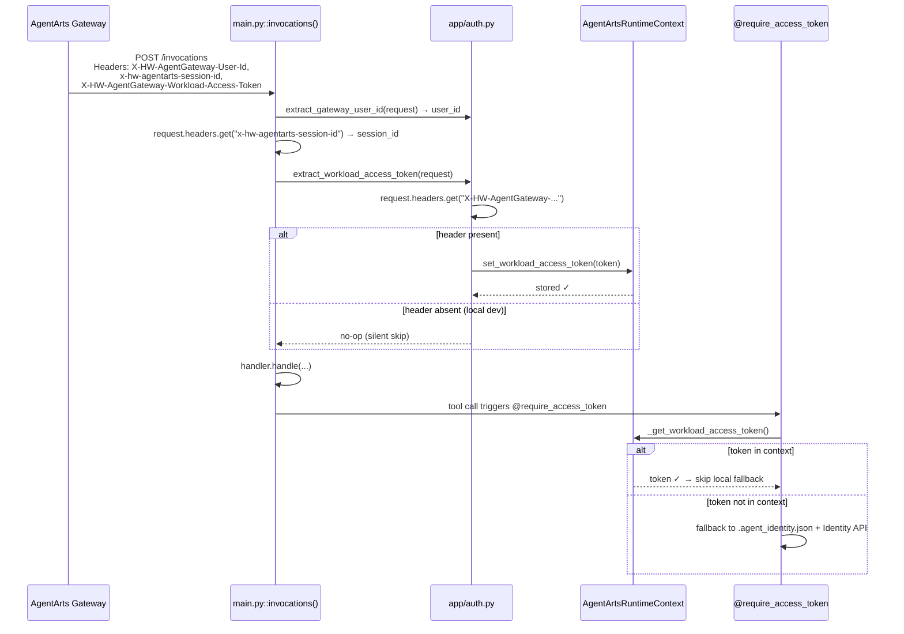

# Service Plan: 从 Request Header 提取 Workload Access Token

> Issue: [chore-5-workload-access-token-from-header](./issue.md)
> Target branch: `chore-5-workload-access-token-from-header`

---

## 1. Overview

AgentArts Gateway 在转发请求到 Runtime 容器时，通过 `X-HW-AgentGateway-Workload-Access-Token` header 注入 Workload Access Token——容器以 Workload Identity 认证 Identity Service 的短期凭证。

当前 `personal-assistant-service` 已手动提取 `X-HW-AgentGateway-User-Id` 和 `x-hw-agentarts-session-id`，但遗漏了 Workload Access Token header。这导致 `@require_access_token` 等装饰器每次都需要从本地 `.agent_identity.json` + Identity Service API 走完整认证流程，而非直接复用 Gateway 注入的 token。

**变更**：在 `app/auth.py` 新增 `extract_workload_access_token(request)` 函数，在 `main.py::invocations()` 入口处调用，将 token 存入 `AgentArtsRuntimeContext`。Header 不存在时（本地开发环境）静默跳过，不抛异常。



---

## 2. Files to Modify

| File | Change | Reason |
|------|--------|--------|
| `personal-assistant-service/app/auth.py` | Add `extract_workload_access_token()` function | New header extraction logic, following `extract_gateway_user_id` pattern |
| `personal-assistant-service/app/main.py` | Import new function + call it in `invocations()` | Wire the extraction into the request pipeline |
| `personal-assistant-service/tests/test_auth.py` | Add unit tests for new function | Verify header-present and header-absent behavior |

> **No changes** to `email_tools.py`, `tools/__init__.py`, `agent_handler.py`, `pyproject.toml`, or any other file.

---

## 3. Detailed Implementation Steps

### 3.1 `personal-assistant-service/app/auth.py` — Add `extract_workload_access_token()`

**Current state** (entire file):

```python
# personal-assistant-service/app/auth.py (current — 21 lines)
from fastapi import HTTPException, Request

def extract_gateway_user_id(request: Request) -> str:
    user_id = request.headers.get("X-HW-AgentGateway-User-Id", "").strip()
    if not user_id:
        raise HTTPException(
            status_code=401,
            detail="Missing X-HW-AgentGateway-User-Id header",
        )
    return user_id
```

**Planned change**: Append a new function `extract_workload_access_token(request)` below the existing `extract_gateway_user_id`.

**Implementation**:

1. Add import at top (after existing imports):

   ```python
   from agentarts.sdk.runtime.context import AgentArtsRuntimeContext
   ```

2. Append new function:

   ```python
   def extract_workload_access_token(request: Request) -> None:
       """提取并存入 AgentArts Gateway 注入的 Workload Access Token。

       生产环境中，AgentArts Gateway 在转发请求时会注入
       X-HW-AgentGateway-Workload-Access-Token header。
       提取后存入 AgentArtsRuntimeContext，使 @require_access_token
       等装饰器可以直接使用，跳过本地 .agent_identity.json 的 fallback 流程。

       若 header 不存在（本地开发环境），静默跳过，不抛异常。
       SDK 的 _get_workload_access_token() 自动 fallback 到本地认证。
       """
       token = request.headers.get("X-HW-AgentGateway-Workload-Access-Token")
       if token:
           AgentArtsRuntimeContext.set_workload_access_token(token)
   ```

**Design rationale** (following the `extract_gateway_user_id` pattern):

- **Same file** (`app/auth.py`): Both functions concern Gateway header extraction. Colocated for discoverability.
- **Different contract**: `extract_gateway_user_id` is fail-closed (raises 401 on missing header — production must have it). `extract_workload_access_token` is fail-open (silent no-op — local dev is fine without it).
- **Return type `None`**: The function's job is a side-effect — store token into context. Caller doesn't need a return value.
- **Strip not needed**: Unlike `user_id` which needs `.strip()` to handle whitespace-only values (and reject them as invalid), the Workload Access Token is an opaque JWT string. If it's non-empty, pass it through as-is; the SDK will validate it downstream.

### 3.2 `personal-assistant-service/app/main.py` — Import and call at `invocations()` entry

**Current relevant section** (lines 37–38, 116–117):

```python
from app.auth import extract_gateway_user_id  # line 38

# ... inside invocations():
user_id = extract_gateway_user_id(request)       # line 116
session_id = request.headers.get("x-hw-agentarts-session-id")  # line 117
```

**Planned change**:

1. Update the import on line 38 to also import the new function:

   ```python
   from app.auth import extract_gateway_user_id, extract_workload_access_token
   ```

2. Add a call to `extract_workload_access_token(request)` immediately after the existing header extractions, *before* the `if not message` validation. The recommended insertion point is right after the `session_id` extraction (after line 122, which raises if session_id is missing) and before `if not message:` (line 124):

   ```python
   # After line 122 (the session_id 400 check):
   extract_workload_access_token(request)
   ```

   **Why this position?** The token must be set in context *before* any tool calls happen (which are triggered later during `handler.handle()` or `handler.handle_stream()`). Setting it early in the request pipeline ensures it's available regardless of sync/stream path.

**Full `invocations()` function after changes** (only the header section; the rest is unchanged):

```python
async def invocations(request: Request):
    """Agent invocation endpoint, supporting sync JSON and SSE streaming."""
    try:
        body = await request.json()
    except JSONDecodeError as e:
        raise HTTPException(status_code=400, detail="invalid JSON body") from e

    message = body.get("message", "")
    stream = body.get("stream", False)
    user_id = extract_gateway_user_id(request)
    session_id = request.headers.get("x-hw-agentarts-session-id")
    if not session_id:
        raise HTTPException(
            status_code=400,
            detail="x-hw-agentarts-session-id header is required",
        )
    extract_workload_access_token(request)  # ← NEW: Chore 5

    if not message:
        raise HTTPException(status_code=400, detail="message is required")
    # ... rest unchanged
```

### 3.3 `personal-assistant-service/tests/test_auth.py` — Unit tests

Add a new test class `TestExtractWorkloadAccessToken` following the same pattern as `TestExtractGatewayUserId`.

**Test cases**:

| Test | Description | Expected |
|------|-------------|----------|
| `test_stores_token_when_header_present` | Header `X-HW-AgentGateway-Workload-Access-Token: eyJhbG...` present → context gets the token | `AgentArtsRuntimeContext.set_workload_access_token` called with the token string |
| `test_noop_when_header_missing` | No header → function returns without error | No exception, `set_workload_access_token` NOT called |
| `test_noop_when_header_empty_string` | Header present but empty string `""` → treated as absent (falsy check) | No exception, `set_workload_access_token` NOT called |

**Test implementation approach**:

Since `AgentArtsRuntimeContext.set_workload_access_token()` is a classmethod on a third-party SDK class, the tests should **mock** this call to verify:
1. It is called with the correct token when the header is present.
2. It is NOT called when the header is absent or empty.

```python
from unittest.mock import patch

from app.auth import extract_workload_access_token


class TestExtractWorkloadAccessToken:
    """Tests for extract_workload_access_token()."""

    def test_stores_token_when_header_present(self) -> None:
        """Header X-HW-AgentGateway-Workload-Access-Token present →
        set_workload_access_token called with token value."""
        token_value = "eyJhbGciOiJSUzI1NiIsInR5cCI6IkpXVCJ9..."
        request = _make_request(
            {"X-HW-AgentGateway-Workload-Access-Token": token_value}
        )
        with patch(
            "app.auth.AgentArtsRuntimeContext.set_workload_access_token"
        ) as mock_set:
            extract_workload_access_token(request)
            mock_set.assert_called_once_with(token_value)

    def test_noop_when_header_missing(self) -> None:
        """No header → function returns silently, set_workload_access_token NOT called."""
        request = _make_request({"other-header": "value"})
        with patch(
            "app.auth.AgentArtsRuntimeContext.set_workload_access_token"
        ) as mock_set:
            extract_workload_access_token(request)
            mock_set.assert_not_called()

    def test_noop_when_header_empty_string(self) -> None:
        """Header present but empty → treated as absent, set_workload_access_token NOT called."""
        request = _make_request(
            {"X-HW-AgentGateway-Workload-Access-Token": ""}
        )
        with patch(
            "app.auth.AgentArtsRuntimeContext.set_workload_access_token"
        ) as mock_set:
            extract_workload_access_token(request)
            mock_set.assert_not_called()
```

> **Note**: The `_make_request()` helper already exists in `test_auth.py` (reuse it — no need to duplicate).

---

## 4. Validation

### 4.1 Unit test verification

```bash
cd personal-assistant-service
uv run pytest tests/test_auth.py -v -k "TestExtractWorkloadAccessToken"
```

Expected: 3 passing tests.

### 4.2 Full test suite (no regressions)

```bash
cd personal-assistant-service
uv run pytest tests/ -v
```

Expected: all existing tests still pass. No test in `test_main.py` should break — the new function call is silent and side-effect-only.

### 4.3 Manual integration test (local)

```bash
cd personal-assistant-service
uv run uvicorn app.main:app --host 0.0.0.0 --port 8080 --reload
```

```bash
# With workload access token header (simulated)
curl -X POST http://localhost:8080/invocations \
  -H "Content-Type: application/json" \
  -H "X-HW-AgentGateway-User-Id: test-user" \
  -H "x-hw-agentarts-session-id: sess-123" \
  -H "X-HW-AgentGateway-Workload-Access-Token: test-token-value" \
  -d '{"message": "你好"}'
# Expected: 200 OK with response. Token silently stored in context.

# Without workload access token header (local dev mode)
curl -X POST http://localhost:8080/invocations \
  -H "Content-Type: application/json" \
  -H "X-HW-AgentGateway-User-Id: test-user" \
  -H "x-hw-agentarts-session-id: sess-123" \
  -d '{"message": "你好"}'
# Expected: 200 OK with response. No error — silent skip.
```

### 4.4 Production verification (post-deploy)

After `agentarts launch`, call via Gateway:

```bash
curl -X POST https://<runtime-domain>/invocations \
  -H "Content-Type: application/json" \
  -H "Authorization: Bearer <jwt-token>" \
  -d '{"message": "列出我的收件箱"}'
```

Verify in logs that:
1. The `/invocations` endpoint returns 200.
2. Email tools (which use `@require_access_token`) work without errors — the decorator picks up the context-stored token.
3. No errors related to missing `.agent_identity.json` (unless the token itself is expired — which is a separate concern).

---

## 5. Risks & Mitigations

| Risk | Likelihood | Impact | Mitigation |
|------|-----------|--------|------------|
| **`AgentArtsRuntimeContext` is not thread-safe** (multiple concurrent requests could clobber the token) | Low | Medium — wrong token applied to wrong request | This is an SDK-level concern, not our abstraction. The SDK's `context.py` uses `contextvars` (per-async-task storage), which is safe for ASGI. If the SDK's implementation is different, it's a bug in the SDK, not our code. Follow-up: verify `contextvars` usage in SDK source. |
| **Header name changes in future Gateway version** | Low | Medium — token silently not extracted | The header name `X-HW-AgentGateway-Workload-Access-Token` is defined as a constant in the SDK (`agentarts.sdk.runtime.model.ACCESS_TOKEN_HEADER`). If it changes, the SDK will change too and a version bump will surface the mismatch. |
| **Empty token string (header present but value is `""`)** | Low | Low — SDK fallback works | The `if token:` guard in our code treats empty strings as absent. The SDK's `_get_workload_access_token()` will fall back to local auth. No regression. |
| **`set_workload_access_token()` raises an exception** (e.g., SDK validation) | Very Low | Medium — crashes the `/invocations` handler | The function is called before `if not message:` validation, so malformed tokens would 500 the request. Mitigation: add a try/except around the call if SDK docs indicate it can raise. Per current SDK docs, it's a simple setter — no validation. Monitor after deployment. |

---

## 6. Dependency Confirmation

| Dependency | Version | Status |
|------------|---------|--------|
| `agentarts-sdk` | `>=0.1.3` | ✅ Already in `pyproject.toml` |

No new dependencies needed. The `AgentArtsRuntimeContext` class and `set_workload_access_token()` method are available in v0.1.3+ of the SDK.

---

## 7. Summary of Code Changes

```
personal-assistant-service/
├── app/
│   ├── auth.py          ← +1 import, +~15 lines (new function)
│   └── main.py          ← ±1 line (import addition), +1 line (function call)
└── tests/
    └── test_auth.py     ← +~40 lines (new test class with 3 tests)
```

**Total net new lines**: ~55 (15 auth + 1 main + 40 tests). Zero lines removed.
