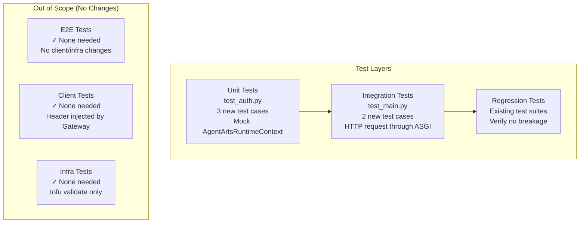
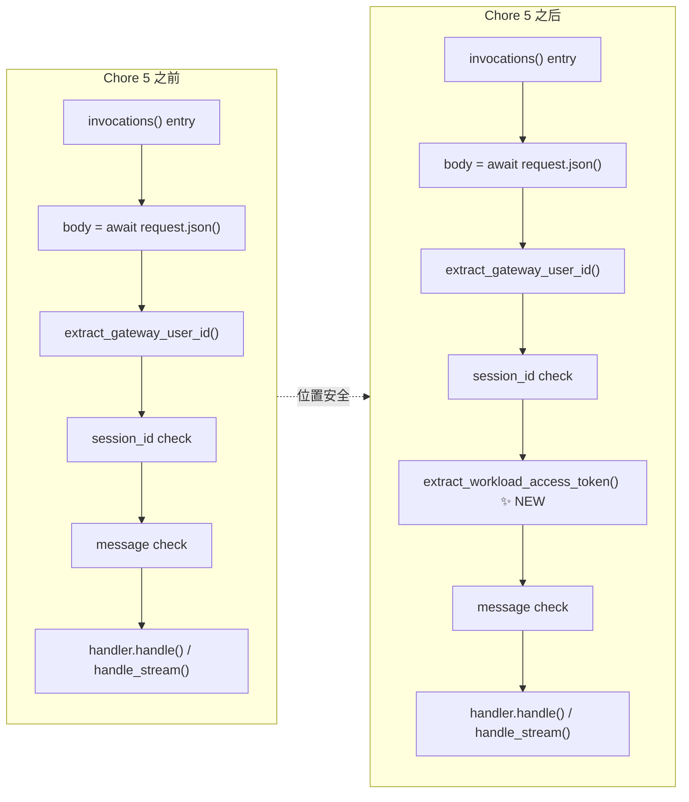
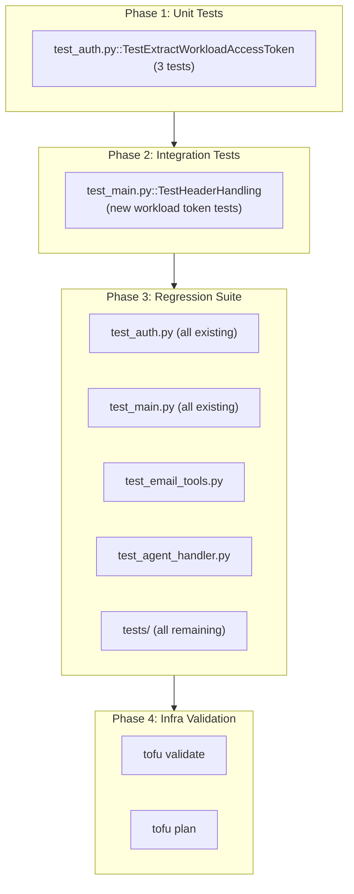
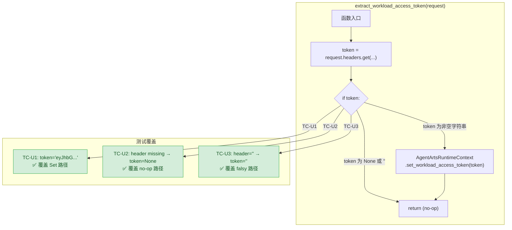

# Test Plan — Chore 5: 从 Request Header 提取 Workload Access Token

> Issue: [chore-5-workload-access-token-from-header](./issue.md)
> Feature branch: `chore-5-workload-access-token-from-header`
> 版本：v1.0 | 状态：Draft

---

## 1. Test Strategy Overview

### 1.1 What Is Being Tested

本次变更在 `personal-assistant-service/app/auth.py` 新增 `extract_workload_access_token(request)` 函数，并在 `main.py::invocations()` 入口处调用。该函数从 AgentArts Gateway 注入的 `X-HW-AgentGateway-Workload-Access-Token` header 中提取 token，存入 `AgentArtsRuntimeContext`，使 `@require_access_token` 等装饰器可直接使用，跳过本地 `.agent_identity.json` fallback。

核心契约：

| 行为 | 契约 |
|------|------|
| Header 存在且非空 | `AgentArtsRuntimeContext.set_workload_access_token(token)` 被调用，token 值原样传递 |
| Header 不存在 | 静默跳过，不抛异常，不调用 `set_workload_access_token` |
| Header 为空字符串 | 视为"不存在"，静默跳过（Python falsy guard `if token:`） |

### 1.2 Testing Scope



### 1.3 Why No E2E Tests

- **Client 层无变更**：`X-HW-AgentGateway-Workload-Access-Token` header 由 AgentArts Gateway 注入，前端不发送、不感知、不依赖此 header（见 `client-plan.md` §1.1）。
- **Infra 层无变更**：无新资源、无配置变更、无 IaC 文件修改（见 `infra-plan.md` §2）。
- **Token 生命周期对 E2E 透明**：E2E 测试直连 FastAPI 容器，无 Gateway → header 不存在 → SDK 自然 fallback 到本地 `.agent_identity.json`。此行为在本次变更前后完全一致。

---

## 2. Unit Tests（`test_auth.py`）

### 2.1 Test Location

在 `personal-assistant-service/tests/test_auth.py` 尾部新增 `TestExtractWorkloadAccessToken` 类，遵循已有 `TestExtractGatewayUserId` 的编码风格：

- 复用 `_make_request()` helper（文件顶部已定义）
- 使用 `unittest.mock.patch` 对 `AgentArtsRuntimeContext.set_workload_access_token` 进行 mock assertion
- 每个 test method 包含中文 docstring + 箭头说明（→）

### 2.2 Test Cases

| # | Test Method | Input | Expected Behavior | Assertion |
|---|-------------|-------|-------------------|-----------|
| TC-U1 | `test_stores_token_when_header_present` | Header `X-HW-AgentGateway-Workload-Access-Token: "eyJhbGciOiJSUzI1NiIs..."` | `set_workload_access_token` 被调用一次，参数为 token 字符串 | `mock_set.assert_called_once_with(token_value)` |
| TC-U2 | `test_noop_when_header_missing` | 无 `X-HW-AgentGateway-Workload-Access-Token` header（仅有 `other-header`） | 函数正常返回，不抛异常；`set_workload_access_token` 未被调用 | `mock_set.assert_not_called()` |
| TC-U3 | `test_noop_when_header_empty_string` | Header `X-HW-AgentGateway-Workload-Access-Token: ""` | 函数正常返回，不抛异常；`set_workload_access_token` 未被调用（`if token:` 将 `""` 视为 falsy） | `mock_set.assert_not_called()` |

### 2.3 Test Implementation Template

```python
from unittest.mock import patch

from app.auth import extract_workload_access_token


class TestExtractWorkloadAccessToken:
    """Tests for extract_workload_access_token()."""

    def test_stores_token_when_header_present(self) -> None:
        """Header X-HW-AgentGateway-Workload-Access-Token present →
        set_workload_access_token called with token value."""
        token_value = "eyJhbGciOiJSUzI1NiIsInR5cCI6IkpXVCJ9.test-token"
        request = _make_request(
            {"X-HW-AgentGateway-Workload-Access-Token": token_value}
        )
        with patch(
            "app.auth.AgentArtsRuntimeContext.set_workload_access_token"
        ) as mock_set:
            extract_workload_access_token(request)
            mock_set.assert_called_once_with(token_value)

    def test_noop_when_header_missing(self) -> None:
        """No header → function returns silently,
        set_workload_access_token NOT called."""
        request = _make_request({"other-header": "value"})
        with patch(
            "app.auth.AgentArtsRuntimeContext.set_workload_access_token"
        ) as mock_set:
            extract_workload_access_token(request)
            mock_set.assert_not_called()

    def test_noop_when_header_empty_string(self) -> None:
        """Header present but empty → treated as absent,
        set_workload_access_token NOT called."""
        request = _make_request(
            {"X-HW-AgentGateway-Workload-Access-Token": ""}
        )
        with patch(
            "app.auth.AgentArtsRuntimeContext.set_workload_access_token"
        ) as mock_set:
            extract_workload_access_token(request)
            mock_set.assert_not_called()
```

### 2.4 Mock Strategy

`AgentArtsRuntimeContext` 是 `agentarts-sdk` 的第三方类，其 `set_workload_access_token()` 是一个 `@classmethod`。单元测试**不应**依赖真实的 SDK 行为，而是：

1. **Patch 路径**：`"app.auth.AgentArtsRuntimeContext.set_workload_access_token"` — 这是函数被调用的路径。
2. **验证调用次数与参数**：使用 `mock.assert_called_once_with()` 和 `mock.assert_not_called()`。
3. **不验证 SDK 内部行为**：`set_workload_access_token()` 的内部实现（如 `contextvars` 存储）由 SDK 自身的测试覆盖，本项目的单元测试只关心"是否以正确的 token 调用了 SDK 的公开 API"。

### 2.5 Edge Cases Not Covered

以下边角情况**不需要**在本次单元测试中覆盖，原因如下：

| Edge Case | Why Not Tested |
|-----------|---------------|
| Token 中包含特殊字符（换行、null 字节） | Token 是 Gateway 注入的 JWT，格式由平台保证，不会出现畸形值 |
| 多次调用 `extract_workload_access_token()` | 函数在 `invocations()` 中仅在入口处调用一次，不存在重复调用场景 |
| 并发请求下 context 隔离 | `AgentArtsRuntimeContext` 使用 `contextvars`，隔离性由 SDK 保证。若 SDK 实现有 bug，不是本项目测试可覆盖的 |
| `set_workload_access_token()` 抛异常 | 按当前 SDK docs，该方法为简单 setter，不做校验。若后续 SDK 版本引入验证抛异常，应通过分层的 integration test 捕获，非单元测试责任 |

---

## 3. Integration Tests（`test_main.py`）

### 3.1 Test Location

在 `personal-assistant-service/tests/test_main.py` 的 `TestHeaderHandling` 类中新增 2 个测试方法，验证 workload access token 在完整 HTTP 请求路径中的行为。

### 3.2 Test Cases

| # | Test Method | Input | Expected Behavior | Assertion |
|---|-------------|-------|-------------------|-----------|
| TC-I1 | `test_workload_token_header_accepted` | 完整 POST /invocations 请求，包含 `X-HW-AgentGateway-Workload-Access-Token: "test-token"` header | 请求正常返回 200，不因 workload token header 的存在而改变任何行为。验证 `extract_workload_access_token` 被调用 | `response.status_code == 200`，mock 被调用一次 |
| TC-I2 | `test_no_workload_token_header_no_error` | 完整 POST /invocations 请求，无 `X-HW-AgentGateway-Workload-Access-Token` header（模拟本地开发） | 请求正常返回 200，不报错。验证 `extract_workload_access_token` 被调用（无 header 时是 no-op） | `response.status_code == 200`，mock 被调用一次但未调 `set_workload_access_token` |

### 3.3 Test Implementation Notes

- 复用 `test_main.py` 中的 `client` fixture（提供 ASGI transport + FakeAgentHandler）。
- 使用 `patch("app.auth.extract_workload_access_token")` 间接验证该函数在请求路径中被调用。
- **不要**在 integration test 中 mock `AgentArtsRuntimeContext`——integration test 关注的是"请求-响应"路径的完整性，包括真实调用链 `main.py → auth.py → SDK`。
- 对于 TC-I2，可直接通过 `patch("app.main.extract_workload_access_token")` 验证调用次数。

### 3.4 Alternative: Direct Integration Test without Mocks

如果需要更真实的集成验证，可采用另一种策略（**推荐但需要真实 SDK 环境**）：

```python
@pytest.mark.asyncio
async def test_workload_token_header_integration(client, fake_handler):
    """POST /invocations with workload token header → 200, handler unaffected."""
    response = await client.post(
        "/invocations",
        json={"message": "你好"},
        headers={
            "X-HW-AgentGateway-User-Id": "test-user",
            "x-hw-agentarts-session-id": "sess-test",
            "X-HW-AgentGateway-Workload-Access-Token": "test-token-123",
        },
    )
    assert response.status_code == 200
    assert "response" in response.json()
```

这种方式不 mock，直接验证端到端 200 行为，但生产价值有限（无法验证 token 是否真的被 SDk 使用）。

---

## 4. Regression Tests

### 4.1 Existing Test Suites

以下现有测试套件**必须全部通过**，确保本次变更无回归：

| Test File | Tests | Regression Check |
|-----------|-------|------------------|
| `tests/test_auth.py` | `TestExtractGatewayUserId` (4 tests) | 现有 header 提取逻辑不受影响；`_make_request()` helper 行为不变 |
| `tests/test_main.py` | `TestHeaderHandling` (8 tests) | session_id / user_id 提取逻辑不变；400/401 错误码不变 |
| `tests/test_main.py` | `/invocations` 全部异步测试 (~20 tests) | body 解析、stream 路由、CORS、Chainlit mount 均不变 |
| `tests/test_email_tools.py` | 全部邮件工具测试 | `@require_access_token` 装饰器行为不变 |
| `tests/test_agent_handler.py` | 全部 handler 测试 | handler 调用链不受影响 |
| `tests/test_llm_config.py` | 全部 LLM 配置测试 | 无变更，应全部通过 |
| `tests/test_checkpointer.py` | 全部 checkpointer 测试 | checkpoint 逻辑不受影响 |
| `tests/test_tools_init.py` | 全部 tools 初始化测试 | 工具注册逻辑不变 |
| `tests/test_playground.py` | 全部 playground 测试 | Chainlit mount 不变 |

### 4.2 Regression Test Cases（Explicit）

以下 3 个显式回归测试场景**无需新写代码**，但必须在测试执行过程中明确确认：

| # | Regression Scenario | Verification Method | Expected Result |
|---|---------------------|---------------------|-----------------|
| RC-1 | **`@require_access_token` 装饰器行为不变** | 运行 `tests/test_email_tools.py` 全部测试 | 全部通过。token 获取逻辑（context → `.agent_identity.json` fallback）不受本次变更影响 |
| RC-2 | **`.agent_identity.json` fallback 仍可用** | 在本地开发环境（无 Gateway header）运行 `curl -X POST /invocations` 并含邮件工具调用 | 200 OK。SDK 自动走本地 `.agent_identity.json` + Identity API 认证路径 |
| RC-3 | **`extract_gateway_user_id` 不变** | 运行 `tests/test_auth.py::TestExtractGatewayUserId` | 全部 4 个测试通过。401 行为、`.strip()` 逻辑不变 |
| RC-4 | **`invocations()` body 解析顺序不变** | 运行 `tests/test_main.py` 中与 body 解析相关的全部测试 | JSON body 解析 → user_id 提取 → session_id 提取 → 新函数调用 → message 验证 的执行顺序中，早期返回（400/401）在调用 workload token 之前，不影响现有错误路径 |

### 4.3 Regression Risk Assessment



**关键回归安全分析**：

1. 新函数插入位置在 `session_id` 验证之后、`message` 验证之前。
2. 所有在 session_id 检查之前的失败路径（JSONDecodeError → 400, extract_gateway_user_id → 401, session_id missing → 400）**执行不到新函数**，完全不受影响。
3. 新函数是纯 side-effect（不返回、不抛异常），不会改变控制流。
4. `message` 验证和后续 handler 调用不受影响。

---

## 5. E2E Scenarios

### 5.1 Conclusion: No E2E Tests Required

**不需要**新增 E2E 测试用例。理由：

- Client 层零变更（`client-plan.md` 已确认）
- Infra 层零变更（`infra-plan.md` 已确认）
- Workload Access Token 的注入和提取纯粹是后端 + Gateway 的内部行为
- 现有 E2E 测试覆盖的请求路径不涉及此 header（E2E 直连 FastAPI，无 Gateway）

### 5.2 Post-Deploy Production Verification（Manual）

以下手动验证步骤供生产部署后执行（非自动化测试）：

| Step | Action | Expected |
|------|--------|----------|
| 1 | `agentarts launch` 部署新镜像 | 部署成功，容器启动 |
| 2 | 通过 Gateway 调用 `/invocations`（含邮件工具请求） | 200 OK，邮件工具正常工作 |
| 3 | 检查容器日志 | 无 `@require_access_token` 相关认证错误 |
| 4 | 确认无 `.agent_identity.json` missing 错误 | 仅在本地开发环境出现，生产环境应无此错误 |

---

## 6. Infrastructure Tests

### 6.1 `tofu validate`

```bash
cd personal-assistant-infra
tofu validate
```

**Expected**: Passes with no errors. IaC 文件无变更，HCL 语法应保持有效。

### 6.2 `tofu plan`

```bash
cd personal-assistant-infra
tofu plan
```

**Expected**: `No changes. Your infrastructure matches the configuration.`

> 以上 2 个 infra 检查由 `personal-assistant-infra-tester` 在 Infra 控制循环中执行（即使本 chore 无 IaC 变更，验证现有栈仍然有效是良好的工程实践）。

---

## 7. Test Execution Order & Dependencies

### 7.1 Execution Flow



### 7.2 Dependencies

| Dependency | Status | Notes |
|------------|--------|-------|
| `agentarts-sdk` >= 0.1.3 | ✅ Already in `pyproject.toml` | `AgentArtsRuntimeContext` class available |
| `pytest` + `pytest-asyncio` | ✅ Already in dev dependencies | All test suites use pytest |
| `unittest.mock` | ✅ Python stdlib | Used for `patch()` in unit tests |
| `httpx` | ✅ Already in test dependencies | Used in `test_main.py` integration tests |

### 7.3 Run Commands

```bash
# Phase 1: Unit tests (new code only)
cd personal-assistant-service
uv run pytest tests/test_auth.py -v -k "TestExtractWorkloadAccessToken"

# Phase 2: Integration tests (new tests)
uv run pytest tests/test_main.py::TestHeaderHandling -v -k "workload"

# Phase 3: Full regression
uv run pytest tests/ -v

# Phase 4: Infra validation
cd personal-assistant-infra
tofu validate && tofu plan
```

---

## 8. Expected Test Outcomes & Pass/Fail Criteria

### 8.1 Pass Criteria

| Criterion | Metric | Target |
|-----------|--------|--------|
| 新单元测试全部通过 | `tests/test_auth.py -k TestExtractWorkloadAccessToken` | 3/3 passed |
| 新集成测试全部通过 | `tests/test_main.py` workload token tests | 2/2 passed |
| 现有测试套件零回归 | `tests/` full suite | 100% pass rate（与基线一致） |
| Infra 验证通过 | `tofu validate` + `tofu plan` | 无错误，无 drift |
| 代码覆盖率 | `tests/test_auth.py` 中 `extract_workload_access_token` | 100%（函数仅 2 种路径，3 个测试覆盖） |

### 8.2 Fail Criteria

以下任一情况视为测试失败：

| Failure | Severity | Action |
|---------|----------|--------|
| TC-U1 fail：header 存在时 `set_workload_access_token` 未被调用或参数错误 | **CRITICAL** | 核心功能未实现，阻止合并 |
| TC-U2 fail：header 缺失时抛异常 | **HIGH** | 破坏本地开发体验，阻止合并 |
| TC-U3 fail：header 为空字符串时抛异常 | **MEDIUM** | 边界情况未处理，应修复后合并 |
| 任何现有测试回归（Phase 3 full suite 有新增失败） | **CRITICAL** | 阻止合并，需排查变更引入的回归 |
| `tofu plan` 显示 infra 变更 | **HIGH** | 阻止合并，本 chore 不应引入 IaC 变更 |

### 8.3 Test Coverage Diagram



---

## 9. Risk-Based Test Prioritization

| Priority | Test | Rationale |
|----------|------|-----------|
| **P0 - 必须通过** | TC-U1 (header present → set token) | 这正是 Issue 要求实现的核心功能 |
| **P0 - 必须通过** | RC-1 (@require_access_token regression) | 回归风险最高的区域 — 装饰器行为变化会导致邮件功能不可用 |
| **P0 - 必须通过** | Phase 3 full test suite | 必须确认零回归方可合并 |
| **P1 - 应该通过** | TC-U2 (header missing → no-op) | 本地开发体验的保护，失败虽非阻断但应修复 |
| **P1 - 应该通过** | TC-U3 (header empty → no-op) | 边界情况，防御性编程的必要验证 |
| **P2 - 建议通过** | TC-I1, TC-I2 (integration tests) | 集成层验证，在单元测试通过后可提供额外信心 |

---

## 10. Summary of Test Artifacts

```mermaid
gantt
    title Test Plan Execution Timeline
    dateFormat  HH:mm
    axisFormat %H:%M
    section Unit
    TC-U1 header present    :u1, 00:00, 0.5min
    TC-U2 header missing    :u2, after u1, 0.5min
    TC-U3 header empty      :u3, after u2, 0.5min
    section Integration
    TC-I1 token accepted    :i1, after u3, 1min
    TC-I2 no token no error :i2, after i1, 1min
    section Regression
    full test suite         :r1, after i2, 5min
    section Infra
    tofu validate + plan    :iv1, after r1, 1min
```



| Artifact | File | Status |
|----------|------|--------|
| Unit tests | `personal-assistant-service/tests/test_auth.py` | **New**: `TestExtractWorkloadAccessToken` (3 tests, ~40 LOC) |
| Integration tests | `personal-assistant-service/tests/test_main.py` | **New**: 2 test methods in `TestHeaderHandling` (~25 LOC) |
| E2E tests | `personal-assistant-e2e/tests/` | **No new tests** — no client/infra changes |
| Regression tests | Existing test suites | **No new files** — verify all pass |
| Infra validation | `personal-assistant-infra/` | **No new code** — `tofu validate` + `tofu plan` only |

**Total new test code**: ~65 lines across 2 existing files. Zero new test files created.
