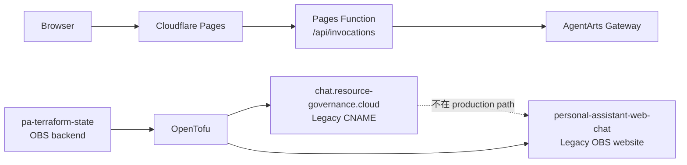
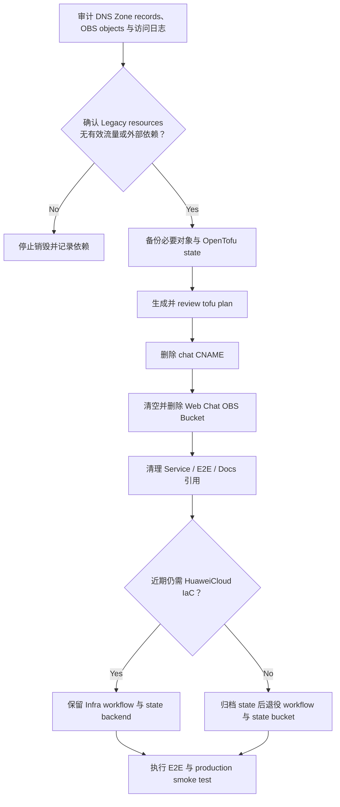

# Chore 6: 退役 Legacy OBS / DNS Infrastructure

## 变更动机

Production Web Chat 已于 2026-06-18 迁移至 Cloudflare Pages，并通过
Pages Function 将 same-origin `/api/invocations` 请求代理到 AgentArts
Gateway。原有华为云 OBS static website 与
`chat.resource-governance.cloud` CNAME 已不在当前 production request path
中，但仍由 `personal-assistant-infra`、OpenTofu state 和
`.github/workflows/deploy-infra.yml` 持续管理。

继续保留这些 Legacy resources 会产生以下问题：

- 公开可读的 OBS Bucket 扩大无必要的安全暴露面。
- DNS、OBS 和 OpenTofu state 产生持续维护成本，并容易让新成员误判当前
  production topology。
- Service CORS fallback、E2E tests 和部署文档仍包含 OBS / Netlify 历史配置，
  与当前 Cloudflare Pages 架构不一致。
- Infra workflow 在 `main` 变更后自动执行 `tofu apply`，可能长期维持已经没有
  production 用途的资源。

## 当前状态

## 目标状态

- 删除 `personal-assistant-web-chat` Legacy static website Bucket。
- 删除 `chat.resource-governance.cloud` CNAME。
- 保留 `resource-governance.cloud` DNS Zone 本身，除非实施时确认整个域名及其
  全部 records 均已废弃。
- 清理 OBS / Netlify CORS fallback、过期 E2E assertions 和当前架构文档中的
  非历史性引用。
- 根据近期 HuaweiCloud IaC 需求，明确选择以下之一：
  - 保留精简后的 `personal-assistant-infra` 与 `pa-terraform-state`，用于未来
    RDS、IAM、VPC 或 EIP resources。
  - 完全退役 OpenTofu workflow，并在安全迁移或归档 state 后删除
    `pa-terraform-state`。

## 影响范围

### Infra

- `personal-assistant-infra/obs.tf`
- `personal-assistant-infra/dns.tf`
- `personal-assistant-infra/outputs.tf`
- `personal-assistant-infra/main.tf`
- `personal-assistant-infra/README.md`
- `personal-assistant-infra/AGENTS.md`
- `.github/workflows/deploy-infra.yml`

### Service

- `personal-assistant-service/app/main.py`
- `personal-assistant-service/.agentarts_config.yaml`
- `personal-assistant-service/.env.example`
- 对应 CORS unit tests

### E2E

- 删除或改写仍验证 CDKTF、OBS static website、OBS CORS origin 的 Legacy tests。
- Production deployment tests 应改为验证 Cloudflare Pages URL 与
  same-origin API Proxy。

### Meta

- 更新当前架构和 CI/CD 文档，使 OBS / DNS 只存在于明确标记为 Historical 的
 记录中。
- 保留必要的历史 ADR、resolved issue 和排障记录，不篡改历史决策。

## 实施顺序

## 任务拆解

- [ ] 审计 `resource-governance.cloud` DNS Zone 的全部 records，确认不能删除
  Zone resource。
- [ ] 检查 `chat.resource-governance.cloud` 当前解析、访问流量、OAuth Redirect
  URI、CORS allowlist 和外部 bookmark / integration。
- [ ] 检查 `personal-assistant-web-chat` Bucket 内容、访问日志、versioning 和
  retention，备份必要对象。
- [ ] 获取远程 OpenTofu state 备份，并确认 state 中实际管理的 resources。
- [ ] 在修改 Terraform resources 前执行 GitNexus impact analysis。
- [ ] 生成销毁 Legacy CNAME 与 Web Chat Bucket 的 `tofu plan`，人工 review
  后方可 apply。
- [ ] 从 OpenTofu 管理中安全移除 DNS Zone；不得因删除 Terraform declaration
  而销毁仍在使用的 Zone。
- [ ] 删除 OBS / DNS outputs 和无效 variables。
- [ ] 清理 Service 中 OBS / Netlify CORS fallback；确认 Cloudflare
  same-origin path 不依赖 FastAPI CORS。
- [ ] 更新或删除 Legacy OBS / CDKTF E2E tests。
- [ ] 更新 Infra、CI/CD 和 architecture 文档。
- [ ] 决定是否保留 OpenTofu：
  - [ ] 若保留：将目录说明改为未来 HuaweiCloud resources 的空基线。
  - [ ] 若退役：禁用 Infra workflow，归档 state，再删除
    `pa-terraform-state`。
- [ ] 运行 Service unit tests、Client tests、相关 E2E tests 和 Cloudflare
  production smoke test。
- [ ] 在 commit 前运行 `gitnexus_detect_changes()`，确认影响范围符合预期。

## 安全约束

- 不得直接执行未 review 的 `tofu destroy`。
- 不得删除整个 `resource-governance.cloud` DNS Zone，除非已审计全部 records
  并得到明确批准。
- 不得先删除 `pa-terraform-state`；必须先备份或迁移 state，并确认不存在仍由
  OpenTofu 管理的有效 resources。
- 删除启用 versioning 的 OBS Bucket 前，必须处理所有 object versions 和
  delete markers。
- 云资源删除属于不可逆 external state change，实施阶段必须单独获得明确批准。

## 验收标准

- Cloudflare Pages 首页、SPA routes 与 `/api/invocations` smoke test 正常。
- AgentArts Gateway authentication 与 SSE streaming 不受影响。
- `chat.resource-governance.cloud` CNAME 和
  `personal-assistant-web-chat` Bucket 已按批准范围退役。
- `resource-governance.cloud` 的其他 DNS records 不受影响。
- 仓库当前配置与 tests 不再将 OBS / Netlify 视为 production frontend。
- OpenTofu 和 `pa-terraform-state` 的保留或退役决策已记录，且仓库配置与该
  决策一致。

## 关联文档

- `personal-assistant-meta/architecture/ADR/ADR-017-cloudflare-pages-proxy.md`
- `personal-assistant-meta/architecture/cloud-service/cloudflare/pages.md`
- `personal-assistant-meta/architecture/cloud-service/domain.md`
- `personal-assistant-meta/architecture/devops/cicd.md`
- `personal-assistant-infra/README.md`

