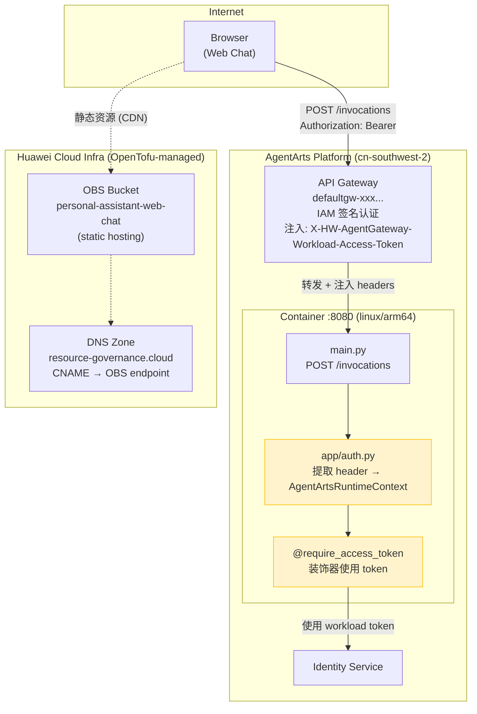

# Chore 5: Infrastructure Implementation Plan

> **Issue**: [chore-5-workload-access-token-from-header](issue.md)
> **Feature Branch**: `chore-5-workload-access-token-from-header`
> **Status**: No infrastructure changes required

---

## 1. Summary

**This chore requires zero infrastructure changes.** The work is entirely within `personal-assistant-service/` — extracting the `X-HW-AgentGateway-Workload-Access-Token` header that the AgentArts Gateway already injects into every forwarded request, and storing it in `AgentArtsRuntimeContext` so that `@require_access_token` decorators can use it directly.

---

## 2. Why No Infrastructure Changes

### 2.1 Gateway Header Injection Is a Platform Feature

The AgentArts Gateway automatically injects the `X-HW-AgentGateway-Workload-Access-Token` header on every request it forwards to the Runtime container. This is **built-in behavior of the AgentArts platform** — it is enabled by default, requires no configuration toggle, and is documented in the [AgentArts API reference PDF](../../../../architecture/cloud-service/agentarts-api-pdf.pdf) (pp. 859–868).

It is **not something configured in OpenTofu/HCL, `.agentarts_config.yaml`, or any Huawei Cloud IAM policy**. The platform simply does it.

### 2.2 Change Scope Is Purely Backend Service Code

The only change is in `personal-assistant-service/` — adding ~5 lines of Python to read the header and call `AgentArtsRuntimeContext.set_workload_access_token()`:

```python
# app/auth.py or main.py (not infra)
from agentarts.sdk.runtime.context import AgentArtsRuntimeContext

workload_token = request.headers.get("X-HW-AgentGateway-Workload-Access-Token")
if workload_token:
    AgentArtsRuntimeContext.set_workload_access_token(workload_token)
```

This is a **service-layer concern**, falling under the Service plan (`service-plan.md`), not infrastructure.

### 2.3 No New Cloud Resources Needed

| Resource Type | Needed? | Reason |
|---|---|---|
| OBS Bucket | No | Static hosting unchanged |
| RDS Instance | No | No new database |
| SWR Repository | No | Same container image |
| IAM Policy/Role/Agency | No | Gateway auth unchanged |
| VPC / Subnet / EIP | No | Network topology unchanged |
| CDN / DNS | No | Same domain + distribution |

---

## 3. Verification: Existing Infrastructure Unaffected

### 3.1 Current IaC Resources (all unaffected)

From `personal-assistant-infra/`:

| File | Resources | Impact |
|---|---|---|
| `main.tf` | Provider (`huaweicloud/huaweicloud`), OBS S3 backend | None |
| `obs.tf` | `huaweicloud_obs_bucket.web_chat` (static website hosting) | None |
| `dns.tf` | `huaweicloud_dns_zone.resource_governance_cloud`, `huaweicloud_dns_recordset.chat` | None |
| `variables.tf` | Variable declarations (`region`, `dns_zone_id`) | None |
| `outputs.tf` | Stack outputs (`website_endpoint`) | None |

These resources all pertain to frontend static hosting and DNS. The workload access token header flows through the **AgentArts Gateway → Container** path, which is entirely platform-managed and has no corresponding OpenTofu resource.

### 3.2 `.agentarts_config.yaml` (AgentArts Layer)

The `.agentarts_config.yaml` in `personal-assistant-service/` requires **no modification**. The `identity_configuration` block configures Inbound auth (CUSTOM_JWT / API Key), and the Gateway's header injection is orthogonal to these settings. The header is injected regardless of the configured `authorizer_type`.

### 3.3 `tofu plan` Expectation

Running `tofu plan` from `personal-assistant-infra/` after this chore is complete should show:

```
No changes. Your infrastructure matches the configuration.
```

---

## 4. Infrastructure Topology (for Reference)

The following diagram shows the existing infrastructure with the relevant data flow annotated. The change (extracting a header) happens entirely inside the container — the infrastructure layer is unchanged.



**Key**: The highlighted nodes (`app/auth.py` and `@require_access_token`) are the only components changed — both are inside the container and managed as service code, not infrastructure.

---

## 5. Infrastructure Test Cases

### 5.1 `tofu validate` — Syntax Check

```bash
cd personal-assistant-infra
tofu validate
```

**Expected**: Passes with no errors. The IaC files are unchanged and should remain valid.

### 5.2 `tofu plan` — No Drift

```bash
cd personal-assistant-infra
tofu plan
```

**Expected**: `No changes. Your infrastructure matches the configuration.`

### 5.3 Deployment Verification

After the service change is deployed (`agentarts launch`), the infrastructure layer should be verified indirectly:

- Web Chat is accessible at `https://chat.resource-governance.cloud`
- `/ping` health check passes (container is alive)
- `/invocations` returns valid responses (Gateway forwarding works)
- `X-HW-AgentGateway-Workload-Access-Token` header is present in Gateway-forwarded requests (verified by service-level tests in `service-plan.md`)

No separate infrastructure-specific test cases are needed beyond the `tofu validate` + `tofu plan` checks.

---

## 6. Notes for Implementers

1. **This is a zero-touch plan for `personal-assistant-infra-dev`.** The `personal-assistant-infra-manager` should skip the Infra control loop for this issue — there are no `.tf` files to modify and nothing to test beyond running `tofu validate` to confirm the existing stack is still valid.

2. **The Gateway header injection is already active.** The `X-HW-AgentGateway-Workload-Access-Token` header has been injected by the Gateway since the Runtime was first deployed. The backend just hasn't been reading it. No "enablement" step is needed — the token is already there.

3. **Fallback behavior is preserved.** If the header is absent (e.g., local `uvicorn` development), `AgentArtsRuntimeContext` will have no token, and the SDK's `_get_workload_access_token()` will automatically fall back to `.agent_identity.json` + Identity Service API call. No infrastructure configuration can affect this — it's purely runtime code logic.

4. **Reference architecture docs:**
   - `overall_architecture.md` §4.1 — Gateway Header 注入
   - `backend_architecture.md` §2.3 — AgentArts Gateway Header 注入 (updated for Chore 5)
   - `backend_architecture.md` §5.2 — Workload Access Token 优化
