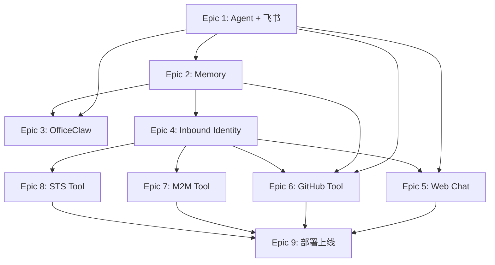

# Epics

Personal Assistant 开发计划，9 个 Phase 对应 9 个 Epic。

渠道策略：飞书 → OfficeClaw → Web Chat。优先用企业内部 IM 验证 Agent 能力，Web Chat 作为最后的对外展示渠道。

## 概览

| Epic | 内容 | 核心交付 | 依赖 | 状态 |
|------|------|----------|------|------|
| [1](epic-1-agent-skeleton.md) | Agent 骨架 + 飞书 | 飞书 @Bot 完成一轮对话 | 无 | backlog |
| [2](epic-2-memory.md) | Memory 集成 | 飞书上验证跨 Session 记忆 | Epic 1 | backlog |
| [3](epic-3-officeclaw.md) | OfficeClaw 渠道 | 飞书/微信多渠道覆盖（零代码） | Epic 1, 2 | backlog |
| [4](epic-4-inbound-identity.md) | Inbound Identity (OAuth) | Google OAuth + JWT + API Key | Epic 1, 2 | backlog |
| [5](epic-5-web-chat.md) | Web Chat 渠道 | SSE 流式 + 浏览器对话 | Epic 1, 4 | backlog |
| [6](epic-6-github-tool.md) | GitHub Tool (User Federation) | Agent 代用户查 GitHub Issues | Epic 1, 2, 4 | backlog |
| [7](epic-7-m2m-tool.md) | 内部 API Tool (M2M) | Agent 调企业内部 API | Epic 1, 4 | backlog |
| [8](epic-8-sts-tool.md) | 云资源 Tool (STS) | Agent 访问 OBS 等云资源 | Epic 1, 4 | backlog |
| [9](epic-9-deployment.md) | 部署上线 + 可观测 | 生产环境 + 三渠道验证 | Epic 1-8 | backlog |

## 依赖关系



## 渠道上线顺序

```
Epic 1: 飞书      ← 第一个可用渠道，企业内部 IM
Epic 3: OfficeClaw ← 加微信支持，几乎不写代码
Epic 5: Web Chat  ← 最后完成，用于对外 Demo
```

## 相关文档

| 文档 | 路径 |
|------|------|
| 总体功能规格 | `../specs/overall_specifications.md` |
| 架构设计 | `../architecture/overall_architecture.md` |
| ADR | `../architecture/ADR/README.md` |
| DevOps | `../architecture/devops/` |
| 领域词典 | `../specs/dictionary.md` |
