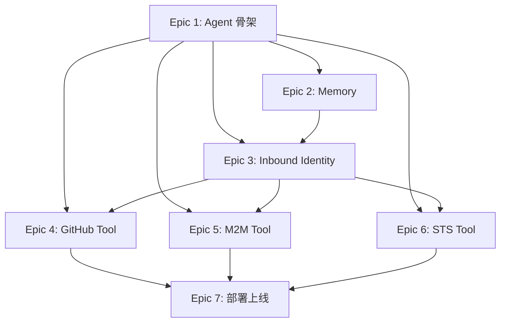

# Epics

Personal Assistant 开发计划，7 个 Phase 对应 7 个 Epic。

## 概览

| Epic | 内容 | 核心交付 | 依赖 | 状态 |
|------|------|----------|------|------|
| [1](epic-1-agent-skeleton.md) | Agent 骨架 | LangGraph chat loop + MaaS 连接 | 无 | backlog |
| [2](epic-2-memory.md) | Memory 集成 | 跨 Session 记忆 | Epic 1 | backlog |
| [3](epic-3-inbound-identity.md) | Inbound 认证 + Web Chat | OAuth 登录 + SSE 流式 | Epic 1, 2 | backlog |
| [4](epic-4-github-tool.md) | GitHub Tool (User Federation) | Agent 代用户查 Issues | Epic 1, 3 | backlog |
| [5](epic-5-m2m-tool.md) | 内部 API Tool (M2M) | Agent 调企业内部 API | Epic 1, 3 | backlog |
| [6](epic-6-sts-tool.md) | 云资源 Tool (STS) | Agent 访问云存储 | Epic 1, 3 | backlog |
| [7](epic-7-deployment.md) | 部署上线 + 可观测 | 生产环境 + 多渠道验证 | Epic 1-6 | backlog |

## 依赖关系

## 相关文档

| 文档 | 路径 |
|------|------|
| 总体功能规格 | `../specs/overall_specifications.md` |
| 架构设计 | `../architecture/overall_architecture.md` |
| ADR | `../architecture/ADR/README.md` |
| DevOps | `../architecture/devops/` |
| 领域词典 | `../specs/dictionary.md` |
