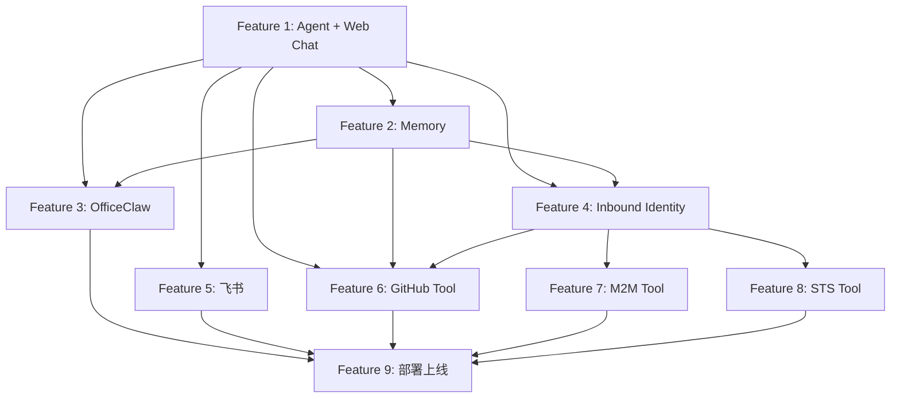

# Features

Personal Assistant 开发计划，9 个 Phase 对应 9 个 Feature。

渠道策略：Web Chat → 飞书 → OfficeClaw。用浏览器快速验证 Agent 核心能力，再接入企业内部 IM 和微信。

## 概览

| Feature | 内容 | 核心交付 | 依赖 | 状态 |
|---------|------|----------|------|------|
| [1](feature-1-agent-skeleton.md) | Agent 骨架 + Web Chat | 浏览器完成流式对话 | 无 | backlog |
| [2](feature-2-memory.md) | Memory 集成 | 跨 Session 记忆（Web Chat 验证） | Feature 1 | backlog |
| [3](feature-3-officeclaw.md) | OfficeClaw 渠道 | 飞书/微信多渠道覆盖（零代码） | Feature 1, 2 | backlog |
| [4](feature-4-inbound-identity.md) | Inbound Identity (OAuth) | Microsoft Entra ID OAuth + JWT + API Key | Feature 1, 2 | backlog |
| [5](feature-5-feishu-channel.md) | 飞书渠道 | 飞书 @Bot 完成对话 | Feature 1 | backlog |
| [6](feature-6-github-tool.md) | GitHub Tool (User Federation) | Agent 代用户查 GitHub Issues | Feature 1, 2, 4 | backlog |
| [7](feature-7-m2m-tool.md) | 内部 API Tool (M2M) | Agent 调企业内部 API | Feature 1, 4 | backlog |
| [8](feature-8-sts-tool.md) | 云资源 Tool (STS) | Agent 访问 OBS 等云资源 | Feature 1, 4 | backlog |
| [9](feature-9-deployment.md) | 部署上线 + 可观测 | 生产环境 + 三渠道验证 | Feature 1-8 | backlog |

## 依赖关系



## 渠道上线顺序

```
Feature 1: Web Chat  ← 第一条渠道，浏览器直接验证 Agent
Feature 5: 飞书      ← 第二条渠道，企业内部 IM 接入
Feature 3: OfficeClaw ← 最后，零代码加微信覆盖
```

## 相关文档

| 文档 | 路径 |
|------|------|
| 总体功能规格 | `../specs/overall_specifications.md` |
| 架构设计 | `../architecture/overall_architecture.md` |
| ADR | `../architecture/ADR/README.md` |
| DevOps | `../architecture/devops/` |
| 领域词典 | `../specs/dictionary.md` |
