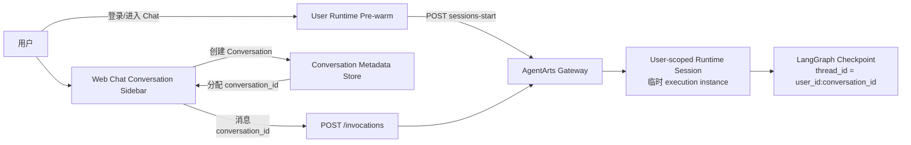
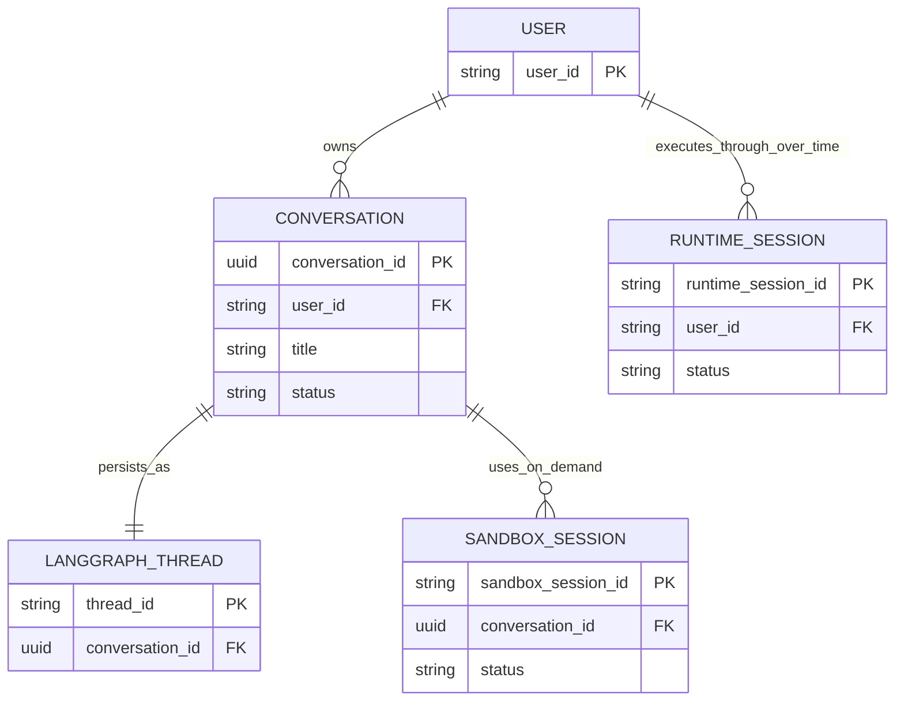
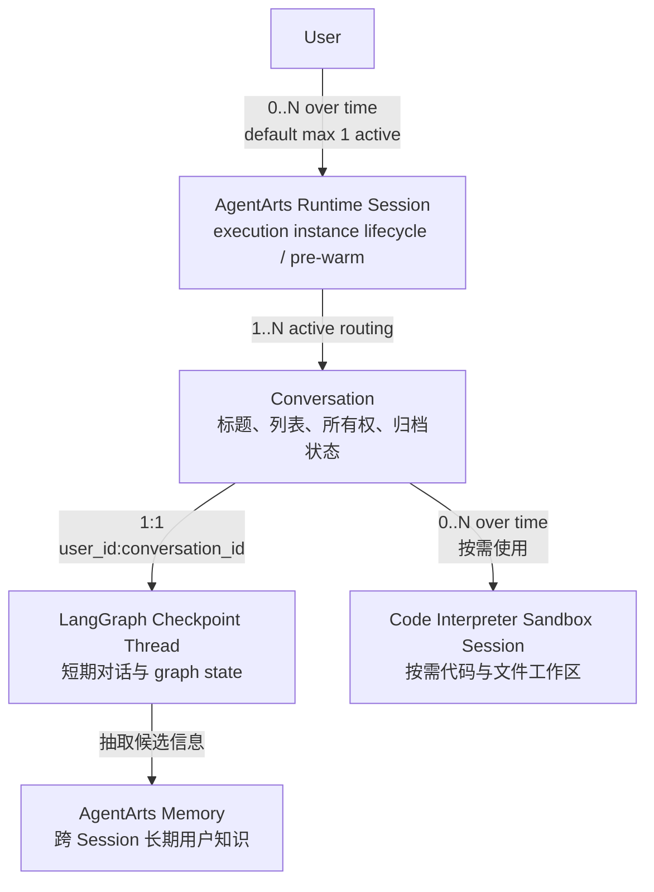
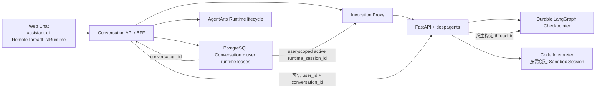
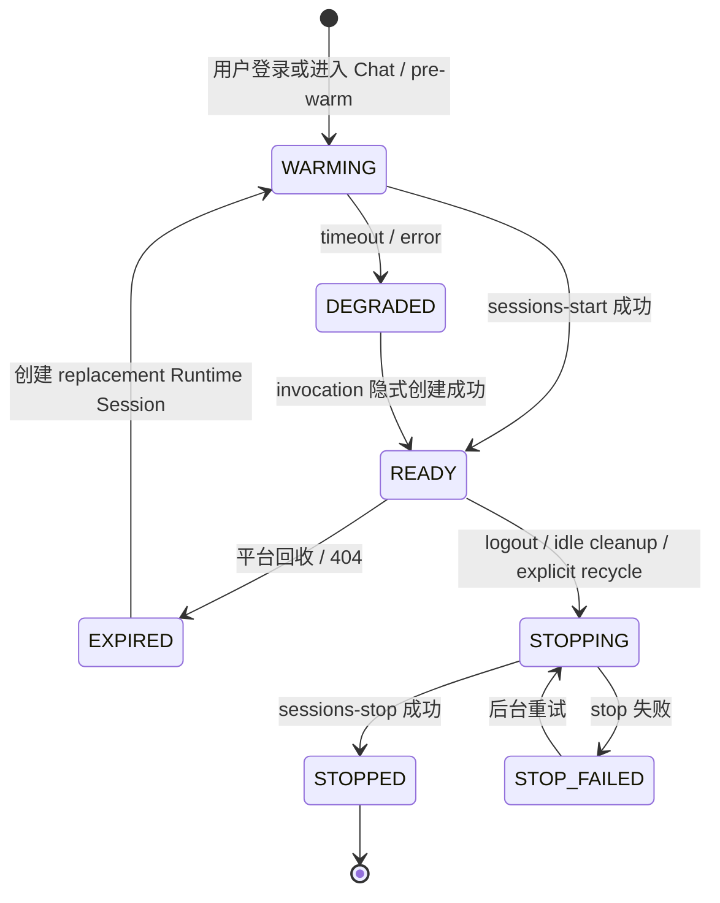
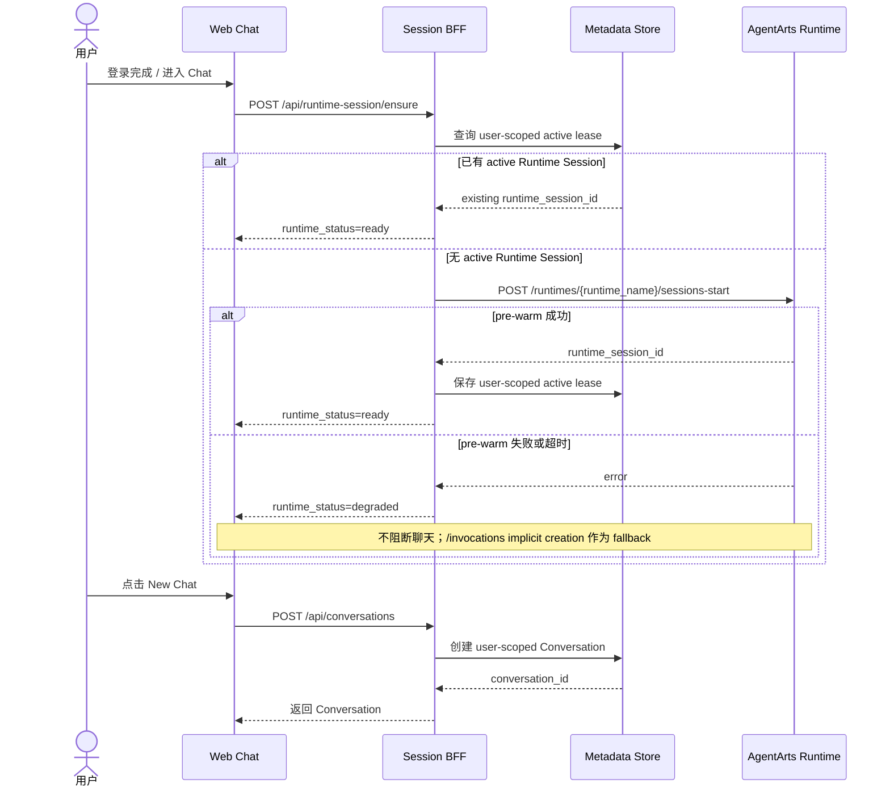
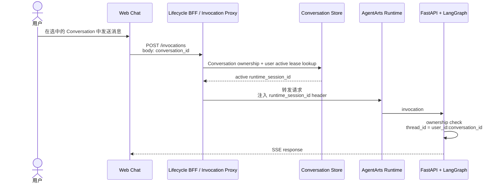

# Feature 14: Web Chat 多 Conversation 管理与 AgentArts Runtime 预热

## 动机

当前 Web Chat 仅在 `localStorage` 中保存一个 `agentarts-session-id`，并将它同时
用作 AgentArts Runtime Session ID 和 LangGraph `thread_id` 的组成部分。用户可以
通过 Feature 13 的 Reset 操作丢弃当前 ID 并生成新 ID，但这种设计混合了产品对话
与临时执行资源的身份和生命周期。

用户目前无法：

- 查看历史 Conversation；
- 在多个 Conversation 之间切换；
- 为 Conversation 命名或自动生成标题；
- 删除或归档指定 Conversation；
- 在用户发送第一条消息前准备 AgentArts Runtime execution instance。

此外，当前用户首次 `/invocations` 请求同时承担 Runtime Session 建立、Agent 初始化
和首次 LLM 调用，可能放大首条消息延迟，甚至触发 Gateway timeout。
AgentArts 提供显式的
`POST /runtimes/{runtime_name}/sessions-start`，可在用户进入 Chat 或登录完成后提前
建立 user-scoped Runtime Session，从而将 cold start 从首条业务消息的关键路径中
移出。

本 Feature 将“New Chat”从单纯重置 UUID 升级为完整的多 Conversation 产品能力，
并为每个用户引入可观测、可降级的 Runtime pre-warm 流程。

## 核心架构决策

本 Feature 固定以下四条 invariant，Implementation Plan 不得重新合并这些概念：

1. **`thread_id` 稳定代表一条 Conversation；Conversation 与 LangGraph
   `thread_id` 永久 1:1。**
2. **Runtime Session 只是可替换、可预热、可回收的执行资源，不是 Conversation
   的永久身份，也不是对话历史的存储位置。**
3. **Runtime Session 默认按 User 管理：一个用户的多个 Conversation 与多个浏览器
   Tab 共用一个 active Runtime Session；不同用户绝不共享 Runtime Session。**
4. **Runtime Session ID 在有效期内持续复用，不按消息或 Conversation 重新生成；
   失效、停止或被平台回收后创建新的 replacement ID。**

由此，当前复用同一个 `session_id` 同时表达 Conversation、LangGraph thread 和
Runtime Session 的做法必须被拆分。

## 目标



- 用户可创建、查看、切换、重命名和删除多个 Conversation。
- 用户进入 Chat 后，前端不必等待首条消息才触发 Runtime 初始化。
- pre-warm 失败不得阻断聊天；首条 `/invocations` 仍可使用平台现有的 implicit
  Session creation 行为作为 fallback。
- Conversation、LangGraph thread、Runtime Session、Sandbox Session 和长期
  Memory 保持职责分离。

## 范围

### 包含

- **Frontend**
  - Conversation sidebar/list；
  - New Chat、切换、重命名、删除/归档；
  - 当前 Conversation 的稳定 `conversation_id`；
  - 用户级 Runtime pre-warm 状态；
  - 页面刷新后恢复 Conversation 列表与当前选择。
- **Conversation Metadata**
  - 至少保存 `conversation_id`、`title`、`created_at`、`updated_at`、`status`；
  - Metadata 必须按已认证 `user_id` 隔离；
  - 明确本地存储与服务端持久化的演进方案。
- **Runtime lifecycle**
  - 用户登录/进入 Chat 时调用 `sessions-start` 进行 pre-warm；
  - 一个用户的多个 Conversation 和 Tab 复用同一 active Runtime Session；
  - 不同用户使用不同 Runtime Session；
  - 登出、idle cleanup、Session 失效时调用 `sessions-stop` 或创建 replacement；
  - 记录 pre-warm latency、成功/失败与 fallback；
  - 防止多 Tab/并发请求为同一用户重复创建 Runtime Session。
- **Service / BFF**
  - 浏览器不得持有 AgentArts 管理凭据；
  - 通过 same-origin Backend-for-Frontend endpoint 代理 Runtime Session lifecycle；
  - 校验 Conversation 所有权，禁止用户操作其他用户的 Conversation；
  - 分别处理 `conversation_id` 和 user-scoped `runtime_session_id`，不得由一个字段
    兼任。
- **E2E**
  - 多 Conversation 上下文隔离；
  - Conversation 切换与恢复；
  - pre-warm 成功、失败 fallback 和重复请求幂等性；
  - 删除 Conversation 后的 Checkpoint/Sandbox 清理，以及用户级 Runtime 保留行为。

### 不涉及

- 跨 Session 语义 Memory 抽取与检索（Feature 2）；
- Code Interpreter Sandbox 的具体 Tool 集成（但本 Feature 必须确定其 domain model
  与 cardinality）；
- 将 Runtime execution instance 当作唯一的会话数据存储；
- 在浏览器中直接调用 AgentArts Runtime lifecycle API；
- 依赖 process-local memory 保证历史消息持久化。

## 四个核心概念

### 1. Conversation

用户在产品界面中看到的一条聊天记录，例如“规划日本旅行”。它是产品层的 durable
aggregate root，负责标题、所有权、创建时间、归档状态和资源关联。

`conversation_id` 是稳定、不可复用的产品主键。Conversation 不因为 Runtime
Session 被回收而消失。

### 2. LangGraph `thread_id`

LangGraph Checkpointer 用于读写 conversation state 的 key，保存 messages、
tool state、interrupt state 和 graph execution position。

本项目固定采用：

```python
thread_id = f"{user_id}:{conversation_id}"
```

同一 Conversation 在整个生命周期内始终使用同一个 `thread_id`。不得由
`runtime_session_id` 派生 `thread_id`。

### 3. AgentArts Runtime Session

AgentArts 管理的临时 execution resource，用于请求路由、pre-warm、命令/文件操作
和实例生命周期管理。通过 `X-HW-AgentArts-Session-Id` 传递。

Runtime Session 可以过期、失败、停止或被平台回收。同一 Conversation 可在不同
时间经由同一用户的多个 replacement Runtime Session 执行。默认情况下，一个用户
任一时刻最多拥有一个 active Runtime Session，该 Session 可承载该用户的多个
Conversation。

Runtime Session ID 管理规则：

- active/ready 期间复用同一个 ID，不按消息生成；
- 创建、切换或删除 Conversation 不主动更换 ID；
- Session expired、404、stop 或平台回收后，创建新的 replacement ID；
- 旧 ID 不得分配给其他用户；
- 多 Tab 通过服务端 user-scoped lease 共享 ID，不依赖 Tab-local storage 协调。

### 4. Code Interpreter Sandbox Session

Agent 按需创建的隔离代码与文件执行环境，使用独立的 Code Interpreter Session
ID。它只在 Conversation 需要运行动态代码、处理文件或保存临时工作区时存在。

Sandbox Session 不是 Runtime Session，也不是 LangGraph `thread_id`。其创建、
复用和销毁必须由应用显式管理，不能假设 AgentArts 会根据 `thread_id` 自动绑定。

## Cardinality 与生命周期



| 关系 | Cardinality | 强制约束 |
|------|-------------|----------|
| User → Conversation | 1:N | 一个 Conversation 只属于一个用户 |
| Conversation → LangGraph thread | **1:1** | `thread_id` 稳定且与 Conversation 同生命周期 |
| User → Runtime Session | **1:N over time** | 默认任一时刻最多一个 active；失效后可替换 |
| Runtime Session → User | **N:1（历史）/ 1:1（单个实例）** | 一个 Runtime Session 只属于一个用户 |
| Runtime Session → Conversation | **1:N active routing** | 同一用户的多个 Conversation 共用；状态由 `thread_id` 隔离 |
| Conversation → Sandbox Session | **0:N over time** | 按需创建；默认任一时刻最多一个 active workspace |
| Sandbox Session → Conversation | **N:1（历史）/ 1:1（单个实例）** | 一个 Sandbox Session 不得跨 Conversation 复用 |

> AgentArts 平台本身未必强制上述 Runtime/Sandbox cardinality。这是 Personal
> Assistant 为降低状态歧义、强化多租户隔离而规定的 application invariant。

### 为什么一个用户的多个 Conversation 共用 Runtime Session

Conversation 隔离已经由稳定的 LangGraph `thread_id` 与 PostgreSQL Checkpoint
提供，不需要为每条 Conversation 重复创建 Runtime Session。user-scoped 复用具有
以下优势：

- 用户只需 pre-warm 一次；
- 切换 Conversation 不产生新的 cold start；
- 多 Tab 打开不同 Conversation 仍可复用；
- 减少 Runtime Session 数量、配额和资源成本；
- Conversation 的创建、删除与 Runtime lifecycle 解耦。

不同用户不得共享 Runtime Session，因为身份上下文、临时 process state、审计、配额
与数据隔离都必须保持 user boundary。

> 默认 cardinality：一个 User 同时最多一个 active Runtime Session；该 Runtime
> Session 承载该 User 的多个 Conversation。

未来只有在平台并发限制或性能测试证明单 Session 不足时，才演进为受控的
per-user Runtime Session pool；这不改变 Conversation 与 `thread_id` 的 1:1 关系。

## 职责边界



| 层 | 负责 | 不负责 |
|----|------|--------|
| Conversation | 列表、标题、所有权、创建/归档时间、资源关联 | Agent 执行资源 |
| Runtime Session | user-scoped execution instance 的准备、复用与回收 | Conversation 状态隔离与 durable persistence |
| LangGraph thread | 单 Conversation 的 messages、tool state、interrupt state | Runtime lifecycle |
| Sandbox Session | 不可信代码、命令和临时文件的隔离执行 | Agent reasoning、对话历史 |
| AgentArts Memory | 长期偏好、事实、情景记忆 | Conversation UI 列表 |

Runtime Session 或 Sandbox Session 被平台回收后，Conversation 及其历史仍应能由
Conversation Metadata Store + durable Checkpoint 恢复。

## ID Contract

| 字段 | 示例 | 来源 | 用途 |
|------|------|------|------|
| `conversation_id` | UUID | Conversation Service | 产品主键、API path/body |
| `thread_id` | `{user_id}:{conversation_id}` | Service 派生 | LangGraph Checkpointer |
| `runtime_session_id` | platform-generated 或 client-generated | User Runtime lifecycle | `X-HW-AgentArts-Session-Id` |
| `sandbox_session_id` | AgentArts 返回值 | Code Interpreter lifecycle | `X-HW-AgentArts-Code-Interpreter-Session-Id` |

前端不得自行构造 `thread_id`。Service 必须从可信 `user_id` 与已完成 ownership
校验的 `conversation_id` 派生它。

## 推荐目标方案

采用 **Conversation-centered orchestration**：所有 durable state 和资源关联均以
Conversation 为中心，Runtime/Sandbox 只是可替换 lease。



### 推荐数据模型

不要把所有 ID 塞进一张 Conversation 表后覆盖旧值。使用 Conversation 主表与
resource lease 表，保留 lifecycle history：

| 表/实体 | 关键字段 | 说明 |
|---------|----------|------|
| `conversations` | `id`, `user_id`, `title`, `status`, timestamps | durable aggregate root |
| `conversation_messages` | `id`, `conversation_id`, `role`, `content`, `sequence`, timestamps | 面向 UI 的稳定 message read model |
| `runtime_session_leases` | `id`, `user_id`, `runtime_session_id`, `status`, `started_at`, `ended_at` | User Runtime Session 历史；partial unique 保证每个 User 默认最多一个 active |
| `sandbox_session_leases` | `id`, `conversation_id`, `sandbox_session_id`, `status`, timestamps | 按需 Sandbox history；默认最多一个 active |
| LangGraph checkpoint tables | `thread_id`, checkpoint state | `thread_id = user_id:conversation_id` |

关键 database constraints：

- `conversations(user_id, id)` 可用于所有 ownership query；
- `runtime_session_id` 全局 unique；
- active Runtime lease 对 `user_id` partial unique；
- `sandbox_session_id` 全局 unique；
- active Sandbox lease 对 `conversation_id` partial unique；
- Runtime lease 不允许在不同 User 之间 reassignment；
- Sandbox lease 不允许在不同 Conversation 之间 reassignment。

`conversation_messages` 与 LangGraph Checkpoint 不能互相替代：

- Message read model 服务于 Sidebar 切换、历史消息加载、分页和跨设备恢复；
- Checkpoint 服务于 Agent execution state，包括 graph position、tool state 和
  interrupt state；
- 两者写入必须具有明确的一致性策略。首选由 Service 在 invocation transaction/
  completion boundary 写入 message read model，禁止由不可信客户端单方面声明
  assistant message。

### assistant-ui 集成

当前使用的 `@assistant-ui/react` 已提供 `RemoteThreadListAdapter` 和
`useRemoteThreadListRuntime`，原生覆盖多 Conversation 所需操作：

| assistant-ui 概念/API | 本项目映射 |
|-----------------------|------------|
| `remoteId` | `conversation_id` |
| `list()` | 查询当前用户的 Conversation list |
| `initialize()` | 创建 Conversation；若当前用户无 active Runtime，则复用统一 ensure/pre-warm 流程 |
| `switchTo()` | 切换 Conversation，加载 message history |
| `rename()` | 更新 Conversation title |
| `archive()` / `unarchive()` | 更新 Conversation status |
| `delete()` | 删除 Conversation，并启动资源回收 workflow |
| `generateTitle()` | 根据首轮消息生成并保存标题 |
| `ThreadHistoryAdapter` | 加载/追加 `conversation_messages` read model |

这里 assistant-ui 所称的 `thread` 是 UI 层 Conversation，不等于 LangGraph
`thread_id`。该映射必须在代码命名和文档中保持明确。

前端使用 assistant-ui runtime 管理选中状态和交互，不使用 Zustand/localStorage
复制一套 Conversation truth。Zustand 只允许保存瞬时 UI state；PostgreSQL
Conversation API 是跨设备、跨刷新一致的唯一事实源。

### Runtime Session 状态机



Conversation 状态与 Runtime 状态必须分开。例如多个 Conversation 可以保持
`active`，同时用户的 Runtime lease 为 `expired`；下一次进入 Chat 或发送消息时
重新 pre-warm 即可。

### Invocation contract

目标 API contract 应显式携带两个身份：

```json
{
  "conversation_id": "018f...",
  "message": "你好",
  "stream": true
}
```

- `conversation_id` 进入业务 body/path，用于 ownership 和 `thread_id`；
- `runtime_session_id` 仅用于 AgentArts Runtime header/routing；
- BFF/Proxy 按 `user_id` 从数据库读取 active lease 并注入 Runtime Session header，避免浏览器将
  临时 Runtime resource identity 当作 Conversation identity；
- 若无 active Runtime lease，BFF 可先执行有界 pre-warm，或生成/协商 fallback
  Runtime Session ID 后直接 invocation；
- Service 不能再从 Runtime Session header 构造 LangGraph `thread_id`。

### Conversation API contract

现有 AgentArts Gateway 使用 `PREFIX_MATCH`，Service 内部路由建议收敛在
`/invocations` 前缀下：

```text
POST   /invocations/conversations
GET    /invocations/conversations
GET    /invocations/conversations/{conversation_id}
PATCH  /invocations/conversations/{conversation_id}
DELETE /invocations/conversations/{conversation_id}
GET    /invocations/conversations/{conversation_id}/messages
POST   /invocations/runtime-session/ensure
DELETE /invocations/runtime-session
POST   /invocations
```

Cloudflare Pages Function 可向浏览器提供 same-origin `/api/conversations/*`，
再映射到上述 Runtime path。所有 endpoint 必须：

- 从 Gateway 验证后的 identity 获取 `user_id`；
- 在数据库中执行 `(user_id, conversation_id)` ownership query；
- 对 list 使用 cursor pagination；
- 对 Conversation create/delete 与 Runtime ensure/stop 使用 idempotency key；
- 不允许客户端指定或覆盖 `thread_id`；
- 不返回 AgentArts 管理凭据。

在冻结路由方案前必须通过 API spike 确认：调用 Conversation 管理路由是否会被
AgentArts 强制绑定或创建 Runtime Session。如果管理请求本身会产生昂贵的
session-scoped execution instance，应将 Conversation API 放到独立 stateless BFF，
而不是部署在 session-scoped Agent Runtime 内。

### Pre-warm 与 Session ID policy

Runtime pre-warm 是 user-scoped，而不是 Conversation-scoped：

1. 用户登录完成或首次进入 Chat 时，执行一次幂等 `ensureUserRuntimeSession()`；
2. 若已有 active/ready Runtime Session，直接复用旧 `runtime_session_id`；
3. 创建、切换、归档、删除 Conversation 都不更换 Runtime Session ID；
4. 多 Tab 并发调用同一个 ensure API，由数据库 unique constraint + lock/single-flight
   保证只创建一个 active Runtime Session；
5. 用户发送首条消息而 pre-warm 尚未完成时，不等待无限期，使用短 timeout 后进入
   implicit creation fallback；
6. Session expired、404、stop 或平台回收后，将旧 lease 标记为 terminal，并创建
   新的 replacement ID；
7. logout、长时间 idle 或显式资源回收时调用 `sessions-stop`；
8. Sandbox Session 只在 Tool 首次需要代码/文件执行时 lazy-create，普通聊天不创建。

### 多 Tab 与多用户规则

- 多 Tab 打开同一个 Conversation：共享同一个 user Runtime Session 和同一个
  `thread_id`，同一 `thread_id` 的并发 invocation 必须串行化或使用乐观并发控制；
- 多 Tab 打开不同 Conversation：共享同一个 user Runtime Session，但使用不同
  `thread_id`；
- 多用户：每个用户拥有独立 Runtime Session，不允许跨用户共享；
- 如果未来单个 Runtime Session 的并发能力不足，可演进为 per-user pool，但 pool
  routing 必须保持 user isolation，且不能改变稳定 `thread_id`。

### Durable state 要求

最佳方案要求生产环境使用 shared durable Checkpointer（目标为 PostgreSQL），而非
`InMemorySaver`。否则 Runtime Session 更换或 Runtime instance 重启后，即使
Conversation 与 `thread_id` 保持稳定，也无法恢复旧的 graph state。

## 目标交互流程

### 用户 Runtime 预热与创建 Conversation



### 发送消息



`Lifecycle BFF` 是逻辑角色，不预先锁定为 Cloudflare Pages Function 或 AgentArts
Runtime 内部模块。API spike 与 Meta Implementation Plan 必须根据 Runtime Session
创建语义、RDS 网络可达性和凭据边界决定其最终部署位置。

### 删除或结束

删除 Conversation 时，应先将 Metadata 标记为 deleting/archived，再异步执行：

1. 不停止 user-scoped Runtime Session，因为其他 Conversation/Tab 可能仍在使用；
2. 停止该 Conversation 的 active Sandbox Session（若存在）；
3. 按数据保留策略删除或归档 LangGraph Checkpoint；
4. 保留可审计的最小 Metadata，或按隐私策略彻底删除；
5. 即使 Sandbox/Checkpoint 清理失败，也不得让 Conversation 永久卡在 UI 中。

Runtime Session 只在用户登出、长期 idle、Session 失效或显式资源回收时停止。

## AgentArts API 验证任务

官方 PDF（文档版本 03，2026-06-11）确认存在：

- `POST /runtimes/{runtime_name}/sessions-start`；
- `POST /runtimes/{runtime_name}/sessions-stop`；
- `/invocations` 使用 `X-HW-AgentArts-Session-Id`；
- `sessions-stop` 用于销毁“会话对应的实例”。

当前验证状态：

- **已验证**：客户端生成合法 Session ID，直接调用 `/invocations` 可以正常工作；
  AgentArts 会隐式创建或绑定 Runtime Session。这是当前生产链路的现状。
- **高概率但尚未验证**：显式调用 `sessions-start` 时由平台生成并返回 Session ID，
  后续 `/invocations` 复用该 ID。
- **设计推断**：平台可能同时支持显式 platform-generated ID 与 implicit
  client-generated ID，但在真实环境验证前不将此推断写死为 API contract。

Implementation 前必须在目标 Region `cn-southwest-2` 完成剩余 spike：

- [ ] 确认 `sessions-start` 的实际 request body、headers 和 response body；
- [ ] 确认显式 `sessions-start` 是否由平台生成并返回 Session ID；
- [ ] 确认 `sessions-start` 是否也允许客户端指定 Session ID；
- [ ] 确认相同 Session ID 重复 start 的幂等行为与状态码；
- [ ] 确认 start 完成是否代表 execution instance 已 ready；
- [ ] 测量 start latency，以及 start 后首个 `/invocations` latency；
- [x] 确认未调用 start 时，client-generated ID 可直接用于 `/invocations`；
- [ ] 确认 automatic idle timeout、最大 Session 数和并发配额；
- [ ] 确认一个 Runtime Session 处理同一用户多个 Conversation/并发 invocation 的
  实际行为和平台限制；
- [ ] 确认 `sessions-stop` 后再次使用同一 Session ID 的行为；
- [ ] 确认 lifecycle API 是否可通过现有 Gateway domain 和 CUSTOM_JWT 调用；
- [ ] 记录无法由 API 文档推导的平台行为，必要时提交 AgentArts 工单。

## 关键设计约束

### Pre-warm 是优化，不是正确性前提

业务调用必须在以下情况下继续工作：

- `sessions-start` timeout；
- AgentArts 返回 4xx/5xx；
- 用户在 pre-warm 完成前立即发送消息；
- pre-warm 状态丢失；
- Runtime Session 已被平台自动回收。

因此 `/invocations` 的 implicit Session creation 是必须保留的 fallback。

### 身份与所有权

- Conversation Metadata 查询必须以 Gateway 验证后的 `user_id` 为边界；
- 客户端传入的 `conversation_id`、`runtime_session_id` 不构成授权；
- lifecycle endpoint 必须验证 `{user_id, conversation_id}` ownership，并确认
  Runtime Session 绑定到该 User、Sandbox Session 绑定到该 Conversation；
- `thread_id` 固定使用 `{user_id}:{conversation_id}`，防止跨用户碰撞；
- 不在浏览器保存 AgentArts API Key、AK/SK 或 Workload Access Token。

### 持久化

多 Conversation UI 不能仅依赖 Runtime Session 或单个 `localStorage` key。Implementation
Plan 必须在以下方案中作出明确决策：

| 方案 | 优点 | 限制 |
|------|------|------|
| local-first metadata | 实现快，无后端 schema | 不跨设备，清理浏览器数据即丢失 |
| PostgreSQL metadata | 跨设备、可审计、支持分页 | 依赖数据库与 API |
| staged rollout | 先 local-first，再迁移 PostgreSQL | 需要定义 migration 与兼容策略 |

目标架构采用 PostgreSQL。若 Feature 1.2 尚未完成，可用 local-first prototype 验证
UI，但不得将其标记为 Feature 完成；正式验收必须具备服务端 Metadata 与 durable
Checkpoint。

## 验收标准

### AC1：多 Conversation 列表与切换

- [ ] 用户可创建至少两个 Conversation；
- [ ] Sidebar 展示 Conversation 标题及最近更新时间；
- [ ] 切换 Conversation 后恢复对应消息与 Agent state；
- [ ] Conversation A 与 Conversation B 的上下文严格隔离；
- [ ] 页面刷新后恢复 Conversation 列表和当前选中项。
- [ ] assistant-ui `remoteId` 唯一映射到 `conversation_id`；
- [ ] 前端不再以单个 `agentarts-session-id` localStorage key 作为 Conversation
  source of truth。

### AC2：ID 与 cardinality invariant

- [ ] 每个 Conversation 恰好对应一个稳定 `thread_id`；
- [ ] Runtime Session 更换后 `thread_id` 保持不变；
- [ ] 同一用户的多个 Conversation 共用一个 active Runtime Session；
- [ ] 不同用户绝不共享 Runtime Session；
- [ ] 一个用户默认任一时刻最多一个 active Runtime Session；
- [ ] Runtime Session ID 在有效期内跨消息、跨 Conversation、跨 Tab 复用；
- [ ] Runtime Session 失效后使用新 replacement ID，旧 ID 不复用给其他用户；
- [ ] 用户无 active Runtime Session 时仍可通过 implicit creation fallback 继续调用；
- [ ] Sandbox Session ID 不得被当作 Runtime Session ID 或 `thread_id` 使用。

### AC3：User Runtime pre-warm

- [ ] 用户登录完成或首次进入 Chat 时触发幂等 `ensureUserRuntimeSession()`；
- [ ] 创建/切换 Conversation 不重复创建 Runtime Session；
- [ ] 多 Tab 同时 ensure 时最多创建一个 active Runtime Session；
- [ ] UI 可区分 `warming`、`ready`、`degraded`；
- [ ] pre-warm 不阻塞用户进入空白聊天界面；
- [ ] 记录 start latency 和结果；
- [ ] start 完成后的首条消息 latency 相比未预热基线有可测量结果。

### AC4：失败降级

- [ ] `sessions-start` 返回错误或 timeout 时仍可发送消息；
- [ ] `/invocations` 使用 User 对应的 Runtime Session ID 或 fallback ID，并由
  平台隐式建立 Runtime Session；
- [ ] 用户不会看到不可恢复的 loading 状态；
- [ ] 可观测日志能关联 user-safe identifier、`conversation_id`、
  `runtime_session_id` 和 failure reason。

### AC5：幂等与并发

- [ ] 同一请求的重复 create/start 不产生多个 Conversation；
- [ ] 快速重复点击 New Chat 有明确的防抖或幂等策略；
- [ ] 用户在 warming 中立即发送消息不会产生状态冲突；
- [ ] 同一 `thread_id` 的跨 Tab 并发消息被串行化、拒绝或通过乐观锁安全处理；
- [ ] 不同 Conversation 可共享 Runtime Session，同时保持 Checkpoint 隔离；
- [ ] 重试策略不会自动重放已经进入 Agent 的业务 invocation。

### AC6：删除与资源回收

- [ ] 用户可删除或归档指定 Conversation；
- [ ] 删除 Conversation 不停止仍被该用户其他 Conversation 使用的 Runtime Session；
- [ ] logout/idle/recycle 流程尝试调用 `sessions-stop`；
- [ ] Runtime stop 失败进入后台重试或可观测失败状态；
- [ ] Checkpoint 的删除/保留策略有明确实现和测试；
- [ ] 删除其他用户的 Conversation 返回 404 或 403。

### AC7：安全与数据隔离

- [ ] Conversation list 只返回当前认证用户的数据；
- [ ] 伪造其他用户的 ID 无法读取消息、Checkpoint 或控制 Runtime/Sandbox lifecycle；
- [ ] 浏览器 bundle、localStorage 和网络响应中不出现平台管理凭据；
- [ ] lifecycle BFF 只允许受支持的 Runtime 和操作，不能成为通用代理。

### AC8：E2E

- [ ] E2E 覆盖创建 → pre-warm → 首条消息 → 切换 → 返回；
- [ ] E2E 覆盖 pre-warm failure fallback；
- [ ] E2E 覆盖删除/归档；
- [ ] E2E 覆盖同一用户多 Conversation 共享 Runtime Session；
- [ ] E2E 覆盖同一用户多 Tab 共享与并发控制；
- [ ] E2E 覆盖两个用户之间的 Runtime Session 隔离；
- [ ] Client、Service 与 E2E 测试全部通过。

### AC9：Message history 与 Checkpoint

- [ ] Conversation history 从 `conversation_messages` 加载，而不是解析 Checkpoint
  内部存储格式；
- [ ] 同一 `conversation_id` 始终派生相同 `thread_id`；
- [ ] Runtime Session 替换后历史消息与 LangGraph state 均可恢复；
- [ ] assistant message 只能由可信 Service execution 写入；
- [ ] history 支持分页，且不同用户之间严格隔离。

### AC10：Pre-warm 资源策略

- [ ] 用户级 ensure/login/first-message 路径遵循统一的幂等 pre-warm policy；
- [ ] 默认 per-user active Runtime Session 上限为 1，idle timeout 可配置；
- [ ] Conversation create/switch/delete 不更换 active Runtime Session ID；
- [ ] Sandbox 仅在 Tool 首次需要时 lazy-create；
- [ ] 资源回收失败可观测并可后台重试。

## 风险与缓解

| 风险 | 严重度 | 缓解 |
|------|:------:|------|
| 平台文档与实际行为不一致 | High | 先完成 API spike，再冻结 Implementation Plan |
| 每个用户长期占用 Runtime instance | Medium | user-scoped 单实例、idle/stop 策略；确认平台配额与计费 |
| pre-warm 与首条 invocation race | High | 幂等 session state machine；implicit creation fallback |
| 多 Tab 同时创建重复 Runtime Session | High | user-scoped partial unique + distributed lock/single-flight |
| 同一 Conversation 跨 Tab 并发写 Checkpoint | High | per-thread serialization 或 Checkpointer optimistic concurrency |
| Runtime Session 与 Checkpoint 生命周期错配 | High | 分层建模，不以 Runtime instance 存在性判断历史是否存在 |
| Message read model 与 Checkpoint 漂移 | High | 定义可信写入边界、reconciliation job 与一致性测试 |
| `sessions-stop` 误杀活跃请求 | Medium | streaming/active-run guard，停止前进入 closing 状态 |
| Conversation list 数据跨用户泄露 | Critical | 服务端 ownership 校验 + user-scoped query + E2E negative tests |
| localStorage 无法跨设备 | Medium | PostgreSQL 为目标架构；local-first 仅允许 staged rollout |

## Four-Question Gate

| Question | Answer | 说明 |
|----------|:------:|------|
| Is it best practice? | **Yes** | Conversation/Checkpoint 负责业务状态，user-scoped Runtime 负责可替换计算，Conversation-scoped Sandbox 负责危险执行；避免用计算资源承担数据隔离，符合 Separation of Concerns、Defense in Depth 与 least resource consumption。 |
| Is it industry standard? | **Yes** | 多租户服务通常由一个 user/session execution context 承载多个业务 thread，由稳定 ID 与 durable store 隔离状态；主流 Chat 产品使用 durable Conversation，LangGraph 使用稳定 `thread_id`，云端 execution resource 使用 lease/lifecycle。 |
| Is it conventional? | **Yes** | REST Conversation API、PostgreSQL、Sidebar/New Chat、user-scoped session、cursor pagination、archive/delete、BFF 注入云平台 header 都是成熟团队熟悉的设计。 |
| Is it modern? | **Yes** | shared durable Checkpoint、Conversation read model、user-scoped async pre-warm、lazy Sandbox、resource lease history、跨 Tab single-flight 和 server-side authorization 符合现代 Agent application 架构。 |

## 依赖

- Feature 13：Reset Session（已有 New Chat 的最小能力，可升级/替换）；
- Feature Session Checkpoint：单个 Conversation 的短期 Agent state；
- Feature 4：Inbound Identity，提供可信 `user_id`；
- Feature 1.2：PostgreSQL（正式验收的硬依赖；可在完成前进行 local-first UI prototype）；
- AgentArts Runtime `sessions-start` / `sessions-stop` API 可用性验证。

## 受影响文档

Implementation 完成后至少更新：

- `personal-assistant-meta/specs/overall_specifications.md`；
- `personal-assistant-meta/architecture/overall_architecture.md`；
- `personal-assistant-meta/architecture/frontend_architecture.md`；
- `personal-assistant-meta/architecture/backend_architecture.md`；
- `personal-assistant-meta/architecture/session-state-management.md`；
- `personal-assistant-meta/architecture/cloud-service/agentarts.md`；
- Client、Service 与 E2E 的 `AGENTS.md` / `README.md`（若职责或命令变化）。

## 参考

- `personal-assistant-meta/architecture/cloud-service/agentarts-api-pdf.pdf`
  - §4.7.1.1 `StartRuntimeSession`
  - §4.7.1.3 `ExecuteRuntime`
  - §4.7.1.7 `StopRuntimeSession`
- `personal-assistant-meta/issues/features/resolved/feature-13-reset-session/issue.md`
- `personal-assistant-meta/issues/features/resolved/feature-session-checkpoint/issue.md`
- `personal-assistant-client/src/lib/chat/session.ts`
- `personal-assistant-service/app/agent_handler.py`
- assistant-ui 官方 `RemoteThreadListAdapter`、`useRemoteThreadListRuntime` 与
  `ThreadHistoryAdapter` 文档
