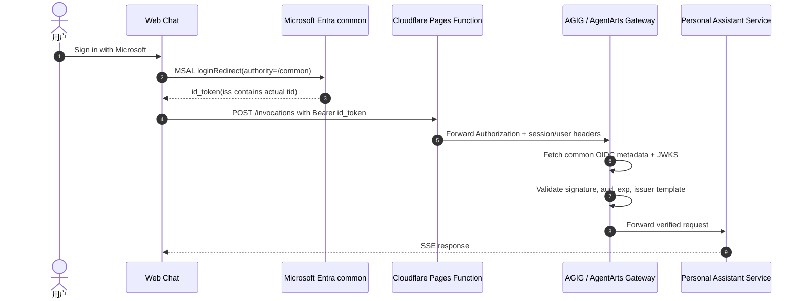

# Feature 16: Inbound Auth 切换到 Microsoft Entra common

## 动机

当前 Web Chat Inbound Auth 使用 Microsoft Entra ID + AgentArts Gateway
`CUSTOM_JWT`：

- 前端 MSAL 获取 Microsoft `id_token`；
- Cloudflare Pages Function 透传 `Authorization: Bearer <id_token>`；
- AgentArts Gateway / AGIG 执行 JWT validation；
- Service 从可信 header 中读取用户身份。

为了支持任意 Microsoft 账号直接登录 Web Chat，并让个人 Microsoft 账号后续使用
Microsoft 365 邮件 / Calendar 时不被固定企业 tenant 绑定，Inbound Auth 需要从固定
tenant endpoint 切换到 Microsoft Entra `common` endpoint。

2026-06-25 的线上验证显示，仅将以下配置切到 `common` 会导致线上聊天请求返回
Gateway 层 `401 Authentication failed`：

```text
VITE_ENTRA_TENANT_ID=common
custom_jwt.discovery_url=https://login.microsoftonline.com/common/v2.0/.well-known/openid-configuration
```

该请求未到达业务容器，说明失败发生在 AGIG / AgentArts Gateway 的 `CUSTOM_JWT`
校验阶段。

## 平台阻塞项

Microsoft Entra `common` 的 OpenID Connect metadata 中，`issuer` 是 tenant-independent
template：

```text
https://login.microsoftonline.com/{tenantid}/v2.0
```

实际 `id_token.iss` 会包含签发 token 的真实 tenant：

```text
https://login.microsoftonline.com/<actual-tid>/v2.0
```

因此 AGIG / AgentArts Gateway 不能只做字面值比较：

```text
token.iss == metadata.issuer
```

它需要支持 Microsoft tenant-independent issuer validation：从 JWT 读取 `tid`，将
metadata issuer 中的 `{tenantid}` 替换为实际 `tid`，再与 token `iss` 精确匹配。

## 目标架构



## 范围

### 包含

- 将前端 production Inbound authority 切换为 `common`：
  - `personal-assistant-client/.env.production`
  - Cloudflare Pages build-time `VITE_ENTRA_TENANT_ID`
- 将 AgentArts Gateway `CUSTOM_JWT` discovery URL 切换为 `common`：
  - `personal-assistant-service/.agentarts_config.yaml`
- 确认 Microsoft Entra App Registration 支持：
  - `Accounts in any organizational directory and personal Microsoft accounts`
  - Web Chat production redirect origin
- 验证 AGIG / AgentArts Gateway 能通过 `common` metadata 校验：
  - organizational account token
  - personal Microsoft account token
  - B2B Guest account token
- 更新 Inbound Auth 架构文档和部署 runbook。

### 不包含

- 将 JWT validation 移到 Cloudflare Pages Function；
- 用 API Key 代替 Gateway JWT validation；
- 修改 Outbound Microsoft 365 OAuth2 provider 行为；
- 重写 Web Chat 登录 UI；
- 引入非 Microsoft 的 Inbound Identity Provider。

## AGIG / Gateway 需求

AGIG / AgentArts Gateway 的 `CUSTOM_JWT` 需要支持：

- [ ] `discovery_url=https://login.microsoftonline.com/common/v2.0/.well-known/openid-configuration`
- [ ] issuer template：`https://login.microsoftonline.com/{tenantid}/v2.0`
- [ ] 从 JWT `tid` claim 替换 `{tenantid}` 后校验 `iss`
- [ ] 校验 `aud` 在 `allowed_audience` 中
- [ ] 校验 `exp` / `nbf` / signature
- [ ] 使用 Microsoft common JWKS 时，按 key 适用 issuer 规则限制 key 使用范围
- [ ] 支持 personal Microsoft account 的 consumer tenant：
  `9188040d-6c67-4c5b-b112-36a304b66dad`
- [ ] 失败时返回可排障的原因或 trace id，便于区分 issuer / audience / signature /
  expiration 问题

## 验收标准

### AC1：组织账号可登录并聊天

- [ ] 前端 `VITE_ENTRA_TENANT_ID=common`
- [ ] Gateway `discovery_url` 使用 Microsoft `common`
- [ ] 企业 / 学校账号完成登录后，`POST /invocations` 返回 `200` 或 SSE stream
- [ ] Service 日志能看到请求到达容器

### AC2：个人 Microsoft 账号可登录并聊天

- [ ] 个人 Microsoft 账号完成登录后，`POST /invocations` 不再返回 Gateway 层 `401`
- [ ] JWT payload 中 `tid=9188040d-6c67-4c5b-b112-36a304b66dad` 时，Gateway 校验通过
- [ ] `X-HW-AgentGateway-User-Id` / 前端补充 user id header 仍能稳定映射用户

### AC3：错误 token 仍被拒绝

- [ ] 错误 `aud` 被 Gateway 拒绝
- [ ] 过期 token 被 Gateway 拒绝
- [ ] 篡改签名的 token 被 Gateway 拒绝
- [ ] 非 Microsoft Entra 签发的 token 被 Gateway 拒绝

### AC4：部署与回滚清晰

- [ ] runbook 记录切换步骤、验证命令和 rollback 步骤
- [ ] 切换前保留固定 tenant 配置作为 rollback baseline
- [ ] 若 AgentArts 配置变更需要 `agentarts delete` + `agentarts launch`，runbook 明确说明

## 风险与缓解

| 风险 | 严重度 | 缓解 |
|------|:------:|------|
| AGIG 未实现 Microsoft issuer template validation | High | 本 Feature 保持 backlog，直到 Gateway 团队提供支持并在 staging 验证 |
| `common` 放开登录范围后导致非目标用户可访问 | High | 先明确产品策略；如需限制用户，增加 tenant / domain / email allowlist |
| personal account 与 organizational account 的 user id claim 不一致 | Medium | 统一使用 `oid` / `sub` / `preferred_username` 映射策略，并补充 E2E |
| Gateway 错误信息不足，排障成本高 | Medium | 要求 Gateway 返回 trace id，并记录 issuer/audience 失败类别 |
| 配置切换影响所有线上 Web Chat 用户 | High | staging 先验；production 灰度或低峰切换；保留固定 tenant rollback |

## Four-Question Gate

| Question | Answer | 说明 |
|----------|:------:|------|
| Is it best practice? | **Yes** | JWT validation 继续由 Gateway 承担，浏览器只持有 Microsoft `id_token`，符合 centralized policy enforcement。 |
| Is it industry standard? | **Yes** | Microsoft Entra `common` + tenant-independent issuer validation 是多租户应用的标准验证模型。 |
| Is it conventional? | **Yes** | 多租户 / personal account 应用通常使用 `common` authority，并在 resource gateway 层验证 `aud`、`iss`、signature 与 expiry。 |
| Is it modern? | **Yes** | 保持 PKCE + OIDC + Gateway JWT validation 的无状态架构，避免 server-side browser session。 |

## 依赖

- AGIG / AgentArts Gateway 支持 Microsoft Entra `common` issuer template validation；
- Feature 4：现有 Inbound Identity 基线；
- Microsoft Entra App Registration 已配置为 multi-tenant + personal accounts；
- Cloudflare Pages production 环境变量可切换 `VITE_ENTRA_TENANT_ID`。

## 受影响文档

Implementation 完成后至少更新：

- `personal-assistant-meta/architecture/auth/inbound-auth-lifecycle.md`
- `personal-assistant-meta/architecture/cloud-service/huaweicloud/agentarts.md`
- `personal-assistant-meta/architecture/cloud-service/azure/microsoft-entra-id-setup.md`
- `personal-assistant-meta/architecture/devops/agentarts-deploy-runbook.md`
- `personal-assistant-client/README.md`

## 参考

- Microsoft identity platform token validation:
  `https://learn.microsoft.com/en-us/entra/identity-platform/access-tokens#validate-the-issuer`
- `personal-assistant-meta/issues/features/resolved/feature-4-inbound-identity/issue.md`
- `personal-assistant-meta/architecture/cloud-service/huaweicloud/agentarts.md`
- `personal-assistant-meta/issues/bugs/resolved/bug-14-email-tool-b2b-guest-401/issue.md`
